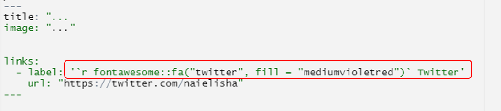

# Ejercicio usando `usethis`, `here` y `postcards`

## Ejercicio postcards
* Similar a https://pages.github.com/
* `postcards` tiene 4 templados de páginas web https://github.com/seankross/postcards
* Tu página web debe describir decir algo sobre ti, tus intereses, y tus proyectos además de cómo contactarte
  - Ejemplo https://amy-peterson.github.io/ vía https://github.com/amy-peterson/amy-peterson.github.com
  - http://jtleek.com/ vía https://github.com/jtleek/jtleek.github.io
  - http://aejaffe.com/ vía https://github.com/andrewejaffe/andrewejaffe.github.io


### Crear el repositorio
* Podemos crearlo desde RStudio o desde github.com

**(opción 1) Desde RStudio**

<div class="alert alert-block alert-danger">
<b>¡Cuidado!:</b> Antes de crear un proyecto, revisen dónde están parados (`getwd()`) en su directorio y dónde quieren que se cree
</div>

```{r postcards_proj, eval = FALSE}
## Creen el RStudio project. Es MUY importante que el usuario debe sea igual que en github
usethis::create_project("Su_Usuario.github.io")
```

Nuevo proyecto :

```{r echo=FALSE, fig.cap="git user", fig.width = "40%"}
knitr::include_graphics("img_postcard/proyecto_github_user.png")
```

```{r postcards_git, eval = FALSE}
## Configura Git y GitHub

# Con use_git() preguntará si desean hacer un commit, y después pedirá reiniciar Rstudio para que obtengan un nuevo botón llamado "git()"
usethis::use_git()
```

Nuevo botón

```{r echo=FALSE, fig.cap="button_git", fig.width = "40%"}
knitr::include_graphics("img_postcard/activa_boton_git.png")
```

```{r postcards_github, eval = FALSE}
usethis::use_github()
```


Creen su templado usando `postcards`. Va a crear un archivo `index.Rmd`

```{r postcards_create, eval = FALSE}
## Solo uno de estos, de acuerdo al templado que más les gustó
postcards::create_postcard(template = "jolla")
postcards::create_postcard(template = "jolla-blue")
postcards::create_postcard(template = "trestles")
postcards::create_postcard(template = "onofre")
```

**(opción 2) Desde github**

* Creen un nuevo repositorio, público y **sin** archivo README en https://github.com/new llamado "usuario.github.io" con su **nombre exacto** en github

<div class="alert alert-warning">
  <strong>¡Cuidado!</strong> El repositorio debe ser **público** y sin README
</div>

* Creen un nuevo proyecto en RStudio: 
  File > New_project > New directory > Postcards Website 
  
* Elijan el templado que más les gustó

* Ya con el proyecto creado, hay que configurar git y github

```{r postcards_git2, eval = FALSE}
## Configura Git y GitHub

# Con use_git() preguntará si desean hacer un commit, y después pedirá reiniciar Rstudio para que obtengan un nuevo botón llamado "git()"
usethis::use_git()
```

  
  
Nuevo botón: 

```{r echo=FALSE, fig.cap="button_git", fig.width = "40%"}
knitr::include_graphics("img_postcard/activa_boton_git.png")
```

* Ahora que tienen el botón Git, hagan click y en la esquina derecha habrá un símbolo con dos  rectángulos morados y un rombo blanco, denle click.

```{r echo=FALSE, fig.cap="button_branch", fig.width = "40%"}
knitr::include_graphics("img_postcard/branch.png")
```

* Ahora el botón *Add Remote* y ahí podrán nombrar este acceso remoto como gusten, y agregar la URL de su repositorio en github.

* Da click en *Add* y después asignen el nombre de rama **master**

* Ahora pueden crear la rama, y sobreescribir el acceso cuando se los pregunte.

-----------------------------


-----------------------------

### Modificar y subir a github nuestro postcard

Ya que hayan creado con cualquiera de las 2 opciones anteriores pueden continuar:

* Llenen su información usando el formato `Markdown`. Por ejemplo https://github.com/andrewejaffe/andrewejaffe.github.io/blob/master/index.Rmd#L17-L31.
* Agreguen sus perfiles estilo https://github.com/andrewejaffe/andrewejaffe.github.io/blob/master/index.Rmd#L7-L12
* Den click en el botón azul de `knit` en RStudio. Es equivalente a `rmarkdown::render("index.Rmd")`. Esto creará el archivo `index.html`.

* Hagan un `commit` para guardar los archivos nuevos incluyendo `index.html` y luego un `push` para subir los archivos a GitHub con alguna de las siguientes dos maneras:

**(opción 1) Botón de Git**
* Para guardar los archivos nuevos, incluyendo `index.html`, debemos hacer un `commit`. Podemos hacerlo con el nuevo botón de git, primero seleccionando los archivos: 

```{r echo=FALSE, fig.cap="add_file", fig.width = "40%"}
knitr::include_graphics("img_postcard/add_stag.png")
```

Cuando hayamos seleccionado **todos** los archivos, veremos que la columna Status cambia a una "A" de agregado o added y podemos darle al botón `Commit` justo arriba de Status. Esto abrirá una nueva pestaña donde podremos poner un mensaje sobre nuestro `commit` y después darle al botón `Commit`.

```{r echo=FALSE, fig.cap="button_git", fig.width = "80%"}
knitr::include_graphics("img_postcard/commit_message.png")
```

Una vez terminado, en esa misma pantalla podemos darle un `push` para subir los archivos a GitHub con el botón de  `Push` con una flecha verde arriba de *Commit message*.


**(opcion 2) Línea de comandos**
Otra manera de hacer es vía línea de comandos, primero pueden agregar los archivos con `gert::git_add()`  o hacer directamente un commit de todos los archivos y luego un pull:

```{r postcards_pull, eval = FALSE}
## Guardamos los archivos nuevos con el commit
gert::git_commit_all('mensaje sobre el commit')

## Subimos los archivos a github
gert::git_push
```

* <span style="color:DodgerBlue">**(extra)** </span>. Pueden copiar y pegar emojis en sus páginas o utilizar [fontawesome](https://github.com/rstudio/fontawesome) para agregar diferentes símbolos (como github o twitter):

  - En código YAML
```{r fawesome_yaml, eval = FALSE}


# Utlilizando `r fontawesome::fa("font-awesome-logo-full", fill = "forestgreen")` en código YAML

```

```{r echo=FALSE, fig.cap="y_fawesome", fig.width = "40%"}

```

  Se ve así:
  
```{r echo=FALSE, fig.cap="fawesome", fig.width = "40%"}
knitr::include_graphics("img_postcard/awesome.png")
```

* 
   - En el texto


```{r fawesome_text, eval = FALSE}


# Utlilizando `r fontawesome::fa("font-awesome-logo-full", fill = "forestgreen")` en el texto

```

```{r echo=FALSE, fig.cap="tfawesome", fig.width = "40%"}
knitr::include_graphics("img_postcard/text_awesome.png")
```


* <span style="color:DodgerBlue">**(opcional)**</span>. Anuncien su nueva página web en Twitter usando el hashtag `#rstats` y/o etiquen al autor de `postcards` https://twitter.com/seankross. Pueden después incluir su página web en su introducción en el canal `#bienvenida` del Slack de la CDSB ^^.

## Detalles de la sesión de R

```{r}
## Información de la sesión de R
Sys.time()
proc.time()
options(width = 120)
sessioninfo::session_info()
```

## Patrocinadores {-}

Agradecemos a nuestros patrocinadores:

<a href="https://comunidadbioinfo.github.io/es/post/cs_and_s_event_fund_award/#.YJH-wbVKj8A"></a>

<a href="https://www.r-consortium.org/"></a>
