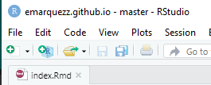

# Ejercicio usando `usethis`, `here` y `postcards`

Instructoras: [Elisa Márquez Zavala](https://twitter.com/naielisha), [Citlali Gil Aguillon](http://twitter.com/argininaa)

Contenido adaptado del [Curso de RNASeq](https://lcolladotor.github.io/rnaseq_LCG-UNAM_2021/index.html) de [Leonardo Collado Torres](https://github.com/lcolladotor)

## here

Este paquete es bastante útil 

El directorio que toma como base será en el que nos encontremos al momento de cargar el paquete  `here`, heuristicamente busca la raíz del proyecto y se posiciona en él.


```r
# se descargó previamente, así que solo se carga
library("here") # busca la raiz del proyecto en el que se encuentre
```

En ciertas ocasiones puede haber algun error, ya que puede chocar con otros paquetes (como `plyr`). para evitar esto podemos usar `here::here` (que básicamente aclara que la función solicitada es del paquete `here`)


```r
here::here()
```

Podemos checar en qué directorio nos encontramos con `getwd()`, si no es el que deseamos podemos cambiarlo con `setwd()`

```r
getwd() # regresa la path en donde nos encontramos
setwd("direccion/deseada") # nos lleva a la path indicada
```

Pero con `here` podemos no especificar la path 


```r
getwd() # para checar en donde nos encontramos
here::here() # para checar dónde te encuentras

# nos movemos al subdirectorio R
setwd(here::here("R")) # podemos cambiar de directorio, aun así `here está en la raíz
```

A continuación ofrecemos algunos ejemplos de cómo podría emplearse `here::here`


```r
# como ejemplo: vamos a guardar datos en archivo y cargarlos
a <- 1
c <- 23
save(a, c, file = here::here("datos-prueba.RData"))
# rm(a,c)
load(here::here("datos-prueba.RData"))

# creamos un directorio
dir.create(here::here("subdirectorio"), showWarnings = FALSE)
# podemos crear un archivo, indicando el subdirectorio, (en este caso el primer argumento)
file.create(here::here("subdirectorio", "nombrearchivo"))
# abrimos el nuevo archivo creado
file.show(here::here("subdirectorio", "nombrearchivo")) # podemos editarlo!!

# por ejemplo si quisieramos ver nuestros archivos del directorio
list.files(here::here(), recursive = TRUE)
```

## usethis

[manual de usuario](https://cran.r-project.org/web/packages/usethis/usethis.pdf)

`usethis` puede ser más amigable, por ejemplo para la creación de nuevos archivos .R es capaz de agruparlos en la carpeta R (dando un orden al proyecto)


```r
usethis::use_r("notas-prueba.R") # no importando en qué path estemos
```

En el siguiente ejercicio veremos algunos usos de `usethis`


## Vinculando RStudio con Git y GitHub 


Ahora vamos a vincular nuestro proyecto de Rstudio con Github, esto es muy util para tener un control de nuestros archivos, poder compartirlos o usar el de otrxs

### Prerrequisitos

  Debemos tener una cuenta de Github. Si no tienes este es el momento para crear una cuenta!

  - https://docs.github.com/es/github/getting-started-with-github/signing-up-for-github/signing-up-for-a-new-github-account

  También debemos instalar `git` en nuestras computadoras ya que el paquete `gitcreds` lo requiere

- https://git-scm.com/book/en/v2/Getting-Started-Installing-Git

>Despues de instalar git debemor reiniciar nuestro RStudio para que pueda anexarse

Y la instalación de los siguientes paquetes:
  

```r
# paquetes que vamos a requerir
install.packages(c("gitcreds", "gert", "gh"))
# cargarlos de manera separada
library("gitcreds")
library("gert")
library("gh")
```


### Creando token de acceso personal (PAT)

Para conectar nuestro repositorio de Rstudio con Github solicitamos un token, esto para que github otorgue permiso a nuestra computadora

Emplearemos el siguiente bloque de código para solicitar dicho token (elige un nombre significativo)

>Otra manera de solicitar el token es ingresando a https://github.com/settings/tokens, esta opción no dará una recomendación de los parámetros a seleccionar

>El parámetro de expiración del token puede cambiarse para que no expire (por seguridad no lo recomienda Github), de otra manera considera su tiempo de vigencia

Una vez generado el token debes guardarlo, pues no volverá a aparecer.

>Siempre puedes volver a generar uno nuevo (no olvides borrar el token anterior)


```r
# Para iniciar conexión con GitHub
usethis::create_github_token() # redirige a github donde eligiras nombre especifico del token
# copia el token para después ingresarlo con gitcreds_set()
gitcreds::gitcreds_set() # aquí colocas el token (NO tu contraseña de github!!!)
```
> NOTA: en el comando `gitcreds::gitcreds_set()` **NO debemos poner nuestro token entre parentesis,** sino que al ejecutar el comando la misma función nos pedirá ingresar el token

El siguiente paso será configurar nuestro usuario de github en el archivo `.gitconfig`


```r
# Configurar usuario de gitHub
usethis::edit_git_config() # que abre el archivo .gitconfig
# colocaremos nombre y correo de cuenta de github. SOLO borrar los # y respetar los demas espacios
# [user]
#   name = N O M B R E
#   email = correodeGithub
```

### Inicializar repositorio de Git y Github
Ahora vamos a inicializar el repositorio en Git (de manera local en tu computadora) y enseguida solicitamos que se conecte con los servidores de Github


```r
# inicializar el repositorio de Git
usethis::use_git() #

# conectar tu repositorio local de Git con los servidores de GitHub
usethis::use_github()
```

>Git es el software mientras que GitHub es la plataforma web (basada en Git) que permite la colaboración


**LISTO!!**

>Comando útil para checar configuración


```r
gh::gh_whoami() # para checar cómo quedó la configuración
```

### Probar otros comandos de `gert`

Una vez que ya vinculamos nuestro repositorio con github podemos seguir actualizandolo. Vamos a checar brevemente algunos de los comandos que son útiles para ello:

Checaremos `git_add`, `git_commit`, `git_log` y `git_push`

```r
# escribimos un nuevo archivo, volvemos a usar here::here para especificar path
writeLines("hola", here::here("R", "prueba-here.R"))
# otra manera es usar use_r
usethis::use_r("archivo-prueba-github.R") # añade archivo al directorio R del proyecto actual

# Por ejemplo podríamos probar añadir algo nuevo
gert::git_add("R/archivo-prueba-github.R")

# añadimos commit de lo que se hizo
gert::git_commit("se subio archivo prueba")

# nos da info de los commits
gert::git_log()

# sube tus cambios del repo local a los de github
gert::git_push() # COMANDO IMPORTANTE
```

_Puede ser más amigable usar el recuadro de Git que aparece en RStudio para hacer todo lo anterior!_

**Recuerden subir sus repositorios al**
[Google Sheet](https://docs.google.com/spreadsheets/d/13xHCfRb3vATXCFxS1prIA5cYgHNFnzI0GLlcIjtenyw/edit)

## Ejercicio postcards
* Similar a https://pages.github.com/
* `postcards` tiene 4 templados de páginas web https://github.com/seankross/postcards
* Tu página web debe describir decir algo sobre ti, tus intereses, y tus proyectos además de cómo contactarte
  - Ejemplo https://amy-peterson.github.io/ vía https://github.com/amy-peterson/amy-peterson.github.com
  - http://jtleek.com/ vía https://github.com/jtleek/jtleek.github.io
  - http://aejaffe.com/ vía https://github.com/andrewejaffe/andrewejaffe.github.io


### Crear el repositorio
* Podemos crearlo desde RStudio o desde github.com

**(opción 1) Desde RStudio**

<div class="alert alert-block alert-danger">
<b>¡Cuidado!:</b> Antes de crear un proyecto, revisen dónde están parados (`getwd()`) en su directorio y dónde quieren que se cree
</div>


```r
## Creen el RStudio project. Es MUY importante que el usuario debe sea igual que en github
usethis::create_project("Su_Usuario.github.io")
```

Nuevo proyecto :

<div class="figure">

<p class="caption">git user</p>
</div>


```r
## Configura Git y GitHub

# Con use_git() preguntará si desean hacer un commit, y después pedirá reiniciar Rstudio para que obtengan un nuevo botón llamado "git()"
usethis::use_git()
```

Nuevo botón

<div class="figure">

<p class="caption">button_git</p>
</div>


```r
usethis::use_github()
```


Creen su templado usando `postcards` corriendo **una** de las 4 líneas (la que tenga el templado que más les gustó). Va a crear un archivo `index.Rmd`


```r
## Solo uno de estos, de acuerdo al templado que más les gustó
postcards::create_postcard(template = "jolla")
postcards::create_postcard(template = "jolla-blue")
postcards::create_postcard(template = "trestles")
postcards::create_postcard(template = "onofre")
```

**(opción 2) Desde github**

* Creen un nuevo repositorio, público y **sin** archivo README en https://github.com/new llamado "usuario.github.io" con su **nombre exacto** en github

<div class="alert alert-warning">
  <strong>¡Cuidado!</strong> El repositorio debe ser **público** y sin README
</div>

* Creen un nuevo proyecto en RStudio: 
  File > New_project > New directory > Postcards Website 
  
* Elijan el templado que más les gustó

* Ya con el proyecto creado, hay que configurar git y github


```r
## Configura Git y GitHub

# Con use_git() preguntará si desean hacer un commit, y después pedirá reiniciar Rstudio para que obtengan un nuevo botón llamado "git()"
usethis::use_git()
```

  
  
Nuevo botón: 

<div class="figure">

<p class="caption">button_git</p>
</div>

* Ahora que tienen el botón Git, hagan click y en la esquina derecha habrá un símbolo con dos  rectángulos morados y un rombo blanco, denle click.

<div class="figure">

<p class="caption">button_branch</p>
</div>

* Ahora el botón *Add Remote* y ahí podrán nombrar este acceso remoto como gusten, y agregar la URL de su repositorio en github.

* Da click en *Add* y después asignen el nombre de rama **master**

* Ahora pueden crear la rama, y sobreescribir el acceso cuando se los pregunte.

-----------------------------


-----------------------------

### Modificar y subir a github nuestro postcard

Ya que hayan creado con cualquiera de las 2 opciones anteriores pueden continuar:

* Llenen su información usando el formato `Markdown`. Por ejemplo https://github.com/andrewejaffe/andrewejaffe.github.io/blob/master/index.Rmd#L17-L31.
* Agreguen sus perfiles estilo https://github.com/andrewejaffe/andrewejaffe.github.io/blob/master/index.Rmd#L7-L12
* Den click en el botón azul de `knit` en RStudio. Es equivalente a `rmarkdown::render("index.Rmd")`. Esto creará el archivo `index.html`.

* Hagan un `commit` para guardar los archivos nuevos incluyendo `index.html` y luego un `push` para subir los archivos a GitHub con alguna de las siguientes dos maneras:

**(opción 1) Botón de Git**
* Para guardar los archivos nuevos, incluyendo `index.html`, debemos hacer un `commit`. Podemos hacerlo con el nuevo botón de git, primero seleccionando los archivos: 

<div class="figure">

<p class="caption">add_file</p>
</div>

Cuando hayamos seleccionado **todos** los archivos, veremos que la columna Status cambia a una "A" de agregado o added y podemos darle al botón `Commit` justo arriba de Status. Esto abrirá una nueva pestaña donde podremos poner un mensaje sobre nuestro `commit` y después darle al botón `Commit`.

<div class="figure">

<p class="caption">button_git</p>
</div>

Una vez terminado, en esa misma pantalla podemos darle un `push` para subir los archivos a GitHub con el botón de  `Push` con una flecha verde arriba de *Commit message*.


**(opcion 2) Línea de comandos**
Otra manera de hacer es vía línea de comandos, primero pueden agregar los archivos con `gert::git_add()`  o hacer directamente un commit de todos los archivos y luego un pull:


```r
## Guardamos los archivos nuevos con el commit
gert::git_commit_all("mensaje sobre el commit")

## Subimos los archivos a github
gert::git_push()
```

* <span style="color:DodgerBlue">**(extra)** </span>. Pueden copiar y pegar emojis en sus páginas o utilizar [fontawesome](https://github.com/rstudio/fontawesome) para agregar diferentes símbolos (como github o twitter):

  - En código YAML

```r
# Utlilizando `r fontawesome::fa("font-awesome-logo-full", fill = "forestgreen")` en código YAML
```

<div class="figure">

<p class="caption">y_fawesome</p>
</div>

  Se ve así:
  
<div class="figure">

<p class="caption">fawesome</p>
</div>

* 
   - En el texto


```r
# Utlilizando `r fontawesome::fa("font-awesome-logo-full", fill = "forestgreen")` en el texto
```

<div class="figure">

<p class="caption">tfawesome</p>
</div>


* <span style="color:DodgerBlue">**(opcional)**</span>. Anuncien su nueva página web en Twitter usando el hashtag `#rstats` y/o etiquen al autor de `postcards` https://twitter.com/seankross. Pueden después incluir su página web en su introducción en el canal `#bienvenida` del Slack de la CDSB ^^.

**Recuerden subir sus repositorios al**
[Google Sheet](https://docs.google.com/spreadsheets/d/13xHCfRb3vATXCFxS1prIA5cYgHNFnzI0GLlcIjtenyw/edit)

* Acá podemos ver varias de las páginas web que hicieron lxs participantes del taller.

<blockquote class="twitter-tweet"><p lang="es" dir="ltr">En el taller de <a href="https://twitter.com/hashtag/scRNAseq?src=hash&amp;ref_src=twsrc%5Etfw">#scRNAseq</a> aprendimos a usar <a href="https://twitter.com/hashtag/postcards?src=hash&amp;ref_src=twsrc%5Etfw">#postcards</a> de <a href="https://twitter.com/seankross?ref_src=twsrc%5Etfw">@seankross</a> y <a href="https://twitter.com/hashtag/usethis?src=hash&amp;ref_src=twsrc%5Etfw">#usethis</a> de <a href="https://twitter.com/JennyBryan?ref_src=twsrc%5Etfw">@JennyBryan</a> <a href="https://twitter.com/jimhester_?ref_src=twsrc%5Etfw">@jimhester_</a> et al para hacer páginas web✨<br><br>El objetivo: aumentar la presencia de Latinxs en la red 🌐<br><br>Instructoras 🦆: Elisa <a href="https://twitter.com/naielisha?ref_src=twsrc%5Etfw">@naielisha</a> y <a href="https://twitter.com/argininaa?ref_src=twsrc%5Etfw">@argininaa</a> <a href="https://twitter.com/hashtag/rstatsES?src=hash&amp;ref_src=twsrc%5Etfw">#rstatsES</a><a href="https://t.co/O6AoxRqp6o">https://t.co/O6AoxRqp6o</a> <a href="https://t.co/rGWb1l38hk">pic.twitter.com/rGWb1l38hk</a></p>&mdash; ComunidadBioInfo (@CDSBMexico) <a href="https://twitter.com/CDSBMexico/status/1426259850523201544?ref_src=twsrc%5Etfw">August 13, 2021</a></blockquote> <script async src="https://platform.twitter.com/widgets.js" charset="utf-8"></script>

## Detalles de la sesión de R


```r
## Información de la sesión de R
Sys.time()
```

```
## [1] "2021-08-13 22:35:53 UTC"
```

```r
proc.time()
```

```
##    user  system elapsed 
##   0.584   0.139   0.595
```

```r
options(width = 120)
sessioninfo::session_info()
```

```
## ─ Session info ───────────────────────────────────────────────────────────────────────────────────────────────────────
##  setting  value                       
##  version  R version 4.1.0 (2021-05-18)
##  os       Ubuntu 20.04.2 LTS          
##  system   x86_64, linux-gnu           
##  ui       X11                         
##  language (EN)                        
##  collate  en_US.UTF-8                 
##  ctype    en_US.UTF-8                 
##  tz       UTC                         
##  date     2021-08-13                  
## 
## ─ Packages ───────────────────────────────────────────────────────────────────────────────────────────────────────────
##  package     * version date       lib source        
##  bookdown      0.22    2021-04-22 [1] RSPM (R 4.1.0)
##  bslib         0.2.5.1 2021-05-18 [1] RSPM (R 4.1.0)
##  cli           3.0.1   2021-07-17 [2] RSPM (R 4.1.0)
##  digest        0.6.27  2020-10-24 [2] RSPM (R 4.1.0)
##  evaluate      0.14    2019-05-28 [2] RSPM (R 4.1.0)
##  highr         0.9     2021-04-16 [2] RSPM (R 4.1.0)
##  htmltools     0.5.1.1 2021-01-22 [1] RSPM (R 4.1.0)
##  jquerylib     0.1.4   2021-04-26 [1] RSPM (R 4.1.0)
##  jsonlite      1.7.2   2020-12-09 [2] RSPM (R 4.1.0)
##  knitr         1.33    2021-04-24 [2] RSPM (R 4.1.0)
##  magrittr      2.0.1   2020-11-17 [2] RSPM (R 4.1.0)
##  R6            2.5.0   2020-10-28 [2] RSPM (R 4.1.0)
##  rlang         0.4.11  2021-04-30 [2] RSPM (R 4.1.0)
##  rmarkdown     2.10    2021-08-06 [1] RSPM (R 4.1.0)
##  sass          0.4.0   2021-05-12 [1] RSPM (R 4.1.0)
##  sessioninfo   1.1.1   2018-11-05 [2] RSPM (R 4.1.0)
##  stringi       1.7.3   2021-07-16 [2] RSPM (R 4.1.0)
##  stringr       1.4.0   2019-02-10 [2] RSPM (R 4.1.0)
##  withr         2.4.2   2021-04-18 [2] RSPM (R 4.1.0)
##  xfun          0.25    2021-08-06 [2] RSPM (R 4.1.0)
## 
## [1] /__w/_temp/Library
## [2] /usr/local/lib/R/site-library
## [3] /usr/local/lib/R/library
```

## Patrocinadores {-}

Agradecemos a nuestros patrocinadores:

<a href="https://comunidadbioinfo.github.io/es/post/cs_and_s_event_fund_award/#.YJH-wbVKj8A"></a>

<a href="https://www.r-consortium.org/"></a>
