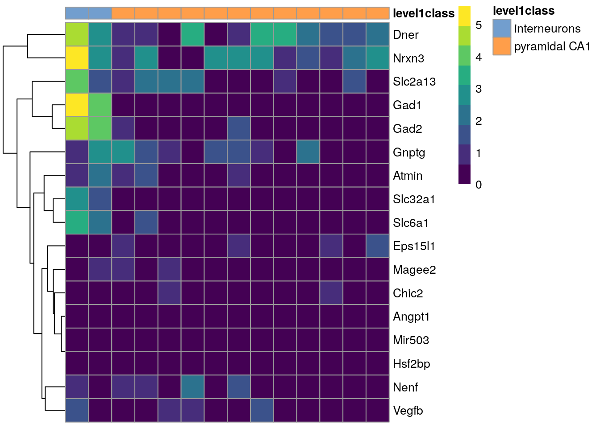

# Estructura e importe de datos

Instructoras: [Elisa Márquez Zavala](https://twitter.com/naielisha), [Citlali Gil Aguillon](http://twitter.com/argininaa)

Contenido adaptado de [CDSB2020: Introducción a scRNA-seq, estructura e importe de datos
](https://comunidadbioinfo.github.io/cdsb2020/scRNAseq/02-data-infrastructure-and-import.html#1) de [Leonardo Collado Torres](https://twitter.com/lcolladotor). 

## Preprocesamiento de datos

### Cell Ranger

* [`cellranger`](https://support.10xgenomics.com/single-cell-gene-expression/software/pipelines/latest/what-is-cell-ranger) es un _pipeline_ que provee 10x Genomics para procesar datos de scRNA-seq generados con la tecnología de Chromium de 10x Genomics 


* [`cellranger count`](https://support.10xgenomics.com/single-cell-gene-expression/software/pipelines/latest/using/count) procesa los datos crudos de FASTQ y genera los archivos que podemos leer en R usando `DropletUtils::read10xCounts()`.

### scPipe

* [`scPipe`](https://bioconductor.org/packages/scPipe/) es otro _pipeline_ para procesar datos crudos (en formato FASTQ) de tecnologías de scRNA-seq. Funciona para varias tecnologías y usa `Rsubread` para el paso de alineamiento. 

> we developed scPipe, an R/Bioconductor package that integrates barcode demultiplexing, read alignment, UMI-aware gene-level quantification and quality control of raw sequencing data generated by multiple protocols that include CEL-seq, MARS-seq, Chromium 10X, Drop-seq and Smart-seq.


Fuente: [Tian et al, _PLoS Comput Biol._, 2018](https://www.ncbi.nlm.nih.gov/pmc/articles/PMC6105007/).

### Etc

Hay muchos pipelines para procesar datos de scRNA-seq, porque a diferencia de bulk RNA-seq, en scRNA-seq hay muchas tecnologías en el mercado. Aunque tal vez la más común es la de 10x Genomics Chromium.

## Estructura de `SingleCellExperiment`

Dentro del curso -y más ampliamente dentro de los análisis de scRNA-seq en R- emplearemos la clase `SingleCellExperiment` . 

>Además recordemos que la interoperabilidad dentro de los paquetes de Bioconductor hará que facilmente puedas ajustarte más facilmente a otros paquetes que vayamos encontrando útiles (la infraestructura de los dato nos seguirá sirviendo!).

Podríamos dividir esta clase en cuatro categorias:

- datos primarios y transformados (donde estaran lo)

- metadata de datos (información de los genes o features, de las células y del experimento)

- reduccion de dimensiones 

- experimentos alternativos

Todo lo anterior está ligado, por lo que hace más sencillo el manejo de subsets de interés

> por ejemplo si nos interesa los genes x,y,z podríamos solicitarlos y con ello traer la información de las demás tablas

Examinaremos cada una de estas partes a detalle


Usaremos las diapositivas de [Peter Hickey](https://www.peterhickey.org/) para explicar la clase `SingleCellExperiment` [en las siguientes diapositivas](https://docs.google.com/presentation/d/1X9qP3wNlnn3BMUQhuZwAo4vCV76c33X_M-UnHxkPZpE/edit#slide=id.g7e63e0fe24_0_151). A la par se demostrará el siguiente código.


## Ejercicio 1

The A. T. L. Lun et al. (2017) dataset contains two 96-well plates of 416B cells (an immortalized mouse myeloid progenitor cell line), processed using the Smart-seq2 protocol (Picelli et al. 2014). A constant amount of spike-in RNA from the External RNA Controls Consortium (ERCC) was also added to each cell’s lysate prior to library preparation. High-throughput sequencing was performed and the expression of each gene was quantified by counting the total number of reads mapped to its exonic regions. Similarly, the quantity of each spike-in transcript was measured by counting the number of reads mapped to the spike-in reference sequences.

Fragmento obtenido de https://bioconductor.org/books/release/OSCA/lun-416b-cell-line-smart-seq2.html


```r
library("scRNAseq")
sce.416b <- LunSpikeInData(which = "416b")

# Carga el paquete SingleCellExperiment
library("SingleCellExperiment")

"Primera parte
aquí checamos el slot assays"
```

```
## [1] "Primera parte\naquí checamos el slot assays"
```

```r
# Extrae la matriz de cuentas del set de datos de 416b
counts.416b <- counts(sce.416b)
# CHEQUEMOS clase y dimensiones
class(counts.416b) # es matriz
```

```
## [1] "matrix" "array"
```

```r
dim(counts.416b) # indicará genes y células
```

```
## [1] 46604   192
```

```r
# CONSTRUIR un nuevo objeto SCE de la matriz de cuentas !!!!!!
sce <- SingleCellExperiment(assays = list(counts = counts.416b))

# Revisa el objeto que acabamos de crear
sce
```

```
## class: SingleCellExperiment 
## dim: 46604 192 
## metadata(0):
## assays(1): counts
## rownames(46604): ENSMUSG00000102693 ENSMUSG00000064842 ...
##   ENSMUSG00000095742 CBFB-MYH11-mcherry
## rowData names(0):
## colnames(192): SLX-9555.N701_S502.C89V9ANXX.s_1.r_1
##   SLX-9555.N701_S503.C89V9ANXX.s_1.r_1 ...
##   SLX-11312.N712_S508.H5H5YBBXX.s_8.r_1
##   SLX-11312.N712_S517.H5H5YBBXX.s_8.r_1
## colData names(0):
## reducedDimNames(0):
## mainExpName: NULL
## altExpNames(0):
```

```r
## ¿Qué tan grande es el objeto de R?
lobstr::obj_size(sce) / 1024^2 ## En MB
```

```
## 38.26031 B
```

```r
# Accesa la matriz de cuenta del compartimento (slot) "assays"
# assays(sce, "counts")
# OJO: ¡esto puede inundar tu sesión de R!

# 1. El método general
assay(sce, "counts")[110:115, 1:3] # gene, cell
```

```
##                    SLX-9555.N701_S502.C89V9ANXX.s_1.r_1
## ENSMUSG00000097893                                    0
## ENSMUSG00000025915                                    8
## ENSMUSG00000046334                                    2
## ENSMUSG00000088916                                    0
## ENSMUSG00000046101                                    0
## ENSMUSG00000098234                                   63
##                    SLX-9555.N701_S503.C89V9ANXX.s_1.r_1
## ENSMUSG00000097893                                    0
## ENSMUSG00000025915                                    0
## ENSMUSG00000046334                                    3
## ENSMUSG00000088916                                    0
## ENSMUSG00000046101                                    0
## ENSMUSG00000098234                                   21
##                    SLX-9555.N701_S504.C89V9ANXX.s_1.r_1
## ENSMUSG00000097893                                   19
## ENSMUSG00000025915                                    1
## ENSMUSG00000046334                                   15
## ENSMUSG00000088916                                    0
## ENSMUSG00000046101                                    0
## ENSMUSG00000098234                                   17
```

```r
# 2. El método específico para accesar la matriz de cuentas "counts"
counts(sce)[110:115, 1:3]
```

```
##                    SLX-9555.N701_S502.C89V9ANXX.s_1.r_1
## ENSMUSG00000097893                                    0
## ENSMUSG00000025915                                    8
## ENSMUSG00000046334                                    2
## ENSMUSG00000088916                                    0
## ENSMUSG00000046101                                    0
## ENSMUSG00000098234                                   63
##                    SLX-9555.N701_S503.C89V9ANXX.s_1.r_1
## ENSMUSG00000097893                                    0
## ENSMUSG00000025915                                    0
## ENSMUSG00000046334                                    3
## ENSMUSG00000088916                                    0
## ENSMUSG00000046101                                    0
## ENSMUSG00000098234                                   21
##                    SLX-9555.N701_S504.C89V9ANXX.s_1.r_1
## ENSMUSG00000097893                                   19
## ENSMUSG00000025915                                    1
## ENSMUSG00000046334                                   15
## ENSMUSG00000088916                                    0
## ENSMUSG00000046101                                    0
## ENSMUSG00000098234                                   17
```

```r
# AGREGAR MAS ASSAYS
sce <- scater::logNormCounts(sce)
# Revisa el objeto que acabamos de actualizar
sce
```

```
## class: SingleCellExperiment 
## dim: 46604 192 
## metadata(0):
## assays(2): counts logcounts
## rownames(46604): ENSMUSG00000102693 ENSMUSG00000064842 ...
##   ENSMUSG00000095742 CBFB-MYH11-mcherry
## rowData names(0):
## colnames(192): SLX-9555.N701_S502.C89V9ANXX.s_1.r_1
##   SLX-9555.N701_S503.C89V9ANXX.s_1.r_1 ...
##   SLX-11312.N712_S508.H5H5YBBXX.s_8.r_1
##   SLX-11312.N712_S517.H5H5YBBXX.s_8.r_1
## colData names(1): sizeFactor
## reducedDimNames(0):
## mainExpName: NULL
## altExpNames(0):
```

```r
## ¿Qué tan grande es el objeto de R?
lobstr::obj_size(sce) / 1024^2 ## En MB
```

```
## 106.5302 B
```

```r
# 1. El método general
assay(sce, "logcounts")[110:115, 1:3]
```

```
##                    SLX-9555.N701_S502.C89V9ANXX.s_1.r_1
## ENSMUSG00000097893                             0.000000
## ENSMUSG00000025915                             3.557154
## ENSMUSG00000046334                             1.884687
## ENSMUSG00000088916                             0.000000
## ENSMUSG00000046101                             0.000000
## ENSMUSG00000098234                             6.423258
##                    SLX-9555.N701_S503.C89V9ANXX.s_1.r_1
## ENSMUSG00000097893                             0.000000
## ENSMUSG00000025915                             0.000000
## ENSMUSG00000046334                             2.087367
## ENSMUSG00000088916                             0.000000
## ENSMUSG00000046101                             0.000000
## ENSMUSG00000098234                             4.569735
##                    SLX-9555.N701_S504.C89V9ANXX.s_1.r_1
## ENSMUSG00000097893                            4.3052563
## ENSMUSG00000025915                            0.9912494
## ENSMUSG00000046334                            3.9835488
## ENSMUSG00000088916                            0.0000000
## ENSMUSG00000046101                            0.0000000
## ENSMUSG00000098234                            4.1533513
```

```r
# 2. El método específico para accesar la matriz de cuentas
# transformadas "logcounts"
logcounts(sce)[110:115, 1:3]
```

```
##                    SLX-9555.N701_S502.C89V9ANXX.s_1.r_1
## ENSMUSG00000097893                             0.000000
## ENSMUSG00000025915                             3.557154
## ENSMUSG00000046334                             1.884687
## ENSMUSG00000088916                             0.000000
## ENSMUSG00000046101                             0.000000
## ENSMUSG00000098234                             6.423258
##                    SLX-9555.N701_S503.C89V9ANXX.s_1.r_1
## ENSMUSG00000097893                             0.000000
## ENSMUSG00000025915                             0.000000
## ENSMUSG00000046334                             2.087367
## ENSMUSG00000088916                             0.000000
## ENSMUSG00000046101                             0.000000
## ENSMUSG00000098234                             4.569735
##                    SLX-9555.N701_S504.C89V9ANXX.s_1.r_1
## ENSMUSG00000097893                            4.3052563
## ENSMUSG00000025915                            0.9912494
## ENSMUSG00000046334                            3.9835488
## ENSMUSG00000088916                            0.0000000
## ENSMUSG00000046101                            0.0000000
## ENSMUSG00000098234                            4.1533513
```

```r
# agregemos un assay mas, esta vez de manera manual
assay(sce, "counts_100") <- assay(sce, "counts") + 100 # suma 100 a counts assay
# Enumera los "assays" en el objeto
assays(sce) # indica num y nombre de assays
```

```
## List of length 3
## names(3): counts logcounts counts_100
```

```r
assayNames(sce) # solo nos dará los nombres de los assays
```

```
## [1] "counts"     "logcounts"  "counts_100"
```

```r
#      assay(sce, "counts_100")[110:115, 1:3]
## ¿Qué tan grande es el objeto de R?
lobstr::obj_size(sce) / 1024^2 ## En MB
```

```
## 174.7981 B
```

```r
"segunda parte:
aquí checaremos metadata de las células"
```

```
## [1] "segunda parte:\naquí checaremos metadata de las células"
```

```r
# Extrae la información de las muestras (metadata) del set de datos de 416b
colData.416b <- colData(sce.416b) # podemos checar objeto en la cajita de environment de RStudio!!

# explorar datooos
table(colData.416b$phenotype)
```

```
## 
## induced CBFB-MYH11 oncogene expression                    wild type phenotype 
##                                     96                                     96
```

```r
table(colData.416b$block) # fue en varios dias?
```

```
## 
## 20160113 20160325 
##       96       96
```

```r
# Agrega algo de esa información a nuestro objeto de SCE
colData(sce) <- colData.416b[, c("phenotype", "block")]
# Revisa el objeto que acabamos de actualizar
sce
```

```
## class: SingleCellExperiment 
## dim: 46604 192 
## metadata(0):
## assays(3): counts logcounts counts_100
## rownames(46604): ENSMUSG00000102693 ENSMUSG00000064842 ...
##   ENSMUSG00000095742 CBFB-MYH11-mcherry
## rowData names(0):
## colnames(192): SLX-9555.N701_S502.C89V9ANXX.s_1.r_1
##   SLX-9555.N701_S503.C89V9ANXX.s_1.r_1 ...
##   SLX-11312.N712_S508.H5H5YBBXX.s_8.r_1
##   SLX-11312.N712_S517.H5H5YBBXX.s_8.r_1
## colData names(2): phenotype block
## reducedDimNames(0):
## mainExpName: NULL
## altExpNames(0):
```

```r
# Accesa a la información de las muestras (metadata) en nuestro SCE
colData(sce) # usar head?
```

```
## DataFrame with 192 rows and 2 columns
##                                                    phenotype     block
##                                                  <character> <integer>
## SLX-9555.N701_S502.C89V9ANXX.s_1.r_1     wild type phenotype  20160113
## SLX-9555.N701_S503.C89V9ANXX.s_1.r_1     wild type phenotype  20160113
## SLX-9555.N701_S504.C89V9ANXX.s_1.r_1     wild type phenotype  20160113
## SLX-9555.N701_S505.C89V9ANXX.s_1.r_1  induced CBFB-MYH11 o..  20160113
## SLX-9555.N701_S506.C89V9ANXX.s_1.r_1  induced CBFB-MYH11 o..  20160113
## ...                                                      ...       ...
## SLX-11312.N712_S505.H5H5YBBXX.s_8.r_1 induced CBFB-MYH11 o..  20160325
## SLX-11312.N712_S506.H5H5YBBXX.s_8.r_1 induced CBFB-MYH11 o..  20160325
## SLX-11312.N712_S507.H5H5YBBXX.s_8.r_1 induced CBFB-MYH11 o..  20160325
## SLX-11312.N712_S508.H5H5YBBXX.s_8.r_1 induced CBFB-MYH11 o..  20160325
## SLX-11312.N712_S517.H5H5YBBXX.s_8.r_1    wild type phenotype  20160325
```

```r
# Accesa una columna específica de la información de las muestras (metadata)
table(sce$block)
```

```
## 
## 20160113 20160325 
##       96       96
```

```r
table(colData(sce)$block) # otra manera
```

```
## 
## 20160113 20160325 
##       96       96
```

```r
# Ejemplo de una función que agrega columnas nuevas al colData
sce <- scater::addPerCellQC(sce.416b) # añade datos de control de calidad
# Accesa a la información de las muestras (metadata) en nuestro SCE actualizado
colData(sce)
```

```
## DataFrame with 192 rows and 18 columns
##                                                  Source Name   cell line
##                                                  <character> <character>
## SLX-9555.N701_S502.C89V9ANXX.s_1.r_1  SLX-9555.N701_S502.C..        416B
## SLX-9555.N701_S503.C89V9ANXX.s_1.r_1  SLX-9555.N701_S503.C..        416B
## SLX-9555.N701_S504.C89V9ANXX.s_1.r_1  SLX-9555.N701_S504.C..        416B
## SLX-9555.N701_S505.C89V9ANXX.s_1.r_1  SLX-9555.N701_S505.C..        416B
## SLX-9555.N701_S506.C89V9ANXX.s_1.r_1  SLX-9555.N701_S506.C..        416B
## ...                                                      ...         ...
## SLX-11312.N712_S505.H5H5YBBXX.s_8.r_1 SLX-11312.N712_S505...        416B
## SLX-11312.N712_S506.H5H5YBBXX.s_8.r_1 SLX-11312.N712_S506...        416B
## SLX-11312.N712_S507.H5H5YBBXX.s_8.r_1 SLX-11312.N712_S507...        416B
## SLX-11312.N712_S508.H5H5YBBXX.s_8.r_1 SLX-11312.N712_S508...        416B
## SLX-11312.N712_S517.H5H5YBBXX.s_8.r_1 SLX-11312.N712_S517...        416B
##                                                 cell type
##                                               <character>
## SLX-9555.N701_S502.C89V9ANXX.s_1.r_1  embryonic stem cell
## SLX-9555.N701_S503.C89V9ANXX.s_1.r_1  embryonic stem cell
## SLX-9555.N701_S504.C89V9ANXX.s_1.r_1  embryonic stem cell
## SLX-9555.N701_S505.C89V9ANXX.s_1.r_1  embryonic stem cell
## SLX-9555.N701_S506.C89V9ANXX.s_1.r_1  embryonic stem cell
## ...                                                   ...
## SLX-11312.N712_S505.H5H5YBBXX.s_8.r_1 embryonic stem cell
## SLX-11312.N712_S506.H5H5YBBXX.s_8.r_1 embryonic stem cell
## SLX-11312.N712_S507.H5H5YBBXX.s_8.r_1 embryonic stem cell
## SLX-11312.N712_S508.H5H5YBBXX.s_8.r_1 embryonic stem cell
## SLX-11312.N712_S517.H5H5YBBXX.s_8.r_1 embryonic stem cell
##                                       single cell well quality
##                                                    <character>
## SLX-9555.N701_S502.C89V9ANXX.s_1.r_1                        OK
## SLX-9555.N701_S503.C89V9ANXX.s_1.r_1                        OK
## SLX-9555.N701_S504.C89V9ANXX.s_1.r_1                        OK
## SLX-9555.N701_S505.C89V9ANXX.s_1.r_1                        OK
## SLX-9555.N701_S506.C89V9ANXX.s_1.r_1                        OK
## ...                                                        ...
## SLX-11312.N712_S505.H5H5YBBXX.s_8.r_1                       OK
## SLX-11312.N712_S506.H5H5YBBXX.s_8.r_1                       OK
## SLX-11312.N712_S507.H5H5YBBXX.s_8.r_1                       OK
## SLX-11312.N712_S508.H5H5YBBXX.s_8.r_1                       OK
## SLX-11312.N712_S517.H5H5YBBXX.s_8.r_1                       OK
##                                                     genotype
##                                                  <character>
## SLX-9555.N701_S502.C89V9ANXX.s_1.r_1  Doxycycline-inducibl..
## SLX-9555.N701_S503.C89V9ANXX.s_1.r_1  Doxycycline-inducibl..
## SLX-9555.N701_S504.C89V9ANXX.s_1.r_1  Doxycycline-inducibl..
## SLX-9555.N701_S505.C89V9ANXX.s_1.r_1  Doxycycline-inducibl..
## SLX-9555.N701_S506.C89V9ANXX.s_1.r_1  Doxycycline-inducibl..
## ...                                                      ...
## SLX-11312.N712_S505.H5H5YBBXX.s_8.r_1 Doxycycline-inducibl..
## SLX-11312.N712_S506.H5H5YBBXX.s_8.r_1 Doxycycline-inducibl..
## SLX-11312.N712_S507.H5H5YBBXX.s_8.r_1 Doxycycline-inducibl..
## SLX-11312.N712_S508.H5H5YBBXX.s_8.r_1 Doxycycline-inducibl..
## SLX-11312.N712_S517.H5H5YBBXX.s_8.r_1 Doxycycline-inducibl..
##                                                    phenotype      strain
##                                                  <character> <character>
## SLX-9555.N701_S502.C89V9ANXX.s_1.r_1     wild type phenotype    B6D2F1-J
## SLX-9555.N701_S503.C89V9ANXX.s_1.r_1     wild type phenotype    B6D2F1-J
## SLX-9555.N701_S504.C89V9ANXX.s_1.r_1     wild type phenotype    B6D2F1-J
## SLX-9555.N701_S505.C89V9ANXX.s_1.r_1  induced CBFB-MYH11 o..    B6D2F1-J
## SLX-9555.N701_S506.C89V9ANXX.s_1.r_1  induced CBFB-MYH11 o..    B6D2F1-J
## ...                                                      ...         ...
## SLX-11312.N712_S505.H5H5YBBXX.s_8.r_1 induced CBFB-MYH11 o..    B6D2F1-J
## SLX-11312.N712_S506.H5H5YBBXX.s_8.r_1 induced CBFB-MYH11 o..    B6D2F1-J
## SLX-11312.N712_S507.H5H5YBBXX.s_8.r_1 induced CBFB-MYH11 o..    B6D2F1-J
## SLX-11312.N712_S508.H5H5YBBXX.s_8.r_1 induced CBFB-MYH11 o..    B6D2F1-J
## SLX-11312.N712_S517.H5H5YBBXX.s_8.r_1    wild type phenotype    B6D2F1-J
##                                       spike-in addition     block       sum
##                                             <character> <integer> <numeric>
## SLX-9555.N701_S502.C89V9ANXX.s_1.r_1          ERCC+SIRV  20160113    865936
## SLX-9555.N701_S503.C89V9ANXX.s_1.r_1          ERCC+SIRV  20160113   1076277
## SLX-9555.N701_S504.C89V9ANXX.s_1.r_1          ERCC+SIRV  20160113   1180138
## SLX-9555.N701_S505.C89V9ANXX.s_1.r_1          ERCC+SIRV  20160113   1342593
## SLX-9555.N701_S506.C89V9ANXX.s_1.r_1          ERCC+SIRV  20160113   1668311
## ...                                                 ...       ...       ...
## SLX-11312.N712_S505.H5H5YBBXX.s_8.r_1          Premixed  20160325    776622
## SLX-11312.N712_S506.H5H5YBBXX.s_8.r_1          Premixed  20160325   1299950
## SLX-11312.N712_S507.H5H5YBBXX.s_8.r_1          Premixed  20160325   1800696
## SLX-11312.N712_S508.H5H5YBBXX.s_8.r_1          Premixed  20160325     46731
## SLX-11312.N712_S517.H5H5YBBXX.s_8.r_1          Premixed  20160325   1866692
##                                        detected altexps_ERCC_sum
##                                       <numeric>        <numeric>
## SLX-9555.N701_S502.C89V9ANXX.s_1.r_1       7618            65278
## SLX-9555.N701_S503.C89V9ANXX.s_1.r_1       7521            74748
## SLX-9555.N701_S504.C89V9ANXX.s_1.r_1       8306            60878
## SLX-9555.N701_S505.C89V9ANXX.s_1.r_1       8143            60073
## SLX-9555.N701_S506.C89V9ANXX.s_1.r_1       7154           136810
## ...                                         ...              ...
## SLX-11312.N712_S505.H5H5YBBXX.s_8.r_1      8174            61575
## SLX-11312.N712_S506.H5H5YBBXX.s_8.r_1      8956            94982
## SLX-11312.N712_S507.H5H5YBBXX.s_8.r_1      9530           113707
## SLX-11312.N712_S508.H5H5YBBXX.s_8.r_1      6649             7580
## SLX-11312.N712_S517.H5H5YBBXX.s_8.r_1     10964            48664
##                                       altexps_ERCC_detected
##                                                   <numeric>
## SLX-9555.N701_S502.C89V9ANXX.s_1.r_1                     39
## SLX-9555.N701_S503.C89V9ANXX.s_1.r_1                     40
## SLX-9555.N701_S504.C89V9ANXX.s_1.r_1                     42
## SLX-9555.N701_S505.C89V9ANXX.s_1.r_1                     42
## SLX-9555.N701_S506.C89V9ANXX.s_1.r_1                     44
## ...                                                     ...
## SLX-11312.N712_S505.H5H5YBBXX.s_8.r_1                    39
## SLX-11312.N712_S506.H5H5YBBXX.s_8.r_1                    41
## SLX-11312.N712_S507.H5H5YBBXX.s_8.r_1                    40
## SLX-11312.N712_S508.H5H5YBBXX.s_8.r_1                    44
## SLX-11312.N712_S517.H5H5YBBXX.s_8.r_1                    39
##                                       altexps_ERCC_percent altexps_SIRV_sum
##                                                  <numeric>        <numeric>
## SLX-9555.N701_S502.C89V9ANXX.s_1.r_1               6.80658            27828
## SLX-9555.N701_S503.C89V9ANXX.s_1.r_1               6.28030            39173
## SLX-9555.N701_S504.C89V9ANXX.s_1.r_1               4.78949            30058
## SLX-9555.N701_S505.C89V9ANXX.s_1.r_1               4.18567            32542
## SLX-9555.N701_S506.C89V9ANXX.s_1.r_1               7.28887            71850
## ...                                                    ...              ...
## SLX-11312.N712_S505.H5H5YBBXX.s_8.r_1              7.17620            19848
## SLX-11312.N712_S506.H5H5YBBXX.s_8.r_1              6.65764            31729
## SLX-11312.N712_S507.H5H5YBBXX.s_8.r_1              5.81467            41116
## SLX-11312.N712_S508.H5H5YBBXX.s_8.r_1             13.48898             1883
## SLX-11312.N712_S517.H5H5YBBXX.s_8.r_1              2.51930            16289
##                                       altexps_SIRV_detected
##                                                   <numeric>
## SLX-9555.N701_S502.C89V9ANXX.s_1.r_1                      7
## SLX-9555.N701_S503.C89V9ANXX.s_1.r_1                      7
## SLX-9555.N701_S504.C89V9ANXX.s_1.r_1                      7
## SLX-9555.N701_S505.C89V9ANXX.s_1.r_1                      7
## SLX-9555.N701_S506.C89V9ANXX.s_1.r_1                      7
## ...                                                     ...
## SLX-11312.N712_S505.H5H5YBBXX.s_8.r_1                     7
## SLX-11312.N712_S506.H5H5YBBXX.s_8.r_1                     7
## SLX-11312.N712_S507.H5H5YBBXX.s_8.r_1                     7
## SLX-11312.N712_S508.H5H5YBBXX.s_8.r_1                     7
## SLX-11312.N712_S517.H5H5YBBXX.s_8.r_1                     7
##                                       altexps_SIRV_percent     total
##                                                  <numeric> <numeric>
## SLX-9555.N701_S502.C89V9ANXX.s_1.r_1               2.90165    959042
## SLX-9555.N701_S503.C89V9ANXX.s_1.r_1               3.29130   1190198
## SLX-9555.N701_S504.C89V9ANXX.s_1.r_1               2.36477   1271074
## SLX-9555.N701_S505.C89V9ANXX.s_1.r_1               2.26741   1435208
## SLX-9555.N701_S506.C89V9ANXX.s_1.r_1               3.82798   1876971
## ...                                                    ...       ...
## SLX-11312.N712_S505.H5H5YBBXX.s_8.r_1             2.313165    858045
## SLX-11312.N712_S506.H5H5YBBXX.s_8.r_1             2.224004   1426661
## SLX-11312.N712_S507.H5H5YBBXX.s_8.r_1             2.102562   1955519
## SLX-11312.N712_S508.H5H5YBBXX.s_8.r_1             3.350892     56194
## SLX-11312.N712_S517.H5H5YBBXX.s_8.r_1             0.843271   1931645
```

```r
# Revisa el objeto que acabamos de actualizar
sce
```

```
## class: SingleCellExperiment 
## dim: 46604 192 
## metadata(0):
## assays(1): counts
## rownames(46604): ENSMUSG00000102693 ENSMUSG00000064842 ...
##   ENSMUSG00000095742 CBFB-MYH11-mcherry
## rowData names(1): Length
## colnames(192): SLX-9555.N701_S502.C89V9ANXX.s_1.r_1
##   SLX-9555.N701_S503.C89V9ANXX.s_1.r_1 ...
##   SLX-11312.N712_S508.H5H5YBBXX.s_8.r_1
##   SLX-11312.N712_S517.H5H5YBBXX.s_8.r_1
## colData names(18): Source Name cell line ... altexps_SIRV_percent total
## reducedDimNames(0):
## mainExpName: endogenous
## altExpNames(2): ERCC SIRV
```

```r
## ¿Qué tan grande es el objeto de R?
lobstr::obj_size(sce) / 1024^2 ## En MB
```

```
## 39.47633 B
```

```r
## Agrega las cuentas normalizadas (lognorm) de nuevo
sce <- scater::logNormCounts(sce)

## ¿Qué tan grande es el objeto de R?
lobstr::obj_size(sce) / 1024^2 ## En MB
```

```
## 107.7463 B
```

```r
# Ejemplo: obtén el subconjunto de células de fenotipo "wild type"
# Acuérdate que las células son columnas del SCE !!!!
sce[, sce$phenotype == "wild type phenotype"]
```

```
## class: SingleCellExperiment 
## dim: 46604 96 
## metadata(0):
## assays(2): counts logcounts
## rownames(46604): ENSMUSG00000102693 ENSMUSG00000064842 ...
##   ENSMUSG00000095742 CBFB-MYH11-mcherry
## rowData names(1): Length
## colnames(96): SLX-9555.N701_S502.C89V9ANXX.s_1.r_1
##   SLX-9555.N701_S503.C89V9ANXX.s_1.r_1 ...
##   SLX-11312.N712_S504.H5H5YBBXX.s_8.r_1
##   SLX-11312.N712_S517.H5H5YBBXX.s_8.r_1
## colData names(19): Source Name cell line ... total sizeFactor
## reducedDimNames(0):
## mainExpName: endogenous
## altExpNames(2): ERCC SIRV
```

```r
"Tercera parte:
examinaremos metadata de features (rowData)"
```

```
## [1] "Tercera parte:\nexaminaremos metadata de features (rowData)"
```

```r
# Accesa la información de los genes de nuestro SCE
# ¡Está vació actualmente!
rowData(sce)
```

```
## DataFrame with 46604 rows and 1 column
##                       Length
##                    <integer>
## ENSMUSG00000102693      1070
## ENSMUSG00000064842       110
## ENSMUSG00000051951      6094
## ENSMUSG00000102851       480
## ENSMUSG00000103377      2819
## ...                      ...
## ENSMUSG00000094621       121
## ENSMUSG00000098647        99
## ENSMUSG00000096730      3077
## ENSMUSG00000095742       243
## CBFB-MYH11-mcherry      2998
```

```r
# Ejemplo de una función que agrega campos nuevos en el rowData
sce <- scater::addPerFeatureQC(sce)
# Accesa a la información de las muestras (metadata) en nuestro SCE actualizado
rowData(sce)
```

```
## DataFrame with 46604 rows and 3 columns
##                       Length      mean  detected
##                    <integer> <numeric> <numeric>
## ENSMUSG00000102693      1070 0.0000000  0.000000
## ENSMUSG00000064842       110 0.0000000  0.000000
## ENSMUSG00000051951      6094 0.0000000  0.000000
## ENSMUSG00000102851       480 0.0000000  0.000000
## ENSMUSG00000103377      2819 0.0104167  0.520833
## ...                      ...       ...       ...
## ENSMUSG00000094621       121       0.0         0
## ENSMUSG00000098647        99       0.0         0
## ENSMUSG00000096730      3077       0.0         0
## ENSMUSG00000095742       243       0.0         0
## CBFB-MYH11-mcherry      2998   50375.7       100
```

```r
## ¿Qué tan grande es el objeto de R?
lobstr::obj_size(sce) / 1024^2 ## En MB
```

```
## 108.4578 B
```

```r
# Descarga los archivos de anotación de la base de datos de Ensembl
# correspondientes usando los recursos disponibles vía AnnotationHub
library("AnnotationHub")
ah <- AnnotationHub()
query(ah, c("Mus musculus", "Ensembl", "v97"))
```

```
## AnnotationHub with 1 record
## # snapshotDate(): 2021-05-18
## # names(): AH73905
## # $dataprovider: Ensembl
## # $species: Mus musculus
## # $rdataclass: EnsDb
## # $rdatadateadded: 2019-05-02
## # $title: Ensembl 97 EnsDb for Mus musculus
## # $description: Gene and protein annotations for Mus musculus based on Ensem...
## # $taxonomyid: 10090
## # $genome: GRCm38
## # $sourcetype: ensembl
## # $sourceurl: http://www.ensembl.org
## # $sourcesize: NA
## # $tags: c("97", "AHEnsDbs", "Annotation", "EnsDb", "Ensembl", "Gene",
## #   "Protein", "Transcript") 
## # retrieve record with 'object[["AH73905"]]'
```

```r
# Obtén la posición del cromosoma para cada gen
ensdb <- ah[["AH73905"]]
chromosome <- mapIds(ensdb,
    keys = rownames(sce),
    keytype = "GENEID",
    column = "SEQNAME"
)
rowData(sce)$chromosome <- chromosome

# Accesa a la información de las muestras (metadata) en nuestro SCE actualizado
rowData(sce)
```

```
## DataFrame with 46604 rows and 4 columns
##                       Length      mean  detected  chromosome
##                    <integer> <numeric> <numeric> <character>
## ENSMUSG00000102693      1070 0.0000000  0.000000           1
## ENSMUSG00000064842       110 0.0000000  0.000000           1
## ENSMUSG00000051951      6094 0.0000000  0.000000           1
## ENSMUSG00000102851       480 0.0000000  0.000000           1
## ENSMUSG00000103377      2819 0.0104167  0.520833           1
## ...                      ...       ...       ...         ...
## ENSMUSG00000094621       121       0.0         0  GL456372.1
## ENSMUSG00000098647        99       0.0         0  GL456381.1
## ENSMUSG00000096730      3077       0.0         0  JH584292.1
## ENSMUSG00000095742       243       0.0         0  JH584295.1
## CBFB-MYH11-mcherry      2998   50375.7       100          NA
```

```r
## ¿Qué tan grande es el objeto de R?
lobstr::obj_size(sce) / 1024^2 ## En MB
```

```
## 108.8135 B
```

```r
# Ejemplo: obtén el subconjunto de datos donde los genes están en el
# cromosoma 3
# NOTA: which() fue necesario para lidear con los nombres de cromosoma
# que son NA
sce[which(rowData(sce)$chromosome == "3"), ]
```

```
## class: SingleCellExperiment 
## dim: 2876 192 
## metadata(0):
## assays(2): counts logcounts
## rownames(2876): ENSMUSG00000098982 ENSMUSG00000098307 ...
##   ENSMUSG00000105990 ENSMUSG00000075903
## rowData names(4): Length mean detected chromosome
## colnames(192): SLX-9555.N701_S502.C89V9ANXX.s_1.r_1
##   SLX-9555.N701_S503.C89V9ANXX.s_1.r_1 ...
##   SLX-11312.N712_S508.H5H5YBBXX.s_8.r_1
##   SLX-11312.N712_S517.H5H5YBBXX.s_8.r_1
## colData names(19): Source Name cell line ... total sizeFactor
## reducedDimNames(0):
## mainExpName: endogenous
## altExpNames(2): ERCC SIRV
```

```r
"Cuarta parte:
examinamos slot metadata"
```

```
## [1] "Cuarta parte:\nexaminamos slot metadata"
```

```r
# Accesa la información de nuestro experimento usando metadata()
# ¡Está vació actualmente!
metadata(sce)
```

```
## list()
```

```r
# La información en el metadata() es como Vegas - todo se vale
metadata(sce) <- list(
    favourite_genes = c("Shh", "Nck1", "Diablo"),
    analyst = c("Pete")
)

# Accesa la información de nuestro experimento usando metadata() de
# nuestro objeto actualizado
metadata(sce)
```

```
## $favourite_genes
## [1] "Shh"    "Nck1"   "Diablo"
## 
## $analyst
## [1] "Pete"
```

```r
"Quinta parte:
examinamos slot de reducción de dimensiones"
```

```
## [1] "Quinta parte:\nexaminamos slot de reducción de dimensiones"
```

```r
# Ejemplo: agrega los componentes principales (PCs) de las logcounts
# NOTA: aprenderemos más sobre análisis de componentes principales (PCA) después
sce <- scater::runPCA(sce)
# Revisa el objeto que acabamos de actualizar
sce
```

```
## class: SingleCellExperiment 
## dim: 46604 192 
## metadata(2): favourite_genes analyst
## assays(2): counts logcounts
## rownames(46604): ENSMUSG00000102693 ENSMUSG00000064842 ...
##   ENSMUSG00000095742 CBFB-MYH11-mcherry
## rowData names(4): Length mean detected chromosome
## colnames(192): SLX-9555.N701_S502.C89V9ANXX.s_1.r_1
##   SLX-9555.N701_S503.C89V9ANXX.s_1.r_1 ...
##   SLX-11312.N712_S508.H5H5YBBXX.s_8.r_1
##   SLX-11312.N712_S517.H5H5YBBXX.s_8.r_1
## colData names(19): Source Name cell line ... total sizeFactor
## reducedDimNames(1): PCA
## mainExpName: endogenous
## altExpNames(2): ERCC SIRV
```

```r
# Accesa la matriz de PCA del componente (slot) reducedDims
reducedDim(sce, "PCA")[1:6, 1:3]
```

```
##                                             PC1        PC2       PC3
## SLX-9555.N701_S502.C89V9ANXX.s_1.r_1  18.717668  27.598132  5.939654
## SLX-9555.N701_S503.C89V9ANXX.s_1.r_1   2.480705  27.564583  4.916567
## SLX-9555.N701_S504.C89V9ANXX.s_1.r_1  42.034018   7.552435 12.126964
## SLX-9555.N701_S505.C89V9ANXX.s_1.r_1  -8.494303 -31.833727 15.760853
## SLX-9555.N701_S506.C89V9ANXX.s_1.r_1 -49.737390  -4.226795  6.123169
## SLX-9555.N701_S507.C89V9ANXX.s_1.r_1 -44.528081   3.215503 10.384939
```

```r
# Ejemplo, agrega una representación de los logcounts en t-SNE
# NOTA: aprenderemos más sobre t-SNE después
sce <- scater::runTSNE(sce)
# Revisa el objeto que acabamos de actualizar
sce
```

```
## class: SingleCellExperiment 
## dim: 46604 192 
## metadata(2): favourite_genes analyst
## assays(2): counts logcounts
## rownames(46604): ENSMUSG00000102693 ENSMUSG00000064842 ...
##   ENSMUSG00000095742 CBFB-MYH11-mcherry
## rowData names(4): Length mean detected chromosome
## colnames(192): SLX-9555.N701_S502.C89V9ANXX.s_1.r_1
##   SLX-9555.N701_S503.C89V9ANXX.s_1.r_1 ...
##   SLX-11312.N712_S508.H5H5YBBXX.s_8.r_1
##   SLX-11312.N712_S517.H5H5YBBXX.s_8.r_1
## colData names(19): Source Name cell line ... total sizeFactor
## reducedDimNames(2): PCA TSNE
## mainExpName: endogenous
## altExpNames(2): ERCC SIRV
```

```r
# Accesa a la matriz de t-SNE en el componente (slot) de reducedDims
head(reducedDim(sce, "TSNE"))
```

```
##                                            [,1]       [,2]
## SLX-9555.N701_S502.C89V9ANXX.s_1.r_1  0.1864158  4.0735379
## SLX-9555.N701_S503.C89V9ANXX.s_1.r_1  2.1243106  0.8406248
## SLX-9555.N701_S504.C89V9ANXX.s_1.r_1 -0.1084946  6.2123631
## SLX-9555.N701_S505.C89V9ANXX.s_1.r_1 -3.2077068  3.0288697
## SLX-9555.N701_S506.C89V9ANXX.s_1.r_1 -2.1428271 -8.9638257
## SLX-9555.N701_S507.C89V9ANXX.s_1.r_1 -2.7099935 -9.7265665
```

```r
# Ejemplo: agrega una representación 'manual' de los logcounts en UMAP
# NOTA: aprenderemos más sobre UMAP después y de una forma más sencilla de
#       calcularla
u <- uwot::umap(t(logcounts(sce)), n_components = 2)

# Agrega la matriz de UMAP al componente (slot) reducedDims
reducedDim(sce, "UMAP") <- u

# Accesa a la matriz de UMAP desde el componente (slot) reducedDims
head(reducedDim(sce, "UMAP"))
```

```
##                                            [,1]       [,2]
## SLX-9555.N701_S502.C89V9ANXX.s_1.r_1 -3.5696758  0.2058864
## SLX-9555.N701_S503.C89V9ANXX.s_1.r_1 -2.3473114 -0.5141323
## SLX-9555.N701_S504.C89V9ANXX.s_1.r_1 -3.3653539  0.4215144
## SLX-9555.N701_S505.C89V9ANXX.s_1.r_1 -0.9666699 -0.9630569
## SLX-9555.N701_S506.C89V9ANXX.s_1.r_1 -0.8301982 -2.0055049
## SLX-9555.N701_S507.C89V9ANXX.s_1.r_1 -0.7885545 -1.1281199
```

```r
# Enumera los resultados de reducción de dimensiones en nuestro objeto SCE
reducedDims(sce)
```

```
## List of length 3
## names(3): PCA TSNE UMAP
```

```r
"Sexta parte:
experimentos alternativos"
```

```
## [1] "Sexta parte:\nexperimentos alternativos"
```

```r
# Extrae la información de ERCC de nuestro SCE para el set de datos de 416b
ercc.sce.416b <- altExp(sce.416b, "ERCC")
# Inspecciona el SCE para los datos de ERCC
ercc.sce.416b
```

```
## class: SingleCellExperiment 
## dim: 92 192 
## metadata(0):
## assays(1): counts
## rownames(92): ERCC-00002 ERCC-00003 ... ERCC-00170 ERCC-00171
## rowData names(7): Length subgroup ... log2(Mix 1/Mix 2) molecules
## colnames(192): SLX-9555.N701_S502.C89V9ANXX.s_1.r_1
##   SLX-9555.N701_S503.C89V9ANXX.s_1.r_1 ...
##   SLX-11312.N712_S508.H5H5YBBXX.s_8.r_1
##   SLX-11312.N712_S517.H5H5YBBXX.s_8.r_1
## colData names(0):
## reducedDimNames(0):
## mainExpName: NULL
## altExpNames(0):
```

```r
# Agrega el SCE de ERCC como un experimento alternativo a nuestro SCE
altExp(sce, "ERCC") <- ercc.sce.416b
# Revisa el objeto que acabamos de actualizar
sce
```

```
## class: SingleCellExperiment 
## dim: 46604 192 
## metadata(2): favourite_genes analyst
## assays(2): counts logcounts
## rownames(46604): ENSMUSG00000102693 ENSMUSG00000064842 ...
##   ENSMUSG00000095742 CBFB-MYH11-mcherry
## rowData names(4): Length mean detected chromosome
## colnames(192): SLX-9555.N701_S502.C89V9ANXX.s_1.r_1
##   SLX-9555.N701_S503.C89V9ANXX.s_1.r_1 ...
##   SLX-11312.N712_S508.H5H5YBBXX.s_8.r_1
##   SLX-11312.N712_S517.H5H5YBBXX.s_8.r_1
## colData names(19): Source Name cell line ... total sizeFactor
## reducedDimNames(3): PCA TSNE UMAP
## mainExpName: endogenous
## altExpNames(2): ERCC SIRV
```

```r
## ¿Qué tan grande es el objeto de R?
lobstr::obj_size(sce) / 1024^2 ## En MB
```

```
## 108.8965 B
```

```r
# Enumera los experimentos alternativos almacenados en nuestro objeto
altExps(sce)
```

```
## List of length 2
## names(2): ERCC SIRV
```

```r
# El crear un subconjunto del SCE por muestra (célula) automáticamente
# obtiene el subconjunto de los experimentos alternativos
sce.subset <- sce[, 1:10]
ncol(sce.subset)
```

```
## [1] 10
```

```r
ncol(altExp(sce.subset))
```

```
## [1] 10
```

```r
## ¿Qué tan grande es el objeto de R?
lobstr::obj_size(sce.subset) / 1024^2 ## En MB
```

```
## 11.99544 B
```

```r
"Septima parte:
sizefactores"
```

```
## [1] "Septima parte:\nsizefactores"
```

```r
# Extrae los factores de tamaño (size factors)
# Estos fueron añadidos a nuestro objeto cuando corrimos
# scater::logNormCounts(sce)
head(sizeFactors(sce))
```

```
## SLX-9555.N701_S502.C89V9ANXX.s_1.r_1 SLX-9555.N701_S503.C89V9ANXX.s_1.r_1 
##                            0.7427411                            0.9231573 
## SLX-9555.N701_S504.C89V9ANXX.s_1.r_1 SLX-9555.N701_S505.C89V9ANXX.s_1.r_1 
##                            1.0122422                            1.1515851 
## SLX-9555.N701_S506.C89V9ANXX.s_1.r_1 SLX-9555.N701_S507.C89V9ANXX.s_1.r_1 
##                            1.4309639                            0.8713409
```

```r
# "Automáticamente" reemplaza los factores de tamaño
sce <- scran::computeSumFactors(sce)
head(sizeFactors(sce))
```

```
## [1] 0.6961756 0.8834223 0.9704247 0.9804890 1.2446699 0.7922620
```

```r
# "Manualmente" reemplaza los factores de tamaño
sizeFactors(sce) <- scater::librarySizeFactors(sce)
head(sizeFactors(sce))
```

```
## SLX-9555.N701_S502.C89V9ANXX.s_1.r_1 SLX-9555.N701_S503.C89V9ANXX.s_1.r_1 
##                            0.7427411                            0.9231573 
## SLX-9555.N701_S504.C89V9ANXX.s_1.r_1 SLX-9555.N701_S505.C89V9ANXX.s_1.r_1 
##                            1.0122422                            1.1515851 
## SLX-9555.N701_S506.C89V9ANXX.s_1.r_1 SLX-9555.N701_S507.C89V9ANXX.s_1.r_1 
##                            1.4309639                            0.8713409
```

NOTA: La clase `SingleCellExperiment`está basada en `SummarizedExperiment`, por lo que ya estamos un poco familiarizados con esta nueva clase.

> Una de las diferencias es que no contiene ranuras para análisis de reducción de dimensiones. (será solo datos y metadata de ellos)

### Preguntas:

* ¿Cuáles son los tipos de tablas que debe siempre contenter el objeto `sce`?

* ¿Donde usamos los `colnames(sce)`?

* ¿donde usamos los `rownames(sce)`?

## Breve repaso de R


```r
# Creamos un data.frame
df <- data.frame(x = c(TRUE, FALSE, NA, NA), y = c(12, 34, 56, 78))
row.names(df) <- letters[1:4]

df
```

```
##       x  y
## a  TRUE 12
## b FALSE 34
## c    NA 56
## d    NA 78
```

```r
# Para acceder a los nombres de las columnas
colnames(df)
```

```
## [1] "x" "y"
```

```r
# Para acceder a los nombres de las filas
rownames(df)
```

```
## [1] "a" "b" "c" "d"
```

```r
# Podemos sacar información booleana
df$y < 20
```

```
## [1]  TRUE FALSE FALSE FALSE
```

```r
# Y podemos acceder al mismo data.frame con la información booleana

df[df$y < 40, ]
```

```
##       x  y
## a  TRUE 12
## b FALSE 34
```

```r
## %in% (dentro de)
bool_info <- rownames(df) %in% c("a", "c", "z")
df[bool_info, ]
```

```
##      x  y
## a TRUE 12
## c   NA 56
```

```r
## & (y)
bool_info <- df$y < 50 & df$y > 20
df[bool_info, ]
```

```
##       x  y
## b FALSE 34
```

```r
## | (o)
bool_info <- df$y < 20 | df$y > 60
df[bool_info, ]
```

```
##      x  y
## a TRUE 12
## d   NA 78
```


## Ejercicio 2


```r
library("SingleCellExperiment")
library("scRNAseq")

# Mini muestreo del set de datos usado en: https://bioconductor.org/books/release/OSCA/zeisel-mouse-brain-strt-seq.html#introduction-5

archivo_cuentas <- "https://raw.githubusercontent.com/emarquezz/minidataset_osca/main/min_sce.csv"
archivo_rowData <- "https://raw.githubusercontent.com/emarquezz/minidataset_osca/main/rowD.csv"
archivo_colData <- "https://raw.githubusercontent.com/emarquezz/minidataset_osca/main/colD.csv"


counts <- read.csv(archivo_cuentas, row.names = 1, header = TRUE, check.names = F)
col.data <- DataFrame(read.csv(archivo_colData, row.names = 1, header = TRUE, check.names = F))
row.data <- read.csv(archivo_rowData, row.names = 1, header = TRUE, check.names = F)
```


* Crea un objeto `SingleCellExperiment`

  - ¿Cuántos genes tenemos?

  - ¿Qué información tenemos en el `rowData()`? 

* Extraigan los datos de los genes que nos interesan (objeto `int_gen`)
  - Pasen el mouse sobre los siguientes textos para ver recomendaciones:
  - [Recomendación 1](## "Recuerda que puedes acceder con booleanos")
  
  
  - [Recomendación 2](## "Recuerda que puedes utilizar el operador %in%")
  
  
  - [Recomendación 3](## "Esto es como el ejercicio 'Using **rowData** for subsetting'")


```r
int_gen <- c("Angpt1", "Chic2", "Mir503", "Magee2", "Nenf", "Eps15l1", "Hsf2bp", "Gnptg", "Vegfb", "Atmin", "Gad1", "Gad2", "Slc32a1", "Dner", "Slc2a13", "Slc6a1", "Nrxn3")
```

* Creen un objeto llamado `min_sce` con los datos de solo esos genes

  - ¿Cuáles son parte del tejido `interneurons` o del tejido `pyramidal CA1` ? (del objeto `min_sce`) 


  - [Recomendación 1](## "Recuerda que puedes acceder con booleanos")
  
  
  - [Recomendación 2](## "Recuerda que puedes utilizar el operador |")
  
  
  - [Recomendación 3](## "Esto es como el ejercicio 'Using **colData** for subsetting'")


* Con este subconjunto, crea el objeto `tej_min_sce`

* Una vez que tengan el objeto ´SingleCellExperiment´ llamado ´tej_min_sce´, corran el siguiente código.

```r
library("scater")

plotHeatmap(object = tej_min_sce, features = rownames(tej_min_sce), order_columns_by = "level1class")
```


### Respuestas


```r
sce <- SingleCellExperiment(
    assays = list(counts = counts),
    colData = col.data,
    rowData = row.data
)

sce <- scater::logNormCounts(sce)

sce
```

```
## class: SingleCellExperiment 
## dim: 100 30 
## metadata(0):
## assays(2): counts logcounts
## rownames(100): Olfr1219 Angpt1 ... Slc6a1 Nrxn3
## rowData names(2): featureType Ensembl
## colnames(30): 1772066102_E02 1772067073_F10 ... 1772066096_G11
##   1772066101_E11
## colData names(11): tissue group.. ... level2class sizeFactor
## reducedDimNames(0):
## mainExpName: NULL
## altExpNames(0):
```


```r
bool_data <- rownames(rowData(sce))
min_sce <- sce[bool_data %in% int_gen, ]
```


```r
tej_int <- min_sce$level1class == "interneurons"
tej_pyr <- min_sce$level1class == "pyramidal CA1"


tej_min_sce <- min_sce[, tej_int | tej_pyr]
```


```r
library("scater")
```

```
## Loading required package: scuttle
```

```
## Loading required package: ggplot2
```

```r
plotHeatmap(object = tej_min_sce, features = rownames(tej_min_sce), order_columns_by = "level1class")
```



### Extra

* Realiza los mismos pasos, pero ahora los genes que buscamos no tienen el nombre usual de gen (Gad1), sino su Ensembl gene IDs


```r
int_gen <- c("ENSMUSG00000071076", "ENSMUSG00000002076", "ENSMUSG00000024962", "ENSMUSG00000031224", "ENSMSG00000036560", "ENSMUSG00000037499", "ENSMUSG00000006276", "ENSMUSG00000035521", "ENSMUSG00000047388", "ENSMUSG0000051079", "ENSMUSG00000076122", "ENSMUSG00000029229", "ENSMUSG00000022309", "ENSMUSG00000036766", "ENSMUSG00000070880", "ENSMUSG00000026787", "ENSMUSG00000066392", "ENSMUSG00000036298", "ENSMUSG00000037771", "ENSMUSG00000030310")
```

## Import data

* Diapositivas de Peter Hickey

Ve las diapositivas [aquí](https://docs.google.com/presentation/d/1X9qP3wNlnn3BMUQhuZwAo4vCV76c33X_M-UnHxkPZpE/edit).


```r
# Descarga datos de ejemplo procesados con CellRanger
# Paréntesis: al usar BiocFileCache solo tenemos que descargar
#             los datos una vez.
library("BiocFileCache")
bfc <- BiocFileCache()
pbmc.url <-
    paste0(
        "http://cf.10xgenomics.com/samples/cell-vdj/",
        "3.1.0/vdj_v1_hs_pbmc3/",
        "vdj_v1_hs_pbmc3_filtered_feature_bc_matrix.tar.gz"
    )
pbmc.data <- bfcrpath(bfc, pbmc.url)
```

```
## adding rname 'http://cf.10xgenomics.com/samples/cell-vdj/3.1.0/vdj_v1_hs_pbmc3/vdj_v1_hs_pbmc3_filtered_feature_bc_matrix.tar.gz'
```

```r
# Extrae los archivos en un directorio temporal
untar(pbmc.data, exdir = tempdir())

# Enumera los archivos que descargamos y que extrajimos
# Estos son los archivos típicos de CellRanger
pbmc.dir <- file.path(
    tempdir(),
    "filtered_feature_bc_matrix"
)
list.files(pbmc.dir)
```

```
## [1] "barcodes.tsv.gz" "features.tsv.gz" "matrix.mtx.gz"
```

```r
# Importa los datos como un objeto de tipo SingleCellExperiment
library("DropletUtils")
sce.pbmc <- read10xCounts(pbmc.dir)
# Revisa el objeto que acabamos de construir
sce.pbmc
```

```
## class: SingleCellExperiment 
## dim: 33555 7231 
## metadata(1): Samples
## assays(1): counts
## rownames(33555): ENSG00000243485 ENSG00000237613 ... CD127 CD15
## rowData names(3): ID Symbol Type
## colnames: NULL
## colData names(2): Sample Barcode
## reducedDimNames(0):
## mainExpName: NULL
## altExpNames(0):
```

```r
## ¿Qué tan grande es el objeto de R?
lobstr::obj_size(sce.pbmc) / 1024^2 ## En MB
```

```
## 124.191 B
```

```r
# Almacena la información de CITE-seq como un experimento alternativo
sce.pbmc <- splitAltExps(sce.pbmc, rowData(sce.pbmc)$Type)
# Revisa el objeto que acabamos de actualizar
sce.pbmc
```

```
## class: SingleCellExperiment 
## dim: 33538 7231 
## metadata(1): Samples
## assays(1): counts
## rownames(33538): ENSG00000243485 ENSG00000237613 ... ENSG00000277475
##   ENSG00000268674
## rowData names(3): ID Symbol Type
## colnames: NULL
## colData names(2): Sample Barcode
## reducedDimNames(0):
## mainExpName: Gene Expression
## altExpNames(1): Antibody Capture
```

```r
## ¿Qué tan grande es el objeto de R?
lobstr::obj_size(sce.pbmc) / 1024^2 ## En MB
```

```
## 124.4871 B
```

```r
# Descarga datos de ejemplo procesados con scPipe
library("BiocFileCache")
bfc <- BiocFileCache()
sis_seq.url <-
    "https://github.com/LuyiTian/SIS-seq_script/archive/master.zip"
sis_seq.data <- bfcrpath(bfc, sis_seq.url)
```

```
## adding rname 'https://github.com/LuyiTian/SIS-seq_script/archive/master.zip'
```

```r
# Extrae los archivos en un directorio temporal
unzip(sis_seq.data, exdir = tempdir())

# Enumera (algunos de) los archivos que descargamos y extrajimos
# Estos son los archivos típicos de scPipe
sis_seq.dir <- file.path(
    tempdir(),
    "SIS-seq_script-master",
    "data",
    "BcorKO_scRNAseq",
    "RPI10"
)
list.files(sis_seq.dir)
```

```
## [1] "gene_count.csv" "stat"
```

```r
# Importa los datos como un objeto de tipo SingleCellExperiment
library("scPipe")
```

```
## 
```

```
## 
```

```
## Registered S3 method overwritten by 'GGally':
##   method from   
##   +.gg   ggplot2
```

```r
sce.sis_seq <- create_sce_by_dir(sis_seq.dir)
```

```
## organism/gene_id_type not provided. Make a guess: mmusculus_gene_ensembl / ensembl_gene_id
```

```r
# Revisa el objeto que acabamos de construir
sce.sis_seq
```

```
## class: SingleCellExperiment 
## dim: 19232 383 
## metadata(2): scPipe Biomart
## assays(1): counts
## rownames(19232): ENSMUSG00000079140 ENSMUSG00000081587 ...
##   ENSMUSG00000036880 ENSMUSG00000106872
## rowData names(0):
## colnames(383): A1 A10 ... P8 P9
## colData names(7): unaligned aligned_unmapped ... mapped_to_ERCC
##   mapped_to_MT
## reducedDimNames(0):
## mainExpName: NULL
## altExpNames(0):
```

```r
## ¿Qué tan grande es el objeto de R?
lobstr::obj_size(sce.sis_seq) / 1024^2 ## En MB
```

```
## 29.84988 B
```

```r
# Descarga un ejemplo de un montón de archivos
library("BiocFileCache")
bfc <- BiocFileCache()
lun_counts.url <-
    paste0(
        "https://www.ebi.ac.uk/arrayexpress/files/",
        "E-MTAB-5522/E-MTAB-5522.processed.1.zip"
    )
lun_counts.data <- bfcrpath(bfc, lun_counts.url)
```

```
## adding rname 'https://www.ebi.ac.uk/arrayexpress/files/E-MTAB-5522/E-MTAB-5522.processed.1.zip'
```

```r
lun_coldata.url <-
    paste0(
        "https://www.ebi.ac.uk/arrayexpress/files/",
        "E-MTAB-5522/E-MTAB-5522.sdrf.txt"
    )
lun_coldata.data <- bfcrpath(bfc, lun_coldata.url)
```

```
## adding rname 'https://www.ebi.ac.uk/arrayexpress/files/E-MTAB-5522/E-MTAB-5522.sdrf.txt'
```

```r
# Extrae los archivos en un directorio temporal
lun_counts.dir <- tempfile("lun_counts.")
unzip(lun_counts.data, exdir = lun_counts.dir)

# Enumera los archivos que descargamos y extrajimos
list.files(lun_counts.dir)
```

```
## [1] "counts_Calero_20160113.tsv" "counts_Calero_20160325.tsv"
## [3] "counts_Liora_20160906.tsv"  "counts_Liora_20170201.tsv"
```

```r
# Lee la matriz de cuentas (para una placa)
lun.counts <- read.delim(
    file.path(lun_counts.dir, "counts_Calero_20160113.tsv"),
    header = TRUE,
    row.names = 1,
    check.names = FALSE
)
# Almacena la información de la longitud de los genes para después
gene.lengths <- lun.counts$Length
# Convierte los datos de cuentas de genez a una matriz (quitamos las longitudes)
lun.counts <- as.matrix(lun.counts[, -1])

# Lee la información de las muestras (células)
lun.coldata <- read.delim(lun_coldata.data,
    check.names = FALSE,
    stringsAsFactors = FALSE
)
library("S4Vectors")
lun.coldata <- as(lun.coldata, "DataFrame")

# Pon en orden la información de las muestras para que
# sea idéntico al orden en la matriz de cuentas
m <- match(
    colnames(lun.counts),
    lun.coldata$`Source Name`
)
lun.coldata <- lun.coldata[m, ]

# Construye la tabla de información de los genes
lun.rowdata <- DataFrame(Length = gene.lengths)

# Construye el objeto de SingleCellExperiment
lun.sce <- SingleCellExperiment(
    assays = list(assays = lun.counts),
    colData = lun.coldata,
    rowData = lun.rowdata
)
# Revisa el objeto que acabamos de construir
lun.sce
```

```
## class: SingleCellExperiment 
## dim: 46703 96 
## metadata(0):
## assays(1): assays
## rownames(46703): ENSMUSG00000102693 ENSMUSG00000064842 ... SIRV7
##   CBFB-MYH11-mcherry
## rowData names(1): Length
## colnames(96): SLX-9555.N701_S502.C89V9ANXX.s_1.r_1
##   SLX-9555.N701_S503.C89V9ANXX.s_1.r_1 ...
##   SLX-9555.N712_S508.C89V9ANXX.s_1.r_1
##   SLX-9555.N712_S517.C89V9ANXX.s_1.r_1
## colData names(50): Source Name Comment[ENA_SAMPLE] ... Factor
##   Value[phenotype] Factor Value[block]
## reducedDimNames(0):
## mainExpName: NULL
## altExpNames(0):
```

```r
## ¿Qué tan grande es el objeto de R?
lobstr::obj_size(lun.sce) / 1024^2 ## En MB
```

```
## 21.49744 B
```

## Detalles de la sesión de R


```r
## Información de la sesión de R
Sys.time()
```

```
## [1] "2021-08-12 00:39:29 UTC"
```

```r
proc.time()
```

```
##    user  system elapsed 
##  84.471   4.634 137.187
```

```r
options(width = 120)
sessioninfo::session_info()
```

```
## ─ Session info ───────────────────────────────────────────────────────────────────────────────────────────────────────
##  setting  value                       
##  version  R version 4.1.0 (2021-05-18)
##  os       Ubuntu 20.04.2 LTS          
##  system   x86_64, linux-gnu           
##  ui       X11                         
##  language (EN)                        
##  collate  en_US.UTF-8                 
##  ctype    en_US.UTF-8                 
##  tz       UTC                         
##  date     2021-08-12                  
## 
## ─ Packages ───────────────────────────────────────────────────────────────────────────────────────────────────────────
##  package                * version  date       lib source        
##  AnnotationDbi          * 1.54.1   2021-06-08 [1] Bioconductor  
##  AnnotationFilter       * 1.16.0   2021-05-19 [1] Bioconductor  
##  AnnotationHub          * 3.0.1    2021-06-20 [1] Bioconductor  
##  assertthat               0.2.1    2019-03-21 [1] RSPM (R 4.1.0)
##  beachmat                 2.8.0    2021-05-19 [1] Bioconductor  
##  beeswarm                 0.4.0    2021-06-01 [1] RSPM (R 4.1.0)
##  Biobase                * 2.52.0   2021-05-19 [1] Bioconductor  
##  BiocFileCache          * 2.0.0    2021-05-19 [1] Bioconductor  
##  BiocGenerics           * 0.38.0   2021-05-19 [1] Bioconductor  
##  BiocIO                   1.2.0    2021-05-19 [1] Bioconductor  
##  BiocManager              1.30.16  2021-06-15 [1] RSPM (R 4.1.0)
##  BiocNeighbors            1.10.0   2021-05-19 [1] Bioconductor  
##  BiocParallel             1.26.1   2021-07-04 [1] Bioconductor  
##  BiocSingular             1.8.1    2021-06-08 [1] Bioconductor  
##  BiocVersion              3.13.1   2021-03-19 [2] Bioconductor  
##  biomaRt                  2.48.2   2021-07-01 [1] Bioconductor  
##  Biostrings               2.60.2   2021-08-05 [1] Bioconductor  
##  bit                      4.0.4    2020-08-04 [1] RSPM (R 4.1.0)
##  bit64                    4.0.5    2020-08-30 [1] RSPM (R 4.1.0)
##  bitops                   1.0-7    2021-04-24 [1] RSPM (R 4.1.0)
##  blob                     1.2.2    2021-07-23 [1] RSPM (R 4.1.0)
##  bluster                  1.2.1    2021-05-27 [1] Bioconductor  
##  bookdown                 0.22     2021-04-22 [1] RSPM (R 4.1.0)
##  bslib                    0.2.5.1  2021-05-18 [1] RSPM (R 4.1.0)
##  cachem                   1.0.5    2021-05-15 [2] RSPM (R 4.1.0)
##  cli                      3.0.1    2021-07-17 [2] RSPM (R 4.1.0)
##  cluster                  2.1.2    2021-04-17 [3] CRAN (R 4.1.0)
##  colorspace               2.0-2    2021-06-24 [1] RSPM (R 4.1.0)
##  crayon                   1.4.1    2021-02-08 [2] RSPM (R 4.1.0)
##  curl                     4.3.2    2021-06-23 [2] RSPM (R 4.1.0)
##  DBI                      1.1.1    2021-01-15 [1] RSPM (R 4.1.0)
##  dbplyr                 * 2.1.1    2021-04-06 [1] RSPM (R 4.1.0)
##  DelayedArray             0.18.0   2021-05-19 [1] Bioconductor  
##  DelayedMatrixStats       1.14.2   2021-08-08 [1] Bioconductor  
##  DEoptimR                 1.0-9    2021-05-24 [1] RSPM (R 4.1.0)
##  digest                   0.6.27   2020-10-24 [2] RSPM (R 4.1.0)
##  dplyr                    1.0.7    2021-06-18 [1] RSPM (R 4.1.0)
##  dqrng                    0.3.0    2021-05-01 [1] RSPM (R 4.1.0)
##  DropletUtils           * 1.12.2   2021-07-22 [1] Bioconductor  
##  edgeR                    3.34.0   2021-05-19 [1] Bioconductor  
##  ellipsis                 0.3.2    2021-04-29 [2] RSPM (R 4.1.0)
##  ensembldb              * 2.16.4   2021-08-05 [1] Bioconductor  
##  evaluate                 0.14     2019-05-28 [2] RSPM (R 4.1.0)
##  ExperimentHub            2.0.0    2021-05-19 [1] Bioconductor  
##  fansi                    0.5.0    2021-05-25 [2] RSPM (R 4.1.0)
##  farver                   2.1.0    2021-02-28 [1] RSPM (R 4.1.0)
##  fastmap                  1.1.0    2021-01-25 [2] RSPM (R 4.1.0)
##  filelock                 1.0.2    2018-10-05 [1] RSPM (R 4.1.0)
##  FNN                      1.1.3    2019-02-15 [1] RSPM (R 4.1.0)
##  generics                 0.1.0    2020-10-31 [1] RSPM (R 4.1.0)
##  GenomeInfoDb           * 1.28.1   2021-07-01 [1] Bioconductor  
##  GenomeInfoDbData         1.2.6    2021-07-29 [1] Bioconductor  
##  GenomicAlignments        1.28.0   2021-05-19 [1] Bioconductor  
##  GenomicFeatures        * 1.44.0   2021-05-19 [1] Bioconductor  
##  GenomicRanges          * 1.44.0   2021-05-19 [1] Bioconductor  
##  GGally                   2.1.2    2021-06-21 [1] RSPM (R 4.1.0)
##  ggbeeswarm               0.6.0    2017-08-07 [1] RSPM (R 4.1.0)
##  ggplot2                * 3.3.5    2021-06-25 [1] RSPM (R 4.1.0)
##  glue                     1.4.2    2020-08-27 [2] RSPM (R 4.1.0)
##  gridExtra                2.3      2017-09-09 [1] RSPM (R 4.1.0)
##  gtable                   0.3.0    2019-03-25 [1] RSPM (R 4.1.0)
##  HDF5Array                1.20.0   2021-05-19 [1] Bioconductor  
##  highr                    0.9      2021-04-16 [2] RSPM (R 4.1.0)
##  hms                      1.1.0    2021-05-17 [1] RSPM (R 4.1.0)
##  htmltools                0.5.1.1  2021-01-22 [1] RSPM (R 4.1.0)
##  httpuv                   1.6.1    2021-05-07 [1] RSPM (R 4.1.0)
##  httr                     1.4.2    2020-07-20 [2] RSPM (R 4.1.0)
##  igraph                   1.2.6    2020-10-06 [1] RSPM (R 4.1.0)
##  interactiveDisplayBase   1.30.0   2021-05-19 [1] Bioconductor  
##  IRanges                * 2.26.0   2021-05-19 [1] Bioconductor  
##  irlba                    2.3.3    2019-02-05 [1] RSPM (R 4.1.0)
##  jquerylib                0.1.4    2021-04-26 [1] RSPM (R 4.1.0)
##  jsonlite                 1.7.2    2020-12-09 [2] RSPM (R 4.1.0)
##  KEGGREST                 1.32.0   2021-05-19 [1] Bioconductor  
##  knitr                    1.33     2021-04-24 [2] RSPM (R 4.1.0)
##  later                    1.2.0    2021-04-23 [1] RSPM (R 4.1.0)
##  lattice                  0.20-44  2021-05-02 [3] CRAN (R 4.1.0)
##  lazyeval                 0.2.2    2019-03-15 [1] RSPM (R 4.1.0)
##  lifecycle                1.0.0    2021-02-15 [2] RSPM (R 4.1.0)
##  limma                    3.48.3   2021-08-10 [1] Bioconductor  
##  lobstr                   1.1.1    2019-07-02 [1] RSPM (R 4.1.0)
##  locfit                   1.5-9.4  2020-03-25 [1] RSPM (R 4.1.0)
##  magrittr                 2.0.1    2020-11-17 [2] RSPM (R 4.1.0)
##  Matrix                   1.3-4    2021-06-01 [3] RSPM (R 4.1.0)
##  MatrixGenerics         * 1.4.2    2021-08-08 [1] Bioconductor  
##  matrixStats            * 0.60.0   2021-07-26 [1] RSPM (R 4.1.0)
##  mclust                   5.4.7    2020-11-20 [1] RSPM (R 4.1.0)
##  memoise                  2.0.0    2021-01-26 [2] RSPM (R 4.1.0)
##  metapod                  1.0.0    2021-05-19 [1] Bioconductor  
##  mime                     0.11     2021-06-23 [2] RSPM (R 4.1.0)
##  munsell                  0.5.0    2018-06-12 [1] RSPM (R 4.1.0)
##  org.Hs.eg.db             3.13.0   2021-07-29 [1] Bioconductor  
##  org.Mm.eg.db             3.13.0   2021-07-29 [1] Bioconductor  
##  pheatmap                 1.0.12   2019-01-04 [1] RSPM (R 4.1.0)
##  pillar                   1.6.2    2021-07-29 [2] RSPM (R 4.1.0)
##  pkgconfig                2.0.3    2019-09-22 [2] RSPM (R 4.1.0)
##  plyr                     1.8.6    2020-03-03 [1] RSPM (R 4.1.0)
##  png                      0.1-7    2013-12-03 [1] RSPM (R 4.1.0)
##  prettyunits              1.1.1    2020-01-24 [2] RSPM (R 4.1.0)
##  progress                 1.2.2    2019-05-16 [1] RSPM (R 4.1.0)
##  promises                 1.2.0.1  2021-02-11 [1] RSPM (R 4.1.0)
##  ProtGenerics             1.24.0   2021-05-19 [1] Bioconductor  
##  purrr                    0.3.4    2020-04-17 [2] RSPM (R 4.1.0)
##  R.methodsS3              1.8.1    2020-08-26 [1] RSPM (R 4.1.0)
##  R.oo                     1.24.0   2020-08-26 [1] RSPM (R 4.1.0)
##  R.utils                  2.10.1   2020-08-26 [1] RSPM (R 4.1.0)
##  R6                       2.5.0    2020-10-28 [2] RSPM (R 4.1.0)
##  rappdirs                 0.3.3    2021-01-31 [2] RSPM (R 4.1.0)
##  RColorBrewer             1.1-2    2014-12-07 [1] RSPM (R 4.1.0)
##  Rcpp                     1.0.7    2021-07-07 [2] RSPM (R 4.1.0)
##  RCurl                    1.98-1.3 2021-03-16 [1] RSPM (R 4.1.0)
##  reshape                  0.8.8    2018-10-23 [1] RSPM (R 4.1.0)
##  restfulr                 0.0.13   2017-08-06 [1] RSPM (R 4.1.0)
##  rhdf5                    2.36.0   2021-05-19 [1] Bioconductor  
##  rhdf5filters             1.4.0    2021-05-19 [1] Bioconductor  
##  Rhdf5lib                 1.14.2   2021-07-06 [1] Bioconductor  
##  Rhtslib                  1.24.0   2021-05-19 [1] Bioconductor  
##  rjson                    0.2.20   2018-06-08 [1] RSPM (R 4.1.0)
##  rlang                    0.4.11   2021-04-30 [2] RSPM (R 4.1.0)
##  rmarkdown                2.10     2021-08-06 [1] RSPM (R 4.1.0)
##  robustbase               0.93-8   2021-06-02 [1] RSPM (R 4.1.0)
##  Rsamtools                2.8.0    2021-05-19 [1] Bioconductor  
##  RSpectra                 0.16-0   2019-12-01 [1] RSPM (R 4.1.0)
##  RSQLite                  2.2.7    2021-04-22 [1] RSPM (R 4.1.0)
##  rsvd                     1.0.5    2021-04-16 [1] RSPM (R 4.1.0)
##  rtracklayer              1.52.0   2021-05-19 [1] Bioconductor  
##  Rtsne                    0.15     2018-11-10 [1] RSPM (R 4.1.0)
##  S4Vectors              * 0.30.0   2021-05-19 [1] Bioconductor  
##  sass                     0.4.0    2021-05-12 [1] RSPM (R 4.1.0)
##  ScaledMatrix             1.0.0    2021-05-19 [1] Bioconductor  
##  scales                   1.1.1    2020-05-11 [1] RSPM (R 4.1.0)
##  scater                 * 1.20.1   2021-06-15 [1] Bioconductor  
##  scPipe                 * 1.14.0   2021-05-19 [1] Bioconductor  
##  scran                    1.20.1   2021-05-24 [1] Bioconductor  
##  scRNAseq               * 2.6.1    2021-05-25 [1] Bioconductor  
##  scuttle                * 1.2.1    2021-08-05 [1] Bioconductor  
##  sessioninfo              1.1.1    2018-11-05 [2] RSPM (R 4.1.0)
##  shiny                    1.6.0    2021-01-25 [1] RSPM (R 4.1.0)
##  SingleCellExperiment   * 1.14.1   2021-05-21 [1] Bioconductor  
##  sparseMatrixStats        1.4.2    2021-08-08 [1] Bioconductor  
##  statmod                  1.4.36   2021-05-10 [1] RSPM (R 4.1.0)
##  stringi                  1.7.3    2021-07-16 [2] RSPM (R 4.1.0)
##  stringr                  1.4.0    2019-02-10 [2] RSPM (R 4.1.0)
##  SummarizedExperiment   * 1.22.0   2021-05-19 [1] Bioconductor  
##  tibble                   3.1.3    2021-07-23 [2] RSPM (R 4.1.0)
##  tidyselect               1.1.1    2021-04-30 [1] RSPM (R 4.1.0)
##  utf8                     1.2.2    2021-07-24 [2] RSPM (R 4.1.0)
##  uwot                     0.1.10   2020-12-15 [1] RSPM (R 4.1.0)
##  vctrs                    0.3.8    2021-04-29 [2] RSPM (R 4.1.0)
##  vipor                    0.4.5    2017-03-22 [1] RSPM (R 4.1.0)
##  viridis                  0.6.1    2021-05-11 [1] RSPM (R 4.1.0)
##  viridisLite              0.4.0    2021-04-13 [1] RSPM (R 4.1.0)
##  withr                    2.4.2    2021-04-18 [2] RSPM (R 4.1.0)
##  xfun                     0.25     2021-08-06 [2] RSPM (R 4.1.0)
##  XML                      3.99-0.6 2021-03-16 [1] RSPM (R 4.1.0)
##  xml2                     1.3.2    2020-04-23 [2] RSPM (R 4.1.0)
##  xtable                   1.8-4    2019-04-21 [1] RSPM (R 4.1.0)
##  XVector                  0.32.0   2021-05-19 [1] Bioconductor  
##  yaml                     2.2.1    2020-02-01 [2] RSPM (R 4.1.0)
##  zlibbioc                 1.38.0   2021-05-19 [1] Bioconductor  
## 
## [1] /__w/_temp/Library
## [2] /usr/local/lib/R/site-library
## [3] /usr/local/lib/R/library
```

## Patrocinadores {-}

Agradecemos a nuestros patrocinadores:

<a href="https://comunidadbioinfo.github.io/es/post/cs_and_s_event_fund_award/#.YJH-wbVKj8A"></a>

<a href="https://www.r-consortium.org/"></a>
