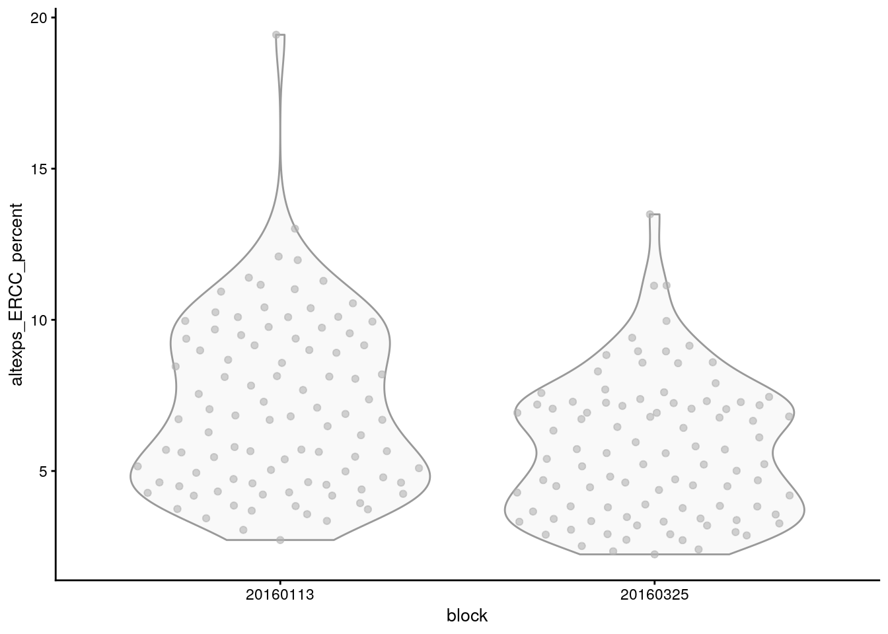
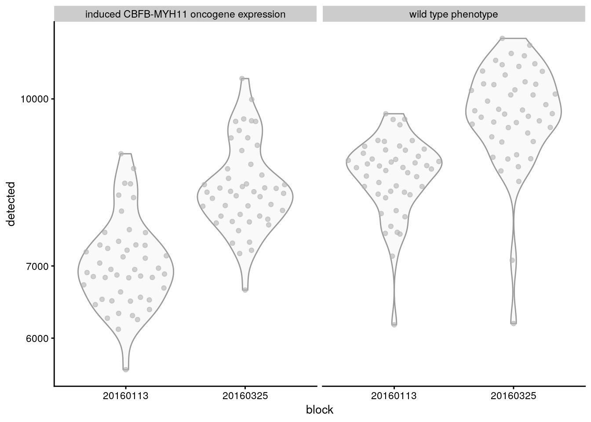
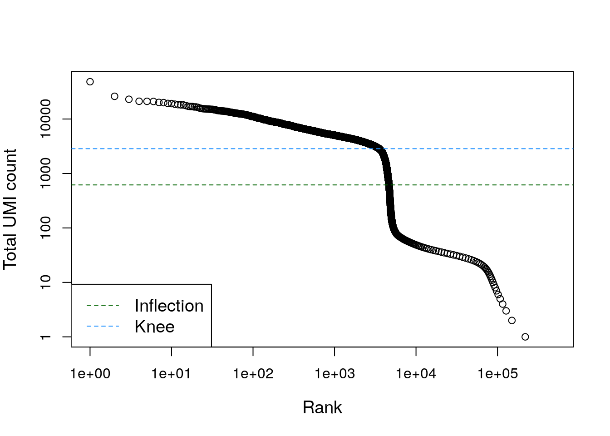

# Control de calidad

Instructor: [Leonardo Collado Torres](https://comunidadbioinfo.github.io/es/authors/lcollado/)


```r
## Paquetes de este capítulo
library("scRNAseq") ## para descargar datos de ejemplo
library("AnnotationHub") ## para obtener información de genes
library("scater") ## para gráficas y control de calidad
library("BiocFileCache") ## para descargar datos
library("DropletUtils") ## para detectar droplets
library("Matrix") ## para leer datos en formatos comprimidos
```

## Diapositivas de Peter Hickey

Ve las diapositivas [aquí](https://docs.google.com/presentation/d/1pIiA7fZd1GBxaKQpzT2sPn7C6fIZxEJ8NI4p3UtoIOo/edit#slide=id.p)

## Ejercicio: entendiendo addPerCellQC


```r
## Datos
library("scRNAseq")
sce.416b <- LunSpikeInData(which = "416b")
```

```
## snapshotDate(): 2021-05-18
```

```
## see ?scRNAseq and browseVignettes('scRNAseq') for documentation
```

```
## loading from cache
```

```
## see ?scRNAseq and browseVignettes('scRNAseq') for documentation
```

```
## loading from cache
```

```
## see ?scRNAseq and browseVignettes('scRNAseq') for documentation
```

```
## loading from cache
```

```
## snapshotDate(): 2021-05-18
```

```
## see ?scRNAseq and browseVignettes('scRNAseq') for documentation
```

```
## loading from cache
```

```
## snapshotDate(): 2021-05-18
```

```
## loading from cache
```

```
## require("ensembldb")
```

```r
sce.416b$block <- factor(sce.416b$block)

# Descarga los archivos de anotación de la base de datos de Ensembl
# correspondientes usando los recursos disponibles vía AnnotationHub
library("AnnotationHub")
ah <- AnnotationHub()
```

```
## snapshotDate(): 2021-05-18
```

```r
query(ah, c("Mus musculus", "Ensembl", "v97"))
```

```
## AnnotationHub with 1 record
## # snapshotDate(): 2021-05-18
## # names(): AH73905
## # $dataprovider: Ensembl
## # $species: Mus musculus
## # $rdataclass: EnsDb
## # $rdatadateadded: 2019-05-02
## # $title: Ensembl 97 EnsDb for Mus musculus
## # $description: Gene and protein annotations for Mus musculus based on Ensem...
## # $taxonomyid: 10090
## # $genome: GRCm38
## # $sourcetype: ensembl
## # $sourceurl: http://www.ensembl.org
## # $sourcesize: NA
## # $tags: c("97", "AHEnsDbs", "Annotation", "EnsDb", "Ensembl", "Gene",
## #   "Protein", "Transcript") 
## # retrieve record with 'object[["AH73905"]]'
```

```r
# Obtén la posición del cromosoma para cada gen
ens.mm.v97 <- ah[["AH73905"]]
```

```
## loading from cache
```

```r
location <- mapIds(
    ens.mm.v97,
    keys = rownames(sce.416b),
    keytype = "GENEID",
    column = "SEQNAME"
)
```

```
## Warning: Unable to map 563 of 46604 requested IDs.
```

```r
# Identifica los genes mitocondriales
is.mito <- which(location == "MT")
library("scater")
sce.416b <- addPerCellQC(sce.416b,
    subsets = list(Mito = is.mito)
)
## Si quieres guarda los resultados de addPerCellQC() para responder
## las preguntas del ejercicio. Eventualmente si necesitaremos los
## resultados de addPerCellQC() para las secciones posteriores a este
## ejercicio.
```


* ¿Qué cambió en nuestro objeto `sce` después de `addPerCellQC`? ^[Ahora tenemos más información en `colData(sce.416b)`]
* Haz una gráfica de _boxplots_ del número de genes por bloque (block) de células. ^[`with(colData(sce.416b), boxplot(detected ~ block))`]

## Gráficas sobre medidas de control de calidad (QC)


```r
plotColData(sce.416b, x = "block", y = "detected")
```


```r
plotColData(sce.416b, x = "block", y = "detected") +
    scale_y_log10()
```


```r
plotColData(sce.416b,
    x = "block",
    y = "detected",
    other_fields = "phenotype"
) +
    scale_y_log10() +
    facet_wrap(~phenotype)
```


### Ejercicio: gráficas QC ERCC

Adapta el código de las gráficas anteriores para otra variable de control de calidad. Por ejemplo, escribe el código para reproducir las siguientes gráficas.



* Basado en las gráficas encuentra la variable de `colData(sce.416b)` que contiene la información que queremos gráficar.
* ¡No hay que reemplazar todo lo que diga `phenotype`
* Tengo cuidado con las transformaciones de valores en el eje Y. No aplican para todo tipo de datos.

## Eliminar células de baja calidad


```r
# Valores de límite ejemplo
qc.lib <- sce.416b$sum < 100000
qc.nexprs <- sce.416b$detected < 5000
qc.spike <- sce.416b$altexps_ERCC_percent > 10
qc.mito <- sce.416b$subsets_Mito_percent > 10
discard <- qc.lib | qc.nexprs | qc.spike | qc.mito

# Obtenemos un resumen del número de células
# eliminadas por cada filtro
DataFrame(
    LibSize = sum(qc.lib),
    NExprs = sum(qc.nexprs),
    SpikeProp = sum(qc.spike),
    MitoProp = sum(qc.mito),
    Total = sum(discard)
)
```

```
## DataFrame with 1 row and 5 columns
##     LibSize    NExprs SpikeProp  MitoProp     Total
##   <integer> <integer> <integer> <integer> <integer>
## 1         3         0        19        14        33
```

```r
## Usando isOutlier() para determinar los valores de corte
qc.lib2 <- isOutlier(sce.416b$sum, log = TRUE, type = "lower")
qc.nexprs2 <- isOutlier(sce.416b$detected,
    log = TRUE,
    type = "lower"
)
qc.spike2 <- isOutlier(sce.416b$altexps_ERCC_percent,
    type = "higher"
)
qc.mito2 <- isOutlier(sce.416b$subsets_Mito_percent,
    type = "higher"
)
discard2 <- qc.lib2 | qc.nexprs2 | qc.spike2 | qc.mito2

# Extraemos los límites de valores (thresholds)
attr(qc.lib2, "thresholds")
```

```
##    lower   higher 
## 434082.9      Inf
```

```r
attr(qc.nexprs2, "thresholds")
```

```
##    lower   higher 
## 5231.468      Inf
```

```r
# Obtenemos un resumen del número de células
# eliminadas por cada filtro
DataFrame(
    LibSize = sum(qc.lib2),
    NExprs = sum(qc.nexprs2),
    SpikeProp = sum(qc.spike2),
    MitoProp = sum(qc.mito2),
    Total = sum(discard2)
)
```

```
## DataFrame with 1 row and 5 columns
##     LibSize    NExprs SpikeProp  MitoProp     Total
##   <integer> <integer> <integer> <integer> <integer>
## 1         4         0         1         2         6
```

```r
## Más pruebas
plotColData(sce.416b,
    x = "block",
    y = "detected",
    other_fields = "phenotype"
) +
    scale_y_log10() +
    facet_wrap(~phenotype)
```



```r
## Determino el bloque (batch) de muestras
batch <- paste0(sce.416b$phenotype, "-", sce.416b$block)

## Versión de isOutlier() que toma en cuenta los bloques de muestras
qc.lib3 <- isOutlier(sce.416b$sum,
    log = TRUE,
    type = "lower",
    batch = batch
)
qc.nexprs3 <- isOutlier(sce.416b$detected,
    log = TRUE,
    type = "lower",
    batch = batch
)
qc.spike3 <- isOutlier(sce.416b$altexps_ERCC_percent,
    type = "higher",
    batch = batch
)
qc.mito3 <- isOutlier(sce.416b$subsets_Mito_percent,
    type = "higher",
    batch = batch
)
discard3 <- qc.lib3 | qc.nexprs3 | qc.spike3 | qc.mito3

# Extraemos los límites de valores (thresholds)
attr(qc.lib3, "thresholds")
```

```
##        induced CBFB-MYH11 oncogene expression-20160113
## lower                                         461073.1
## higher                                             Inf
##        induced CBFB-MYH11 oncogene expression-20160325
## lower                                         399133.7
## higher                                             Inf
##        wild type phenotype-20160113 wild type phenotype-20160325
## lower                      599794.9                     370316.5
## higher                          Inf                          Inf
```

```r
attr(qc.nexprs3, "thresholds")
```

```
##        induced CBFB-MYH11 oncogene expression-20160113
## lower                                          5399.24
## higher                                             Inf
##        induced CBFB-MYH11 oncogene expression-20160325
## lower                                          6519.74
## higher                                             Inf
##        wild type phenotype-20160113 wild type phenotype-20160325
## lower                      7215.887                     7586.402
## higher                          Inf                          Inf
```

```r
# Obtenemos un resumen del número de células
# eliminadas por cada filtro
DataFrame(
    LibSize = sum(qc.lib3),
    NExprs = sum(qc.nexprs3),
    SpikeProp = sum(qc.spike3),
    MitoProp = sum(qc.mito3),
    Total = sum(discard3)
)
```

```
## DataFrame with 1 row and 5 columns
##     LibSize    NExprs SpikeProp  MitoProp     Total
##   <integer> <integer> <integer> <integer> <integer>
## 1         5         4         6         2         9
```

## Ejercicio: filtrado de células

* ¿Fue necesario `qc.lib` para crear `discard`? ^[Sí, usando `table(qc.lib , qc.spike)` y `table(qc.lib , qc.mito)`.]
* ¿Cúal filtro fue más estricto? ¿`discard` o `discard2`? ^[`discard` de `table(discard, discard2)`]
* Al considerar el grupo de cada muestra (batch), ¿descartamos más células usando un valor de límite automático? ^[Sí, usando `table(discard, discard2, discard3)`]

## Datos de Grun et al

¿Qué patrón revela esta gráfica?


```r
sce.grun <- GrunPancreasData()
```

```
## snapshotDate(): 2021-05-18
```

```
## see ?scRNAseq and browseVignettes('scRNAseq') for documentation
```

```
## downloading 1 resources
```

```
## retrieving 1 resource
```

```
## loading from cache
```

```
## snapshotDate(): 2021-05-18
```

```
## see ?scRNAseq and browseVignettes('scRNAseq') for documentation
```

```
## loading from cache
```

```r
sce.grun <- addPerCellQC(sce.grun)

## ¿Qué patrón revela esta gráfica?
plotColData(sce.grun, x = "donor", y = "altexps_ERCC_percent")
```

```
## Warning: Removed 10 rows containing non-finite values (stat_ydensity).
```

```
## Warning: Removed 10 rows containing missing values (position_quasirandom).
```


¿Cúal de las siguientes gráficas identifica mejor las células de baja calidad?


```r
## isOutlier() puede ayudarnos cuando un grupo de muestras
## tuvo más problemas que el resto
discard.ercc <- isOutlier(sce.grun$altexps_ERCC_percent,
    type = "higher",
    batch = sce.grun$donor
)
```

```
## Warning in .get_med_and_mad(metric, batch = batch, subset = subset,
## share.medians = share.medians, : missing values ignored during outlier detection
```

```r
discard.ercc2 <- isOutlier(
    sce.grun$altexps_ERCC_percent,
    type = "higher",
    batch = sce.grun$donor,
    subset = sce.grun$donor %in% c("D17", "D2", "D7")
)
```

```
## Warning in .get_med_and_mad(metric, batch = batch, subset = subset,
## share.medians = share.medians, : missing values ignored during outlier detection
```

```r
## isOutlier() tomando en cuenta el batch
plotColData(
    sce.grun,
    x = "donor",
    y = "altexps_ERCC_percent",
    colour_by = data.frame(discard = discard.ercc)
)
```

```
## Warning: Removed 10 rows containing non-finite values (stat_ydensity).
```

```
## Warning: Removed 10 rows containing missing values (position_quasirandom).
```


```r
## isOutlier() tomando en cuenta batch y muestras que fallaron
plotColData(
    sce.grun,
    x = "donor",
    y = "altexps_ERCC_percent",
    colour_by = data.frame(discard = discard.ercc2)
)
```

```
## Warning: Removed 10 rows containing non-finite values (stat_ydensity).

## Warning: Removed 10 rows containing missing values (position_quasirandom).
```


## Gráficas de QC extra

Otras gráficas que podemos hacer.


```r
# Agregamos información sobre que células
# tienen valores extremos
sce.416b$discard <- discard2

# Haz esta gráfica para cada medida de
# control de calidad (QC)
plotColData(
    sce.416b,
    x = "block",
    y = "sum",
    colour_by = "discard",
    other_fields = "phenotype"
) +
    facet_wrap(~phenotype) +
    scale_y_log10()
```


```r
# Otra gráfica de diagnóstico útil
plotColData(
    sce.416b,
    x = "sum",
    y = "subsets_Mito_percent",
    colour_by = "discard",
    other_fields = c("block", "phenotype")
) +
    facet_grid(block ~ phenotype)
```


## Ejercicio: ERCC Grun et al

Adapta el código de `sce.416b` para los datos de Grun et al y reproduce la imagen siguiente.


* Fíjate en que variables de `colData()` estamos graficando.
* ¿Existe la variable `discard` en `colData()`?
* ¿Qué variable tiene valores de D10, D17, D2, D3 y D7?

## Identificando droplets vacíos con datos de PBMC


.](https://cdn.10xgenomics.com/image/upload/dpr_2.0,e_sharpen,f_auto,q_auto/v1607106030/Reagent_delivery_system.png)

<div class="figure">

<p class="caption">Opciones algorítmicas para detecar los droplets vacíos. Fuente: [Lun et al, _Genome Biology_, 2019](https://doi.org/10.1186/s13059-019-1662-y).</p>
</div>


```r
## Descarguemos los datos
library("BiocFileCache")
bfc <- BiocFileCache()
raw.path <-
    bfcrpath(
        bfc,
        file.path(
            "http://cf.10xgenomics.com/samples",
            "cell-exp/2.1.0/pbmc4k/pbmc4k_raw_gene_bc_matrices.tar.gz"
        )
    )
```

```
## adding rname 'http://cf.10xgenomics.com/samples/cell-exp/2.1.0/pbmc4k/pbmc4k_raw_gene_bc_matrices.tar.gz'
```

```r
untar(raw.path, exdir = file.path(tempdir(), "pbmc4k"))

## Leamos los datos en R
library("DropletUtils")
library("Matrix")
fname <- file.path(tempdir(), "pbmc4k/raw_gene_bc_matrices/GRCh38")
sce.pbmc <- read10xCounts(fname, col.names = TRUE)
bcrank <- barcodeRanks(counts(sce.pbmc))

# Mostremos solo los puntos únicos para acelerar
# el proceso de hacer esta gráfica
uniq <- !duplicated(bcrank$rank)
plot(
    bcrank$rank[uniq],
    bcrank$total[uniq],
    log = "xy",
    xlab = "Rank",
    ylab = "Total UMI count",
    cex.lab = 1.2
)
```

```
## Warning in xy.coords(x, y, xlabel, ylabel, log): 1 y value <= 0 omitted from
## logarithmic plot
```

```r
abline(
    h = metadata(bcrank)$inflection,
    col = "darkgreen",
    lty = 2
)
abline(
    h = metadata(bcrank)$knee,
    col = "dodgerblue",
    lty = 2
)
legend(
    "bottomleft",
    legend = c("Inflection", "Knee"),
    col = c("darkgreen", "dodgerblue"),
    lty = 2,
    cex = 1.2
)
```


Encontremos los _droplets_ vacíos usando `emptyDrops()`.


```r
## Usemos DropletUtils para encontrar los droplets
set.seed(100)
e.out <- emptyDrops(counts(sce.pbmc))

# Revisa ?emptyDrops para una explicación de porque hay valores NA
summary(e.out$FDR <= 0.001)
```

```
##    Mode   FALSE    TRUE    NA's 
## logical     989    4300  731991
```

```r
set.seed(100)
limit <- 100
all.out <-
    emptyDrops(counts(sce.pbmc), lower = limit, test.ambient = TRUE)

# Idealmente, este histograma debería verse uniforme.
# Picos grandes cerca de cero indican que los _barcodes_
# con un número total de cuentas menor a "lower" no son
# de origen ambiental.
hist(all.out$PValue[all.out$Total <= limit &
    all.out$Total > 0],
xlab = "P-value",
main = "",
col = "grey80"
)
```


## Ejercicio: detección de droplets vacíos

* ¿Por qué `emptyDrops()` regresa valores `NA`? ^[Debajo de `lower` son considerados _droplets_ vacíos. Solo se usan para la correción estadística de pruebas múltiples.]
* ¿Los valores p son iguales entre `e.out` y `all.out`? ^[No, debido a los `NA`s.]
* ¿Son iguales si obtienes el subconjunto de valores que no son `NA`? ^[Sí: `identical(e.out$PValue[!is.na(e.out$FDR)], all.out$PValue[!is.na(e.out$FDR)])`.]

## Filtrado de expresión mitocondrial adicional

Después de filtar los droplets, el filtrado por expresión mitocondrial nos va a ayudar a eliminar células de baja calidad.


```r
sce.pbmc <- sce.pbmc[, which(e.out$FDR <= 0.001)]
is.mito <- grep("^MT-", rowData(sce.pbmc)$Symbol)
sce.pmbc <- addPerCellQC(sce.pbmc, subsets = list(MT = is.mito))
discard.mito <-
    isOutlier(sce.pmbc$subsets_MT_percent, type = "higher")
plot(
    sce.pmbc$sum,
    sce.pmbc$subsets_MT_percent,
    log = "x",
    xlab = "Total count",
    ylab = "Mitochondrial %"
)
abline(h = attr(discard.mito, "thresholds")["higher"], col = "red")
```


## Ejercicio avanzado

Volvamos a crear `sce.pbmc` para poder usar `plotColData()` y visualizar la relación entre `total` y los niveles de expresión mitocondrial (en porcentaje) separando lo que pensamos que son droplets vacíos y las células de acuerdo a los resultados que ya calculamos de `emptyDrops()`. El resultado final se verá como en la siguiente imagen.


* No podemos usar nuestro objeto `sce.pbmc` porque ya eliminamos los droplets vacíos al correr `sce.pbmc <- sce.pbmc[, which(e.out$FDR <= 0.001)]`. Por eso tendremos que volver a usar `sce.pbmc <- read10xCounts(fname, col.names = TRUE)`.
* Una vez que hayamos vuelto a hacer `sce.pbmc`, tenemos que guardar en ese objeto los resultados de `emptyDrops()`. Por ejemplo, con `sce.pbmc$is_cell <- e.out$FDR <= 0.001`.
* Como `e.out$FDR` tiene muchos `NA`, nos conviene filtrar esos datos.
* Tendremos que volver a correr `addPerCellQC()` y guardar los resultados en nuestro objeto `sce.pbmc`.
* Al final usaremos `plotColData()` junto con `facet_grid(~ sce.pbmc$is_cell)`.

## Discusión ¿Conviene eliminar datos?


```r
# Eliminemos las células de calidad baja
# al quedarnos con las columnas del objeto sce que NO
# queremos descartar (eso hace el !)
filtered <- sce.416b[, !discard2]
# Alternativamente, podemos marcar
# las células de baja calidad
marked <- sce.416b
marked$discard <- discard2
```


* ¿Cúal de estos objetos es más grande? ^[`marked` es más grande que `filtered`]
* ¿Cúal prefieres usar? ^[Yo prefiero usar `marked` si tengo suficiente memoria para usarlo.]

### Un nuevo paquete: ExperimentSubset

En [BioC2021](https://bioc2021.bioconductor.org/) presentaron [`ExperimentSubset`](http://bioconductor.org/packages/ExperimentSubset/) que provee otro camino para resolver este dilema.

<div class="figure">

<p class="caption">Descripción gráfica de `ExperimentSubset`. Fuente: [vignette `ExperimentSubset`](http://bioconductor.org/packages/release/bioc/vignettes/ExperimentSubset/inst/doc/ExperimentSubset.html).</p>
</div>

## Explorando datos de forma interactiva con iSEE

<blockquote class="twitter-tweet"><p lang="en" dir="ltr"><a href="https://twitter.com/hashtag/rstats?src=hash&amp;ref_src=twsrc%5Etfw">#rstats</a> / <a href="https://twitter.com/Bioconductor?ref_src=twsrc%5Etfw">@Bioconductor</a> congrats winners of the 1st Shiny Contest: iSEE <a href="https://t.co/oHgGkWqRsJ">https://t.co/oHgGkWqRsJ</a> <a href="https://t.co/vZLFvcMBIS">https://t.co/vZLFvcMBIS</a> !</p>&mdash; Bioconductor (@Bioconductor) <a href="https://twitter.com/Bioconductor/status/1114773873537449984?ref_src=twsrc%5Etfw">April 7, 2019</a></blockquote> <script async src="https://platform.twitter.com/widgets.js" charset="utf-8"></script>

* http://bioconductor.org/packages/release/bioc/html/iSEE.html
* http://bioconductor.org/packages/release/bioc/vignettes/iSEE/inst/doc/basic.html


```r
## Hagamos un objeto sencillo de tipo RangedSummarizedExperiment
library("SummarizedExperiment")
## ?SummarizedExperiment

## De los ejemplos en la ayuda oficial
## Creamos los datos para nuestro objeto de tipo SummarizedExperiment
## para 200 genes a lo largo de 6 muestras
nrows <- 200
ncols <- 6

## Números al azar de cuentas
set.seed(20210223)
counts <- matrix(runif(nrows * ncols, 1, 1e4), nrows)

## Información de nuestros genes
rowRanges <- GRanges(
    rep(c("chr1", "chr2"), c(50, 150)),
    IRanges(floor(runif(200, 1e5, 1e6)), width = 100),
    strand = sample(c("+", "-"), 200, TRUE),
    feature_id = sprintf("ID%03d", 1:200)
)
names(rowRanges) <- paste0("gene_", seq_len(length(rowRanges)))

## Información de nuestras muestras
colData <- DataFrame(
    Treatment = rep(c("ChIP", "Input"), 3),
    row.names = LETTERS[1:6]
)

## Juntamos ahora toda la información en un solo objeto de R
rse <- SummarizedExperiment(
    assays = SimpleList(counts = counts),
    rowRanges = rowRanges,
    colData = colData
)

## Exploremos el objeto resultante
rse
```

```
## class: RangedSummarizedExperiment 
## dim: 200 6 
## metadata(0):
## assays(1): counts
## rownames(200): gene_1 gene_2 ... gene_199 gene_200
## rowData names(1): feature_id
## colnames(6): A B ... E F
## colData names(1): Treatment
```

```r
## Explora el objeto rse de forma interactiva
library("iSEE")
if (interactive()) {
    iSEE::iSEE(rse)
}
```

### Ejercicio iSEE con sce.416b

Repitamos la imagen que hicimos anteriormente.

<a href="https://comunidadbioinfo.github.io/cdsb2021_scRNAseq/control-de-calidad.html#gr%C3%A1ficas-sobre-medidas-de-control-de-calidad-qc"></a>


```r
## Explora el objeto sce.416b de forma interactiva
if (interactive()) {
    iSEE::iSEE(sce.416b, appTitle = "sce.416b")
}
```

### Datos de LIBD de Tran et al

<a href="https://libd.shinyapps.io/tran2021_AMY/"></a>

* Datos de [Tran et al, _bioRxiv_, 2020](https://github.com/LieberInstitute/10xPilot_snRNAseq-human#explore-the-data-interactively).

* Código de R para el sitio web: https://github.com/LieberInstitute/10xPilot_snRNAseq-human/tree/master/shiny_apps/tran2021_AMY. 

### Más detalles de iSEE

<iframe width="560" height="315" src="https://www.youtube.com/embed/bK8D30MqXb8" title="YouTube video player" frameborder="0" allow="accelerometer; autoplay; clipboard-write; encrypted-media; gyroscope; picture-in-picture" allowfullscreen></iframe>

* [Notas en inglés](https://docs.google.com/document/d/19ZMeaFiFqhJUJJHiEj0qsCcH5WMrn32H-PCKzWag1oI/edit).

## Detalles de la sesión de R


```r
## Información de la sesión de R
Sys.time()
```

```
## [1] "2021-08-13 22:41:12 UTC"
```

```r
proc.time()
```

```
##    user  system elapsed 
## 206.175   3.796 211.716
```

```r
options(width = 120)
sessioninfo::session_info()
```

```
## ─ Session info ───────────────────────────────────────────────────────────────────────────────────────────────────────
##  setting  value                       
##  version  R version 4.1.0 (2021-05-18)
##  os       Ubuntu 20.04.2 LTS          
##  system   x86_64, linux-gnu           
##  ui       X11                         
##  language (EN)                        
##  collate  en_US.UTF-8                 
##  ctype    en_US.UTF-8                 
##  tz       UTC                         
##  date     2021-08-13                  
## 
## ─ Packages ───────────────────────────────────────────────────────────────────────────────────────────────────────────
##  package                * version  date       lib source        
##  AnnotationDbi          * 1.54.1   2021-06-08 [1] Bioconductor  
##  AnnotationFilter       * 1.16.0   2021-05-19 [1] Bioconductor  
##  AnnotationHub          * 3.0.1    2021-06-20 [1] Bioconductor  
##  assertthat               0.2.1    2019-03-21 [1] RSPM (R 4.1.0)
##  beachmat                 2.8.1    2021-08-12 [1] Bioconductor  
##  beeswarm                 0.4.0    2021-06-01 [1] RSPM (R 4.1.0)
##  Biobase                * 2.52.0   2021-05-19 [1] Bioconductor  
##  BiocFileCache          * 2.0.0    2021-05-19 [1] Bioconductor  
##  BiocGenerics           * 0.38.0   2021-05-19 [1] Bioconductor  
##  BiocIO                   1.2.0    2021-05-19 [1] Bioconductor  
##  BiocManager              1.30.16  2021-06-15 [1] RSPM (R 4.1.0)
##  BiocNeighbors            1.10.0   2021-05-19 [1] Bioconductor  
##  BiocParallel             1.26.1   2021-07-04 [1] Bioconductor  
##  BiocSingular             1.8.1    2021-06-08 [1] Bioconductor  
##  BiocVersion              3.13.1   2021-03-19 [2] Bioconductor  
##  biomaRt                  2.48.2   2021-07-01 [1] Bioconductor  
##  Biostrings               2.60.2   2021-08-05 [1] Bioconductor  
##  bit                      4.0.4    2020-08-04 [1] RSPM (R 4.1.0)
##  bit64                    4.0.5    2020-08-30 [1] RSPM (R 4.1.0)
##  bitops                   1.0-7    2021-04-24 [1] RSPM (R 4.1.0)
##  blob                     1.2.2    2021-07-23 [1] RSPM (R 4.1.0)
##  bookdown                 0.22     2021-04-22 [1] RSPM (R 4.1.0)
##  bslib                    0.2.5.1  2021-05-18 [1] RSPM (R 4.1.0)
##  cachem                   1.0.5    2021-05-15 [2] RSPM (R 4.1.0)
##  Cairo                    1.5-12.2 2020-07-07 [1] RSPM (R 4.1.0)
##  circlize                 0.4.13   2021-06-09 [1] RSPM (R 4.1.0)
##  cli                      3.0.1    2021-07-17 [2] RSPM (R 4.1.0)
##  clue                     0.3-59   2021-04-16 [1] RSPM (R 4.1.0)
##  cluster                  2.1.2    2021-04-17 [3] CRAN (R 4.1.0)
##  codetools                0.2-18   2020-11-04 [3] CRAN (R 4.1.0)
##  colorspace               2.0-2    2021-06-24 [1] RSPM (R 4.1.0)
##  colourpicker             1.1.0    2020-09-14 [1] RSPM (R 4.1.0)
##  ComplexHeatmap           2.8.0    2021-05-19 [1] Bioconductor  
##  cowplot                  1.1.1    2020-12-30 [1] RSPM (R 4.1.0)
##  crayon                   1.4.1    2021-02-08 [2] RSPM (R 4.1.0)
##  curl                     4.3.2    2021-06-23 [2] RSPM (R 4.1.0)
##  DBI                      1.1.1    2021-01-15 [1] RSPM (R 4.1.0)
##  dbplyr                 * 2.1.1    2021-04-06 [1] RSPM (R 4.1.0)
##  DelayedArray             0.18.0   2021-05-19 [1] Bioconductor  
##  DelayedMatrixStats       1.14.2   2021-08-08 [1] Bioconductor  
##  digest                   0.6.27   2020-10-24 [2] RSPM (R 4.1.0)
##  doParallel               1.0.16   2020-10-16 [1] RSPM (R 4.1.0)
##  dplyr                    1.0.7    2021-06-18 [1] RSPM (R 4.1.0)
##  dqrng                    0.3.0    2021-05-01 [1] RSPM (R 4.1.0)
##  DropletUtils           * 1.12.2   2021-07-22 [1] Bioconductor  
##  DT                       0.18     2021-04-14 [1] RSPM (R 4.1.0)
##  edgeR                    3.34.0   2021-05-19 [1] Bioconductor  
##  ellipsis                 0.3.2    2021-04-29 [2] RSPM (R 4.1.0)
##  ensembldb              * 2.16.4   2021-08-05 [1] Bioconductor  
##  evaluate                 0.14     2019-05-28 [2] RSPM (R 4.1.0)
##  ExperimentHub            2.0.0    2021-05-19 [1] Bioconductor  
##  fansi                    0.5.0    2021-05-25 [2] RSPM (R 4.1.0)
##  farver                   2.1.0    2021-02-28 [1] RSPM (R 4.1.0)
##  fastmap                  1.1.0    2021-01-25 [2] RSPM (R 4.1.0)
##  filelock                 1.0.2    2018-10-05 [1] RSPM (R 4.1.0)
##  foreach                  1.5.1    2020-10-15 [1] RSPM (R 4.1.0)
##  generics                 0.1.0    2020-10-31 [1] RSPM (R 4.1.0)
##  GenomeInfoDb           * 1.28.1   2021-07-01 [1] Bioconductor  
##  GenomeInfoDbData         1.2.6    2021-07-29 [1] Bioconductor  
##  GenomicAlignments        1.28.0   2021-05-19 [1] Bioconductor  
##  GenomicFeatures        * 1.44.0   2021-05-19 [1] Bioconductor  
##  GenomicRanges          * 1.44.0   2021-05-19 [1] Bioconductor  
##  GetoptLong               1.0.5    2020-12-15 [1] RSPM (R 4.1.0)
##  ggbeeswarm               0.6.0    2017-08-07 [1] RSPM (R 4.1.0)
##  ggplot2                * 3.3.5    2021-06-25 [1] RSPM (R 4.1.0)
##  ggrepel                  0.9.1    2021-01-15 [1] RSPM (R 4.1.0)
##  GlobalOptions            0.1.2    2020-06-10 [1] RSPM (R 4.1.0)
##  glue                     1.4.2    2020-08-27 [2] RSPM (R 4.1.0)
##  gridExtra                2.3      2017-09-09 [1] RSPM (R 4.1.0)
##  gtable                   0.3.0    2019-03-25 [1] RSPM (R 4.1.0)
##  HDF5Array                1.20.0   2021-05-19 [1] Bioconductor  
##  highr                    0.9      2021-04-16 [2] RSPM (R 4.1.0)
##  hms                      1.1.0    2021-05-17 [1] RSPM (R 4.1.0)
##  htmltools                0.5.1.1  2021-01-22 [1] RSPM (R 4.1.0)
##  htmlwidgets              1.5.3    2020-12-10 [1] RSPM (R 4.1.0)
##  httpuv                   1.6.1    2021-05-07 [1] RSPM (R 4.1.0)
##  httr                     1.4.2    2020-07-20 [2] RSPM (R 4.1.0)
##  igraph                   1.2.6    2020-10-06 [1] RSPM (R 4.1.0)
##  interactiveDisplayBase   1.30.0   2021-05-19 [1] Bioconductor  
##  IRanges                * 2.26.0   2021-05-19 [1] Bioconductor  
##  irlba                    2.3.3    2019-02-05 [1] RSPM (R 4.1.0)
##  iSEE                   * 2.4.0    2021-05-19 [1] Bioconductor  
##  iterators                1.0.13   2020-10-15 [1] RSPM (R 4.1.0)
##  jquerylib                0.1.4    2021-04-26 [1] RSPM (R 4.1.0)
##  jsonlite                 1.7.2    2020-12-09 [2] RSPM (R 4.1.0)
##  KEGGREST                 1.32.0   2021-05-19 [1] Bioconductor  
##  knitr                    1.33     2021-04-24 [2] RSPM (R 4.1.0)
##  labeling                 0.4.2    2020-10-20 [1] RSPM (R 4.1.0)
##  later                    1.2.0    2021-04-23 [1] RSPM (R 4.1.0)
##  lattice                  0.20-44  2021-05-02 [3] CRAN (R 4.1.0)
##  lazyeval                 0.2.2    2019-03-15 [1] RSPM (R 4.1.0)
##  lifecycle                1.0.0    2021-02-15 [2] RSPM (R 4.1.0)
##  limma                    3.48.3   2021-08-10 [1] Bioconductor  
##  locfit                   1.5-9.4  2020-03-25 [1] RSPM (R 4.1.0)
##  magrittr                 2.0.1    2020-11-17 [2] RSPM (R 4.1.0)
##  Matrix                 * 1.3-4    2021-06-01 [3] RSPM (R 4.1.0)
##  MatrixGenerics         * 1.4.2    2021-08-08 [1] Bioconductor  
##  matrixStats            * 0.60.0   2021-07-26 [1] RSPM (R 4.1.0)
##  memoise                  2.0.0    2021-01-26 [2] RSPM (R 4.1.0)
##  mgcv                     1.8-36   2021-06-01 [3] RSPM (R 4.1.0)
##  mime                     0.11     2021-06-23 [2] RSPM (R 4.1.0)
##  miniUI                   0.1.1.1  2018-05-18 [1] RSPM (R 4.1.0)
##  munsell                  0.5.0    2018-06-12 [1] RSPM (R 4.1.0)
##  nlme                     3.1-152  2021-02-04 [3] CRAN (R 4.1.0)
##  pillar                   1.6.2    2021-07-29 [2] RSPM (R 4.1.0)
##  pkgconfig                2.0.3    2019-09-22 [2] RSPM (R 4.1.0)
##  png                      0.1-7    2013-12-03 [1] RSPM (R 4.1.0)
##  prettyunits              1.1.1    2020-01-24 [2] RSPM (R 4.1.0)
##  progress                 1.2.2    2019-05-16 [1] RSPM (R 4.1.0)
##  promises                 1.2.0.1  2021-02-11 [1] RSPM (R 4.1.0)
##  ProtGenerics             1.24.0   2021-05-19 [1] Bioconductor  
##  purrr                    0.3.4    2020-04-17 [2] RSPM (R 4.1.0)
##  R.methodsS3              1.8.1    2020-08-26 [1] RSPM (R 4.1.0)
##  R.oo                     1.24.0   2020-08-26 [1] RSPM (R 4.1.0)
##  R.utils                  2.10.1   2020-08-26 [1] RSPM (R 4.1.0)
##  R6                       2.5.0    2020-10-28 [2] RSPM (R 4.1.0)
##  rappdirs                 0.3.3    2021-01-31 [2] RSPM (R 4.1.0)
##  RColorBrewer             1.1-2    2014-12-07 [1] RSPM (R 4.1.0)
##  Rcpp                     1.0.7    2021-07-07 [2] RSPM (R 4.1.0)
##  RCurl                    1.98-1.3 2021-03-16 [1] RSPM (R 4.1.0)
##  restfulr                 0.0.13   2017-08-06 [1] RSPM (R 4.1.0)
##  rhdf5                    2.36.0   2021-05-19 [1] Bioconductor  
##  rhdf5filters             1.4.0    2021-05-19 [1] Bioconductor  
##  Rhdf5lib                 1.14.2   2021-07-06 [1] Bioconductor  
##  rintrojs                 0.3.0    2021-06-06 [1] RSPM (R 4.1.0)
##  rjson                    0.2.20   2018-06-08 [1] RSPM (R 4.1.0)
##  rlang                    0.4.11   2021-04-30 [2] RSPM (R 4.1.0)
##  rmarkdown                2.10     2021-08-06 [1] RSPM (R 4.1.0)
##  Rsamtools                2.8.0    2021-05-19 [1] Bioconductor  
##  RSQLite                  2.2.7    2021-04-22 [1] RSPM (R 4.1.0)
##  rsvd                     1.0.5    2021-04-16 [1] RSPM (R 4.1.0)
##  rtracklayer              1.52.0   2021-05-19 [1] Bioconductor  
##  S4Vectors              * 0.30.0   2021-05-19 [1] Bioconductor  
##  sass                     0.4.0    2021-05-12 [1] RSPM (R 4.1.0)
##  ScaledMatrix             1.0.0    2021-05-19 [1] Bioconductor  
##  scales                   1.1.1    2020-05-11 [1] RSPM (R 4.1.0)
##  scater                 * 1.20.1   2021-06-15 [1] Bioconductor  
##  scRNAseq               * 2.6.1    2021-05-25 [1] Bioconductor  
##  scuttle                * 1.2.1    2021-08-05 [1] Bioconductor  
##  sessioninfo              1.1.1    2018-11-05 [2] RSPM (R 4.1.0)
##  shape                    1.4.6    2021-05-19 [1] RSPM (R 4.1.0)
##  shiny                    1.6.0    2021-01-25 [1] RSPM (R 4.1.0)
##  shinyAce                 0.4.1    2019-09-24 [1] RSPM (R 4.1.0)
##  shinydashboard           0.7.1    2018-10-17 [1] RSPM (R 4.1.0)
##  shinyjs                  2.0.0    2020-09-09 [1] RSPM (R 4.1.0)
##  shinyWidgets             0.6.0    2021-03-15 [1] RSPM (R 4.1.0)
##  SingleCellExperiment   * 1.14.1   2021-05-21 [1] Bioconductor  
##  sparseMatrixStats        1.4.2    2021-08-08 [1] Bioconductor  
##  stringi                  1.7.3    2021-07-16 [2] RSPM (R 4.1.0)
##  stringr                  1.4.0    2019-02-10 [2] RSPM (R 4.1.0)
##  SummarizedExperiment   * 1.22.0   2021-05-19 [1] Bioconductor  
##  tibble                   3.1.3    2021-07-23 [2] RSPM (R 4.1.0)
##  tidyselect               1.1.1    2021-04-30 [1] RSPM (R 4.1.0)
##  utf8                     1.2.2    2021-07-24 [2] RSPM (R 4.1.0)
##  vctrs                    0.3.8    2021-04-29 [2] RSPM (R 4.1.0)
##  vipor                    0.4.5    2017-03-22 [1] RSPM (R 4.1.0)
##  viridis                  0.6.1    2021-05-11 [1] RSPM (R 4.1.0)
##  viridisLite              0.4.0    2021-04-13 [1] RSPM (R 4.1.0)
##  withr                    2.4.2    2021-04-18 [2] RSPM (R 4.1.0)
##  xfun                     0.25     2021-08-06 [2] RSPM (R 4.1.0)
##  XML                      3.99-0.6 2021-03-16 [1] RSPM (R 4.1.0)
##  xml2                     1.3.2    2020-04-23 [2] RSPM (R 4.1.0)
##  xtable                   1.8-4    2019-04-21 [1] RSPM (R 4.1.0)
##  XVector                  0.32.0   2021-05-19 [1] Bioconductor  
##  yaml                     2.2.1    2020-02-01 [2] RSPM (R 4.1.0)
##  zlibbioc                 1.38.0   2021-05-19 [1] Bioconductor  
## 
## [1] /__w/_temp/Library
## [2] /usr/local/lib/R/site-library
## [3] /usr/local/lib/R/library
```

## Patrocinadores {-}

Agradecemos a nuestros patrocinadores:

<a href="https://comunidadbioinfo.github.io/es/post/cs_and_s_event_fund_award/#.YJH-wbVKj8A"></a>

<a href="https://www.r-consortium.org/"></a>
