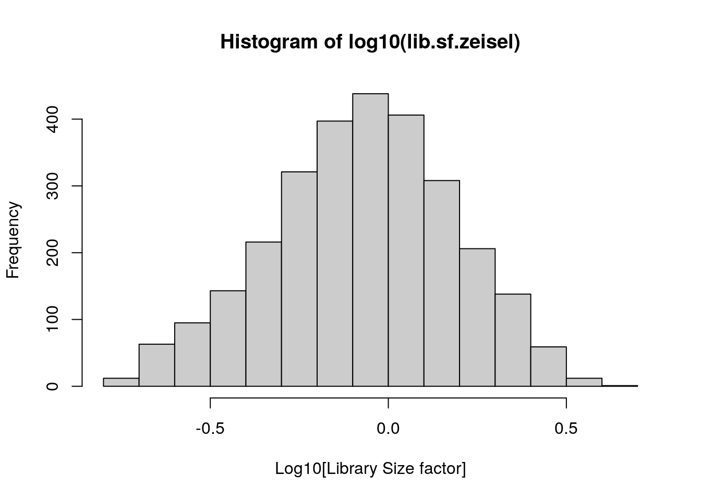
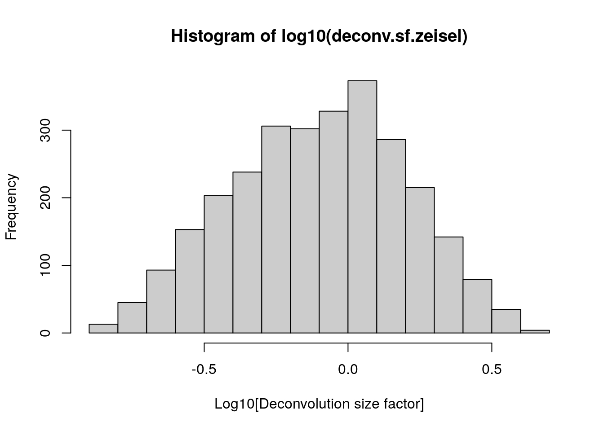
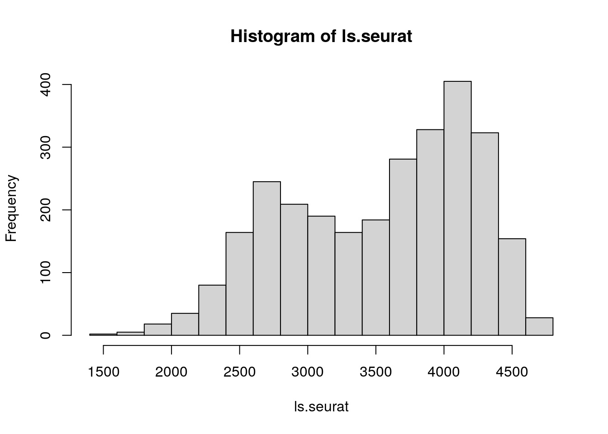
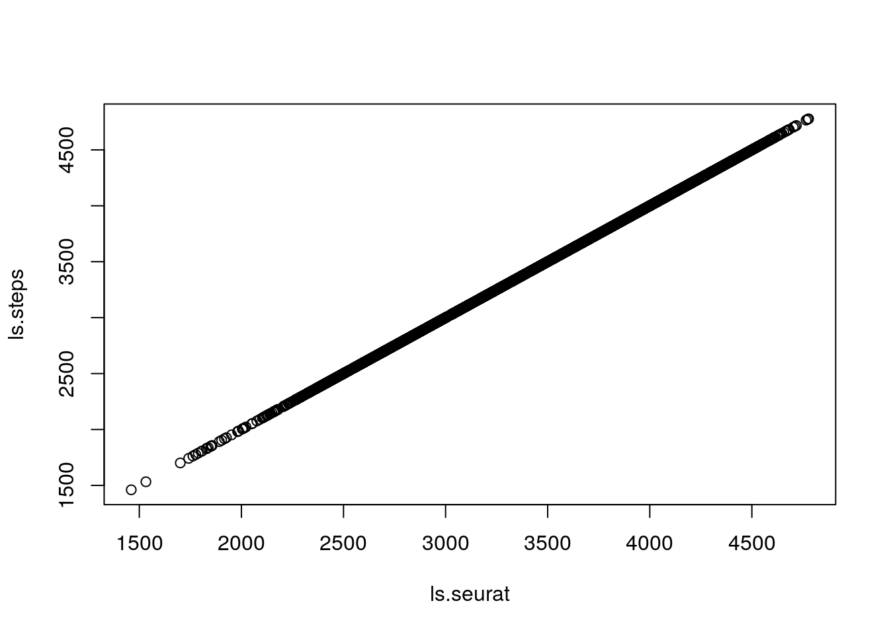
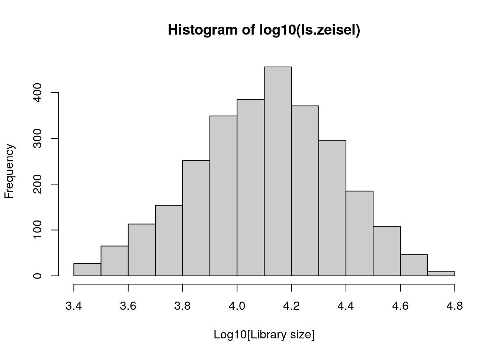
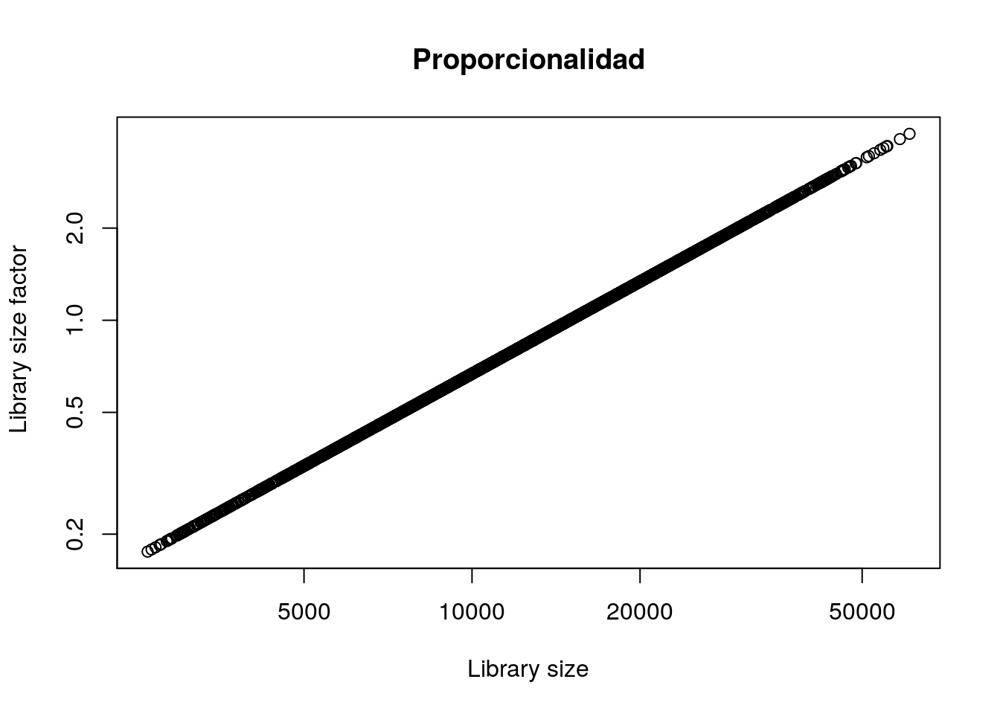
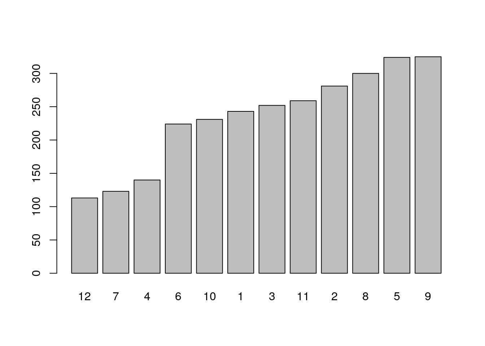
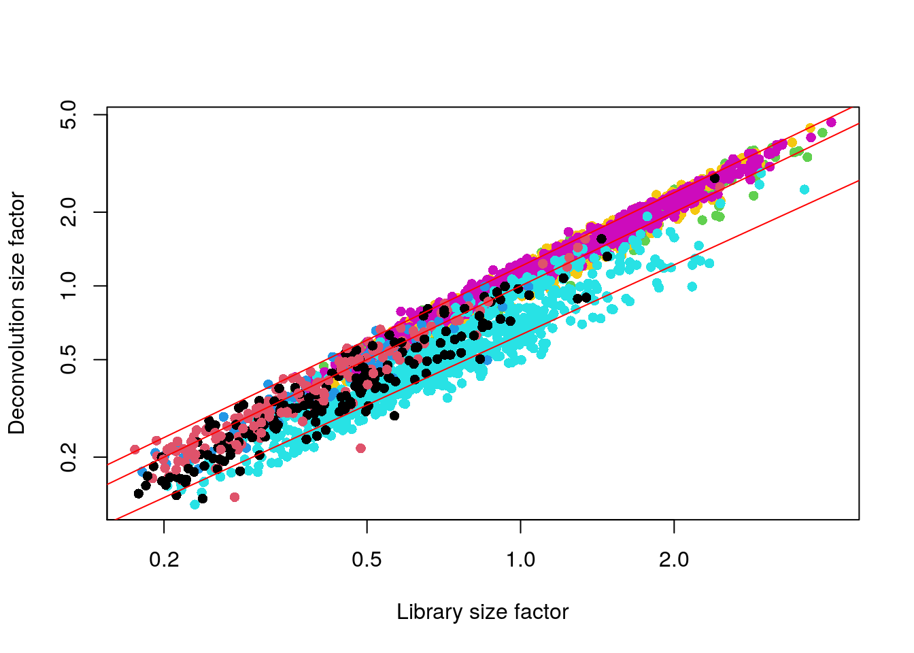

# Normalización de datos

Instructora: [Ana Beatriz Villaseñor Altamirano](https://comunidadbioinfo.github.io/es/authors/anabva/)

## Material

- Diapositivas de Peter Hickey: Ve las diapositivas [aquí](https://docs.google.com/presentation/d/1_tCNLiEsQ_TgsqHHf9_1lzXSaM_LunEHxBq3k130dQI/edit#slide=id.g7cc450648d_0_6)

- Capítulo de OSCA: Ve el capítulo del libro OSCA [aquí](https://bioconductor.org/books/release/OSCA/normalization.html)

## Motivación

Al igual que otras tecnologías, single-cell RNA-seq (scRNA-seq) tiene errores sistemáticos y es importante conocerlos. 

Dentro de los más comunes se encuentran la captura de cDNA y la amplificación de PCR que se lleva acabo por célula. Tener poco material de inicio dificulta lograr una preparación de libreria consistente dando lugar a errores sistemáticos. 


![Figura tomada de [1]](https://scrnaseq-course.cog.sanger.ac.uk/website/figures/RNA-Seq_workflow-5.pdf.jpg)

La **normalización** tiene como objetivo remover estás diferencias sistemáticas para que no interfieran cuando comparamos los perfiles de expresión entre células.

Al normalizar los datos, las diferencias observadas entre poblaciones célulares o condiciones son debido a la biología y no por factores técnicos. 

### Ejercicio: Conceptos básicos

- Da ejemplos de sesgos técnicos (TIP: ¿Qué es RPKM?).

- ¿Qué es correción por lote (*batch effect correction*)? Da un ejemplo. 

- ¿Cuáles son las diferencias entre correción por lote y normalización?


## Datos

Usaremos el dataset de [**Zeisel**](https://bioconductor.org/books/release/OSCA/zeisel-mouse-brain-strt-seq.html).

- Tipos celulares en cerebro de ratón (oligodendrocitos, microglias, neuronas, etc.)

- Procesado con STRT-seq (similar a CEL-seq), un sistema de microfluio. 

- 3005 células y 18441 genes

- Contiene UMIs


```r
library("scRNAseq")
sce.zeisel <- ZeiselBrainData(ensembl = TRUE)
sce.zeisel
```

```
## class: SingleCellExperiment 
## dim: 18441 3005 
## metadata(0):
## assays(1): counts
## rownames(18441): ENSMUSG00000029669 ENSMUSG00000046982 ...
##   ENSMUSG00000064337 ENSMUSG00000065947
## rowData names(2): featureType originalName
## colnames(3005): 1772071015_C02 1772071017_G12 ... 1772066098_A12
##   1772058148_F03
## colData names(10): tissue group # ... level1class level2class
## reducedDimNames(0):
## mainExpName: endogenous
## altExpNames(2): ERCC repeat
```

### Ejercicio: QC

- ¿Cuántos genes son mitocondriales? (TIP: `is.mito`)

- ¿Cuántos genes tienen: bajas cuentas de librería, bajos features, alto porcentaje de expresión de ERCC, alto porcentaje de genes MT? ¿Cuántas células descartamos? (TIP: `perCellQCMetrics` y `quickPerCellQC`)

- Gráfica los resultados


## Normalización por escalamiento (scaling normalization)

La normalización por escalamiento es la estrategia más simple y usada. 

Representa el estimado del sesgo relativo en cada célula. 

Se realiza dividiendo todas las cuentas de cada célula por un factor de escalamiento específico para cada una. Este factor de escalamiento se le conoce como *Library Size factor*.

$$ CuentasNormalizadas = Cuentas / Library Size factor$$

Suposición: Cualquier sesgo específico en cada célula (e.j. eficiencia en la captura o en la amplificación) afecta a **todos los genes de igual manera** a través de escalar por el promedio esperado de cuentas para dicha célula. 

Los valores de expresión normalizados pueden ser usados por análisis posteriores como *clustering* o *reducción de dimenciones*.


### Tamaño de biblioteca (*Library Size*)

**Tamaño de biblioteca (*Library Size*):** La suma total de las cuentas a tráves de todos los genes en una célula.


$$Library Size_{cell} = \sum_{n=1}^{j} gene$$
Donde $j$ es el número total de genes y $gene$ es el número de cuentas por gen para cada célula.


El valor de *library size* es el que asumimos que escala con cualquier sesgo específico en cada célula.


Para escalar los datos ocuparemos un factor de escalamiento llamado *Library Size factor*. 

$$ Library Size \propto Library Size factor $$

Se calcula usando *library size*:

$$ Library Size factor =  {Library Size} / {mean(Library Size)}$$

Y se define de tal manera que el promedio de *Library Size factor*  en todas las células es igual a 1. 

$$ mean(Library Size factor) = 1 $$

Lo que nos permite que los valores normalizados están en la misma escala y pueden ser útiles para la interpretación. 


```r
# Estimar tamaños de librerías
lib.sf.zeisel <- librarySizeFactors(sce.zeisel)
# Examina la distribución de los tamaños de librerías
# que acabamos de estimar
summary(lib.sf.zeisel)
```

```
##    Min. 1st Qu.  Median    Mean 3rd Qu.    Max. 
##  0.1754  0.5682  0.8669  1.0000  1.2758  4.0651
```

```r
hist(log10(lib.sf.zeisel), xlab = "Log10[Library Size factor]", col = "grey80")
```




### Ejercicio: *library Size*

* Revisa los detalles (**Details**) en `?scater::librarySizeFactors`

* Calcula *library Size* `ls.zeisel`

* ¿Son idénticos `ls.zeisel` y `lib.sf.zeisel`?

* ¿Son proporcionales?

* Calcula `lib.sf.zeisel` de forma manual. TIP: Checa el [código fuente](https://github.com/LTLA/scuttle/blob/master/R/librarySizeFactors.R)

### Puntos finales

- Normalizar por *Library Size factor* asume que no hay desigualdad en la cantidad de genes differencialmente expresados (DE) entre dos células.  Es decir, que para cada grupo de genes sobre-expresados, debe existir un grupo de genes sub-expresados en la misma magnitud, cuando esto no pasa se le conoce como *sesgo de composición* (Veáse a continuación). 

- Para análisis exploratorios, la precisión de la normalización no es un punto mayor a considerar. El sesgo por composición normalmente no afecta la separación de los clusters, solo la magnitud. 

- La normalización por *Library Size factor* suele ser suficiente en algunas ocasiones donde se busca identificar clusters y los marcadores de los clusters.


## Normalización por decircunvolución (deconvolution)

Un sesgo técnico que es importante considerar es el *sesgo de composición* de RNA (transcriptoma). 

Supongamos que un gen X (o grupo de genes) se expresa en mayor cantidad en la célula A comparado a la célula B. Esto significa que más recursos fueron tomados por el gen X, disminuyendo la covertura de los demás.

¿Qué pasa si escalamos por tamaño de biblioteca?


![Figura tomada de [2]](https://hbctraining.github.io/DGE_workshop/img/normalization_methods_composition.png)

Este problema ha sido estudiado en bulk RNA-seq, `DESeq2::estimateSizeFactorsFromMatrix()` y `edgeR::calcNormFactors()`, contemplan este sesgo. Se assume que la mayoría de genes no estarán DE entre las muestras (en nuestro caso células) y cualquier diferencia entre los genes non-DE representa un sesgo el cual se remueve (calculando un factor de normalización). 

Sin embargo, single-cell RNA-seq tiene muchas cuentas bajas y ceros debido a limitaciones en la tecnología y no necesariamente indica ausencia de expresión. 

El método de `scran` resuelve este problema juntando las cuentas de varias células (pool) para incrementar el tamaño de las cuentas y obtener un factor de estimación que remueva el sesgo de composición de manera más precisa.

Este factor calculado con las cuentas pool se les regresa individualmente a cada célula mediante decircunvolución (deconvolution). Utilizando este factor se normalizan los datos con `scran::calculateSumFactors()`.


```r
# Normalización por decircunvolución (deconvolution)
library("scran")
# Pre-clustering
set.seed(100)
clust.zeisel <- quickCluster(sce.zeisel)

# Calcula factores de tamaño para la decircunvolución (deconvolution)
deconv.sf.zeisel <-
    calculateSumFactors(sce.zeisel, clusters = clust.zeisel, min.mean = 0.1)
# Examina la distribución de los factores de tamaño
summary(deconv.sf.zeisel)
```

```
##    Min. 1st Qu.  Median    Mean 3rd Qu.    Max. 
##  0.1282  0.4859  0.8248  1.0000  1.3194  4.6521
```

```r
hist(log10(deconv.sf.zeisel),
    xlab = "Log10[Deconvolution size factor]",
    col = "grey80"
)
```



```r
plot(lib.sf.zeisel,
    deconv.sf.zeisel,
    xlab = "Library size factor",
    ylab = "Deconvolution size factor",
    log = "xy",
    pch = 16
)
abline(a = 0, b = 1, col = "red")
```


### Ejercicios: deconvolution


* ¿Cúantos clusters rápidos obtuvimos?

* ¿Cúantas células por cluster obtuvimos?

* ¿Cúantos clusters rápidos obtendríamos si cambiamos el tamaño mínimo a 200? Usa 100 como la semilla (seed).

* ¿Cúantas líneas ves en la gráfica?


### Puntos finales

La normalización por decircunvolución (deconvolution) mejora los resultados para análisis posteriores de una manera más precisa que los métodos para bulk RNA-seq.

`scran` algunas veces alcula factores negativos o ceros lo cual altera la matrix de expresión normalizada. ¡Checa los factores que calculas!


```r
summary(deconv.sf.zeisel)
```

```
##    Min. 1st Qu.  Median    Mean 3rd Qu.    Max. 
##  0.1282  0.4859  0.8248  1.0000  1.3194  4.6521
```

Si obtienes factores negativos intenta variar el número de clusters, checa si incrementar el número de células por cluster te dan factores positivos.

## Transformación logatítmica

### Motivación

¿Qué gen es más interesante?

- *Gen X*: el promedio de expresión en el tipo celular A: 50 y B: 10

- *Gen Y*: el promedio de expresión en el tipo celular A: 1100 y B: 1000


```r
50 - 10
```

```
## [1] 40
```

```r
1100 - 1000
```

```
## [1] 100
```

```r
log(50) - log(10)
```

```
## [1] 1.609438
```

```r
log(1100) - log(1000)
```

```
## [1] 0.09531018
```


Una vez calculados los factores de normalización con `computeSumFactors()`, podemos calular las cuentas en escala logaritmica usando `logNormCounts()`.

Estos valores resultantes son valores de expresión normalizados transformados en escala logarítmica.


```r
# Normalization
# set.seed(100)
# clust.zeisel <- quickCluster(sce.zeisel)
# sce.zeisel <- computeSumFactors(sce.zeisel, cluster=clust.zeisel, min.mean=0.1)

# Log transformation
sce.zeisel <- scater::logNormCounts(sce.zeisel)
assayNames(sce.zeisel)
```

```
## [1] "counts"    "logcounts"
```

### Ejercicio: Transformación logatítmica

- ¿Qué es una pseudo-cuenta?

- ¿Porqué se usa?

- ¿Qué valor de pseudo-cuenta usa `logNormCounts()`?

- ¿Qué es la opción `downsample=TRUE`?


## Otras normalizaciones

Te invitamos a leer más sobre otras formas de normalizar, un lugar para empezar lo puedes encontrar en el curso del [Sanger Institute](https://www.singlecellcourse.org/basic-quality-control-qc-and-exploration-of-scrna-seq-datasets.html#normalization-theory).

Si estas interesad@ en diferencias en el contenido total de RNA  en cada célula checa la normalización por *spike-ins*. La cual asume que los *spike-ins* fueron añadidos en un nivel constante en cada célula.

Si tienes resultados donde el *library size* está asociado a tus datos a pesar de haber normalizado checa la opción de `downsample=TRUE` dentro de la función de `logNormCounts()`.

### Seurat 

La normalización de Seurat con `NormalizeData()` (tomado de [aquí](https://github.com/satijalab/seurat/issues/3630)):

1. Dividir cada célula por el número total de moléculas medidas en la célula. - ¿Será *library size*?

2. Multiplicar ese número por un *scaling factor* (e.j. 10000)

3. Sumar 1 y tomar el logaritmo natural.


```r
library("Seurat")
# Create a Seurat obj
sce <- sce.zeisel
sce <- removeAltExps(sce)
seurat.zeisel <- as.Seurat(sce, counts = "counts", data = NULL)
seurat.zeisel
```

```
## An object of class Seurat 
## 18441 features across 2815 samples within 1 assay 
## Active assay: endogenous (18441 features, 0 variable features)
```

```r
# Normalize using Seurat function
seurat.zeisel <- NormalizeData(seurat.zeisel, normalization.method = "LogNormalize")
# Compare Total counts per cell after normalization
ls.seurat <- colSums(seurat.zeisel[[SingleCellExperiment::mainExpName(x = sce)]]@data)
## Relacionado a
## https://github.com/satijalab/seurat/blob/9b3892961c9e1bf418af3bbb1bc79950adb481d7/R/objects.R#L1041-L1046
## donde podemos ver como Seurat convierte el objeto de SingleCellExperiment
## a un objeto de Seurat

summary(ls.seurat)
```

```
##    Min. 1st Qu.  Median    Mean 3rd Qu.    Max. 
##    1460    2942    3693    3534    4097    4778
```

```r
hist(ls.seurat)
```



```r
# Trying to replicate it
ls.zeisel <- colSums(counts(sce.zeisel))
summary(ls.zeisel)
```

```
##    Min. 1st Qu.  Median    Mean 3rd Qu.    Max. 
##    2623    8497   12964   14955   19080   60792
```

```r
step1 <- t(counts(sce.zeisel)) / ls.zeisel # matrix(2,2,2,2) /c(1,2)
step2 <- step1 * 10000
step3 <- t(log1p(step2))
ls.steps <- colSums(step3)
summary(ls.steps)
```

```
##    Min. 1st Qu.  Median    Mean 3rd Qu.    Max. 
##    1460    2942    3693    3534    4097    4778
```

```r
plot(ls.seurat, ls.steps)
```



```r
# Compare with deconv normalization
ls.log <- colSums(logcounts(sce.zeisel))
plot(ls.seurat, ls.log)
```


Nota: [scanpy](https://scanpy-tutorials.readthedocs.io/en/latest/pbmc3k.html) ocupa un factor de normalización igual que Seurat.

## Notas finales


### Ejercicio: Conceptos básicos

- Da ejemplos de sesgos técnicos (TIP: ¿Qué es RPKM?).

"Technical biases tend to affect genes in a similar manner, or at least in a manner related to their biophysical properties (e.g., length, GC content)" - [hbctraining](https://hbctraining.github.io/DGE_workshop/lessons/02_DGE_count_normalization.html)

Algunos ejemplos de los sesgos técnicos que se contemplan son **la profundidad de secuenciación** y **la longitud del gen**. 

- Profundidad de secuenciación: Es necesario contemplarlo para comparar entre muestras, en este caso células. 

![Figura tomada de [2]](https://hbctraining.github.io/DGE_workshop/img/normalization_methods_depth.png)

- Longitud del gen: Es necesario contemplarlo para comparar entre genes. 

![Figura tomada de [2]](https://hbctraining.github.io/DGE_workshop/img/normalization_methods_length.png)


- ¿Qué es correción por lote (*batch effect correction*)? Da un ejemplo. 

"Large single-cell RNA sequencing (scRNA-seq) projects usually need to generate data across multiple batches due to logistical constraints. However, the processing of different batches is often subject to uncontrollable differences, e.g., changes in operator, differences in reagent quality. This results in systematic differences in the observed expression in cells from different batches, which we refer to as “batch effects”. Batch effects are problematic as they can be major drivers of heterogeneity in the data, masking the relevant biological differences and complicating interpretation of the results" -OSCA


- ¿Cuáles son las diferencias entre correción por lote y normalización?

"Normalization occurs regardless of the batch structure and only considers technical biases, while batch correction - as the name suggests - only occurs across batches and must consider both technical biases and biological differences. Technical biases tend to affect genes in a similar manner, or at least in a manner related to their biophysical properties (e.g., length, GC content), while biological differences between batches can be highly unpredictable" -OSCA


### Ejercicio: QC

- ¿Cuántos genes son mitocondriales? (recuerdas `is.mito`)


```r
length(is.mito)
```

```
## [1] 34
```


- ¿Cuántos genes tienen: bajas cuentas de librería, bajos features, alto porcentaje de expresión de ERCC, alto porcentaje de genes MT? ¿Cuántas células descartamos? (TIP: `perCellQCMetrics` y `quickPerCellQC`)


```r
colSums(as.data.frame(qc))
```

```
##              low_lib_size            low_n_features high_altexps_ERCC_percent 
##                         0                         3                        66 
##   high_subsets_Mt_percent                   discard 
##                       128                       190
```


- Gráfica los resultados


```r
# Plots
colData(unfiltered) <- cbind(colData(unfiltered), stats)
unfiltered$discard <- qc$discard

gridExtra::grid.arrange(
    plotColData(unfiltered, y = "sum", colour_by = "discard") +
        scale_y_log10() + ggtitle("Cuentas Totales"),
    plotColData(unfiltered, y = "detected", colour_by = "discard") +
        scale_y_log10() + ggtitle("Features (genes) detectados"),
    plotColData(unfiltered,
        y = "altexps_ERCC_percent",
        colour_by = "discard"
    ) + ggtitle("ERCC %"),
    plotColData(unfiltered,
        y = "subsets_Mt_percent",
        colour_by = "discard"
    ) + ggtitle("Mito %"),
    ncol = 2
)
```


### Ejercicio: *library Size*

* Revisa los detalles (**Details**) en `?scater::librarySizeFactors`

* Calcula *library size* `ls.zeisel`


```r
ls.zeisel <- colSums(counts(sce.zeisel))
summary(ls.zeisel)
```

```
##    Min. 1st Qu.  Median    Mean 3rd Qu.    Max. 
##    2623    8497   12964   14955   19080   60792
```

```r
hist(log10(ls.zeisel), xlab = "Log10[Library size]", col = "grey80")
```




* ¿Son idénticos `ls.zeisel` y `lib.sf.zeisel`? 


```r
identical(lib.sf.zeisel, ls.zeisel)
```

```
## [1] FALSE
```


* ¿Son proporcionales?


```r
# Checamos proporcionalidad
plot(
    ls.zeisel,
    lib.sf.zeisel,
    log = "xy",
    main = "Proporcionalidad",
    xlab = "Library size",
    ylab = " Library size factor"
)
```




* Calcula `lib.sf.zeisel` de forma manual. TIP: Checa el [código fuente](https://github.com/LTLA/scuttle/blob/master/R/librarySizeFactors.R)


```r
## Ahora asegurate que su media sea 1 (unity mean)
lib_size_factors <- ls.zeisel / mean(ls.zeisel)
summary(lib_size_factors)
```

```
##    Min. 1st Qu.  Median    Mean 3rd Qu.    Max. 
##  0.1754  0.5682  0.8669  1.0000  1.2758  4.0651
```

```r
identical(lib_size_factors, lib.sf.zeisel)
```

```
## [1] TRUE
```


### Ejercicios: deconvolution


* ¿Cúantos clusters rápidos obtuvimos?


```r
levels(clust.zeisel)
```

```
##  [1] "1"  "2"  "3"  "4"  "5"  "6"  "7"  "8"  "9"  "10" "11" "12"
```


* ¿Cúantas células por cluster obtuvimos?


```r
cells_cluster <- sort(table(clust.zeisel))
cells_cluster
```

```
## clust.zeisel
##  12   7   4   6  10   1   3  11   2   8   5   9 
## 113 123 140 224 231 243 252 259 281 300 324 325
```

```r
barplot(cells_cluster)
```




* ¿Cúantos clusters rápidos obtendríamos si cambiamos el tamaño mínimo a 200? Usa 100 como la semilla (seed).


```r
set.seed(100)
sort(table(quickCluster(sce.zeisel, min.size = 200)))
```

```
## 
##   5   9   6   1   3  10   2   4   8   7 
## 224 231 236 243 252 259 281 324 325 440
```


* ¿Cúantas líneas ves en la gráfica?


```r
plot(lib.sf.zeisel,
    deconv.sf.zeisel,
    xlab = "Library size factor",
    ylab = "Deconvolution size factor",
    log = "xy",
    pch = 16,
    col = as.integer(factor(sce.zeisel$level1class))
)
abline(a = 0, b = 1, col = "red")
abline(a = -.2, b = 0.95, col = "red")
abline(a = 0.08, b = 1, col = "red")
```



### Ejercicio: Transformación logatítmica

- ¿Qué es una pseudo-cuenta?

Un número que se agrega para poder sacar el logarítmo 

- ¿Porqué se usa?

Por que `log(0) = -Inf` y produce error más adelante.

- ¿Qué valor de pseudo-cuenta usa `logNormCounts()`?

`pseudo.count = 1`

- ¿Qué es la opción `downsample=TRUE`?

[OSCA: Downsampling](https://bioconductor.org/books/release/OSCA/normalization.html#downsampling-and-log-transforming). Para cuando existe un efecto en los valores que se asocia a la *library size* a pesar de haber nomalizado.

Funciones interesantes para después de normalizar


```r
# sce.zeisel <- runPCA(sce.zeisel)
# plotPCA(sce.zeisel, colour_by = "level1class")
# plotRLE(sce.zeisel, exprs_values = "logcounts", colour_by = "level1class")
```


## Adicionales

[1] [2018 BioInfoSummer Workshop](https://www.stephaniehicks.com/2018-bioinfosummer-scrnaseq/introduction-to-single-cell-rna-seq.html)

[2] [HBC training](https://hbctraining.github.io/DGE_workshop/lessons/02_DGE_count_normalization.html)

## Agradecimientos 

Este curso está basado en el libro [**Orchestrating Single Cell Analysis with Bioconductor**](https://osca.bioconductor.org/) de [Aaron Lun](https://www.linkedin.com/in/aaron-lun-869b5894/), [Robert Amezquita](https://robertamezquita.github.io/), [Stephanie Hicks](https://www.stephaniehicks.com/) y [Raphael Gottardo](http://rglab.org), además del [**curso de scRNA-seq para WEHI**](https://drive.google.com/drive/folders/1cn5d-Ey7-kkMiex8-74qxvxtCQT6o72h) creado por [Peter Hickey](https://www.peterhickey.org/).

Y en el material de la  [comunidadbioinfo/cdsb2020](https://github.com/comunidadbioinfo/cdsb2020) con el permiso de [**Leonardo Collado-Torres**](http://lcolladotor.github.io/).


## Detalles de la sesión de R


```r
## Información de la sesión de R
Sys.time()
```

```
## [1] "2021-08-09 17:15:55 UTC"
```

```r
proc.time()
```

```
##    user  system elapsed 
##  77.374   5.214  86.251
```

```r
options(width = 120)
sessioninfo::session_info()
```

```
## Registered S3 method overwritten by 'cli':
##   method     from         
##   print.boxx spatstat.geom
```

```
## ─ Session info ───────────────────────────────────────────────────────────────────────────────────────────────────────
##  setting  value                       
##  version  R version 4.1.0 (2021-05-18)
##  os       Ubuntu 20.04.2 LTS          
##  system   x86_64, linux-gnu           
##  ui       X11                         
##  language (EN)                        
##  collate  en_US.UTF-8                 
##  ctype    en_US.UTF-8                 
##  tz       UTC                         
##  date     2021-08-09                  
## 
## ─ Packages ───────────────────────────────────────────────────────────────────────────────────────────────────────────
##  package                * version  date       lib source        
##  abind                    1.4-5    2016-07-21 [1] RSPM (R 4.1.0)
##  AnnotationDbi          * 1.54.1   2021-06-08 [1] Bioconductor  
##  AnnotationFilter       * 1.16.0   2021-05-19 [1] Bioconductor  
##  AnnotationHub            3.0.1    2021-06-20 [1] Bioconductor  
##  assertthat               0.2.1    2019-03-21 [1] RSPM (R 4.1.0)
##  beachmat                 2.8.0    2021-05-19 [1] Bioconductor  
##  beeswarm                 0.4.0    2021-06-01 [1] RSPM (R 4.1.0)
##  Biobase                * 2.52.0   2021-05-19 [1] Bioconductor  
##  BiocFileCache            2.0.0    2021-05-19 [1] Bioconductor  
##  BiocGenerics           * 0.38.0   2021-05-19 [1] Bioconductor  
##  BiocIO                   1.2.0    2021-05-19 [1] Bioconductor  
##  BiocManager              1.30.16  2021-06-15 [1] RSPM (R 4.1.0)
##  BiocNeighbors            1.10.0   2021-05-19 [1] Bioconductor  
##  BiocParallel             1.26.1   2021-07-04 [1] Bioconductor  
##  BiocSingular             1.8.1    2021-06-08 [1] Bioconductor  
##  BiocVersion              3.13.1   2021-03-19 [2] Bioconductor  
##  biomaRt                  2.48.2   2021-07-01 [1] Bioconductor  
##  Biostrings               2.60.2   2021-08-05 [1] Bioconductor  
##  bit                      4.0.4    2020-08-04 [1] RSPM (R 4.1.0)
##  bit64                    4.0.5    2020-08-30 [1] RSPM (R 4.1.0)
##  bitops                   1.0-7    2021-04-24 [1] RSPM (R 4.1.0)
##  blob                     1.2.2    2021-07-23 [1] RSPM (R 4.1.0)
##  bluster                  1.2.1    2021-05-27 [1] Bioconductor  
##  bookdown                 0.22     2021-04-22 [1] RSPM (R 4.1.0)
##  bslib                    0.2.5.1  2021-05-18 [1] RSPM (R 4.1.0)
##  cachem                   1.0.5    2021-05-15 [2] RSPM (R 4.1.0)
##  cli                      3.0.1    2021-07-17 [2] RSPM (R 4.1.0)
##  cluster                  2.1.2    2021-04-17 [3] CRAN (R 4.1.0)
##  codetools                0.2-18   2020-11-04 [3] CRAN (R 4.1.0)
##  colorspace               2.0-2    2021-06-24 [1] RSPM (R 4.1.0)
##  cowplot                  1.1.1    2020-12-30 [1] RSPM (R 4.1.0)
##  crayon                   1.4.1    2021-02-08 [2] RSPM (R 4.1.0)
##  curl                     4.3.2    2021-06-23 [2] RSPM (R 4.1.0)
##  data.table               1.14.0   2021-02-21 [1] RSPM (R 4.1.0)
##  DBI                      1.1.1    2021-01-15 [1] RSPM (R 4.1.0)
##  dbplyr                   2.1.1    2021-04-06 [1] RSPM (R 4.1.0)
##  DelayedArray             0.18.0   2021-05-19 [1] Bioconductor  
##  DelayedMatrixStats       1.14.1   2021-08-05 [1] Bioconductor  
##  deldir                   0.2-10   2021-02-16 [1] RSPM (R 4.1.0)
##  digest                   0.6.27   2020-10-24 [2] RSPM (R 4.1.0)
##  dplyr                    1.0.7    2021-06-18 [1] RSPM (R 4.1.0)
##  dqrng                    0.3.0    2021-05-01 [1] RSPM (R 4.1.0)
##  edgeR                    3.34.0   2021-05-19 [1] Bioconductor  
##  ellipsis                 0.3.2    2021-04-29 [2] RSPM (R 4.1.0)
##  ensembldb              * 2.16.4   2021-08-05 [1] Bioconductor  
##  evaluate                 0.14     2019-05-28 [2] RSPM (R 4.1.0)
##  ExperimentHub            2.0.0    2021-05-19 [1] Bioconductor  
##  fansi                    0.5.0    2021-05-25 [2] RSPM (R 4.1.0)
##  farver                   2.1.0    2021-02-28 [1] RSPM (R 4.1.0)
##  fastmap                  1.1.0    2021-01-25 [2] RSPM (R 4.1.0)
##  filelock                 1.0.2    2018-10-05 [1] RSPM (R 4.1.0)
##  fitdistrplus             1.1-5    2021-05-28 [1] RSPM (R 4.1.0)
##  future                   1.21.0   2020-12-10 [1] RSPM (R 4.1.0)
##  future.apply             1.7.0    2021-01-04 [1] RSPM (R 4.1.0)
##  generics                 0.1.0    2020-10-31 [1] RSPM (R 4.1.0)
##  GenomeInfoDb           * 1.28.1   2021-07-01 [1] Bioconductor  
##  GenomeInfoDbData         1.2.6    2021-07-29 [1] Bioconductor  
##  GenomicAlignments        1.28.0   2021-05-19 [1] Bioconductor  
##  GenomicFeatures        * 1.44.0   2021-05-19 [1] Bioconductor  
##  GenomicRanges          * 1.44.0   2021-05-19 [1] Bioconductor  
##  ggbeeswarm               0.6.0    2017-08-07 [1] RSPM (R 4.1.0)
##  ggplot2                * 3.3.5    2021-06-25 [1] RSPM (R 4.1.0)
##  ggrepel                  0.9.1    2021-01-15 [1] RSPM (R 4.1.0)
##  ggridges                 0.5.3    2021-01-08 [1] RSPM (R 4.1.0)
##  globals                  0.14.0   2020-11-22 [1] RSPM (R 4.1.0)
##  glue                     1.4.2    2020-08-27 [2] RSPM (R 4.1.0)
##  goftest                  1.2-2    2019-12-02 [1] RSPM (R 4.1.0)
##  gridExtra                2.3      2017-09-09 [1] RSPM (R 4.1.0)
##  gtable                   0.3.0    2019-03-25 [1] RSPM (R 4.1.0)
##  here                     1.0.1    2020-12-13 [1] RSPM (R 4.1.0)
##  highr                    0.9      2021-04-16 [2] RSPM (R 4.1.0)
##  hms                      1.1.0    2021-05-17 [1] RSPM (R 4.1.0)
##  htmltools                0.5.1.1  2021-01-22 [1] RSPM (R 4.1.0)
##  htmlwidgets              1.5.3    2020-12-10 [1] RSPM (R 4.1.0)
##  httpuv                   1.6.1    2021-05-07 [1] RSPM (R 4.1.0)
##  httr                     1.4.2    2020-07-20 [2] RSPM (R 4.1.0)
##  ica                      1.0-2    2018-05-24 [1] RSPM (R 4.1.0)
##  igraph                   1.2.6    2020-10-06 [1] RSPM (R 4.1.0)
##  interactiveDisplayBase   1.30.0   2021-05-19 [1] Bioconductor  
##  IRanges                * 2.26.0   2021-05-19 [1] Bioconductor  
##  irlba                    2.3.3    2019-02-05 [1] RSPM (R 4.1.0)
##  jquerylib                0.1.4    2021-04-26 [1] RSPM (R 4.1.0)
##  jsonlite                 1.7.2    2020-12-09 [2] RSPM (R 4.1.0)
##  KEGGREST                 1.32.0   2021-05-19 [1] Bioconductor  
##  KernSmooth               2.23-20  2021-05-03 [3] CRAN (R 4.1.0)
##  knitr                    1.33     2021-04-24 [2] RSPM (R 4.1.0)
##  labeling                 0.4.2    2020-10-20 [1] RSPM (R 4.1.0)
##  later                    1.2.0    2021-04-23 [1] RSPM (R 4.1.0)
##  lattice                  0.20-44  2021-05-02 [3] CRAN (R 4.1.0)
##  lazyeval                 0.2.2    2019-03-15 [1] RSPM (R 4.1.0)
##  leiden                   0.3.9    2021-07-27 [1] RSPM (R 4.1.0)
##  lifecycle                1.0.0    2021-02-15 [2] RSPM (R 4.1.0)
##  limma                    3.48.1   2021-06-24 [1] Bioconductor  
##  listenv                  0.8.0    2019-12-05 [1] RSPM (R 4.1.0)
##  lmtest                   0.9-38   2020-09-09 [1] RSPM (R 4.1.0)
##  locfit                   1.5-9.4  2020-03-25 [1] RSPM (R 4.1.0)
##  magrittr                 2.0.1    2020-11-17 [2] RSPM (R 4.1.0)
##  MASS                     7.3-54   2021-05-03 [3] CRAN (R 4.1.0)
##  Matrix                   1.3-4    2021-06-01 [3] RSPM (R 4.1.0)
##  MatrixGenerics         * 1.4.1    2021-08-03 [1] Bioconductor  
##  matrixStats            * 0.60.0   2021-07-26 [1] RSPM (R 4.1.0)
##  memoise                  2.0.0    2021-01-26 [2] RSPM (R 4.1.0)
##  metapod                  1.0.0    2021-05-19 [1] Bioconductor  
##  mgcv                     1.8-36   2021-06-01 [3] RSPM (R 4.1.0)
##  mime                     0.11     2021-06-23 [2] RSPM (R 4.1.0)
##  miniUI                   0.1.1.1  2018-05-18 [1] RSPM (R 4.1.0)
##  munsell                  0.5.0    2018-06-12 [1] RSPM (R 4.1.0)
##  nlme                     3.1-152  2021-02-04 [3] CRAN (R 4.1.0)
##  parallelly               1.27.0   2021-07-19 [1] RSPM (R 4.1.0)
##  patchwork                1.1.1    2020-12-17 [1] RSPM (R 4.1.0)
##  pbapply                  1.4-3    2020-08-18 [1] RSPM (R 4.1.0)
##  pillar                   1.6.2    2021-07-29 [2] RSPM (R 4.1.0)
##  pkgconfig                2.0.3    2019-09-22 [2] RSPM (R 4.1.0)
##  plotly                   4.9.4.1  2021-06-18 [1] RSPM (R 4.1.0)
##  plyr                     1.8.6    2020-03-03 [1] RSPM (R 4.1.0)
##  png                      0.1-7    2013-12-03 [1] RSPM (R 4.1.0)
##  polyclip                 1.10-0   2019-03-14 [1] RSPM (R 4.1.0)
##  prettyunits              1.1.1    2020-01-24 [2] RSPM (R 4.1.0)
##  progress                 1.2.2    2019-05-16 [1] RSPM (R 4.1.0)
##  promises                 1.2.0.1  2021-02-11 [1] RSPM (R 4.1.0)
##  ProtGenerics             1.24.0   2021-05-19 [1] Bioconductor  
##  purrr                    0.3.4    2020-04-17 [2] RSPM (R 4.1.0)
##  R6                       2.5.0    2020-10-28 [2] RSPM (R 4.1.0)
##  RANN                     2.6.1    2019-01-08 [1] RSPM (R 4.1.0)
##  rappdirs                 0.3.3    2021-01-31 [2] RSPM (R 4.1.0)
##  RColorBrewer             1.1-2    2014-12-07 [1] RSPM (R 4.1.0)
##  Rcpp                     1.0.7    2021-07-07 [2] RSPM (R 4.1.0)
##  RcppAnnoy                0.0.19   2021-07-30 [1] RSPM (R 4.1.0)
##  RCurl                    1.98-1.3 2021-03-16 [1] RSPM (R 4.1.0)
##  reshape2                 1.4.4    2020-04-09 [1] RSPM (R 4.1.0)
##  restfulr                 0.0.13   2017-08-06 [1] RSPM (R 4.1.0)
##  reticulate               1.20     2021-05-03 [1] RSPM (R 4.1.0)
##  rjson                    0.2.20   2018-06-08 [1] RSPM (R 4.1.0)
##  rlang                    0.4.11   2021-04-30 [2] RSPM (R 4.1.0)
##  rmarkdown                2.9      2021-06-15 [1] RSPM (R 4.1.0)
##  ROCR                     1.0-11   2020-05-02 [1] RSPM (R 4.1.0)
##  rpart                    4.1-15   2019-04-12 [3] CRAN (R 4.1.0)
##  rprojroot                2.0.2    2020-11-15 [2] RSPM (R 4.1.0)
##  Rsamtools                2.8.0    2021-05-19 [1] Bioconductor  
##  RSQLite                  2.2.7    2021-04-22 [1] RSPM (R 4.1.0)
##  rsvd                     1.0.5    2021-04-16 [1] RSPM (R 4.1.0)
##  rtracklayer              1.52.0   2021-05-19 [1] Bioconductor  
##  Rtsne                    0.15     2018-11-10 [1] RSPM (R 4.1.0)
##  S4Vectors              * 0.30.0   2021-05-19 [1] Bioconductor  
##  sass                     0.4.0    2021-05-12 [1] RSPM (R 4.1.0)
##  ScaledMatrix             1.0.0    2021-05-19 [1] Bioconductor  
##  scales                   1.1.1    2020-05-11 [1] RSPM (R 4.1.0)
##  scater                 * 1.20.1   2021-06-15 [1] Bioconductor  
##  scattermore              0.7      2020-11-24 [1] RSPM (R 4.1.0)
##  scran                  * 1.20.1   2021-05-24 [1] Bioconductor  
##  scRNAseq               * 2.6.1    2021-05-25 [1] Bioconductor  
##  sctransform              0.3.2    2020-12-16 [1] RSPM (R 4.1.0)
##  scuttle                * 1.2.1    2021-08-05 [1] Bioconductor  
##  sessioninfo              1.1.1    2018-11-05 [2] RSPM (R 4.1.0)
##  Seurat                 * 4.0.3    2021-06-10 [1] RSPM (R 4.1.0)
##  SeuratObject           * 4.0.2    2021-06-09 [1] RSPM (R 4.1.0)
##  shiny                    1.6.0    2021-01-25 [1] RSPM (R 4.1.0)
##  SingleCellExperiment   * 1.14.1   2021-05-21 [1] Bioconductor  
##  sparseMatrixStats        1.4.0    2021-05-19 [1] Bioconductor  
##  spatstat.core            2.3-0    2021-07-16 [1] RSPM (R 4.1.0)
##  spatstat.data            2.1-0    2021-03-21 [1] RSPM (R 4.1.0)
##  spatstat.geom            2.2-2    2021-07-12 [1] RSPM (R 4.1.0)
##  spatstat.sparse          2.0-0    2021-03-16 [1] RSPM (R 4.1.0)
##  spatstat.utils           2.2-0    2021-06-14 [1] RSPM (R 4.1.0)
##  statmod                  1.4.36   2021-05-10 [1] RSPM (R 4.1.0)
##  stringi                  1.7.3    2021-07-16 [2] RSPM (R 4.1.0)
##  stringr                  1.4.0    2019-02-10 [2] RSPM (R 4.1.0)
##  SummarizedExperiment   * 1.22.0   2021-05-19 [1] Bioconductor  
##  survival                 3.2-11   2021-04-26 [3] CRAN (R 4.1.0)
##  tensor                   1.5      2012-05-05 [1] RSPM (R 4.1.0)
##  tibble                   3.1.3    2021-07-23 [2] RSPM (R 4.1.0)
##  tidyr                    1.1.3    2021-03-03 [1] RSPM (R 4.1.0)
##  tidyselect               1.1.1    2021-04-30 [1] RSPM (R 4.1.0)
##  utf8                     1.2.2    2021-07-24 [2] RSPM (R 4.1.0)
##  uwot                     0.1.10   2020-12-15 [1] RSPM (R 4.1.0)
##  vctrs                    0.3.8    2021-04-29 [2] RSPM (R 4.1.0)
##  vipor                    0.4.5    2017-03-22 [1] RSPM (R 4.1.0)
##  viridis                  0.6.1    2021-05-11 [1] RSPM (R 4.1.0)
##  viridisLite              0.4.0    2021-04-13 [1] RSPM (R 4.1.0)
##  withr                    2.4.2    2021-04-18 [2] RSPM (R 4.1.0)
##  xfun                     0.24     2021-06-15 [2] RSPM (R 4.1.0)
##  XML                      3.99-0.6 2021-03-16 [1] RSPM (R 4.1.0)
##  xml2                     1.3.2    2020-04-23 [2] RSPM (R 4.1.0)
##  xtable                   1.8-4    2019-04-21 [1] RSPM (R 4.1.0)
##  XVector                  0.32.0   2021-05-19 [1] Bioconductor  
##  yaml                     2.2.1    2020-02-01 [2] RSPM (R 4.1.0)
##  zlibbioc                 1.38.0   2021-05-19 [1] Bioconductor  
##  zoo                      1.8-9    2021-03-09 [1] RSPM (R 4.1.0)
## 
## [1] /__w/_temp/Library
## [2] /usr/local/lib/R/site-library
## [3] /usr/local/lib/R/library
```

## Patrocinadores {-}

Agradecemos a nuestros patrocinadores:

<a href="https://comunidadbioinfo.github.io/es/post/cs_and_s_event_fund_award/#.YJH-wbVKj8A"></a>

<a href="https://www.r-consortium.org/"></a>
