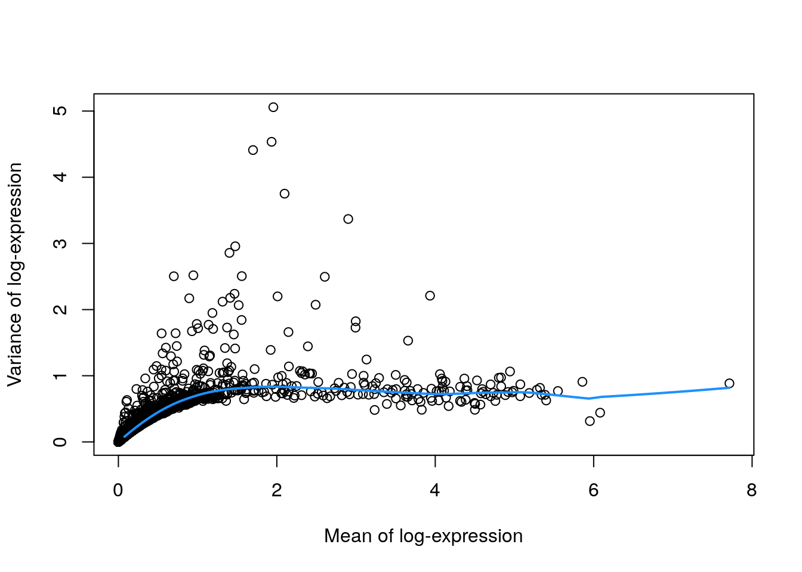
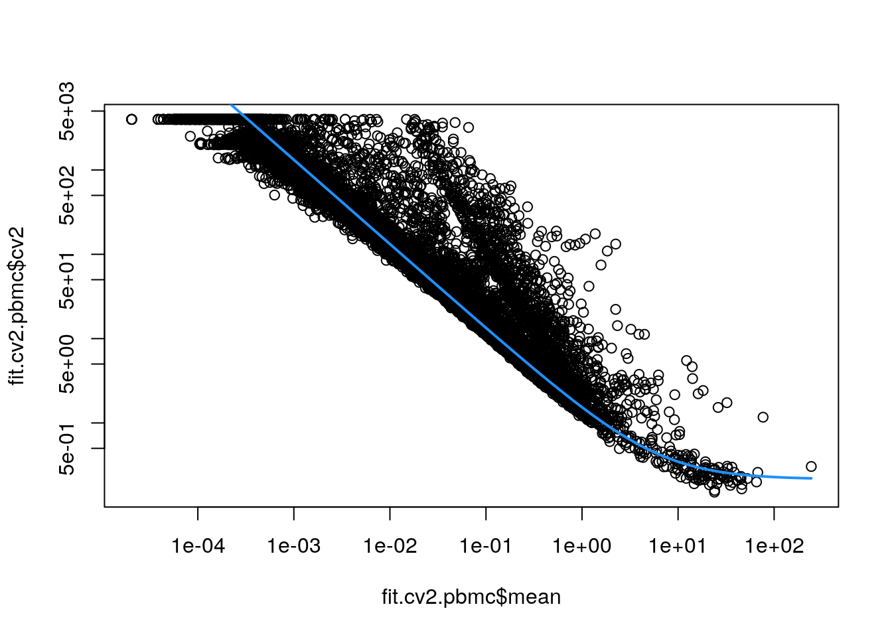
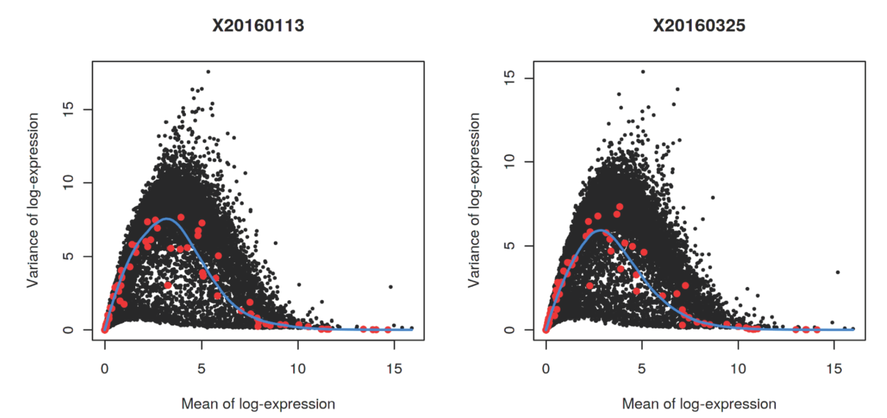

# Selección de genes

* Instructora: [**Yalbi I. Balderas-Martínez**](http://Yalbibalderas.github.io/)
* Instructora: [**Laura Gómez-Romero**](https://comunidadbioinfo.github.io/es/authors/lgomez/)

## Diapositivas de Peter Hickey

Ver las diapositivas originales [aquí](https://docs.google.com/presentation/d/19J2FyjKlBQdAkku4Oa6UZ6SA-Y4P7AEKCRIbEQWA9ho/edit#slide=id.ga100bba375887aa_0)


## Motivación

* Usualmente usamos datos scRNA-seq para caracterizar la heterogeneidad entre células

* Para hacer esto, usamos métodos como el clustering y la reducción de dimensionalidad

* Esto involucra resumir las diferencias por gen en una sola medida de (dis)similitud entre un par de células

* **¿Cuáles genes deberíamos usar para calcular esta medida de (dis)similitud?**


## Selección de _features_ (genes)

La elección de los _features_ tiene un mayor impacto en qué tan similares decidimos que son las células 

* ➕ _Features_ que contienen información útil biológica 
* ➖ _Features_ que contienen ruido aleatorio
* 👉 Efectos laterales al reducir la dimensionalidad de los datos 

Deseamos seleccionar los **genes altamente variables** (High Variable Genes **HVGs**). Genes con una variación incrementada en comparación con otros genes que están siendo afectados por ruido técnico u otra variación biológica que no es de nuestro interés.

## Dataset ilustrativo: PBMC4k 10X sin filtrar

### Descargar datos


```r
# Usemos datos de pbmc4k
library(BiocFileCache)
bfc <- BiocFileCache()
raw.path <- bfcrpath(bfc, file.path(
    "http://cf.10xgenomics.com/samples",
    "cell-exp/2.1.0/pbmc4k/pbmc4k_raw_gene_bc_matrices.tar.gz"
))
untar(raw.path, exdir = file.path(tempdir(), "pbmc4k"))

library(DropletUtils)
library(Matrix)
fname <- file.path(tempdir(), "pbmc4k/raw_gene_bc_matrices/GRCh38")
sce.pbmc <- read10xCounts(fname, col.names = TRUE)
sce.pbmc
```

```
## class: SingleCellExperiment 
## dim: 33694 737280 
## metadata(1): Samples
## assays(1): counts
## rownames(33694): ENSG00000243485 ENSG00000237613 ... ENSG00000277475
##   ENSG00000268674
## rowData names(2): ID Symbol
## colnames(737280): AAACCTGAGAAACCAT-1 AAACCTGAGAAACCGC-1 ...
##   TTTGTCATCTTTAGTC-1 TTTGTCATCTTTCCTC-1
## colData names(2): Sample Barcode
## reducedDimNames(0):
## mainExpName: NULL
## altExpNames(0):
```

Dataset "Células mononucleares humanas de sangre periférica" de 10X Genomics

Descripción [aquí](https://osca.bioconductor.org/unfiltered-human-pbmcs-10x-genomics.html) ^[Zheng, G. X. Y. et al. Massively parallel digital transcriptional profiling of single cells. Nat. Commun. 8, 14049 (2017).]

### Anotación


```r
# Anotación de los genes
library(scater)
rownames(sce.pbmc) <- uniquifyFeatureNames(
    rowData(sce.pbmc)$ID, rowData(sce.pbmc)$Symbol
)
library(EnsDb.Hsapiens.v86)
location <- mapIds(EnsDb.Hsapiens.v86,
    keys = rowData(sce.pbmc)$ID,
    column = "SEQNAME", keytype = "GENEID"
)

# Detección de _droplets_ con células
set.seed(100)
e.out <- emptyDrops(counts(sce.pbmc))
sce.pbmc <- sce.pbmc[, which(e.out$FDR <= 0.001)]
```

### Control de calidad


```r
# Control de calidad
stats <- perCellQCMetrics(sce.pbmc,
    subsets = list(Mito = which(location == "MT"))
)
high.mito <- isOutlier(stats$subsets_Mito_percent,
    type = "higher"
)
sce.pbmc <- sce.pbmc[, !high.mito]

# Normalización de los datos
library(scran)
set.seed(1000)
clusters <- quickCluster(sce.pbmc)
sce.pbmc <- computeSumFactors(sce.pbmc, cluster = clusters)
sce.pbmc <- logNormCounts(sce.pbmc)
```

### Preguntas de repaso

* ¿Cómo determinamos cuales eran los genes mitocondriales? ^[Usando Ensembl v86 para humano]
* ¿Cómo decidimos filtrar las células? ^[Usamos los resultados de `emptyDrops()` con un límite de 0.1% FDR y el filtro de 3 desviaciones sobre la mediana (MAD) en la expresión mitocondrial.]
* ¿Puedes explicar como normalizamos los datos? ^[Encontramos unos clusters rápidos para las célulasy usamos esa información para calcular los factores de tamaño.]

## Cuantificando la varianza por gen


### Varianza de los _log-counts_

El enfoque más simple para cuantificar la variación _per-feature_ es simplemente calcular la varianza de los _log-counts_

* ➕ Selección del _feature_  basado en los _log-counts_ (que serán usadas en los análisis más adelante)
* ⚠️ La transformación log no logra la estabilización de la varianza perfecta, así que se requiere modelar la relación de la varianza-media de los _features_.


### Enfoque simple

1. Calcular la varianza de los _log-counts_ para cada gen (ignorando grupos experimentales)
2. Ordenar los genes del más-al-menos variable

### Un enfoque más sofisticado

1. Calcular la varianza de los _log-counts_ para cada gen (ignorando grupos experimentales)
2. Modelar la relación de la media de la varianza de los _log-counts_ para estimar la variación _técnica_
3. Estimar la varianza _biológica_ sustrayendo la varianza _técnica_ de la varianza total
4. Ordenar los genes de la variable de mayor-a-menor biológicamente


### Supuestos


```r
# Varianza de las log-counts
library(scran)
dec.pbmc <- modelGeneVar(sce.pbmc)
```

* 🤓 El supuesto es que a cualquier abundancia dada, la abundancia de los perfiles de expresión de la mayoría de los genes están dominados por el ruido aleatorio _técnico_
* 🤓 Por lo consiguiente, una tendencia representa un estimado del ruido técnico como una función de la abundancia
* 🤓 Podemos entonces descomponer la varianza total de cada gen en un componente _técnico_ y uno _biológico_ 
* 🤓 Genes con una gran varianza _biológica_ son considerados interesantes 

### Visualizando la media y varianza


```r
# Visualicemos la relación entre la media y la varianza
fit.pbmc <- metadata(dec.pbmc)
plot(fit.pbmc$mean, fit.pbmc$var,
    xlab = "Mean of log-expression",
    ylab = "Variance of log-expression"
)
curve(fit.pbmc$trend(x), col = "dodgerblue", add = TRUE, lwd = 2)
```



#### Ejercicios

* ¿Qué tipo de objeto nos regresó `modelGeneVar()`? ^[Es un `DFrame`]
* ¿`dec.pbmc` es una tabla? ¿O contiene mayor información? ^[No, contiene más información dentro de `metadata(dec.pbmc)`]
* ¿Qué tipo de objeto es `fit.pbmc` y que objetos con nombres contiene? ^[`class(metadata(dec.pbmc))` y `sapply(metadata(dec.pbmc), class)`]
* ¿Qué tipo de objeto es `fit.pbmc$trend`? ^[Una función]
* ¿Donde podemos encontrar más detalles de esta función? ^[Checa `?fitTrendVar` y si quieres también checa el código fuente (para mí es muy útil este paso) https://github.com/MarioniLab/scran/blob/master/R/fitTrendVar.R]


### Ordenando genes interesantes


```r
# Ordenemos por los genes más interesantes para checar
# los datos
dec.pbmc[order(dec.pbmc$bio, decreasing = TRUE), ]
```

```
## DataFrame with 33694 rows and 6 columns
##              mean     total      tech       bio      p.value          FDR
##         <numeric> <numeric> <numeric> <numeric>    <numeric>    <numeric>
## LYZ       1.95605   5.05854  0.835343   4.22320 1.10538e-270 2.17417e-266
## S100A9    1.93416   4.53551  0.835439   3.70007 2.71043e-208 7.61593e-205
## S100A8    1.69961   4.41084  0.824342   3.58650 4.31581e-201 9.43197e-198
## HLA-DRA   2.09785   3.75174  0.831239   2.92050 5.93950e-132 4.86767e-129
## CD74      2.90176   3.36879  0.793188   2.57560 4.83937e-113 2.50488e-110
## ...           ...       ...       ...       ...          ...          ...
## TMSB4X    6.08142  0.441718  0.679215 -0.237497     0.992447            1
## PTMA      3.82978  0.486454  0.731275 -0.244821     0.990002            1
## HLA-B     4.50032  0.486130  0.739577 -0.253447     0.991376            1
## EIF1      3.23488  0.482869  0.768946 -0.286078     0.995135            1
## B2M       5.95196  0.314948  0.654228 -0.339280     0.999843            1
```


## Coeficiente de variación de las cuentas

El coeficiente de variación de las cuentas al cuadrado (CV<sup>2</sup>) es una alternativa a la varianza de los _log-counts_

* 👉 Se calcula usando las cuentas en lugar de los _log-counts_

* 🤓 CV es la tasa de la desviación estándar a la media y está muy relacionada con el parámetro de _dispersión_ de la distribución binomial negativa usada en edgeR y DESeq2


### Coeficiente de variación


```r
# Coeficiente de variación
dec.cv2.pbmc <- modelGeneCV2(sce.pbmc)
```

* 🤓 Modela la relación de la media de la varianza cuando se considera la relevancia de cada gen
* 🤓 Asume que la mayoría de los genes contienen ruido aleatorio y que la tendencia captura la mayoría de la variación técnica 
* 🤓 Genes con un gran CV<sup>2</sup> que se desvían fuertemente de la tendencia es probable que representen genes afectados por la estructura biológica 
* 🤓 Usa la tasa (en lugar de la diferencia) del CV<sup>2</sup> a la tendencia


### Visualizando el coeficiente de variación


```r
# Visualicemos la relación con la media
fit.cv2.pbmc <- metadata(dec.cv2.pbmc)
plot(fit.cv2.pbmc$mean, fit.cv2.pbmc$cv2,
    log = "xy"
)
curve(fit.cv2.pbmc$trend(x),
    col = "dodgerblue",
    add = TRUE, lwd = 2
)
```




### Genes por coeficiente de variación


```r
# Ordenemos por los genes más interesantes para checar
# los datos
dec.cv2.pbmc[order(dec.cv2.pbmc$ratio,
    decreasing = TRUE
), ]
```

```
## DataFrame with 33694 rows and 6 columns
##                 mean     total     trend     ratio   p.value       FDR
##            <numeric> <numeric> <numeric> <numeric> <numeric> <numeric>
## PPBP       2.2437397   132.364  0.803689   164.696         0         0
## PRTFDC1    0.0658743  3197.564 20.266829   157.773         0         0
## HIST1H2AC  1.3731487   175.035  1.176934   148.721         0         0
## FAM81B     0.0477082  3654.419 27.902078   130.973         0         0
## PF4        1.8333127   109.451  0.935484   116.999         0         0
## ...              ...       ...       ...       ...       ...       ...
## AC023491.2         0       NaN       Inf       NaN       NaN       NaN
## AC233755.2         0       NaN       Inf       NaN       NaN       NaN
## AC233755.1         0       NaN       Inf       NaN       NaN       NaN
## AC213203.1         0       NaN       Inf       NaN       NaN       NaN
## FAM231B            0       NaN       Inf       NaN       NaN       NaN
```

## Varianza de los _log-counts_ vs coeficiente de variación

**Generalmente se usa la varianza de los _log-counts_** 

* Ambas son medidas efectivas para cuantificar la variación en la expresión génica 
* CV<sup>2</sup> tiende a tener otorgar rangos altos en abundancias bajas de genes altamente variables 
	- Éstos son dirigidos por una sobreregulación en subpoblaciones raras 
  - Puede asignar un alto rango a genes que no son de nuestro interés con varianza baja absoluta	
* La variación descrita por el CV<sup>2</sup> de las cuentas es menos relevante para los procedimientos que operan en los _log-counts_


## Importando un dataset con factores experimentales


```r
library(scRNAseq)
sce.416b <- LunSpikeInData(which = "416b")
sce.416b$block <- factor(sce.416b$block)

sce.416b
```

```
## class: SingleCellExperiment 
## dim: 46604 192 
## metadata(0):
## assays(1): counts
## rownames(46604): ENSMUSG00000102693 ENSMUSG00000064842 ...
##   ENSMUSG00000095742 CBFB-MYH11-mcherry
## rowData names(1): Length
## colnames(192): SLX-9555.N701_S502.C89V9ANXX.s_1.r_1
##   SLX-9555.N701_S503.C89V9ANXX.s_1.r_1 ...
##   SLX-11312.N712_S508.H5H5YBBXX.s_8.r_1
##   SLX-11312.N712_S517.H5H5YBBXX.s_8.r_1
## colData names(9): Source Name cell line ... spike-in addition block
## reducedDimNames(0):
## mainExpName: endogenous
## altExpNames(2): ERCC SIRV
```

Este dataset consiste de células de una línea celular de células inmortalizadas mieloides progenitoras de ratón utilizando SmartSeq2

Una cantidad constante de spike-in ERCC RNA se agregó a cada lisado celular antes de la prepatación de la librería

Descripción [aquí](https://osca.bioconductor.org/lun-416b-cell-line-smart-seq2.html)

*Lun, A. T. L., Calero-Nieto, F. J., Haim-Vilmovsky, L., Göttgens, B. & Marioni, J. C. Assessing the reliability of spike-in normalization for analyses of single-cell RNA sequencing data. Genome Res. 27, 1795–1806 (2017)*


** Ahora vamos a procesar los datos de la forma que ya hemos aprendido: **


```r
# gene-annotation
# agregando simbolo y cromosoma
library(AnnotationHub)
ens.mm.v97 <- AnnotationHub()[["AH73905"]]
rowData(sce.416b)$ENSEMBL <- rownames(sce.416b)
rowData(sce.416b)$SYMBOL <- mapIds(ens.mm.v97,
    keys = rownames(sce.416b),
    keytype = "GENEID", column = "SYMBOL"
)
rowData(sce.416b)$SEQNAME <- mapIds(ens.mm.v97,
    keys = rownames(sce.416b),
    keytype = "GENEID", column = "SEQNAME"
)
library(scater)
rownames(sce.416b) <- uniquifyFeatureNames(
    rowData(sce.416b)$ENSEMBL,
    rowData(sce.416b)$SYMBOL
)
```


```r
# quality-control
# obteniendo metricas de QC para los datos completos, el subset de mitocondrial y para cada altExp
# eliminando los outliers por batch
mito <- which(rowData(sce.416b)$SEQNAME == "MT")
stats <- perCellQCMetrics(sce.416b, subsets = list(Mt = mito))
qc <- quickPerCellQC(stats,
    percent_subsets = c("subsets_Mt_percent", "altexps_ERCC_percent"),
    batch = sce.416b$block
)
sce.416b <- sce.416b[, !qc$discard]

# normalization
# calculamos factores de tamaño y normalizacion
library(scran)
sce.416b <- computeSumFactors(sce.416b)
sce.416b <- logNormCounts(sce.416b)
```


## Considerando factores experimentales 

- Los datos que contienen múltiples *batches* muy seguido presentan **efecto de bloque** que pueden crear HGVs artificiales
- Se debe identificar los HGVs en cada *batch* y combinarlos en una única lista de HGVs


```r
# calculando la variacion por bloque
library(scran)
dec.block.416b <- modelGeneVarWithSpikes(sce.416b,
    "ERCC",
    block = sce.416b$block
)
dec.block.416b[order(
    dec.block.416b$bio,
    decreasing = TRUE
), ]
```

```
## DataFrame with 46604 rows and 7 columns
##               mean     total      tech       bio      p.value          FDR
##          <numeric> <numeric> <numeric> <numeric>    <numeric>    <numeric>
## Lyz2       6.61235   13.8619   1.58416   12.2777  0.00000e+00  0.00000e+00
## Ccl9       6.67841   13.2599   1.44553   11.8143  0.00000e+00  0.00000e+00
## Top2a      5.81275   14.0192   2.74571   11.2734 3.89855e-137 8.43398e-135
## Cd200r3    4.83305   15.5909   4.31892   11.2719  1.17783e-54  7.00721e-53
## Ccnb2      5.97999   13.0256   2.46647   10.5591 1.20380e-151 2.98405e-149
## ...            ...       ...       ...       ...          ...          ...
## Gm12816    2.91299  0.842574   6.67730  -5.83472     0.999989     0.999999
## Gm5786     2.90717  0.879485   6.71686  -5.83738     0.999994     0.999999
## Rpl9-ps4   3.26421  0.807057   6.64932  -5.84226     0.999988     0.999999
## Gm13623    2.72788  0.700296   6.63875  -5.93845     0.999998     0.999999
## Rps12l1    3.15425  0.750775   6.70033  -5.94955     0.999995     0.999999
##                                                          per.block
##                                                        <DataFrame>
## Lyz2       6.35652:13.3748:2.08227:...:6.86819:14.3490:1.08605:...
## Ccl9       6.68726:13.0778:1.65923:...:6.66956:13.4420:1.23184:...
## Top2a      5.34891:17.5972:3.91642:...:6.27659:10.4411:1.57501:...
## Cd200r3    4.60115:15.7870:5.55587:...:5.06496:15.3948:3.08197:...
## Ccnb2      5.56701:15.4150:3.46931:...:6.39298:10.6362:1.46362:...
## ...                                                            ...
## Gm12816  2.86995:0.624143:7.43036:...:2.95604:1.061004:5.92424:...
## Gm5786   2.96006:0.902872:7.49911:...:2.85427:0.856098:5.93462:...
## Rpl9-ps4 3.60690:0.543276:7.36805:...:2.92151:1.070839:5.93058:...
## Gm13623  2.83129:0.852901:7.39442:...:2.62447:0.547692:5.88308:...
## Rps12l1  3.14399:0.716670:7.57246:...:3.16452:0.784881:5.82819:...
```

Al calcular tendencias específicas por batch se tomarán en cuenta las diferencias en la relación media-varianza entre batches

Se deben obtener estimados de los componentes biológico y técnico para cada gene específicos de cada batch, los cuales se promedian entre los batches para crear una única lista de HVGs


<div class="figure">

<p class="caption">Factor experimental.</p>
</div>


## Seleccionando genes altamante variables (high-variable genes, HVGs)


Hasta ahora hemos ordenado los genes del más al menos **interesantemente variable**

*¿Qué tanto debemos de bajar en la lista para seleccionar nuestros HVGs?*

Para responder esta pregunta debemos tomar en cuenta lo siguiente: elegir un subset más grande:

- Reduce el riesgo de desechar señal biológica
- Incrementa el ruido por la inclusión de genes irrelevantes

Es difícil determinar el balance óptimo porque el rudio en un contexto podría ser una señal útil en otro contexto

Discutiremos algunas estrategias para seleccionar HVGs


### Seleccionando HVGs sobre la métrica de varianza

La estrategia más simple es seleccionar los **top-X genes** con los valores más grandes para la métrica relevante de varianza, *por ejemplo, la varianza biológica más grande calculada con `scran::modelGeneVar()`*

**Pro**: El usuario puede controlar directamente el número de HVGs

**Contra**: ¿Qué valor de X se debe usar?


```r
# Works with modelGeneVar() output
hvg.pbmc.var <- getTopHVGs(dec.pbmc, n = 1000)
str(hvg.pbmc.var)
```

```
##  chr [1:1000] "LYZ" "S100A9" "S100A8" "HLA-DRA" "CD74" "CST3" "TYROBP" ...
```

```r
# Works with modelGeneVarWithSpikes() output
# hvg.416b.var <- getTopHVGs(dec.spike.416b, n=1000)
# str(hvg.416b.var)

# Also works with modelGeneCV2() but note `var.field`
hvg.pbmc.cv2 <- getTopHVGs(dec.cv2.pbmc,
    var.field = "ratio", n = 1000
)
str(hvg.pbmc.cv2)
```

```
##  chr [1:1000] "PPBP" "PRTFDC1" "HIST1H2AC" "FAM81B" "PF4" "GNG11" ...
```


#### Estrategias para seleccionar X

Asume que, por ejemplo, no más del 5% de los genes están diferencialmente expresados entre las células de nuestra población:

 - *Establece X como el 5% de los genes*
 
Normalmente no conocemos el número de genes diferencialmente expresados desde antes, por lo tanto, solo hemos cambiado un número arbitrario por otro número arbitrario
 
**RECOMENDACIÓN**: Si decides utilizar los top-X HGVs, elige un valor de X y procede con el resto del análisis con la intención de regresar más adelante y probar otros valores, en vez de dedicarle mucho esfuerzo a encontrar el valor óptimo


### Seleccionando HVGs de acuerdo a su significancia estadística

Establece un límite fijo en alguna métrica de significancia estadística. Por ejemplo: algunos de los métodos reportan un p-valor para cada gene, entonces selecciona todos los genes con un p-valor ajustado menor que 0.05

**Recuerda que las pruebas estadísticas siempre dependen del tamaño de la muestra**

**Ventajas:** 
* Fácil de implementar
* Menos predecible que la estrategia de los top-X

**Desventajas:**
* Podría priorizar genes con significancia estadística fuerte en vez de significancia biológica fuerte


```r
# Works with modelGeneVar() output
hvg.pbmc.var.2 <- getTopHVGs(dec.pbmc, fdr.threshold = 0.05)
str(hvg.pbmc.var.2)
```

```
##  chr [1:813] "LYZ" "S100A9" "S100A8" "HLA-DRA" "CD74" "CST3" "TYROBP" ...
```

```r
# Works with modelGeneVarWithSpikes() output
# hvg.416b.var.2 <- getTopHVGs(dec.spike.416b,
#  fdr.threshold=0.05)
# str(hvg.416b.var.2)

# Also works with modelGeneCV2() but note `var.field`
hvg.pbmc.cv2.2 <- getTopHVGs(dec.cv2.pbmc,
    var.field = "ratio", fdr.threshold = 0.05
)
str(hvg.pbmc.cv2.2)
```

```
##  chr [1:1972] "PPBP" "PRTFDC1" "HIST1H2AC" "FAM81B" "PF4" "GNG11" ...
```


### Seleccionando genes por arriba de la tendencia media-varianza

Selecciona todos los genes con **una varianza biológica positiva**

Este es un extremo del equilibrio sesgo-varianza que minimiza el sesgo con el costo de maximizar el ruido

Si seguimos esta aproximación, estamos:

* Dándole a la estructura secundaria de la población una oportunidad de manifestarse
* Capturando más ruido, lo cual puede reducir la resolución de poblaciones bien separadas enmascarando la señal secundaria que intentamos preservar

Funciona mejor si tenemos datasets altamente heterogeneos que contienen muchos tipos celulares diferentes


```r
# Works with modelGeneVar() output
hvg.pbmc.var.3 <- getTopHVGs(dec.pbmc, var.threshold = 0)
str(hvg.pbmc.var.3)
```

```
##  chr [1:12745] "LYZ" "S100A9" "S100A8" "HLA-DRA" "CD74" "CST3" "TYROBP" ...
```

```r
# Works with modelGeneVarWithSpikes() output
# hvg.416b.var.3 <- getTopHVGs(dec.spike.416b,
#  var.threshold=0)
# str(hvg.416b.var.3)

# Also works with modelGeneCV2() but note `var.field` and
# value of `var.threshold`
hvg.pbmc.cv2.3 <- getTopHVGs(dec.cv2.pbmc,
    var.field = "ratio", var.threshold = 1
)
str(hvg.pbmc.cv2.2)
```

```
##  chr [1:1972] "PPBP" "PRTFDC1" "HIST1H2AC" "FAM81B" "PF4" "GNG11" ...
```

### Seleccionando genes de interés *a priori*

Una estrategia contundente es usar sets predefinidos de genes de interés. No hay vergüenza en aprovechar el conocimiento biológivo previo

Sin embargo, limita nuestra capacidad de descubrir aspectos nuevos o inesperados de la variación. Por lo tanto, considera esta como una estrategia complementaria a otros tipo de estrategias de selección de HGVs


También podrías eliminar listas pre-definidas de genes:

* Genes de proteínas ribosomales o genes mitocondriales son conocidos por encontrarse dentro de los genes *más variables* y por interferir con análisis posteriores
 
 Sin embargo, tampoco hay que pecar de prevacido, espera a que estos genes demuestren ser problemáticos para removerlos
 

## Poniendo todo junto


```r
# Elegimos el 10% de los genes con con componente biologico de variacion mayor
dec.pbmc <- modelGeneVar(sce.pbmc)
chosen <- getTopHVGs(dec.pbmc, prop = 0.1)
str(chosen)
```

```
##  chr [1:1274] "LYZ" "S100A9" "S100A8" "HLA-DRA" "CD74" "CST3" "TYROBP" ...
```

Después de esto tenemos varias opciones para imponer nuestra selección de HGVs durante el resto del análisis:

1. Hacer un subset de SCE para quedarnos únicamente con los HGVs
2. Especificar los HGVs en funciones posteriores
3. Magia (altExps)


### Quedándonos sólo con los HGVs


```r
sce.pbmc.hvg <- sce.pbmc[chosen, ]
sce.pbmc.hvg
```

```
## class: SingleCellExperiment 
## dim: 1274 3985 
## metadata(1): Samples
## assays(2): counts logcounts
## rownames(1274): LYZ S100A9 ... TNNT1 TMEM55A
## rowData names(2): ID Symbol
## colnames(3985): AAACCTGAGAAGGCCT-1 AAACCTGAGACAGACC-1 ...
##   TTTGTCAGTTAAGACA-1 TTTGTCATCCCAAGAT-1
## colData names(3): Sample Barcode sizeFactor
## reducedDimNames(0):
## mainExpName: NULL
## altExpNames(0):
```

**PRO:** Te aseguras de que los métodos posteriores **sólo** usen estos genes para sus cálculos

**CONTRA:** Los genes no-HGVs son eliminados del nuevo objeto *SingleCellExperiment*, lo cual hace menos conveniente la interrogación del dataset completo sobre genes que no son HGVs


### Especificando los HGVs


```r
# Example of specifying HVGs in a downstream function
# Performing PCA only on the chosen HVGs.
library(scater)
sce.pbmc <- runPCA(sce.pbmc, subset_row = chosen)
sce.pbmc
```

```
## class: SingleCellExperiment 
## dim: 33694 3985 
## metadata(1): Samples
## assays(2): counts logcounts
## rownames(33694): RP11-34P13.3 FAM138A ... AC213203.1 FAM231B
## rowData names(2): ID Symbol
## colnames(3985): AAACCTGAGAAGGCCT-1 AAACCTGAGACAGACC-1 ...
##   TTTGTCAGTTAAGACA-1 TTTGTCATCCCAAGAT-1
## colData names(3): Sample Barcode sizeFactor
## reducedDimNames(1): PCA
## mainExpName: NULL
## altExpNames(0):
```

Mantiene el objeto *SingleCellExperiment* original y especifica los genes para usar en funciones posteriores mediante un argumento adicional como **subset_row**

**PRO:** Es útil si el análisis usa varios conjuntos de HGVs en diferentes pasos

**CONTRA:** Podría ser inconveniente especificar repetidamente el mismo conjunto de HGVs en diferentes pasos


### Witchcraft (Brujería)


```r
# Add the full SCE to the subsetted data SCE
altExp(sce.pbmc.hvg, "original") <- sce.pbmc
sce.pbmc.hvg
```

```
## class: SingleCellExperiment 
## dim: 1274 3985 
## metadata(1): Samples
## assays(2): counts logcounts
## rownames(1274): LYZ S100A9 ... TNNT1 TMEM55A
## rowData names(2): ID Symbol
## colnames(3985): AAACCTGAGAAGGCCT-1 AAACCTGAGACAGACC-1 ...
##   TTTGTCAGTTAAGACA-1 TTTGTCATCCCAAGAT-1
## colData names(3): Sample Barcode sizeFactor
## reducedDimNames(0):
## mainExpName: NULL
## altExpNames(1): original
```

```r
altExp(sce.pbmc.hvg, "original")
```

```
## class: SingleCellExperiment 
## dim: 33694 3985 
## metadata(1): Samples
## assays(2): counts logcounts
## rownames(33694): RP11-34P13.3 FAM138A ... AC213203.1 FAM231B
## rowData names(2): ID Symbol
## colnames(3985): AAACCTGAGAAGGCCT-1 AAACCTGAGACAGACC-1 ...
##   TTTGTCAGTTAAGACA-1 TTTGTCATCCCAAGAT-1
## colData names(3): Sample Barcode sizeFactor
## reducedDimNames(1): PCA
## mainExpName: NULL
## altExpNames(0):
```

Utilizando el sistema de "experimento alternartivo" en la clase *SingleCellExperiment*

**PRO:** Evita algunos problemas a largo plazo cuando el dataset original no está sincronizado con el conjunto filtrado por HVGs

**CONTRA:** Ralentiza todos los análisis subsecuentes


## Resumen y recomendaciones

* Es fácil atorarse en este paso debido a la variedad de opciones disponibles
* Elige un conjunto de HVGs y continúa con el análisis, **recuerda regresar para probar la robustez de tus resultados usando una forma diferente para seleccionar los HVGs**
* Si tienes spike-ins, trata de usarlos. No obstante, recuerda que los spike-ins no pueden capturar todas las fuentes de variación técnica


## Recomendaciones para empezar

Para CEL-Seq2:

- `scran::modelGeneVarWithSpikes()`

Para 10X:

- `scran::modelGeneVarByPoisson()`


Si quieres irte por el lado de conservar demasiados genes:

- `scran::getTopHVGs(dec, var.threshold=0)`

Y realiza una comparación rápida con, por lo menos, el top-1000 HVGs

Regresa al paso de selección de HVG para **eliminar genes problemáticos** tantas veces como sea necesario


## Detalles de la sesión de R


```r
## Información de la sesión de R
Sys.time()
```

```
## [1] "2021-08-11 15:06:06 UTC"
```

```r
proc.time()
```

```
##    user  system elapsed 
## 147.751   4.580 151.119
```

```r
options(width = 120)
sessioninfo::session_info()
```

```
## ─ Session info ───────────────────────────────────────────────────────────────────────────────────────────────────────
##  setting  value                       
##  version  R version 4.1.0 (2021-05-18)
##  os       Ubuntu 20.04.2 LTS          
##  system   x86_64, linux-gnu           
##  ui       X11                         
##  language (EN)                        
##  collate  en_US.UTF-8                 
##  ctype    en_US.UTF-8                 
##  tz       UTC                         
##  date     2021-08-11                  
## 
## ─ Packages ───────────────────────────────────────────────────────────────────────────────────────────────────────────
##  package                * version  date       lib source        
##  AnnotationDbi          * 1.54.1   2021-06-08 [1] Bioconductor  
##  AnnotationFilter       * 1.16.0   2021-05-19 [1] Bioconductor  
##  AnnotationHub          * 3.0.1    2021-06-20 [1] Bioconductor  
##  assertthat               0.2.1    2019-03-21 [1] RSPM (R 4.1.0)
##  beachmat                 2.8.0    2021-05-19 [1] Bioconductor  
##  beeswarm                 0.4.0    2021-06-01 [1] RSPM (R 4.1.0)
##  Biobase                * 2.52.0   2021-05-19 [1] Bioconductor  
##  BiocFileCache          * 2.0.0    2021-05-19 [1] Bioconductor  
##  BiocGenerics           * 0.38.0   2021-05-19 [1] Bioconductor  
##  BiocIO                   1.2.0    2021-05-19 [1] Bioconductor  
##  BiocManager              1.30.16  2021-06-15 [1] RSPM (R 4.1.0)
##  BiocNeighbors            1.10.0   2021-05-19 [1] Bioconductor  
##  BiocParallel             1.26.1   2021-07-04 [1] Bioconductor  
##  BiocSingular             1.8.1    2021-06-08 [1] Bioconductor  
##  BiocVersion              3.13.1   2021-03-19 [2] Bioconductor  
##  biomaRt                  2.48.2   2021-07-01 [1] Bioconductor  
##  Biostrings               2.60.2   2021-08-05 [1] Bioconductor  
##  bit                      4.0.4    2020-08-04 [1] RSPM (R 4.1.0)
##  bit64                    4.0.5    2020-08-30 [1] RSPM (R 4.1.0)
##  bitops                   1.0-7    2021-04-24 [1] RSPM (R 4.1.0)
##  blob                     1.2.2    2021-07-23 [1] RSPM (R 4.1.0)
##  bluster                  1.2.1    2021-05-27 [1] Bioconductor  
##  bookdown                 0.22     2021-04-22 [1] RSPM (R 4.1.0)
##  bslib                    0.2.5.1  2021-05-18 [1] RSPM (R 4.1.0)
##  cachem                   1.0.5    2021-05-15 [2] RSPM (R 4.1.0)
##  cli                      3.0.1    2021-07-17 [2] RSPM (R 4.1.0)
##  cluster                  2.1.2    2021-04-17 [3] CRAN (R 4.1.0)
##  colorspace               2.0-2    2021-06-24 [1] RSPM (R 4.1.0)
##  crayon                   1.4.1    2021-02-08 [2] RSPM (R 4.1.0)
##  curl                     4.3.2    2021-06-23 [2] RSPM (R 4.1.0)
##  DBI                      1.1.1    2021-01-15 [1] RSPM (R 4.1.0)
##  dbplyr                 * 2.1.1    2021-04-06 [1] RSPM (R 4.1.0)
##  DelayedArray             0.18.0   2021-05-19 [1] Bioconductor  
##  DelayedMatrixStats       1.14.2   2021-08-08 [1] Bioconductor  
##  digest                   0.6.27   2020-10-24 [2] RSPM (R 4.1.0)
##  dplyr                    1.0.7    2021-06-18 [1] RSPM (R 4.1.0)
##  dqrng                    0.3.0    2021-05-01 [1] RSPM (R 4.1.0)
##  DropletUtils           * 1.12.2   2021-07-22 [1] Bioconductor  
##  edgeR                    3.34.0   2021-05-19 [1] Bioconductor  
##  ellipsis                 0.3.2    2021-04-29 [2] RSPM (R 4.1.0)
##  EnsDb.Hsapiens.v86     * 2.99.0   2021-07-29 [1] Bioconductor  
##  ensembldb              * 2.16.4   2021-08-05 [1] Bioconductor  
##  evaluate                 0.14     2019-05-28 [2] RSPM (R 4.1.0)
##  ExperimentHub            2.0.0    2021-05-19 [1] Bioconductor  
##  fansi                    0.5.0    2021-05-25 [2] RSPM (R 4.1.0)
##  fastmap                  1.1.0    2021-01-25 [2] RSPM (R 4.1.0)
##  filelock                 1.0.2    2018-10-05 [1] RSPM (R 4.1.0)
##  generics                 0.1.0    2020-10-31 [1] RSPM (R 4.1.0)
##  GenomeInfoDb           * 1.28.1   2021-07-01 [1] Bioconductor  
##  GenomeInfoDbData         1.2.6    2021-07-29 [1] Bioconductor  
##  GenomicAlignments        1.28.0   2021-05-19 [1] Bioconductor  
##  GenomicFeatures        * 1.44.0   2021-05-19 [1] Bioconductor  
##  GenomicRanges          * 1.44.0   2021-05-19 [1] Bioconductor  
##  ggbeeswarm               0.6.0    2017-08-07 [1] RSPM (R 4.1.0)
##  ggplot2                * 3.3.5    2021-06-25 [1] RSPM (R 4.1.0)
##  glue                     1.4.2    2020-08-27 [2] RSPM (R 4.1.0)
##  gridExtra                2.3      2017-09-09 [1] RSPM (R 4.1.0)
##  gtable                   0.3.0    2019-03-25 [1] RSPM (R 4.1.0)
##  HDF5Array                1.20.0   2021-05-19 [1] Bioconductor  
##  highr                    0.9      2021-04-16 [2] RSPM (R 4.1.0)
##  hms                      1.1.0    2021-05-17 [1] RSPM (R 4.1.0)
##  htmltools                0.5.1.1  2021-01-22 [1] RSPM (R 4.1.0)
##  httpuv                   1.6.1    2021-05-07 [1] RSPM (R 4.1.0)
##  httr                     1.4.2    2020-07-20 [2] RSPM (R 4.1.0)
##  igraph                   1.2.6    2020-10-06 [1] RSPM (R 4.1.0)
##  interactiveDisplayBase   1.30.0   2021-05-19 [1] Bioconductor  
##  IRanges                * 2.26.0   2021-05-19 [1] Bioconductor  
##  irlba                    2.3.3    2019-02-05 [1] RSPM (R 4.1.0)
##  jquerylib                0.1.4    2021-04-26 [1] RSPM (R 4.1.0)
##  jsonlite                 1.7.2    2020-12-09 [2] RSPM (R 4.1.0)
##  KEGGREST                 1.32.0   2021-05-19 [1] Bioconductor  
##  knitr                    1.33     2021-04-24 [2] RSPM (R 4.1.0)
##  later                    1.2.0    2021-04-23 [1] RSPM (R 4.1.0)
##  lattice                  0.20-44  2021-05-02 [3] CRAN (R 4.1.0)
##  lazyeval                 0.2.2    2019-03-15 [1] RSPM (R 4.1.0)
##  lifecycle                1.0.0    2021-02-15 [2] RSPM (R 4.1.0)
##  limma                    3.48.2   2021-08-08 [1] Bioconductor  
##  locfit                   1.5-9.4  2020-03-25 [1] RSPM (R 4.1.0)
##  magrittr                 2.0.1    2020-11-17 [2] RSPM (R 4.1.0)
##  Matrix                 * 1.3-4    2021-06-01 [3] RSPM (R 4.1.0)
##  MatrixGenerics         * 1.4.2    2021-08-08 [1] Bioconductor  
##  matrixStats            * 0.60.0   2021-07-26 [1] RSPM (R 4.1.0)
##  memoise                  2.0.0    2021-01-26 [2] RSPM (R 4.1.0)
##  metapod                  1.0.0    2021-05-19 [1] Bioconductor  
##  mime                     0.11     2021-06-23 [2] RSPM (R 4.1.0)
##  munsell                  0.5.0    2018-06-12 [1] RSPM (R 4.1.0)
##  pillar                   1.6.2    2021-07-29 [2] RSPM (R 4.1.0)
##  pkgconfig                2.0.3    2019-09-22 [2] RSPM (R 4.1.0)
##  png                      0.1-7    2013-12-03 [1] RSPM (R 4.1.0)
##  prettyunits              1.1.1    2020-01-24 [2] RSPM (R 4.1.0)
##  progress                 1.2.2    2019-05-16 [1] RSPM (R 4.1.0)
##  promises                 1.2.0.1  2021-02-11 [1] RSPM (R 4.1.0)
##  ProtGenerics             1.24.0   2021-05-19 [1] Bioconductor  
##  purrr                    0.3.4    2020-04-17 [2] RSPM (R 4.1.0)
##  R.methodsS3              1.8.1    2020-08-26 [1] RSPM (R 4.1.0)
##  R.oo                     1.24.0   2020-08-26 [1] RSPM (R 4.1.0)
##  R.utils                  2.10.1   2020-08-26 [1] RSPM (R 4.1.0)
##  R6                       2.5.0    2020-10-28 [2] RSPM (R 4.1.0)
##  rappdirs                 0.3.3    2021-01-31 [2] RSPM (R 4.1.0)
##  Rcpp                     1.0.7    2021-07-07 [2] RSPM (R 4.1.0)
##  RCurl                    1.98-1.3 2021-03-16 [1] RSPM (R 4.1.0)
##  restfulr                 0.0.13   2017-08-06 [1] RSPM (R 4.1.0)
##  rhdf5                    2.36.0   2021-05-19 [1] Bioconductor  
##  rhdf5filters             1.4.0    2021-05-19 [1] Bioconductor  
##  Rhdf5lib                 1.14.2   2021-07-06 [1] Bioconductor  
##  rjson                    0.2.20   2018-06-08 [1] RSPM (R 4.1.0)
##  rlang                    0.4.11   2021-04-30 [2] RSPM (R 4.1.0)
##  rmarkdown                2.10     2021-08-06 [1] RSPM (R 4.1.0)
##  Rsamtools                2.8.0    2021-05-19 [1] Bioconductor  
##  RSQLite                  2.2.7    2021-04-22 [1] RSPM (R 4.1.0)
##  rsvd                     1.0.5    2021-04-16 [1] RSPM (R 4.1.0)
##  rtracklayer              1.52.0   2021-05-19 [1] Bioconductor  
##  S4Vectors              * 0.30.0   2021-05-19 [1] Bioconductor  
##  sass                     0.4.0    2021-05-12 [1] RSPM (R 4.1.0)
##  ScaledMatrix             1.0.0    2021-05-19 [1] Bioconductor  
##  scales                   1.1.1    2020-05-11 [1] RSPM (R 4.1.0)
##  scater                 * 1.20.1   2021-06-15 [1] Bioconductor  
##  scran                  * 1.20.1   2021-05-24 [1] Bioconductor  
##  scRNAseq               * 2.6.1    2021-05-25 [1] Bioconductor  
##  scuttle                * 1.2.1    2021-08-05 [1] Bioconductor  
##  sessioninfo              1.1.1    2018-11-05 [2] RSPM (R 4.1.0)
##  shiny                    1.6.0    2021-01-25 [1] RSPM (R 4.1.0)
##  SingleCellExperiment   * 1.14.1   2021-05-21 [1] Bioconductor  
##  sparseMatrixStats        1.4.2    2021-08-08 [1] Bioconductor  
##  statmod                  1.4.36   2021-05-10 [1] RSPM (R 4.1.0)
##  stringi                  1.7.3    2021-07-16 [2] RSPM (R 4.1.0)
##  stringr                  1.4.0    2019-02-10 [2] RSPM (R 4.1.0)
##  SummarizedExperiment   * 1.22.0   2021-05-19 [1] Bioconductor  
##  tibble                   3.1.3    2021-07-23 [2] RSPM (R 4.1.0)
##  tidyselect               1.1.1    2021-04-30 [1] RSPM (R 4.1.0)
##  utf8                     1.2.2    2021-07-24 [2] RSPM (R 4.1.0)
##  vctrs                    0.3.8    2021-04-29 [2] RSPM (R 4.1.0)
##  vipor                    0.4.5    2017-03-22 [1] RSPM (R 4.1.0)
##  viridis                  0.6.1    2021-05-11 [1] RSPM (R 4.1.0)
##  viridisLite              0.4.0    2021-04-13 [1] RSPM (R 4.1.0)
##  withr                    2.4.2    2021-04-18 [2] RSPM (R 4.1.0)
##  xfun                     0.25     2021-08-06 [2] RSPM (R 4.1.0)
##  XML                      3.99-0.6 2021-03-16 [1] RSPM (R 4.1.0)
##  xml2                     1.3.2    2020-04-23 [2] RSPM (R 4.1.0)
##  xtable                   1.8-4    2019-04-21 [1] RSPM (R 4.1.0)
##  XVector                  0.32.0   2021-05-19 [1] Bioconductor  
##  yaml                     2.2.1    2020-02-01 [2] RSPM (R 4.1.0)
##  zlibbioc                 1.38.0   2021-05-19 [1] Bioconductor  
## 
## [1] /__w/_temp/Library
## [2] /usr/local/lib/R/site-library
## [3] /usr/local/lib/R/library
```

## Patrocinadores {-}

Agradecemos a nuestros patrocinadores:

<a href="https://comunidadbioinfo.github.io/es/post/cs_and_s_event_fund_award/#.YJH-wbVKj8A"></a>

<a href="https://www.r-consortium.org/"></a>
