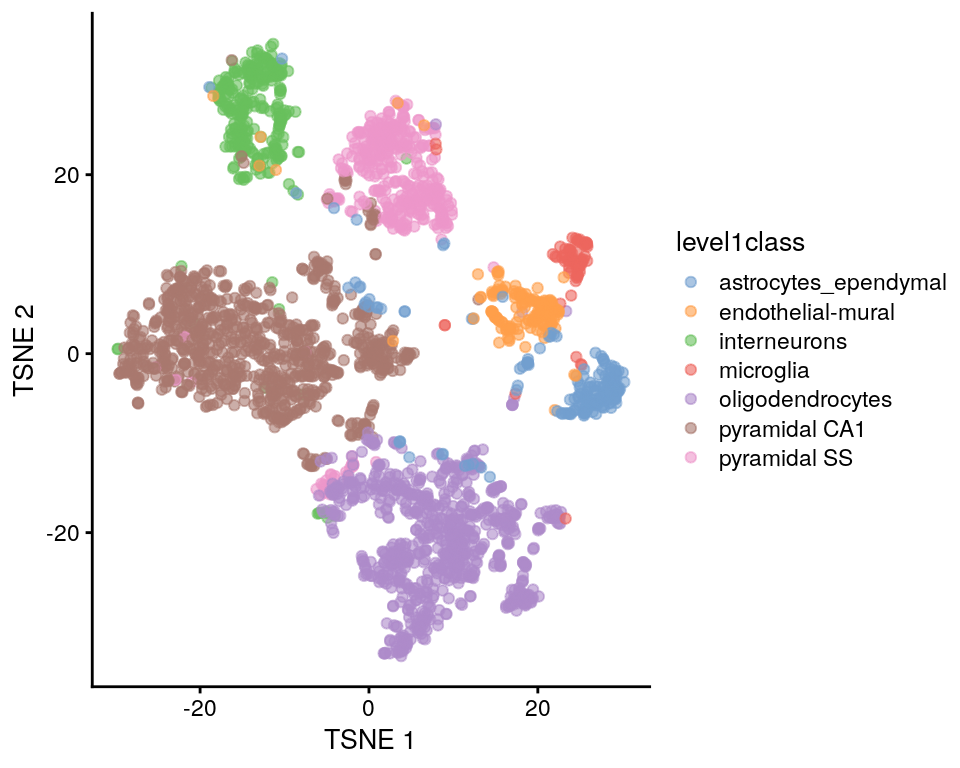

# Reducción de dimensiones

Instructora: [Laura Gómez-Romero](https://comunidadbioinfo.github.io/es/authors/lgomez/)

## Diapositivas de Peter Hickey

Contenido adaptado de: [aquí](https://docs.google.com/presentation/d/12CjvQ1beZVeCcMQqD6ptzd9YUHbHOksvy3lt_rvWyRs/edit)

## Motivación

El siguiente paso en el análisis de scRNA-seq usualmente consiste en identificar grupos de células "similares"

Por ejemplo: un análisis de clustering busca identificar células con un perfil transcriptómico similar al calcular distancias entre ellas

Si tuviéramos un dataset con dos genes podríamos hacer una gráfica de dos dimensiones para identificar clusters de células

<div>
<p style = 'text-align:center;'>

</p>
</div>


Pero... tenemos decenas de miles de genes : **Reducción de dimensionalidad**

## Reducción de dimensionalidad

Es poible porque la expresión de diferentes genes estará correlacionada si estos genes son afectados por el mismo proceso biológico.

Por lo tanto, no necesitamos almacenar información independiente para genes individuales. Podemos comprimir móltiples "features" (genes) en una ónica dimensión.

**Ventajas:**

- Reduce trabajo computacional en análisis posteriores
- Reduce el ruido al "promediar" mútiples genes obteniendo una representación mós precisa de los patrones en los datos
- Permite una graficación efectiva en dos dimensiones

## Dataset ilustrativo: Zeisel


```r
library(scRNAseq)
sce.zeisel <- ZeiselBrainData(ensembl = TRUE)
```

Estudio de tipos celulares en el cerebro de ratón (oligodendrocitos, microglia, neuronas, etc) procesados con el sistema STRT-seq (similar a CEL-Seq)

Descripción [aquí](https://osca.bioconductor.org/zeisel-mouse-brain-strt-seq.html)

*Zeisel, A. et al. Brain structure. Cell types in the mouse cortex and hippocampus revealed by single-cell RNA-seq. Science 347, 1138-1142 (2015)*


```r
# Quality control
library(scater)
is.mito <- which(rowData(sce.zeisel)$featureType == "mito")
stats <- perCellQCMetrics(sce.zeisel,
    subsets = list(Mt = is.mito)
)
qc <- quickPerCellQC(stats,
    percent_subsets = c("altexps_ERCC_percent", "subsets_Mt_percent")
)
sce.zeisel <- sce.zeisel[, !qc$discard]
```


```r
# normalization
library(scran)
set.seed(1000)
clusters <- quickCluster(sce.zeisel)
sce.zeisel <- computeSumFactors(sce.zeisel,
    cluster = clusters
)
sce.zeisel <- logNormCounts(sce.zeisel)

# variance-modelling
dec.zeisel <- modelGeneVarWithSpikes(
    sce.zeisel,
    "ERCC"
)
```

## Dataset ilustrativo: 10x PBMC4k no filtradas


```r
library(BiocFileCache)
bfc <- BiocFileCache()
raw.path <- bfcrpath(bfc, file.path(
    "http://cf.10xgenomics.com/samples",
    "cell-exp/2.1.0/pbmc4k/pbmc4k_raw_gene_bc_matrices.tar.gz"
))
untar(raw.path, exdir = file.path(tempdir(), "pbmc4k"))
```


```r
library(DropletUtils)
library(Matrix)
fname <- file.path(tempdir(), "pbmc4k/raw_gene_bc_matrices/GRCh38")
sce.pbmc <- read10xCounts(fname, col.names = TRUE)
```

Dataset "Células mononucleares humanas de sangre periférica" de 10X Genomics

Descripción [aquí](https://osca.bioconductor.org/unfiltered-human-pbmcs-10x-genomics.html)


*Zheng, G. X. Y. et al. Massively parallel digital transcriptional profiling of single cells. Nat. Commun. 8, 14049 (2017)*


```r
# gene-annotation
library(scater)
rownames(sce.pbmc) <- uniquifyFeatureNames(
    rowData(sce.pbmc)$ID, rowData(sce.pbmc)$Symbol
)
library(EnsDb.Hsapiens.v86)
location <- mapIds(EnsDb.Hsapiens.v86,
    keys = rowData(sce.pbmc)$ID,
    column = "SEQNAME", keytype = "GENEID"
)

# cell-detection
set.seed(100)
e.out <- emptyDrops(counts(sce.pbmc))
sce.pbmc <- sce.pbmc[, which(e.out$FDR <= 0.001)]
```


```r
# quality-control
stats <- perCellQCMetrics(sce.pbmc,
    subsets = list(Mito = which(location == "MT"))
)
high.mito <- isOutlier(stats$subsets_Mito_percent,
    type = "higher"
)
sce.pbmc <- sce.pbmc[, !high.mito]

# normalization
library(scran)
set.seed(1000)
clusters <- quickCluster(sce.pbmc)
sce.pbmc <- computeSumFactors(sce.pbmc, cluster = clusters)
sce.pbmc <- logNormCounts(sce.pbmc)
```


```r
# variance modelling
set.seed(1001)
dec.pbmc <- modelGeneVarByPoisson(sce.pbmc)
top.pbmc <- getTopHVGs(dec.pbmc, prop = 0.1)
```


## Análisis de Componentes Principales

PCA es el arma principal de la reducción de dimensionalidad

**PCA descubre las combinaciones (lineales) de "features" que capturan la cantidad más grande de variación**

In PCA, la primer combinación lineal (componente principal) se elige tal que permite capturar la mayor varianza a través de las células. El siguiente PC se elige tal que es "ortogonal" al primero y captura la cantidad más grande de la variación restante, y así sucesivamente...

### PCA aplicado a datos de scRNA-seq

Podemos realizar reducción de dimensionalidad al aplicar PCA en la matriz de cuentas transformadas (log-counts matrix) y restringiendo los análisis posteriores a los primeros PCs **(top PCs)**

* Esto puede reducir nuestro dataset de 20,000 dimensiones a, digamos, 10, sin perder demasiada información
* La técnica de PCA tiene muchas propiedades teóricas bien estudiadas. 
* Hay varias formas rápidas de realizar PCA en datasets grandes.

### Suposiciones de PCA aplicadas a los datos de scRNA-seq

* Los procesos biológicos afectan múltiples genes en una manera coordinada
* Los primeros PCs probablemente representan la estructura biológica dado que más variación puede ser capturada considerando el comportamiento correlacionado de muchos genes
* Se espera que el ruido técnico azaroso afecte cada gen independientemente

**Consideración: Los primeros PCs capturarán "batch effects" (efectos de lote) que afectan muchos genes en una manera coordinada**


```r
library(scran)
top.zeisel <- getTopHVGs(dec.zeisel, n = 2000)

library(scater)
set.seed(100)
sce.zeisel <- runPCA(sce.zeisel,
    subset_row = top.zeisel
)
```

Por default, **runPCA()** usa un método rápido aproximado que realiza simulaciones, por lo tanto, es necesario *'configurar la semilla'* para obtener resultados reproducibles

### Eligiendo el número de PCs

*Esta elección en análoga a la elección del numero de HVGs. Elegir más PCs evitará descartar señal biológica a expensas de retener más ruido*

* Es común seleccionar un número de PCs "razonable" pero **arbitrario** (10-50), continuar con el análisis y regresar para checar la robustez de los resultados en cierto rango de valores

Ahora exploraremos algunas estrategias guiadas por los datos (data-driven) para hacer esta selección

#### Usando el punto del codo


```r
library(PCAtools)
percent.var <- attr(reducedDim(sce.zeisel), "percentVar")
chosen.elbow <- PCAtools::findElbowPoint(percent.var)
plot(percent.var, xlab = "PC", ylab = "Variance explained (%)")
abline(v = chosen.elbow, col = "red")
```


Una heurística simple es elegir el número de PCs basado en el **porcentaje de varianza explicado** por PCs sucesivos

#### Basados en la estructura de la población


```r
choices <- getClusteredPCs(reducedDim(sce.zeisel))
chosen.clusters <- metadata(choices)$chosen
```

Esta es una aproximación heurística más sofisticada que usa el número de clusters como un *proxy* del número de subpoblaciones

Supongamos que esperamos *d* subpoblaciones de células, en ese caso, necesitamos *d-1* dimensiones para garantizar la separación de todas las subpoblaciones

Pero... en un escenario real realmente no sabes cuántas poblaciones hay...

- Intenta con un rango para *d* y únicamente considera valores que produzcan a lo más *d+1* clusters
- Cuando se seleccionan más clusters con menos dimensiones se produce 'overclustering'
- Elige una *d* que maximice el número de clusters sin caer en 'overclustering'

**Ventaja**: Es una solución pragmática que soluciona el equilibrio sesgo-varianza en los análisis posteriores (especialmente clustering)

**Desventaja**: Hace suposiciones fuertes sobre la naturaleza de las diferencias biológicas entre los clusters, y de hecho supone la existencia de clusters, los cuales podrían no existir en procesos biológicos como la diferenciación

### Juntando todo


```r
set.seed(100)
# Compute and store the 'full' set of PCs
sce.zeisel <- runPCA(sce.zeisel, subset_row = top.zeisel)

# Can also select d and store the reduced set of PCs
# e.g., using the elbow point
reducedDim(sce.zeisel, "PCA_elbow") <- reducedDim(
    sce.zeisel, "PCA"
)[, 1:chosen.elbow]
# e.g., based on population structure
reducedDim(sce.zeisel, "PCA_clusters") <- reducedDim(
    sce.zeisel, "PCA"
)[, 1:chosen.clusters]
```

### Usando el ruido técnico


```r
library(scran)
set.seed(111001001)
denoised.pbmc <- denoisePCA(sce.pbmc,
    technical = dec.pbmc, subset.row = top.pbmc
)
```

Conserva todos los PCs hasta que el % de variación explicado alcance algun límite (por ejemplo, basado en la estimación de la variación técnica)

**denoisePCA()** automáticamente selecciona el número de PCs

Por default, denoisePCA() realiza algunas simulaciones, por lo tanto necesitamos *'configurar la semilla'* para obtener resultados reproducibles


```r
dim(reducedDim(denoised.pbmc, "PCA"))
```

```
## [1] 3985    9
```

La dimensionalidad del output es el límite inferior para el número de PCs requeridos para explicar toda la variación biológica. Lo que significa que cualquier número menor de PCs definitivamente descartaría algún aspecto de la señal biológica

**Esto no grantiza que los PCs retenidos capturen toda la señal biológica**

*Esta técnica usualmente retiene más PCs que el método del punto del codo*


```r
set.seed(001001001)
denoised.zeisel <- denoisePCA(sce.zeisel,
    technical = dec.zeisel, subset.row = top.zeisel
)
dim(reducedDim(denoised.zeisel))
```

```
## [1] 2815   50
```

**scran::denoisePCA()** internamente limita el numero de PCs, por default 5-50, para evitar la selección de excesivamente pocos PCs (cuando el ruido técnico es alto relativo al ruido biológico) o excesivamente muchos PCs (cuando el ruido técnico es demasiado bajo)

*Los datos de cerebro de Zeisel están cerca de este límite superior*


```r
dec.pbmc2 <- modelGeneVar(sce.pbmc)
denoised.pbmc2 <- denoisePCA(sce.pbmc,
    technical = dec.pbmc2, subset.row = top.pbmc
)
dim(reducedDim(denoised.pbmc2))
```

```
## [1] 3985    5
```

**scran::denoisePCA()** tiende a funcionar mejor cuando la relación media-varianza refleja el ruiudo técnico verdadero, *i.e* estimado por **scran::modelGeneVarByPoisson()** o **scran::modelGeneVarWithSpikes()** en vez de  **scran::modelGeneVar()**

 *El dataset PBMC está cerca de este límite inferior*

## Reducción de dimensionalidad para visualización

### Motivación

Clustering y otros algoritmos operaran fácilmente sobre 10-50 (a lo más) PCs, pero ese número es aún demasiado para la visualización

Por lo tanto, necesitamos estrategias adicionales para la reducción de dimensionalidad si queremos visualizar los datos

### Visualizando con PCA


```r
plotReducedDim(sce.zeisel, dimred = "PCA")
```


```r
plotReducedDim(sce.zeisel,
    dimred = "PCA",
    colour_by = "level1class"
)
```


PCA es una técnica lineal, por lo tanto, no es eficiente para comprimir diferencias en más de 2 dimensiones en los primeros 2 PCs

### Retos y resumen de la visualización con PCA


```r
plotReducedDim(sce.zeisel,
    dimred = "PCA",
    ncomponents = 4, colour_by = "level1class"
)
```


**Ventajas:**

- PCA es predecible y no introducirá estructura aritficial en los datos
- Es deterministico y robusto a cambios pequeños en los valores de entrada

**Desventajas:**

- Usualmente no es satisfactoria paara visualizar la naturaleza compleja de los datos de scRNA-seq

### Visualización con t-SNE


```r
set.seed(00101001101)
sce.zeisel <- runTSNE(sce.zeisel, dimred = "PCA")
plotReducedDim(sce.zeisel, dimred = "TSNE", colour_by = "level1class")
```


*t-stochastic neighbour embedding (t-SNE)* es la visualización por excelencia de datos de scRNA-seq. **Intenta encontrar una representación (no-lineal) de los datos usando pocas dimensiones que preserve las distancias entre cada punto y sus vecinos en el espacio multi-dimensional**

#### Retos de la visualización con t-SNE


```r
set.seed(100)
sce.zeisel <- runTSNE(sce.zeisel,
    dimred = "PCA",
    perplexity = 30
)
plotReducedDim(sce.zeisel,
    dimred = "TSNE",
    colour_by = "level1class"
)
```



#### Preguntas

- ¿Qué pasa si vuelves a correr **runTSNE()** sin especifica la semilla?

- ¿Qué pasa si especificas la semilla pero cambas el valor del parámetro *perplexity*?


#### Continuando


- Baja perplejidad favorece la resolución de la estrucutura fina, posiblemente al grado de que la visualización parece rudio random.


<div>
<p style = 'text-align:center;'>

</p>
</div>

El siguiente [foro](http://distill.pub/2016/misread-tsne/) discute la selección de parámetros para t-SNE con cierta profundidad


- No sobreinterpretes los resultados de t-SNE como un 'mapa' de las identidades de las células individuales
- Componentes aleatorios y selección de parámetors cambiarán la visualización
- La interpretación puede ser engañada por el tamaño y posición de los clusters
- t-SNE infla clusters densos y comprime clusters escasos
- t-SNE no está obligado a preservar las localizaciones relativas de clusters no-vecinos (no puedes interpretar distancias no locales)

**Aún así: t-SNE es una herramienta probada para visualización general de datos de scRNA-seq y sigue siendo muy popular**

### Visualización con UMAP

*Uniform manifold approximation and project (UMAP)* es una alternativa a t-SNE

Así como t-SNE, UMAP **intenta encontrar una representación (no lineal) de pocas dimensiones de los datos que preserve las distancias entre cada puntos y sus vecinos en el espacio multi-dimensional**

t-SNE y UMAP están basados en diferentes teorías matemáticas


```r
set.seed(1100101001)
sce.zeisel <- runUMAP(sce.zeisel, dimred = "PCA")
plotReducedDim(sce.zeisel,
    dimred = "UMAP",
    colour_by = "level1class"
)
```


Comparado con t-SNE:

- UMAP tiende a tener clusters visualmente más compactos
- Intenta preservar más de la estructura global que t-SNE
- Tiende a ser más rápido que t-SNE, lo cual puede ser importante para datasets grandes. La diferencia desaprece cuando se aplican a PCs

#### Retos de la visualización con UMAP


```r
set.seed(100)
sce.zeisel <- runUMAP(sce.zeisel,
    dimred = "PCA",
    n_neighbors = 15
)
plotReducedDim(sce.zeisel,
    dimred = "UMAP",
    colour_by = "level1class"
)
```


#### Preguntas

- ¿Qué pasa si vuelves a correr **runUMAP()** sin especifica la semilla?

- ¿Qué pasa si especificas la semilla pero cambas el valor del parámetro *n_neighbors*?

#### Continuando

<div>
<p style = 'text-align:center;'>

</p>
</div>

- Igual que para t-SNE, es necesario configurar una semilla y diferentes valores para los parámetros cambiarán la visualización

- Si el valor para los parámetros *n_neighbors* o *min_dist* es demasiado bajo entonces el ruido aleatorio se interpretará como estructura de alta-resolución, si son demasiado altos entonces se perderá la estructura fina

**TIP: Trata un rango de valores para cada parámetro para asegurarte de que no comprometen ninguna de las conclusiones derivadas de la gráfica UMAP**

### Interpretando las gráficas

**Recuerda:**


- Reducción de dimensionalidad para la visualización de los datos necesariamente involucra descartar información y distorsionar las distancias entre las células

- No sobre interpretes las gráficas bonitas

### Resumen y recomendaciones

- Las gráficas de t-SNE y UMAP son herramientas diagnóstico importantes, por ejemplo: para checar si dos clusters son realmente subclusters vecinos o si un cluster puede ser dividido en más de un cluster

- Es debatible cual visualización, t-SNE o UMAP, es más útil o estéticamente agradable.

- Está bien elegir aquélla que funcione mejor para tu análisis (tomando en cuenta que tratarás la gráfica únicamente como una herramienta de visualización/diagnóstico y que no llegarás a ninguna conclusión fuerte basado únicamente en la gráfica )

## Donde estamos


<div>
<p style = 'text-align:center;'>

</p>
</div>

## Detalles de la sesión de R


```r
## Información de la sesión de R
Sys.time()
```

```
## [1] "2021-08-09 08:54:00 UTC"
```

```r
proc.time()
```

```
##    user  system elapsed 
## 269.781   6.131 270.412
```

```r
options(width = 120)
sessioninfo::session_info()
```

```
## ─ Session info ───────────────────────────────────────────────────────────────────────────────────────────────────────
##  setting  value                       
##  version  R version 4.1.0 (2021-05-18)
##  os       Ubuntu 20.04.2 LTS          
##  system   x86_64, linux-gnu           
##  ui       X11                         
##  language (EN)                        
##  collate  en_US.UTF-8                 
##  ctype    en_US.UTF-8                 
##  tz       UTC                         
##  date     2021-08-09                  
## 
## ─ Packages ───────────────────────────────────────────────────────────────────────────────────────────────────────────
##  package                * version  date       lib source        
##  AnnotationDbi          * 1.54.1   2021-06-08 [1] Bioconductor  
##  AnnotationFilter       * 1.16.0   2021-05-19 [1] Bioconductor  
##  AnnotationHub            3.0.1    2021-06-20 [1] Bioconductor  
##  assertthat               0.2.1    2019-03-21 [1] RSPM (R 4.1.0)
##  beachmat                 2.8.0    2021-05-19 [1] Bioconductor  
##  beeswarm                 0.4.0    2021-06-01 [1] RSPM (R 4.1.0)
##  Biobase                * 2.52.0   2021-05-19 [1] Bioconductor  
##  BiocFileCache          * 2.0.0    2021-05-19 [1] Bioconductor  
##  BiocGenerics           * 0.38.0   2021-05-19 [1] Bioconductor  
##  BiocIO                   1.2.0    2021-05-19 [1] Bioconductor  
##  BiocManager              1.30.16  2021-06-15 [1] RSPM (R 4.1.0)
##  BiocNeighbors            1.10.0   2021-05-19 [1] Bioconductor  
##  BiocParallel             1.26.1   2021-07-04 [1] Bioconductor  
##  BiocSingular             1.8.1    2021-06-08 [1] Bioconductor  
##  BiocVersion              3.13.1   2021-03-19 [2] Bioconductor  
##  biomaRt                  2.48.2   2021-07-01 [1] Bioconductor  
##  Biostrings               2.60.2   2021-08-05 [1] Bioconductor  
##  bit                      4.0.4    2020-08-04 [1] RSPM (R 4.1.0)
##  bit64                    4.0.5    2020-08-30 [1] RSPM (R 4.1.0)
##  bitops                   1.0-7    2021-04-24 [1] RSPM (R 4.1.0)
##  blob                     1.2.2    2021-07-23 [1] RSPM (R 4.1.0)
##  bluster                  1.2.1    2021-05-27 [1] Bioconductor  
##  bookdown                 0.22     2021-04-22 [1] RSPM (R 4.1.0)
##  bslib                    0.2.5.1  2021-05-18 [1] RSPM (R 4.1.0)
##  cachem                   1.0.5    2021-05-15 [2] RSPM (R 4.1.0)
##  cli                      3.0.1    2021-07-17 [2] RSPM (R 4.1.0)
##  cluster                  2.1.2    2021-04-17 [3] CRAN (R 4.1.0)
##  colorspace               2.0-2    2021-06-24 [1] RSPM (R 4.1.0)
##  cowplot                  1.1.1    2020-12-30 [1] RSPM (R 4.1.0)
##  crayon                   1.4.1    2021-02-08 [2] RSPM (R 4.1.0)
##  curl                     4.3.2    2021-06-23 [2] RSPM (R 4.1.0)
##  DBI                      1.1.1    2021-01-15 [1] RSPM (R 4.1.0)
##  dbplyr                 * 2.1.1    2021-04-06 [1] RSPM (R 4.1.0)
##  DelayedArray             0.18.0   2021-05-19 [1] Bioconductor  
##  DelayedMatrixStats       1.14.1   2021-08-05 [1] Bioconductor  
##  digest                   0.6.27   2020-10-24 [2] RSPM (R 4.1.0)
##  dplyr                    1.0.7    2021-06-18 [1] RSPM (R 4.1.0)
##  dqrng                    0.3.0    2021-05-01 [1] RSPM (R 4.1.0)
##  DropletUtils           * 1.12.2   2021-07-22 [1] Bioconductor  
##  edgeR                    3.34.0   2021-05-19 [1] Bioconductor  
##  ellipsis                 0.3.2    2021-04-29 [2] RSPM (R 4.1.0)
##  EnsDb.Hsapiens.v86     * 2.99.0   2021-07-29 [1] Bioconductor  
##  ensembldb              * 2.16.4   2021-08-05 [1] Bioconductor  
##  evaluate                 0.14     2019-05-28 [2] RSPM (R 4.1.0)
##  ExperimentHub            2.0.0    2021-05-19 [1] Bioconductor  
##  fansi                    0.5.0    2021-05-25 [2] RSPM (R 4.1.0)
##  farver                   2.1.0    2021-02-28 [1] RSPM (R 4.1.0)
##  fastmap                  1.1.0    2021-01-25 [2] RSPM (R 4.1.0)
##  filelock                 1.0.2    2018-10-05 [1] RSPM (R 4.1.0)
##  FNN                      1.1.3    2019-02-15 [1] RSPM (R 4.1.0)
##  generics                 0.1.0    2020-10-31 [1] RSPM (R 4.1.0)
##  GenomeInfoDb           * 1.28.1   2021-07-01 [1] Bioconductor  
##  GenomeInfoDbData         1.2.6    2021-07-29 [1] Bioconductor  
##  GenomicAlignments        1.28.0   2021-05-19 [1] Bioconductor  
##  GenomicFeatures        * 1.44.0   2021-05-19 [1] Bioconductor  
##  GenomicRanges          * 1.44.0   2021-05-19 [1] Bioconductor  
##  ggbeeswarm               0.6.0    2017-08-07 [1] RSPM (R 4.1.0)
##  ggplot2                * 3.3.5    2021-06-25 [1] RSPM (R 4.1.0)
##  ggrepel                * 0.9.1    2021-01-15 [1] RSPM (R 4.1.0)
##  glue                     1.4.2    2020-08-27 [2] RSPM (R 4.1.0)
##  gridExtra                2.3      2017-09-09 [1] RSPM (R 4.1.0)
##  gtable                   0.3.0    2019-03-25 [1] RSPM (R 4.1.0)
##  HDF5Array                1.20.0   2021-05-19 [1] Bioconductor  
##  highr                    0.9      2021-04-16 [2] RSPM (R 4.1.0)
##  hms                      1.1.0    2021-05-17 [1] RSPM (R 4.1.0)
##  htmltools                0.5.1.1  2021-01-22 [1] RSPM (R 4.1.0)
##  httpuv                   1.6.1    2021-05-07 [1] RSPM (R 4.1.0)
##  httr                     1.4.2    2020-07-20 [2] RSPM (R 4.1.0)
##  igraph                   1.2.6    2020-10-06 [1] RSPM (R 4.1.0)
##  interactiveDisplayBase   1.30.0   2021-05-19 [1] Bioconductor  
##  IRanges                * 2.26.0   2021-05-19 [1] Bioconductor  
##  irlba                    2.3.3    2019-02-05 [1] RSPM (R 4.1.0)
##  jquerylib                0.1.4    2021-04-26 [1] RSPM (R 4.1.0)
##  jsonlite                 1.7.2    2020-12-09 [2] RSPM (R 4.1.0)
##  KEGGREST                 1.32.0   2021-05-19 [1] Bioconductor  
##  knitr                    1.33     2021-04-24 [2] RSPM (R 4.1.0)
##  labeling                 0.4.2    2020-10-20 [1] RSPM (R 4.1.0)
##  later                    1.2.0    2021-04-23 [1] RSPM (R 4.1.0)
##  lattice                  0.20-44  2021-05-02 [3] CRAN (R 4.1.0)
##  lazyeval                 0.2.2    2019-03-15 [1] RSPM (R 4.1.0)
##  lifecycle                1.0.0    2021-02-15 [2] RSPM (R 4.1.0)
##  limma                    3.48.1   2021-06-24 [1] Bioconductor  
##  locfit                   1.5-9.4  2020-03-25 [1] RSPM (R 4.1.0)
##  magrittr                 2.0.1    2020-11-17 [2] RSPM (R 4.1.0)
##  Matrix                 * 1.3-4    2021-06-01 [3] RSPM (R 4.1.0)
##  MatrixGenerics         * 1.4.1    2021-08-03 [1] Bioconductor  
##  matrixStats            * 0.60.0   2021-07-26 [1] RSPM (R 4.1.0)
##  memoise                  2.0.0    2021-01-26 [2] RSPM (R 4.1.0)
##  metapod                  1.0.0    2021-05-19 [1] Bioconductor  
##  mime                     0.11     2021-06-23 [2] RSPM (R 4.1.0)
##  munsell                  0.5.0    2018-06-12 [1] RSPM (R 4.1.0)
##  PCAtools               * 2.4.0    2021-05-19 [1] Bioconductor  
##  pillar                   1.6.2    2021-07-29 [2] RSPM (R 4.1.0)
##  pkgconfig                2.0.3    2019-09-22 [2] RSPM (R 4.1.0)
##  plyr                     1.8.6    2020-03-03 [1] RSPM (R 4.1.0)
##  png                      0.1-7    2013-12-03 [1] RSPM (R 4.1.0)
##  prettyunits              1.1.1    2020-01-24 [2] RSPM (R 4.1.0)
##  progress                 1.2.2    2019-05-16 [1] RSPM (R 4.1.0)
##  promises                 1.2.0.1  2021-02-11 [1] RSPM (R 4.1.0)
##  ProtGenerics             1.24.0   2021-05-19 [1] Bioconductor  
##  purrr                    0.3.4    2020-04-17 [2] RSPM (R 4.1.0)
##  R.methodsS3              1.8.1    2020-08-26 [1] RSPM (R 4.1.0)
##  R.oo                     1.24.0   2020-08-26 [1] RSPM (R 4.1.0)
##  R.utils                  2.10.1   2020-08-26 [1] RSPM (R 4.1.0)
##  R6                       2.5.0    2020-10-28 [2] RSPM (R 4.1.0)
##  rappdirs                 0.3.3    2021-01-31 [2] RSPM (R 4.1.0)
##  Rcpp                     1.0.7    2021-07-07 [2] RSPM (R 4.1.0)
##  RCurl                    1.98-1.3 2021-03-16 [1] RSPM (R 4.1.0)
##  reshape2                 1.4.4    2020-04-09 [1] RSPM (R 4.1.0)
##  restfulr                 0.0.13   2017-08-06 [1] RSPM (R 4.1.0)
##  rhdf5                    2.36.0   2021-05-19 [1] Bioconductor  
##  rhdf5filters             1.4.0    2021-05-19 [1] Bioconductor  
##  Rhdf5lib                 1.14.2   2021-07-06 [1] Bioconductor  
##  rjson                    0.2.20   2018-06-08 [1] RSPM (R 4.1.0)
##  rlang                    0.4.11   2021-04-30 [2] RSPM (R 4.1.0)
##  rmarkdown                2.9      2021-06-15 [1] RSPM (R 4.1.0)
##  Rsamtools                2.8.0    2021-05-19 [1] Bioconductor  
##  RSpectra                 0.16-0   2019-12-01 [1] RSPM (R 4.1.0)
##  RSQLite                  2.2.7    2021-04-22 [1] RSPM (R 4.1.0)
##  rsvd                     1.0.5    2021-04-16 [1] RSPM (R 4.1.0)
##  rtracklayer              1.52.0   2021-05-19 [1] Bioconductor  
##  Rtsne                    0.15     2018-11-10 [1] RSPM (R 4.1.0)
##  S4Vectors              * 0.30.0   2021-05-19 [1] Bioconductor  
##  sass                     0.4.0    2021-05-12 [1] RSPM (R 4.1.0)
##  ScaledMatrix             1.0.0    2021-05-19 [1] Bioconductor  
##  scales                   1.1.1    2020-05-11 [1] RSPM (R 4.1.0)
##  scater                 * 1.20.1   2021-06-15 [1] Bioconductor  
##  scran                  * 1.20.1   2021-05-24 [1] Bioconductor  
##  scRNAseq               * 2.6.1    2021-05-25 [1] Bioconductor  
##  scuttle                * 1.2.1    2021-08-05 [1] Bioconductor  
##  sessioninfo              1.1.1    2018-11-05 [2] RSPM (R 4.1.0)
##  shiny                    1.6.0    2021-01-25 [1] RSPM (R 4.1.0)
##  SingleCellExperiment   * 1.14.1   2021-05-21 [1] Bioconductor  
##  sparseMatrixStats        1.4.0    2021-05-19 [1] Bioconductor  
##  statmod                  1.4.36   2021-05-10 [1] RSPM (R 4.1.0)
##  stringi                  1.7.3    2021-07-16 [2] RSPM (R 4.1.0)
##  stringr                  1.4.0    2019-02-10 [2] RSPM (R 4.1.0)
##  SummarizedExperiment   * 1.22.0   2021-05-19 [1] Bioconductor  
##  tibble                   3.1.3    2021-07-23 [2] RSPM (R 4.1.0)
##  tidyselect               1.1.1    2021-04-30 [1] RSPM (R 4.1.0)
##  utf8                     1.2.2    2021-07-24 [2] RSPM (R 4.1.0)
##  uwot                     0.1.10   2020-12-15 [1] RSPM (R 4.1.0)
##  vctrs                    0.3.8    2021-04-29 [2] RSPM (R 4.1.0)
##  vipor                    0.4.5    2017-03-22 [1] RSPM (R 4.1.0)
##  viridis                  0.6.1    2021-05-11 [1] RSPM (R 4.1.0)
##  viridisLite              0.4.0    2021-04-13 [1] RSPM (R 4.1.0)
##  withr                    2.4.2    2021-04-18 [2] RSPM (R 4.1.0)
##  xfun                     0.24     2021-06-15 [2] RSPM (R 4.1.0)
##  XML                      3.99-0.6 2021-03-16 [1] RSPM (R 4.1.0)
##  xml2                     1.3.2    2020-04-23 [2] RSPM (R 4.1.0)
##  xtable                   1.8-4    2019-04-21 [1] RSPM (R 4.1.0)
##  XVector                  0.32.0   2021-05-19 [1] Bioconductor  
##  yaml                     2.2.1    2020-02-01 [2] RSPM (R 4.1.0)
##  zlibbioc                 1.38.0   2021-05-19 [1] Bioconductor  
## 
## [1] /__w/_temp/Library
## [2] /usr/local/lib/R/site-library
## [3] /usr/local/lib/R/library
```

## Patrocinadores {-}

Agradecemos a nuestros patrocinadores:

<a href="https://comunidadbioinfo.github.io/es/post/cs_and_s_event_fund_award/#.YJH-wbVKj8A"></a>

<a href="https://www.r-consortium.org/"></a>
