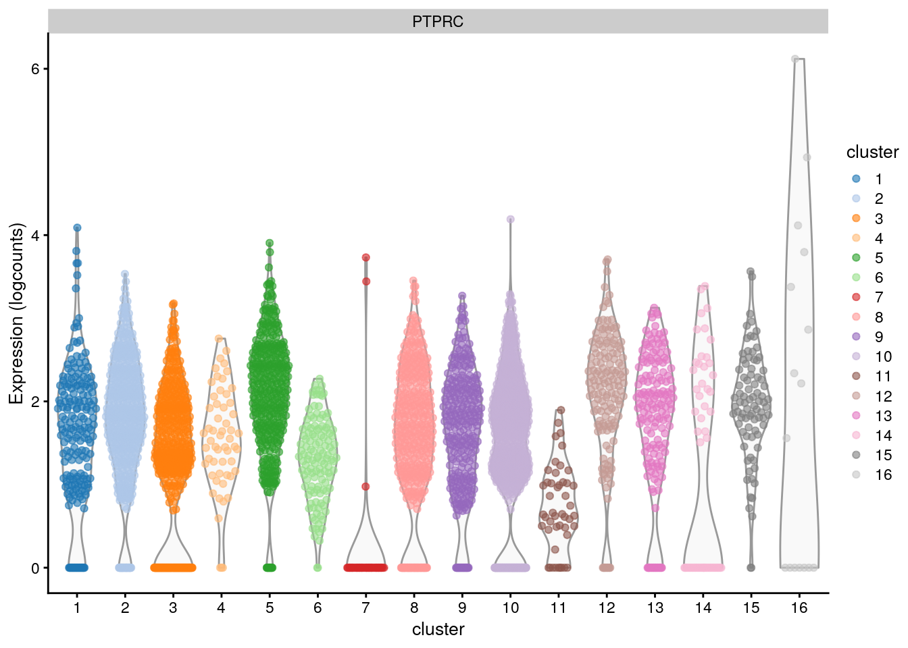
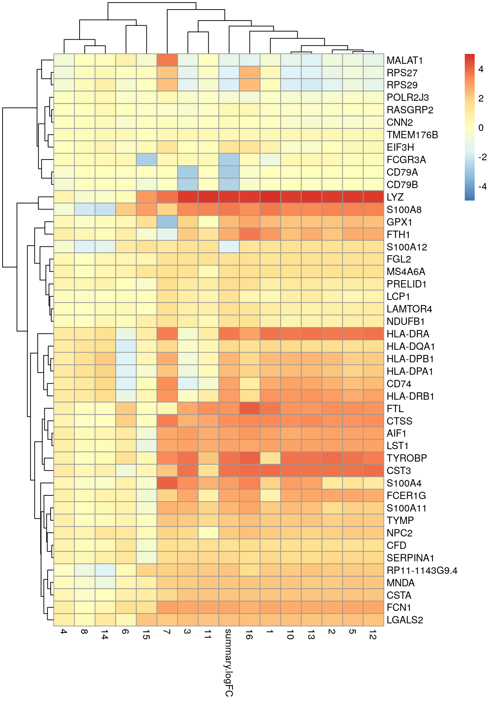

# Identificación de genes marcadores

Instructora: [**Yalbi I. Balderas-Martínez**](http://Yalbibalderas.github.io/).

## Diapositivas de Peter Hickey

Ver las diapositivas originales [aquí](https://docs.google.com/presentation/d/18NArqbfeo3Ujo8bcSJTWXirY8N4lEG-T_tFEqlI-uek/edit)

## Motivación 

* Ahora que hemos obtenido los clústeres, nos preguntamos, pero qué son? (e.g. ¿qué tipo celular es el clúster 1?)

* ¿Cuáles genes están dirigiendo el agrupamiento (e.g., ¿cuáles son los genes diferencialmente expresados entre los clústeres 1 y 2?)

* Idea: Mirar las diferencias en los perfiles de expresión de las células de los diferentes clústeres


## Dataset ilustrativo: PBMC4k 10X sin filtrar

### Descargar datos


```r
# Usemos datos de pbmc4k
library(BiocFileCache)
bfc <- BiocFileCache()
raw.path <- bfcrpath(bfc, file.path(
    "http://cf.10xgenomics.com/samples",
    "cell-exp/2.1.0/pbmc4k/pbmc4k_raw_gene_bc_matrices.tar.gz"
))
untar(raw.path, exdir = file.path(tempdir(), "pbmc4k"))

library(DropletUtils)
library(Matrix)
fname <- file.path(tempdir(), "pbmc4k/raw_gene_bc_matrices/GRCh38")
sce.pbmc <- read10xCounts(fname, col.names = TRUE)
```

Dataset "Células mononucleares humanas de sangre periférica" de 10X Genomics

Descripción [aquí](https://osca.bioconductor.org/unfiltered-human-pbmcs-10x-genomics.html) ^[Zheng, G. X. Y. et al. Massively parallel digital transcriptional profiling of single cells. Nat. Commun. 8, 14049 (2017).]

### Anotación


```r
# Anotación de los genes
library(scater)
rownames(sce.pbmc) <- uniquifyFeatureNames(
    rowData(sce.pbmc)$ID, rowData(sce.pbmc)$Symbol
)
library(EnsDb.Hsapiens.v86)
location <- mapIds(EnsDb.Hsapiens.v86,
    keys = rowData(sce.pbmc)$ID,
    column = "SEQNAME", keytype = "GENEID"
)

# Detección de _droplets_ con células
set.seed(100)
e.out <- emptyDrops(counts(sce.pbmc))
sce.pbmc <- sce.pbmc[, which(e.out$FDR <= 0.001)]
```

### Control de calidad


```r
# Control de calidad
stats <- perCellQCMetrics(sce.pbmc,
    subsets = list(Mito = which(location == "MT"))
)
high.mito <- isOutlier(stats$subsets_Mito_percent,
    type = "higher"
)
sce.pbmc <- sce.pbmc[, !high.mito]

# Normalización de los datos
library(scran)
set.seed(1000)
clusters <- quickCluster(sce.pbmc)
sce.pbmc <- computeSumFactors(sce.pbmc, cluster = clusters)
sce.pbmc <- logNormCounts(sce.pbmc)
```

### Genes variables


```r
## Identificación de genes altamente variables
set.seed(1001)
dec.pbmc <- modelGeneVarByPoisson(sce.pbmc)
top.pbmc <- getTopHVGs(dec.pbmc, prop = 0.1)
```

### Reducción de dimensiones


```r
## Reducción de dimensiones
set.seed(10000)
sce.pbmc <- denoisePCA(sce.pbmc,
    subset.row = top.pbmc,
    technical = dec.pbmc
)
set.seed(100000)
sce.pbmc <- runTSNE(sce.pbmc, dimred = "PCA")
set.seed(1000000)
sce.pbmc <- runUMAP(sce.pbmc, dimred = "PCA")
```

### Clustering


```r
# clustering
g <- buildSNNGraph(sce.pbmc, k = 10, use.dimred = "PCA")
clust <- igraph::cluster_walktrap(g)$membership
sce.pbmc$cluster <- factor(clust)
```

## Motivación - continuación

¿Algunos de estos genes están asociados con los resultados de _clustering_?


```r
# Is gene 1 associated with the clustering?
plotExpression(sce.pbmc,
    features = rownames(sce.pbmc)[1],
    x = "cluster", colour_by = "cluster"
)
```


```r
# Is gene 2 associated with the clustering?
plotExpression(sce.pbmc,
    features = rownames(sce.pbmc)[2],
    x = "cluster", colour_by = "cluster"
)
```


```r
# Is gene 2512 associated with the clustering?
plotExpression(sce.pbmc,
    features = rownames(sce.pbmc)[2512],
    x = "cluster", colour_by = "cluster"
)
```




```r
# Is gene CD3E associated with the clustering?
plotExpression(sce.pbmc,
    features = "CD3E",
    x = "cluster", colour_by = "cluster"
)
```


* Ver una gráfica como una forma de encontrar los genes marcadores obviamente no nos sirve a gran escala

* Necesitamos un método estadístico para identificar estos genes marcadores 

* 👉 La prueba t de Welch es una opción obvia para probar las diferencias en la expresión entre clústeres


## Prueba t modificada de Welch pareada

* ➕ Rápidas y buenas propiedades estadísticas para un gran número de células [(Soneson and Robinson, 2018)](https://www.ncbi.nlm.nih.gov/pubmed/29481549)

* ➕ Las comparaciones pareadas proveen un _log-fold change_ para indicar cuáles clústerse son distinguidos por cada gen 

* 🤔 ¿Por qué no comparar cada clúster con el promedio de todas las otras células?
  - Sensible a la composición poblacional, una subpoblación dominante sola que dirige la selección de los marcadores _top_ para cualquier otro clúster 


## Ejemplo ilustrativo: CD3E como gen marcador en el dataset PBMC4k 10X

### Pruebas pareadas


```r
plotExpression(sce.pbmc,
    features = "CD3E",
    x = "cluster", colour_by = "cluster"
)
```


<table class="table table-striped table-hover" style="font-size: 12px; width: auto !important; ">
 <thead>
  <tr>
   <th style="text-align:left;"> comparison </th>
   <th style="text-align:left;"> logFC </th>
   <th style="text-align:left;"> Pval </th>
  </tr>
 </thead>
<tbody>
  <tr>
   <td style="text-align:left;"> 1 vs 2 </td>
   <td style="text-align:left;"> 1.50 </td>
   <td style="text-align:left;"> 1.7e-198 </td>
  </tr>
  <tr>
   <td style="text-align:left;"> 1 vs 3 </td>
   <td style="text-align:left;"> -0.08 </td>
   <td style="text-align:left;"> 0.11 </td>
  </tr>
  <tr>
   <td style="text-align:left;"> ... </td>
   <td style="text-align:left;"> ... </td>
   <td style="text-align:left;"> ... </td>
  </tr>
  <tr>
   <td style="text-align:left;"> 2 vs 1 </td>
   <td style="text-align:left;"> 1.39 </td>
   <td style="text-align:left;"> 1.7e-198 </td>
  </tr>
  <tr>
   <td style="text-align:left;"> ... </td>
   <td style="text-align:left;"> ... </td>
   <td style="text-align:left;"> ... </td>
  </tr>
  <tr>
   <td style="text-align:left;"> 18 vs 17 </td>
   <td style="text-align:left;"> 0.11 </td>
   <td style="text-align:left;"> 0.46 </td>
  </tr>
</tbody>
</table>

* K = 18 clústeres
* K!/(K-2)! = 306 comparaciones
* La mitad de ellas son **redundantes**


### Combinando comparaciones del gen CD3E para el clúster 1

"Me interesa saber si el gen CD3 está diferencialmente expresado entre el clúster 1 y .."

- **cualquier** (**any**) otro clúster = P = 1.3 x 10<sup>-205</sup> (Simes adjusted P-value)
- **todos** (**all**) los otros clústeres = P = 0.11 (Berger's intersection-union test)
- **algunos** (**some**) de los otros clústeres = P = 2.0 x 10<sup>-44</sup> (mediana u otro cuantil, Holm-adjusted P-values)


#### Extendiendo a todos los genes


```r
scran::pairwiseTTests()
scran::combineMarkers()
```

- M = 33,694 genes
- 🤓 K x M = 10,310,364 pruebas
- Comparaciones involucrando clúster 1...
- Comparaciones involucrando clúster ...
- Comparaciones involucrando clúster 18


## Aplicación estándar

Para cada clúster, usar pruebas **t de Welch** para identificar los genes que están diferencialmente expresados entre éste y **cualquier** (**any**) otro clúster 


```r
# scran::findMarkers()
library(scran)
markers.pbmc <- findMarkers(sce.pbmc,
    groups = sce.pbmc$cluster,
    test.type = "t", pval.type = "any"
)
```

### Explorando los resultados


```r
chosen <- "9"
interesting <- markers.pbmc[[chosen]]
```


```r
plotExpression(sce.pbmc, rownames(interesting)[1:4],
    x = "cluster", colour_by = "cluster"
)
```


### Con un heatmap


```r
best.set <- interesting[interesting$Top <= 6, ]
logFCs <- as.matrix(best.set[, -(1:3)])
colnames(logFCs) <- sub("logFC.", "", colnames(logFCs))
library(pheatmap)
pheatmap(logFCs, breaks = seq(-5, 5, length.out = 101))
```



👉 Usamos el campo _Top_ para identificar un conjunto de genes que distinguen el clúster 9 de cualquier otro clúster


## Usando el _log-fold change_

### Sin espeficiar el lfc

Para cada clúster, usa pruebas t de Welch para identificar los genes que están sobreexpresados entre éste y **cualquier** otro clúster


```r
markers.pbmc.up <- findMarkers(sce.pbmc,
    groups = sce.pbmc$cluster,
    test.type = "t", direction = "up", pval.type = "any"
)
interesting.up <- markers.pbmc.up[[chosen]]
```

### Especificando el lfc

Para cada clúster, usa pruebas t de Welch para identificar los genes que están sobreexpresados con un log-fold change (lfc) o al menos 1 entre éste y **cualquier** otro clúster


```r
markers.pbmc.up2 <- findMarkers(sce.pbmc,
    groups = sce.pbmc$cluster,
    test.type = "t", direction = "up", lfc = 1, pval.type = "any"
)
interesting.up2 <- markers.pbmc.up2[[chosen]]
```

* 👉 La prueba t también nos permite especificar un _log-fold change_ diferente de cero como la hipótesis nula 
* 🤓 Es más riguroso que simplemente filtrar por _log-fold change_ [TREAT](https://www.ncbi.nlm.nih.gov/pmc/articles/PMC2654802/)


### Heatmap


```r
best.set <- interesting.up2[interesting.up2$Top <= 5, ]
logFCs <- as.matrix(best.set[, -(1:3)])
colnames(logFCs) <- sub("logFC.", "", colnames(logFCs))
pheatmap(logFCs, breaks = seq(-5, 5, length.out = 101))
```


* 👉 Los promedios están más centrados en un conjunto de genes marcadores candidatos que están sobreexpresados en el clúster 9 
* ⚠️ El incremento del rigor no se da sin costo 
* ⚠️ Si el _lfc_ es muy grande podría descartar genes útiles
	- E.g., un gen sobreexpresado en una proporción pequeña de células en un clúster sigue siendo un marcador efectivo si el foco está en la especificidad más que en la sensibilidad 
	

## Encontrando marcadores específicos de clústeres

* 👉 Por defecto, `scran::findMarkers()` dará un alto rango a genes que están DE en cualquier comparación pareada
* 🤔 Quiero genes que son específicos de cada clúster
* 👉 Tú quieres genes que son DE en todas las comparaciones pareadas


Para cada clúster, usa pruebas t de Welch para identificar genes que están sobreexpresados entre éste y **todos** los otros clústeres 


```r
markers.pbmc.up3 <- findMarkers(sce.pbmc,
    groups = sce.pbmc$cluster,
    direction = "up", pval.type = "all"
)
interesting.up3 <- markers.pbmc.up3[[chosen]]
```

🤓 Usa una prueba de unión-intersección para combinar los P-values que es el máximo P-value de todas las comparaciones pareadas 


### Pros/cons de los genes marcadores específicos de los clústeres

<table class="table table-striped table-hover" style="font-size: 12px; width: auto !important; ">
 <thead>
  <tr>
   <th style="text-align:left;"> Poblacion </th>
   <th style="text-align:left;"> Expresion_CD4 </th>
   <th style="text-align:left;"> Expresion_CD8 </th>
  </tr>
 </thead>
<tbody>
  <tr>
   <td style="text-align:left;"> DN(CD4-/CD8-) </td>
   <td style="text-align:left;"> No </td>
   <td style="text-align:left;"> No </td>
  </tr>
  <tr>
   <td style="text-align:left;"> CD4+&gt; </td>
   <td style="text-align:left;"> Si </td>
   <td style="text-align:left;"> No </td>
  </tr>
  <tr>
   <td style="text-align:left;"> CD8+&gt; </td>
   <td style="text-align:left;"> No </td>
   <td style="text-align:left;"> Si </td>
  </tr>
  <tr>
   <td style="text-align:left;"> DP(CD4+/CD8+) </td>
   <td style="text-align:left;"> Si </td>
   <td style="text-align:left;"> Si </td>
  </tr>
</tbody>
</table>

### findMarkers con pval.type some

Para cada clúster, usa pruebas t de Welch para identificar los genes que están sobreexpresados entre éste y **algunos** de los otros clústers 


```r
markers.pbmc.up4 <- findMarkers(sce.pbmc,
    groups = sce.pbmc$cluster,
    direction = "up", pval.type = "some"
)
interesting.up4 <- markers.pbmc.up4[[chosen]]
```

* 👉 Para cuando `pval.type="all"` es muy estricto todavía `pval.type="any"` es muy generoso
* 🤓 Aplica la corrección Holm-Bonferroni a los P-values y toma el mejor valor de en medio como el P-value combinado
* ⚠️ Perderás algunas garantías ofrecidas por los otros métodos 


## Pruebas alternas

### Motivación

La prueba t no es la única forma de comparar dos grupos de mediciones

* 🤔 Quiero una prueba que pueda ser usada perfectamente para distinguir dos clústeres uno del otro
- 👉 Prueba de rangos Wilcoxon

* 🤔 Quiero identificar genes que son expresados más frecuentemente en un clúster que en otro
- 👉 Prueba Binomial


## Prueba de rangos de Wilcoxon

Evalúa directamente la separación entre la distribución de la expresión de los diferentes clústeres

* 🤓 Es proporcional al área bajo la curva (AUC), que es la probabilidad de que una célula al azar de un clúster tenga mayor que expresión que una célula al azar de otro clúster

* 👉 AUCs de 1 o 0 indican que los dos clústeres tienen distribuciones de expresión separadas 

* 🤓 También se conoce como prueba Wilcoxon-Mann-Whitney (WMW)


### findMarkers para Wilcoxon
Para cada clúster, usa la prueba de rangos de Wilcoxon para identificar genes que están sobreexpresados entre éste y **cualquier** otro clúster 


```r
markers.pbmc.wmw <- findMarkers(sce.pbmc,
    groups = sce.pbmc$cluster, test.type = "wilcox",
    direction = "up", pval.type = "any"
)
interesting.wmw <- markers.pbmc.wmw[[chosen]]
```

### Heatmap de genes marcadores con Wilcoxon


```r
best.set <- interesting.wmw[interesting.wmw$Top <= 5, ]
AUCs <- as.matrix(best.set[, -(1:3)])
colnames(AUCs) <- sub("AUC.", "", colnames(AUCs))
pheatmap(AUCs,
    breaks = seq(0, 1, length.out = 21),
    color = viridis::viridis(21)
)
```


### Resumen de la prueba de rangos de Wilcoxon

* ➕ Ofrece directamente la propiedad deseable de un gen marcador (i.e. que el gen distinga perfectamente entre dos clústeres)
* ➕ Es simétrico con respecto a las diferencias en el tamaño de los grupos comparados
* ➖ Es mucho más lento comparado con la prueba t (aunque esto en general no es un problema en la práctica)


## Prueba binomial

* Es una prueba que identifica los genes que difieren en la proporción de células que se expresan entre clústeres 
* Una definición mucho más estricta de genes marcadores 

* 🤓 Convierte la expresión en una medida binaria de presencia/ausencia, por lo que toda la información cuantitativa es ignorada 
- Desde una perspectiva práctica, puede ser más fácil para validar 


### findMarkers para binomial

Para cada clúster, usa la prueba Binomial para identificar genes que están más frecuentemente expresados (sobreexpresados) en comparación con cualquier otro clúster 


```r
markers.pbmc.binom <- findMarkers(sce.pbmc,
    groups = sce.pbmc$cluster, test.type = "binom",
    direction = "up", pval.type = "any"
)
interesting.binom <- markers.pbmc.binom[[chosen]]
```

* 🤓 El efecto en el tamaño se reporta como el _log-fold change_ en la proporción de las células que se expresan entre clústeres 
* 👉 _Log-fold changes_ grandes positivos, indican que el gen está más frecuentemente expresado en un clúster comparado con otro

### Visualizando genes marcadores de la prueba bionomial


```r
top.genes <- head(rownames(interesting.binom))
plotExpression(sce.pbmc, x = "cluster", features = top.genes)
```


### Resumen de la prueba binomial

* La prueba Binomial no toma en cuenta la normalización

* ➕ Produce genes marcadores que pueden ser más fáciles de validar

* ➖ Ser más estricto puede llevar a la pérdida de buenos marcadores candidatos  


## Métodos de expresión diferencial personalizados

* 🤔 ¿Por qué no usar edgeR/DESeq2/limma-voom u otros métodos personalizados (e.g., MAST)?
* 👉 Claro que puedes! [Checa OSCA](https://osca.bioconductor.org/marker-detection.html#using-custom-de-methods)

* 👉 Pero éstos son tal vez algo exagerados para identificar genes marcadores
* 🤓 Las células son nuestras "réplicas" para el propósito de identificar genes marcadores
* 🤓 edgeR/DESeq2/limma-voom hacen asunciones más fuertes acerca de los datos que es más probable que no se cumplan para células individuales en scRNA-seq


## Problemas estadísticos


### Invalidez de P-values

Todas las estrategias de DE para detectar genes marcadores entre clústeres son estadísticamente defectuosas de alguna manera

* 🤓 "Dragado de datos": El análisis DE se realiza usando los mismos datos usados para obtener los clústeres 

* 👉 Las pruebas para genes DE entre clústeres producirá inevitablemente algunos resultados significativos y así es como los clústeres serán definidos!

* 👉 Aún cuando los P-values son defectuosos, el efecto no es muy dañino para la detección de genes ya que los P-values solo son usados para los rangos

* 🤓 No se pueden usar P-values para definir "diferencias significativas" entre los clústeres con respecto a un umbral de la tasa de error 


### Naturaleza de la replicación

👉 Idealmente, validar algunos de los marcadores con una población de células independientes (y idealmente usando una técnica diferente, e.g., hibridación fluorescente _in situ_ o qPCR)


### Comentarios adicionales

* 👉 La estrategia de análisis DE es que los marcadores son definidos relativo a subpoblaciones en el mismo dataset 
* 👉 Si un gen se expresa uniformemente a través de la población no servirá como un marcador
- e.g., los marcadores de las células T no serán detectados si solamente hay células T en los datos
- usualmente no es un problema, ya que tenemos idea de las células que se capturaron
* 👉 Existen métodos de machine learning para hacer la identificación de los genes marcadores, pero la humilde prueba t sigue siendo muy buena


## Resumen y recomendaciones

* 👉 Crea múltiples listas de genes marcadores con diferentes niveles de rigor
* 👉 La forma más simple de interpretar los genes marcadores es que son los sobreexpresados de "forma única", o son "genes específicos de clústeres", especialmente si queremos imponer un _log-fold change_ mínimo
* 👉 Puedes requerir hacer una identificación de genes marcadores más enfocada, e.g., subset de los datos de solo 2 clústeres de interés y entonces correr `scran::findMarkers()`


## Detalles de la sesión de R


```r
## Información de la sesión de R
Sys.time()
```

```
## [1] "2021-08-12 01:50:14 UTC"
```

```r
proc.time()
```

```
##    user  system elapsed 
## 370.384   5.226 372.436
```

```r
options(width = 120)
sessioninfo::session_info()
```

```
## ─ Session info ───────────────────────────────────────────────────────────────────────────────────────────────────────
##  setting  value                       
##  version  R version 4.1.0 (2021-05-18)
##  os       Ubuntu 20.04.2 LTS          
##  system   x86_64, linux-gnu           
##  ui       X11                         
##  language (EN)                        
##  collate  en_US.UTF-8                 
##  ctype    en_US.UTF-8                 
##  tz       UTC                         
##  date     2021-08-12                  
## 
## ─ Packages ───────────────────────────────────────────────────────────────────────────────────────────────────────────
##  package              * version  date       lib source        
##  AnnotationDbi        * 1.54.1   2021-06-08 [1] Bioconductor  
##  AnnotationFilter     * 1.16.0   2021-05-19 [1] Bioconductor  
##  assertthat             0.2.1    2019-03-21 [1] RSPM (R 4.1.0)
##  beachmat               2.8.0    2021-05-19 [1] Bioconductor  
##  beeswarm               0.4.0    2021-06-01 [1] RSPM (R 4.1.0)
##  Biobase              * 2.52.0   2021-05-19 [1] Bioconductor  
##  BiocFileCache        * 2.0.0    2021-05-19 [1] Bioconductor  
##  BiocGenerics         * 0.38.0   2021-05-19 [1] Bioconductor  
##  BiocIO                 1.2.0    2021-05-19 [1] Bioconductor  
##  BiocNeighbors          1.10.0   2021-05-19 [1] Bioconductor  
##  BiocParallel           1.26.1   2021-07-04 [1] Bioconductor  
##  BiocSingular           1.8.1    2021-06-08 [1] Bioconductor  
##  biomaRt                2.48.2   2021-07-01 [1] Bioconductor  
##  Biostrings             2.60.2   2021-08-05 [1] Bioconductor  
##  bit                    4.0.4    2020-08-04 [1] RSPM (R 4.1.0)
##  bit64                  4.0.5    2020-08-30 [1] RSPM (R 4.1.0)
##  bitops                 1.0-7    2021-04-24 [1] RSPM (R 4.1.0)
##  blob                   1.2.2    2021-07-23 [1] RSPM (R 4.1.0)
##  bluster                1.2.1    2021-05-27 [1] Bioconductor  
##  bookdown               0.22     2021-04-22 [1] RSPM (R 4.1.0)
##  bslib                  0.2.5.1  2021-05-18 [1] RSPM (R 4.1.0)
##  cachem                 1.0.5    2021-05-15 [2] RSPM (R 4.1.0)
##  cli                    3.0.1    2021-07-17 [2] RSPM (R 4.1.0)
##  cluster                2.1.2    2021-04-17 [3] CRAN (R 4.1.0)
##  colorspace             2.0-2    2021-06-24 [1] RSPM (R 4.1.0)
##  cowplot                1.1.1    2020-12-30 [1] RSPM (R 4.1.0)
##  crayon                 1.4.1    2021-02-08 [2] RSPM (R 4.1.0)
##  curl                   4.3.2    2021-06-23 [2] RSPM (R 4.1.0)
##  DBI                    1.1.1    2021-01-15 [1] RSPM (R 4.1.0)
##  dbplyr               * 2.1.1    2021-04-06 [1] RSPM (R 4.1.0)
##  DelayedArray           0.18.0   2021-05-19 [1] Bioconductor  
##  DelayedMatrixStats     1.14.2   2021-08-08 [1] Bioconductor  
##  digest                 0.6.27   2020-10-24 [2] RSPM (R 4.1.0)
##  dplyr                  1.0.7    2021-06-18 [1] RSPM (R 4.1.0)
##  dqrng                  0.3.0    2021-05-01 [1] RSPM (R 4.1.0)
##  DropletUtils         * 1.12.2   2021-07-22 [1] Bioconductor  
##  edgeR                  3.34.0   2021-05-19 [1] Bioconductor  
##  ellipsis               0.3.2    2021-04-29 [2] RSPM (R 4.1.0)
##  EnsDb.Hsapiens.v86   * 2.99.0   2021-07-29 [1] Bioconductor  
##  ensembldb            * 2.16.4   2021-08-05 [1] Bioconductor  
##  evaluate               0.14     2019-05-28 [2] RSPM (R 4.1.0)
##  fansi                  0.5.0    2021-05-25 [2] RSPM (R 4.1.0)
##  farver                 2.1.0    2021-02-28 [1] RSPM (R 4.1.0)
##  fastmap                1.1.0    2021-01-25 [2] RSPM (R 4.1.0)
##  filelock               1.0.2    2018-10-05 [1] RSPM (R 4.1.0)
##  FNN                    1.1.3    2019-02-15 [1] RSPM (R 4.1.0)
##  generics               0.1.0    2020-10-31 [1] RSPM (R 4.1.0)
##  GenomeInfoDb         * 1.28.1   2021-07-01 [1] Bioconductor  
##  GenomeInfoDbData       1.2.6    2021-07-29 [1] Bioconductor  
##  GenomicAlignments      1.28.0   2021-05-19 [1] Bioconductor  
##  GenomicFeatures      * 1.44.0   2021-05-19 [1] Bioconductor  
##  GenomicRanges        * 1.44.0   2021-05-19 [1] Bioconductor  
##  ggbeeswarm             0.6.0    2017-08-07 [1] RSPM (R 4.1.0)
##  ggplot2              * 3.3.5    2021-06-25 [1] RSPM (R 4.1.0)
##  glue                   1.4.2    2020-08-27 [2] RSPM (R 4.1.0)
##  gridExtra              2.3      2017-09-09 [1] RSPM (R 4.1.0)
##  gtable                 0.3.0    2019-03-25 [1] RSPM (R 4.1.0)
##  HDF5Array              1.20.0   2021-05-19 [1] Bioconductor  
##  highr                  0.9      2021-04-16 [2] RSPM (R 4.1.0)
##  hms                    1.1.0    2021-05-17 [1] RSPM (R 4.1.0)
##  htmltools              0.5.1.1  2021-01-22 [1] RSPM (R 4.1.0)
##  httr                   1.4.2    2020-07-20 [2] RSPM (R 4.1.0)
##  igraph                 1.2.6    2020-10-06 [1] RSPM (R 4.1.0)
##  IRanges              * 2.26.0   2021-05-19 [1] Bioconductor  
##  irlba                  2.3.3    2019-02-05 [1] RSPM (R 4.1.0)
##  jquerylib              0.1.4    2021-04-26 [1] RSPM (R 4.1.0)
##  jsonlite               1.7.2    2020-12-09 [2] RSPM (R 4.1.0)
##  kableExtra           * 1.3.4    2021-02-20 [1] RSPM (R 4.1.0)
##  KEGGREST               1.32.0   2021-05-19 [1] Bioconductor  
##  knitr                  1.33     2021-04-24 [2] RSPM (R 4.1.0)
##  labeling               0.4.2    2020-10-20 [1] RSPM (R 4.1.0)
##  lattice                0.20-44  2021-05-02 [3] CRAN (R 4.1.0)
##  lazyeval               0.2.2    2019-03-15 [1] RSPM (R 4.1.0)
##  lifecycle              1.0.0    2021-02-15 [2] RSPM (R 4.1.0)
##  limma                  3.48.3   2021-08-10 [1] Bioconductor  
##  locfit                 1.5-9.4  2020-03-25 [1] RSPM (R 4.1.0)
##  magrittr               2.0.1    2020-11-17 [2] RSPM (R 4.1.0)
##  Matrix               * 1.3-4    2021-06-01 [3] RSPM (R 4.1.0)
##  MatrixGenerics       * 1.4.2    2021-08-08 [1] Bioconductor  
##  matrixStats          * 0.60.0   2021-07-26 [1] RSPM (R 4.1.0)
##  memoise                2.0.0    2021-01-26 [2] RSPM (R 4.1.0)
##  metapod                1.0.0    2021-05-19 [1] Bioconductor  
##  munsell                0.5.0    2018-06-12 [1] RSPM (R 4.1.0)
##  pheatmap             * 1.0.12   2019-01-04 [1] RSPM (R 4.1.0)
##  pillar                 1.6.2    2021-07-29 [2] RSPM (R 4.1.0)
##  pkgconfig              2.0.3    2019-09-22 [2] RSPM (R 4.1.0)
##  png                    0.1-7    2013-12-03 [1] RSPM (R 4.1.0)
##  prettyunits            1.1.1    2020-01-24 [2] RSPM (R 4.1.0)
##  progress               1.2.2    2019-05-16 [1] RSPM (R 4.1.0)
##  ProtGenerics           1.24.0   2021-05-19 [1] Bioconductor  
##  purrr                  0.3.4    2020-04-17 [2] RSPM (R 4.1.0)
##  R.methodsS3            1.8.1    2020-08-26 [1] RSPM (R 4.1.0)
##  R.oo                   1.24.0   2020-08-26 [1] RSPM (R 4.1.0)
##  R.utils                2.10.1   2020-08-26 [1] RSPM (R 4.1.0)
##  R6                     2.5.0    2020-10-28 [2] RSPM (R 4.1.0)
##  rappdirs               0.3.3    2021-01-31 [2] RSPM (R 4.1.0)
##  RColorBrewer           1.1-2    2014-12-07 [1] RSPM (R 4.1.0)
##  Rcpp                   1.0.7    2021-07-07 [2] RSPM (R 4.1.0)
##  RCurl                  1.98-1.3 2021-03-16 [1] RSPM (R 4.1.0)
##  restfulr               0.0.13   2017-08-06 [1] RSPM (R 4.1.0)
##  rhdf5                  2.36.0   2021-05-19 [1] Bioconductor  
##  rhdf5filters           1.4.0    2021-05-19 [1] Bioconductor  
##  Rhdf5lib               1.14.2   2021-07-06 [1] Bioconductor  
##  rjson                  0.2.20   2018-06-08 [1] RSPM (R 4.1.0)
##  rlang                  0.4.11   2021-04-30 [2] RSPM (R 4.1.0)
##  rmarkdown              2.10     2021-08-06 [1] RSPM (R 4.1.0)
##  Rsamtools              2.8.0    2021-05-19 [1] Bioconductor  
##  RSpectra               0.16-0   2019-12-01 [1] RSPM (R 4.1.0)
##  RSQLite                2.2.7    2021-04-22 [1] RSPM (R 4.1.0)
##  rstudioapi             0.13     2020-11-12 [2] RSPM (R 4.1.0)
##  rsvd                   1.0.5    2021-04-16 [1] RSPM (R 4.1.0)
##  rtracklayer            1.52.0   2021-05-19 [1] Bioconductor  
##  Rtsne                  0.15     2018-11-10 [1] RSPM (R 4.1.0)
##  rvest                  1.0.1    2021-07-26 [1] RSPM (R 4.1.0)
##  S4Vectors            * 0.30.0   2021-05-19 [1] Bioconductor  
##  sass                   0.4.0    2021-05-12 [1] RSPM (R 4.1.0)
##  ScaledMatrix           1.0.0    2021-05-19 [1] Bioconductor  
##  scales                 1.1.1    2020-05-11 [1] RSPM (R 4.1.0)
##  scater               * 1.20.1   2021-06-15 [1] Bioconductor  
##  scran                * 1.20.1   2021-05-24 [1] Bioconductor  
##  scuttle              * 1.2.1    2021-08-05 [1] Bioconductor  
##  sessioninfo            1.1.1    2018-11-05 [2] RSPM (R 4.1.0)
##  SingleCellExperiment * 1.14.1   2021-05-21 [1] Bioconductor  
##  sparseMatrixStats      1.4.2    2021-08-08 [1] Bioconductor  
##  statmod                1.4.36   2021-05-10 [1] RSPM (R 4.1.0)
##  stringi                1.7.3    2021-07-16 [2] RSPM (R 4.1.0)
##  stringr                1.4.0    2019-02-10 [2] RSPM (R 4.1.0)
##  SummarizedExperiment * 1.22.0   2021-05-19 [1] Bioconductor  
##  svglite                2.0.0    2021-02-20 [1] RSPM (R 4.1.0)
##  systemfonts            1.0.2    2021-05-11 [1] RSPM (R 4.1.0)
##  tibble                 3.1.3    2021-07-23 [2] RSPM (R 4.1.0)
##  tidyselect             1.1.1    2021-04-30 [1] RSPM (R 4.1.0)
##  utf8                   1.2.2    2021-07-24 [2] RSPM (R 4.1.0)
##  uwot                   0.1.10   2020-12-15 [1] RSPM (R 4.1.0)
##  vctrs                  0.3.8    2021-04-29 [2] RSPM (R 4.1.0)
##  vipor                  0.4.5    2017-03-22 [1] RSPM (R 4.1.0)
##  viridis                0.6.1    2021-05-11 [1] RSPM (R 4.1.0)
##  viridisLite            0.4.0    2021-04-13 [1] RSPM (R 4.1.0)
##  webshot                0.5.2    2019-11-22 [1] RSPM (R 4.1.0)
##  withr                  2.4.2    2021-04-18 [2] RSPM (R 4.1.0)
##  xfun                   0.25     2021-08-06 [2] RSPM (R 4.1.0)
##  XML                    3.99-0.6 2021-03-16 [1] RSPM (R 4.1.0)
##  xml2                   1.3.2    2020-04-23 [2] RSPM (R 4.1.0)
##  XVector                0.32.0   2021-05-19 [1] Bioconductor  
##  yaml                   2.2.1    2020-02-01 [2] RSPM (R 4.1.0)
##  zlibbioc               1.38.0   2021-05-19 [1] Bioconductor  
## 
## [1] /__w/_temp/Library
## [2] /usr/local/lib/R/site-library
## [3] /usr/local/lib/R/library
```

## Patrocinadores {-}

Agradecemos a nuestros patrocinadores:

<a href="https://comunidadbioinfo.github.io/es/post/cs_and_s_event_fund_award/#.YJH-wbVKj8A"></a>

<a href="https://www.r-consortium.org/"></a>
