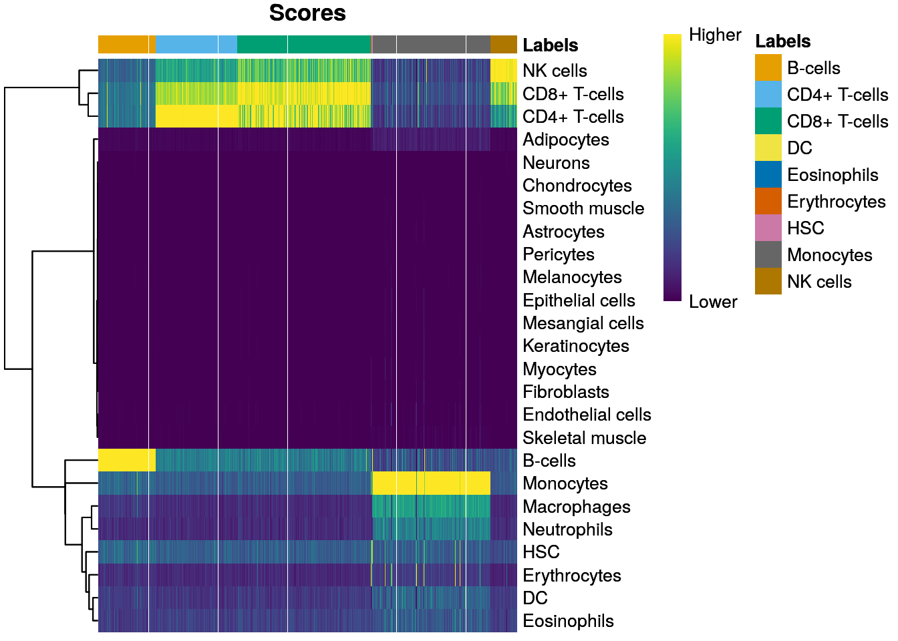
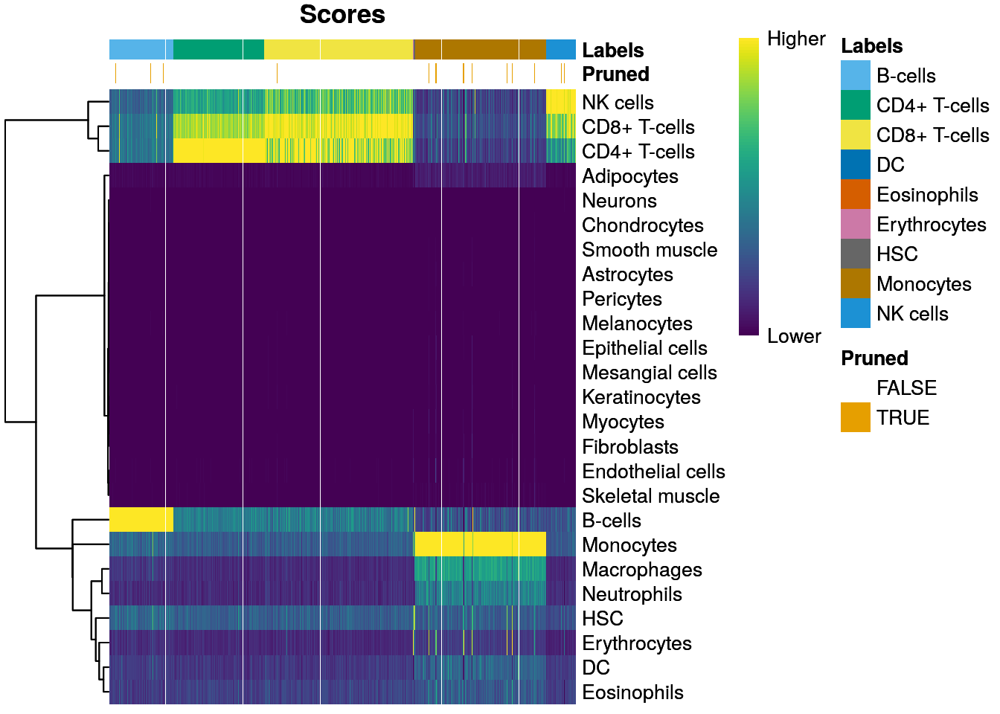
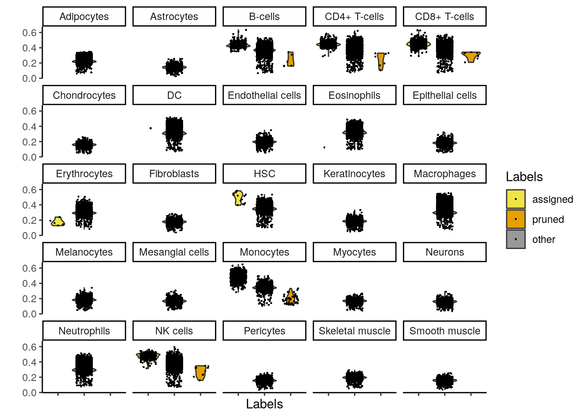
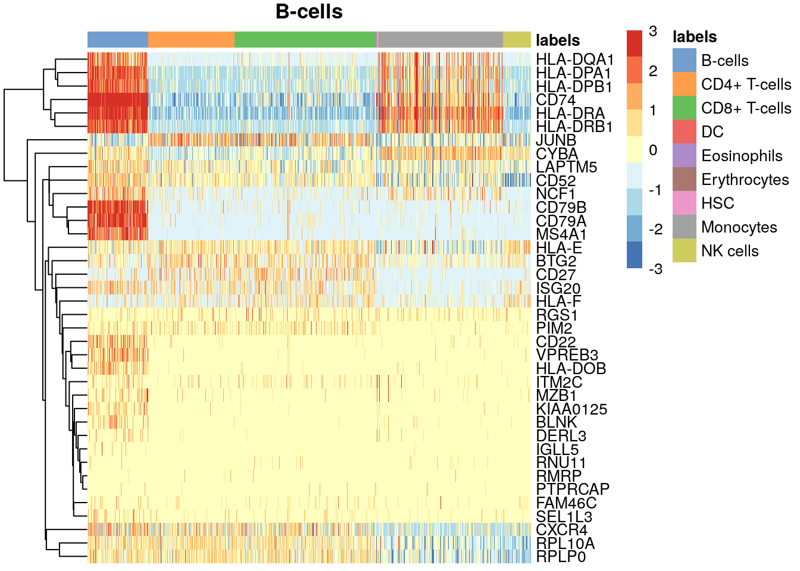
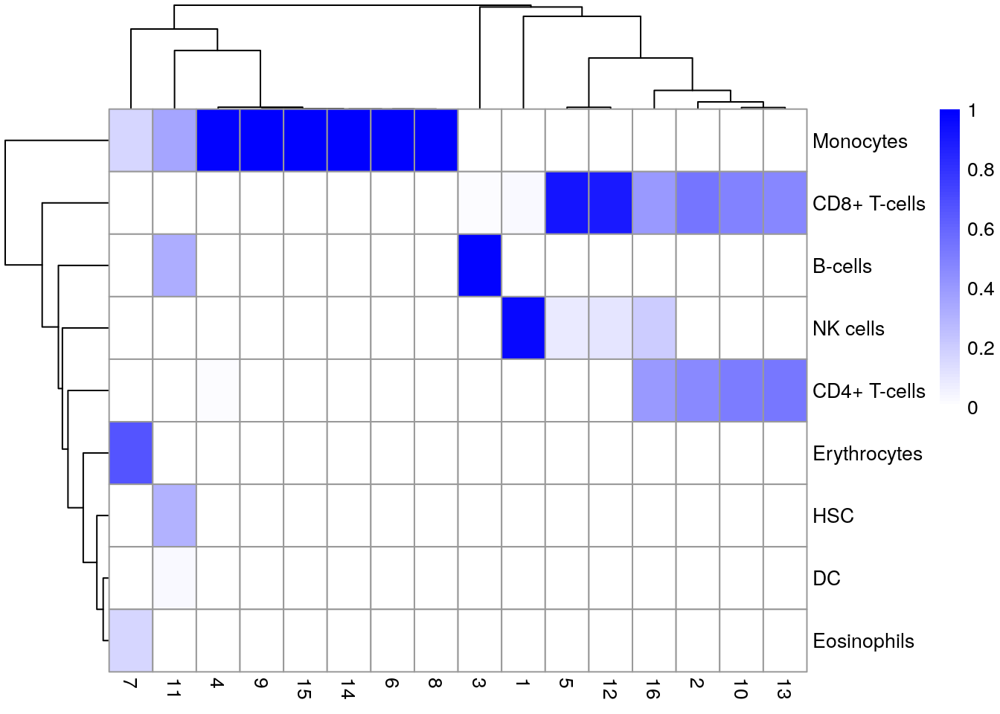
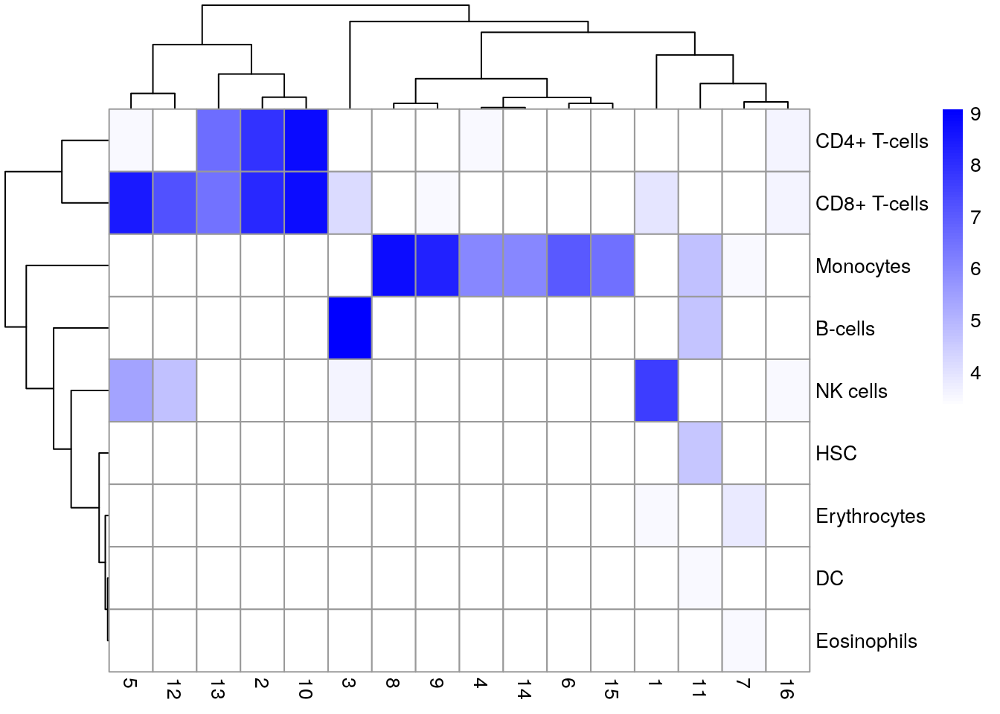
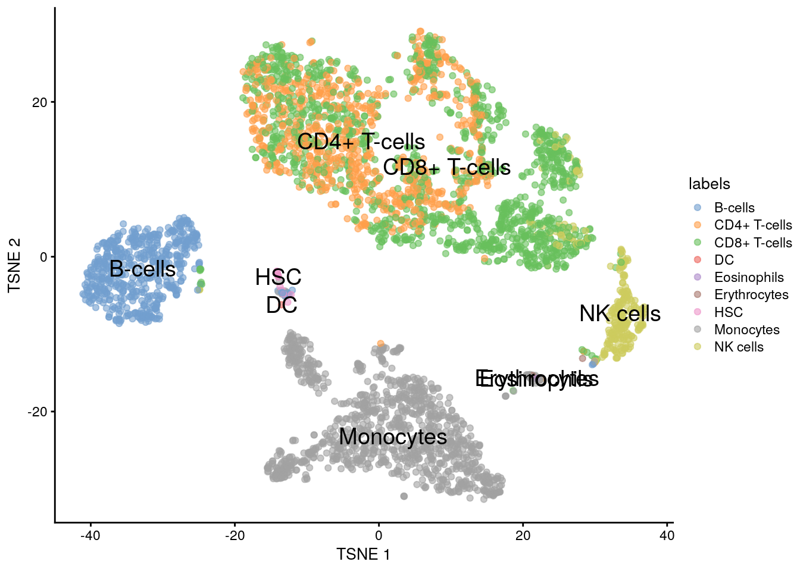

# Anotación de clusters de células

Instructora: [**Yalbi I. Balderas-Martínez**](http://Yalbibalderas.github.io/).

## Diapositivas de Peter Hickey

Ver las diapositivas originales [aquí](https://docs.google.com/presentation/d/1CW-7FjL34kIKVEoZ2L_RVdXoEKQVzRbEuFUDVGJqnXI/edit)

## Motivación

* Ahora estamos a punto de obtener la interpretación biológica de los resultados 
* Esta es la tarea más retadora en los análisis de datos scRNA-seq


* 👉 La obtención de clústeres es más o menos directa
* 🤔 ¿Cuál es el estado biológico que está representado por cada uno de los clústeres?

* 👉 Necesitamos hacer un puente entre el _gap_ del dataset actual y el conocimiento biológico a priori (no siempre está disponible en una forma consistente y cualitativa)

* 🤔 ¿Qué es un tipo celular?
* 🔬 "Lo sabré cuando lo vea"
* 💻 "No"

Aplicaremos varios métodos computacionales que explotan la información _a priori_ para asignar el significado a un dataset no caracterizado de scRNA-seq.

Algunas fuentes de información _a priori_

- Conjuntos de genes curados (e.g. Gene Ontology)
- Perfiles de expresión de bases de datos publicadas de referencia
- Los datos raros que tú hayas escondido en tu cerebro
- Google

## Dataset ilustrativo: PBMC4k 10X sin filtrar


```r
# Usemos datos de pbmc4k
library(BiocFileCache)
bfc <- BiocFileCache()
raw.path <- bfcrpath(bfc, file.path(
    "http://cf.10xgenomics.com/samples",
    "cell-exp/2.1.0/pbmc4k/pbmc4k_raw_gene_bc_matrices.tar.gz"
))
untar(raw.path, exdir = file.path(tempdir(), "pbmc4k"))

library(DropletUtils)
library(Matrix)
fname <- file.path(tempdir(), "pbmc4k/raw_gene_bc_matrices/GRCh38")
sce.pbmc <- read10xCounts(fname, col.names = TRUE)
```


Dataset "Células mononucleares humanas de sangre periférica" de 10X Genomics

Descripción [aquí](https://osca.bioconductor.org/unfiltered-human-pbmcs-10x-genomics.html) ^[Zheng, G. X. Y. et al. Massively parallel digital transcriptional profiling of single cells. Nat. Commun. 8, 14049 (2017).]

### Anotación


```r
# Anotación de los genes
library(scater)
rownames(sce.pbmc) <- uniquifyFeatureNames(
    rowData(sce.pbmc)$ID, rowData(sce.pbmc)$Symbol
)
library(EnsDb.Hsapiens.v86)
location <- mapIds(EnsDb.Hsapiens.v86,
    keys = rowData(sce.pbmc)$ID,
    column = "SEQNAME", keytype = "GENEID"
)

# Detección de _droplets_ con células
set.seed(100)
e.out <- emptyDrops(counts(sce.pbmc))
sce.pbmc <- sce.pbmc[, which(e.out$FDR <= 0.001)]
```

### Control de calidad


```r
# Control de calidad
stats <- perCellQCMetrics(sce.pbmc,
    subsets = list(Mito = which(location == "MT"))
)
high.mito <- isOutlier(stats$subsets_Mito_percent,
    type = "higher"
)
sce.pbmc <- sce.pbmc[, !high.mito]

# Normalización de los datos
library(scran)
set.seed(1000)
clusters <- quickCluster(sce.pbmc)
sce.pbmc <- computeSumFactors(sce.pbmc, cluster = clusters)
sce.pbmc <- logNormCounts(sce.pbmc)
```

### Genes variables


```r
## Identificación de genes altamente variables
set.seed(1001)
dec.pbmc <- modelGeneVarByPoisson(sce.pbmc)
top.pbmc <- getTopHVGs(dec.pbmc, prop = 0.1)
```

### Reducción de dimensiones


```r
## Reducción de dimensiones
set.seed(10000)
sce.pbmc <- denoisePCA(sce.pbmc,
    subset.row = top.pbmc,
    technical = dec.pbmc
)
set.seed(100000)
sce.pbmc <- runTSNE(sce.pbmc, dimred = "PCA")
set.seed(1000000)
sce.pbmc <- runUMAP(sce.pbmc, dimred = "PCA")
```

### Clustering


```r
# clustering
g <- buildSNNGraph(sce.pbmc, k = 10, use.dimred = "PCA")
clust <- igraph::cluster_walktrap(g)$membership
sce.pbmc$cluster <- factor(clust)
```

## Asignando las etiquetas celulares a partir de los datos de referencia

### Visión general

* 👉 Un enfoque directo es comparar los perfiles de expresión single-cell con datasets previamente anotados
* 👉 Las etiquetas pueden entonces ser asignadas a cada célula en nuestro dataset no caracterizado de prueba basado en la muestra de referencia más similar, por dar alguna definición de "similar"


* 👉 Cualquier dataset de expresión génica etiquetado (microarreglos, RNA-seq bulk, scRNA-seq) puede ser usado como una referencia
* ⚠️ Sin embargo, su confiabilidad depende enormemente en la calidad de los datos originales y la experiencia de los autores originales quienes asignaron las etiquetas en primer lugar


* 👉 Asignar las etiquetas a un dataset de "prueba" a partir de un dataset de "entrenamiento" (referencia), es un problema estándar en estadística / _machine learning_
* 👉 Usaremos el método [SingleR (Aran et al. 2019)](https://bioconductor.org/packages/release/bioc/html/SingleR.html)


## SingleR

* 🤓 Asigna las etiquetas a las células basado en las muestras de referencia con las correlaciones de rangos más altas de Spearman
* 🤓 Para reducir el ruido, identifica genes marcadores entre pares de etiquetas (en la referencia) y calcula la correlación usando solamente esos marcadores 
* 🤓 Hace algún tipo de tuneado fino, repitiendo las correlaciones solamente con los genes marcadores de las etiquetas con el mejor score, ayudando a resolver cualquier ambigüedad entre esas etiquetas al eliminar el ruido a partir de marcadores irrelevantes para otras etiquetas


### SingleR incluye varias referencias

[Ver referencias](https://bioconductor.org/packages/3.11/bioc/vignettes/SingleR/inst/doc/SingleR.html#5_available_references)


```r
# Human
SingleR::BlueprintEncodeData()
SingleR::DatabaseImmuneCellExpressionData()
SingleR::HumanPrimaryCellAtlasData()
SingleR::MonacoImmuneData()
SingleR::NovershternHematopoieticData()

# Mice
SingleR::ImmGenData()
SingleR::MouseRNASeqData()
```


### Usando las referencias


```r
# if needed install celldex
# create directory? y
library(celldex)
ref <- celldex::BlueprintEncodeData()
```

❓ ¿Qué tipos celulares están disponibles en este dataset de referencia? 


### Usando las referencias integradas


```r
library(SingleR)
pred <- SingleR(
    test = sce.pbmc, ref = ref,
    labels = ref$label.main
)
```

* ❓ ¿Qué etiquetas han sido asignadas a los datos single-cell?
* ❓ ¿Cómo usaríamos las etiquetas "finas" con SingleR?




* 👉 Inspeccionamos los resultados usando un heatmap de los scores por célula y por etiqueta
* 👉 Idealmente, cada célula debería exhibir un score alto en una etiqueta relativa a todas las otras
* 👉 Los scores se muestran antes de cualquier tuneado fino y son normalizadas a [0, 1] dentro de cada célula


### Podado de etiquetas (Label pruning)


```r
total_pruned <- sum(is.na(pred$pruned.labels))
plotScoreHeatmap(pred, show.pruned = TRUE)
```



* 👉 SingleR intentará podar aquellas asignaciones de baja calidad marcándolas como NA
* 🤓 El podado se hace calculando la diferencia del score de la etiqueta asignada a partir del score de la mediana dentro de cada célula y entonces podando las células con un valor pequeño de esta diferencia


```r
plotScoreDistribution(pred)
```



👉 Distribución de las diferencias del score de la etiqueta asignada a partir del score de la mediana dentro de cada célula


### Identificando los genes con anotación dirigida

* 🤔 ¿Por qué las células en este clúster se etiquetan como el tipo celular X?
* 👉 Examina la expresión de los genes marcadores para cada etiqueta en el dataset de prueba
* 👉 Si una célula en el dataset de prueba está asignado con confianza a una etiqueta en particular, uno esperaría que tenga una fuerte expresión de los marcadores de esa etiqueta (al menos sobreexpresión con respecto a las células asignadas a otras etiquetas)


```r
# install gmp, ClusterR, mbkmeans dependencies if needed
sce.pbmc$labels <- pred$labels
all.markers <- metadata(pred)$de.genes
lab <- "B-cells"
# Get top-10 marker genes for B-cells compared to each other cell
# type
top.markers <- Reduce(union, sapply(all.markers[[lab]], head, 10))

plotHeatmap(sce.pbmc,
    order_columns_by = "labels",
    features = top.markers, center = TRUE, zlim = c(-3, 3), main = lab
)
```



❓ Toma otro tipo celular e identifica los genes que dirigen la anotación


### Comparando las etiquetas con los clústeres


```r
tab <- table(Assigned = pred$pruned.labels, Cluster = sce.pbmc$cluster)

library(pheatmap)
# Proportion of cells in each cluster assigned to each label
pheatmap(prop.table(tab, margin = 2),
    color = colorRampPalette(c("white", "blue"))(101)
)
```



```r
# (log-)number of cells in each cluster assigned to each label
# Adding a pseudo-count of 10 to avoid strong color jumps with just
# 1 cell.
pheatmap(log2(tab + 10),
    color = colorRampPalette(c("white", "blue"))(101)
)
```



### Voilà


```r
plotTSNE(sce.pbmc, colour_by = "labels", text_by = "labels")
```




## Resumen de la anotación basada en una referencia (e.g., SingleR)

* ➕ Se centra en aspectos de los datos que se sabe son interesantes, simplifica el proceso de la interpretación biológica 
* ➖ Está restringido por la diversidad y la resolución de las etiquetas disponibles en el dataset de referencia
* 👉 Se pueden suplir referencias personalizadas a SingleR


## Asignando las etiquetas de tipos celulares a partir de marcadores

* 🤔 ¿Cómo podemos hacer uso de nuestros genes marcadores agrupados?
* 🥉 Revisarlos en hojas de cálculo 
* 🥈 Observar heatmaps
* 🥇 Realizar un gene set enrichment analysis


### Gene set enrichment analysis

* 👉 Identifica las rutas y procesos que están (relativamente) activos en cada clúster basado en la sobreexpresión de los genes asociados en comparación con otros clústeres
* ➕ Un método confiable para determinar si las rutas están sobre- o sub- expresadas entre clúesteres 
* ➕ Existen un montón de herramientas para gene set enrichment analysis
* ➖ Todas las conclusiones son relativas a otros clústeres, haciéndolo más difícil para determinar la identidad celular si alguno no está presente en el mismo estudio [más info](https://osca.bioconductor.org/cell-type-annotation.html#assigning-cluster-labels-from-markers)

### Calculando las actividades de los conjuntos de genes

* 👉 Calcular el promedio de la expresión en log en todos los genes, en un conjunto de genes para cada célula y examinar los clústeres con valores altos (_gene set activities_)
* 👉 Se necesita proveer de conjuntos de genes 
* ➖ No todos los genes en el conjunto pueden exhibir el mismo patrón de diferencia y los genes no-DE añadirán ruido, "diluyendo" la fuerza de cualquiera de las diferencias comparadas a un análisis que se centra directamente en genes DE 
* 👉 Es más una visualización útil que la base para cualquier análisis estadístico real [más info](https://osca.bioconductor.org/cell-type-annotation.html#computing-gene-set-activities)


## Resumen y recomendaciones

* 👉 La anotación de tipos celulares "automática", como SingleR, es mejor cuando funciona (i.e. cuando hay un dataset de referencia apropiado)
* 👉 Usualmente necesitaremos usar un método manual, como aquellos basados en agrupar los genes marcadores  (e.g., gene set enrichment analysis)
* 👉 La anotación del tipo celular ofrecerá una reconsideración inmediata de los parámetros del agrupamiento y/o algunos retoques manuales a los clústeres 

## Detalles de la sesión de R


```r
## Información de la sesión de R
Sys.time()
```

```
## [1] "2021-08-10 17:57:08 UTC"
```

```r
proc.time()
```

```
##    user  system elapsed 
## 183.256   4.014 186.551
```

```r
options(width = 120)
sessioninfo::session_info()
```

```
## ─ Session info ───────────────────────────────────────────────────────────────────────────────────────────────────────
##  setting  value                       
##  version  R version 4.1.0 (2021-05-18)
##  os       Ubuntu 20.04.2 LTS          
##  system   x86_64, linux-gnu           
##  ui       X11                         
##  language (EN)                        
##  collate  en_US.UTF-8                 
##  ctype    en_US.UTF-8                 
##  tz       UTC                         
##  date     2021-08-10                  
## 
## ─ Packages ───────────────────────────────────────────────────────────────────────────────────────────────────────────
##  package                * version  date       lib source        
##  AnnotationDbi          * 1.54.1   2021-06-08 [1] Bioconductor  
##  AnnotationFilter       * 1.16.0   2021-05-19 [1] Bioconductor  
##  AnnotationHub            3.0.1    2021-06-20 [1] Bioconductor  
##  assertthat               0.2.1    2019-03-21 [1] RSPM (R 4.1.0)
##  beachmat                 2.8.0    2021-05-19 [1] Bioconductor  
##  beeswarm                 0.4.0    2021-06-01 [1] RSPM (R 4.1.0)
##  Biobase                * 2.52.0   2021-05-19 [1] Bioconductor  
##  BiocFileCache          * 2.0.0    2021-05-19 [1] Bioconductor  
##  BiocGenerics           * 0.38.0   2021-05-19 [1] Bioconductor  
##  BiocIO                   1.2.0    2021-05-19 [1] Bioconductor  
##  BiocManager              1.30.16  2021-06-15 [1] RSPM (R 4.1.0)
##  BiocNeighbors            1.10.0   2021-05-19 [1] Bioconductor  
##  BiocParallel             1.26.1   2021-07-04 [1] Bioconductor  
##  BiocSingular             1.8.1    2021-06-08 [1] Bioconductor  
##  BiocVersion              3.13.1   2021-03-19 [2] Bioconductor  
##  biomaRt                  2.48.2   2021-07-01 [1] Bioconductor  
##  Biostrings               2.60.2   2021-08-05 [1] Bioconductor  
##  bit                      4.0.4    2020-08-04 [1] RSPM (R 4.1.0)
##  bit64                    4.0.5    2020-08-30 [1] RSPM (R 4.1.0)
##  bitops                   1.0-7    2021-04-24 [1] RSPM (R 4.1.0)
##  blob                     1.2.2    2021-07-23 [1] RSPM (R 4.1.0)
##  bluster                  1.2.1    2021-05-27 [1] Bioconductor  
##  bookdown                 0.22     2021-04-22 [1] RSPM (R 4.1.0)
##  bslib                    0.2.5.1  2021-05-18 [1] RSPM (R 4.1.0)
##  cachem                   1.0.5    2021-05-15 [2] RSPM (R 4.1.0)
##  celldex                * 1.2.0    2021-05-20 [1] Bioconductor  
##  cli                      3.0.1    2021-07-17 [2] RSPM (R 4.1.0)
##  cluster                  2.1.2    2021-04-17 [3] CRAN (R 4.1.0)
##  colorspace               2.0-2    2021-06-24 [1] RSPM (R 4.1.0)
##  cowplot                  1.1.1    2020-12-30 [1] RSPM (R 4.1.0)
##  crayon                   1.4.1    2021-02-08 [2] RSPM (R 4.1.0)
##  curl                     4.3.2    2021-06-23 [2] RSPM (R 4.1.0)
##  DBI                      1.1.1    2021-01-15 [1] RSPM (R 4.1.0)
##  dbplyr                 * 2.1.1    2021-04-06 [1] RSPM (R 4.1.0)
##  DelayedArray             0.18.0   2021-05-19 [1] Bioconductor  
##  DelayedMatrixStats       1.14.2   2021-08-08 [1] Bioconductor  
##  digest                   0.6.27   2020-10-24 [2] RSPM (R 4.1.0)
##  dplyr                    1.0.7    2021-06-18 [1] RSPM (R 4.1.0)
##  dqrng                    0.3.0    2021-05-01 [1] RSPM (R 4.1.0)
##  DropletUtils           * 1.12.2   2021-07-22 [1] Bioconductor  
##  edgeR                    3.34.0   2021-05-19 [1] Bioconductor  
##  ellipsis                 0.3.2    2021-04-29 [2] RSPM (R 4.1.0)
##  EnsDb.Hsapiens.v86     * 2.99.0   2021-07-29 [1] Bioconductor  
##  ensembldb              * 2.16.4   2021-08-05 [1] Bioconductor  
##  evaluate                 0.14     2019-05-28 [2] RSPM (R 4.1.0)
##  ExperimentHub            2.0.0    2021-05-19 [1] Bioconductor  
##  fansi                    0.5.0    2021-05-25 [2] RSPM (R 4.1.0)
##  farver                   2.1.0    2021-02-28 [1] RSPM (R 4.1.0)
##  fastmap                  1.1.0    2021-01-25 [2] RSPM (R 4.1.0)
##  filelock                 1.0.2    2018-10-05 [1] RSPM (R 4.1.0)
##  FNN                      1.1.3    2019-02-15 [1] RSPM (R 4.1.0)
##  generics                 0.1.0    2020-10-31 [1] RSPM (R 4.1.0)
##  GenomeInfoDb           * 1.28.1   2021-07-01 [1] Bioconductor  
##  GenomeInfoDbData         1.2.6    2021-07-29 [1] Bioconductor  
##  GenomicAlignments        1.28.0   2021-05-19 [1] Bioconductor  
##  GenomicFeatures        * 1.44.0   2021-05-19 [1] Bioconductor  
##  GenomicRanges          * 1.44.0   2021-05-19 [1] Bioconductor  
##  ggbeeswarm               0.6.0    2017-08-07 [1] RSPM (R 4.1.0)
##  ggplot2                * 3.3.5    2021-06-25 [1] RSPM (R 4.1.0)
##  glue                     1.4.2    2020-08-27 [2] RSPM (R 4.1.0)
##  gridExtra                2.3      2017-09-09 [1] RSPM (R 4.1.0)
##  gtable                   0.3.0    2019-03-25 [1] RSPM (R 4.1.0)
##  HDF5Array                1.20.0   2021-05-19 [1] Bioconductor  
##  highr                    0.9      2021-04-16 [2] RSPM (R 4.1.0)
##  hms                      1.1.0    2021-05-17 [1] RSPM (R 4.1.0)
##  htmltools                0.5.1.1  2021-01-22 [1] RSPM (R 4.1.0)
##  httpuv                   1.6.1    2021-05-07 [1] RSPM (R 4.1.0)
##  httr                     1.4.2    2020-07-20 [2] RSPM (R 4.1.0)
##  igraph                   1.2.6    2020-10-06 [1] RSPM (R 4.1.0)
##  interactiveDisplayBase   1.30.0   2021-05-19 [1] Bioconductor  
##  IRanges                * 2.26.0   2021-05-19 [1] Bioconductor  
##  irlba                    2.3.3    2019-02-05 [1] RSPM (R 4.1.0)
##  jquerylib                0.1.4    2021-04-26 [1] RSPM (R 4.1.0)
##  jsonlite                 1.7.2    2020-12-09 [2] RSPM (R 4.1.0)
##  KEGGREST                 1.32.0   2021-05-19 [1] Bioconductor  
##  knitr                    1.33     2021-04-24 [2] RSPM (R 4.1.0)
##  labeling                 0.4.2    2020-10-20 [1] RSPM (R 4.1.0)
##  later                    1.2.0    2021-04-23 [1] RSPM (R 4.1.0)
##  lattice                  0.20-44  2021-05-02 [3] CRAN (R 4.1.0)
##  lazyeval                 0.2.2    2019-03-15 [1] RSPM (R 4.1.0)
##  lifecycle                1.0.0    2021-02-15 [2] RSPM (R 4.1.0)
##  limma                    3.48.2   2021-08-08 [1] Bioconductor  
##  locfit                   1.5-9.4  2020-03-25 [1] RSPM (R 4.1.0)
##  magrittr                 2.0.1    2020-11-17 [2] RSPM (R 4.1.0)
##  Matrix                 * 1.3-4    2021-06-01 [3] RSPM (R 4.1.0)
##  MatrixGenerics         * 1.4.2    2021-08-08 [1] Bioconductor  
##  matrixStats            * 0.60.0   2021-07-26 [1] RSPM (R 4.1.0)
##  memoise                  2.0.0    2021-01-26 [2] RSPM (R 4.1.0)
##  metapod                  1.0.0    2021-05-19 [1] Bioconductor  
##  mime                     0.11     2021-06-23 [2] RSPM (R 4.1.0)
##  munsell                  0.5.0    2018-06-12 [1] RSPM (R 4.1.0)
##  pheatmap               * 1.0.12   2019-01-04 [1] RSPM (R 4.1.0)
##  pillar                   1.6.2    2021-07-29 [2] RSPM (R 4.1.0)
##  pkgconfig                2.0.3    2019-09-22 [2] RSPM (R 4.1.0)
##  png                      0.1-7    2013-12-03 [1] RSPM (R 4.1.0)
##  prettyunits              1.1.1    2020-01-24 [2] RSPM (R 4.1.0)
##  progress                 1.2.2    2019-05-16 [1] RSPM (R 4.1.0)
##  promises                 1.2.0.1  2021-02-11 [1] RSPM (R 4.1.0)
##  ProtGenerics             1.24.0   2021-05-19 [1] Bioconductor  
##  purrr                    0.3.4    2020-04-17 [2] RSPM (R 4.1.0)
##  R.methodsS3              1.8.1    2020-08-26 [1] RSPM (R 4.1.0)
##  R.oo                     1.24.0   2020-08-26 [1] RSPM (R 4.1.0)
##  R.utils                  2.10.1   2020-08-26 [1] RSPM (R 4.1.0)
##  R6                       2.5.0    2020-10-28 [2] RSPM (R 4.1.0)
##  rappdirs                 0.3.3    2021-01-31 [2] RSPM (R 4.1.0)
##  RColorBrewer             1.1-2    2014-12-07 [1] RSPM (R 4.1.0)
##  Rcpp                     1.0.7    2021-07-07 [2] RSPM (R 4.1.0)
##  RCurl                    1.98-1.3 2021-03-16 [1] RSPM (R 4.1.0)
##  restfulr                 0.0.13   2017-08-06 [1] RSPM (R 4.1.0)
##  rhdf5                    2.36.0   2021-05-19 [1] Bioconductor  
##  rhdf5filters             1.4.0    2021-05-19 [1] Bioconductor  
##  Rhdf5lib                 1.14.2   2021-07-06 [1] Bioconductor  
##  rjson                    0.2.20   2018-06-08 [1] RSPM (R 4.1.0)
##  rlang                    0.4.11   2021-04-30 [2] RSPM (R 4.1.0)
##  rmarkdown                2.10     2021-08-06 [1] RSPM (R 4.1.0)
##  Rsamtools                2.8.0    2021-05-19 [1] Bioconductor  
##  RSpectra                 0.16-0   2019-12-01 [1] RSPM (R 4.1.0)
##  RSQLite                  2.2.7    2021-04-22 [1] RSPM (R 4.1.0)
##  rsvd                     1.0.5    2021-04-16 [1] RSPM (R 4.1.0)
##  rtracklayer              1.52.0   2021-05-19 [1] Bioconductor  
##  Rtsne                    0.15     2018-11-10 [1] RSPM (R 4.1.0)
##  S4Vectors              * 0.30.0   2021-05-19 [1] Bioconductor  
##  sass                     0.4.0    2021-05-12 [1] RSPM (R 4.1.0)
##  ScaledMatrix             1.0.0    2021-05-19 [1] Bioconductor  
##  scales                   1.1.1    2020-05-11 [1] RSPM (R 4.1.0)
##  scater                 * 1.20.1   2021-06-15 [1] Bioconductor  
##  scran                  * 1.20.1   2021-05-24 [1] Bioconductor  
##  scuttle                * 1.2.1    2021-08-05 [1] Bioconductor  
##  sessioninfo              1.1.1    2018-11-05 [2] RSPM (R 4.1.0)
##  shiny                    1.6.0    2021-01-25 [1] RSPM (R 4.1.0)
##  SingleCellExperiment   * 1.14.1   2021-05-21 [1] Bioconductor  
##  SingleR                * 1.6.1    2021-05-20 [1] Bioconductor  
##  sparseMatrixStats        1.4.2    2021-08-08 [1] Bioconductor  
##  statmod                  1.4.36   2021-05-10 [1] RSPM (R 4.1.0)
##  stringi                  1.7.3    2021-07-16 [2] RSPM (R 4.1.0)
##  stringr                  1.4.0    2019-02-10 [2] RSPM (R 4.1.0)
##  SummarizedExperiment   * 1.22.0   2021-05-19 [1] Bioconductor  
##  tibble                   3.1.3    2021-07-23 [2] RSPM (R 4.1.0)
##  tidyselect               1.1.1    2021-04-30 [1] RSPM (R 4.1.0)
##  utf8                     1.2.2    2021-07-24 [2] RSPM (R 4.1.0)
##  uwot                     0.1.10   2020-12-15 [1] RSPM (R 4.1.0)
##  vctrs                    0.3.8    2021-04-29 [2] RSPM (R 4.1.0)
##  vipor                    0.4.5    2017-03-22 [1] RSPM (R 4.1.0)
##  viridis                  0.6.1    2021-05-11 [1] RSPM (R 4.1.0)
##  viridisLite              0.4.0    2021-04-13 [1] RSPM (R 4.1.0)
##  withr                    2.4.2    2021-04-18 [2] RSPM (R 4.1.0)
##  xfun                     0.25     2021-08-06 [2] RSPM (R 4.1.0)
##  XML                      3.99-0.6 2021-03-16 [1] RSPM (R 4.1.0)
##  xml2                     1.3.2    2020-04-23 [2] RSPM (R 4.1.0)
##  xtable                   1.8-4    2019-04-21 [1] RSPM (R 4.1.0)
##  XVector                  0.32.0   2021-05-19 [1] Bioconductor  
##  yaml                     2.2.1    2020-02-01 [2] RSPM (R 4.1.0)
##  zlibbioc                 1.38.0   2021-05-19 [1] Bioconductor  
## 
## [1] /__w/_temp/Library
## [2] /usr/local/lib/R/site-library
## [3] /usr/local/lib/R/library
```

## Patrocinadores {-}

Agradecemos a nuestros patrocinadores:

<a href="https://comunidadbioinfo.github.io/es/post/cs_and_s_event_fund_award/#.YJH-wbVKj8A"></a>

<a href="https://www.r-consortium.org/"></a>
