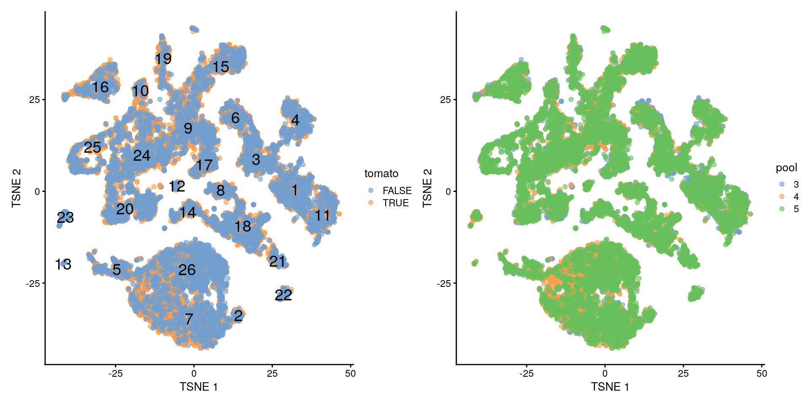
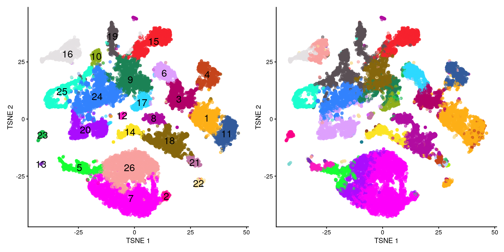
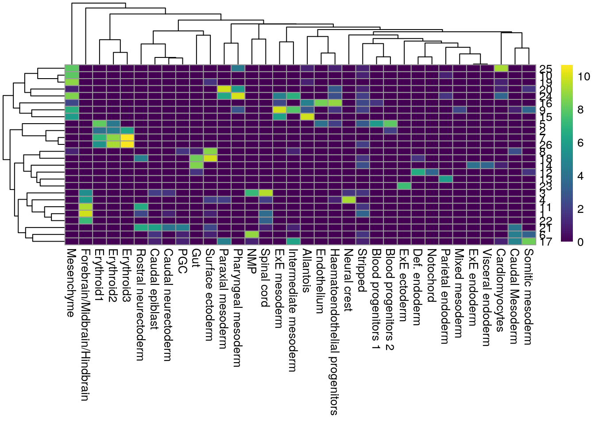
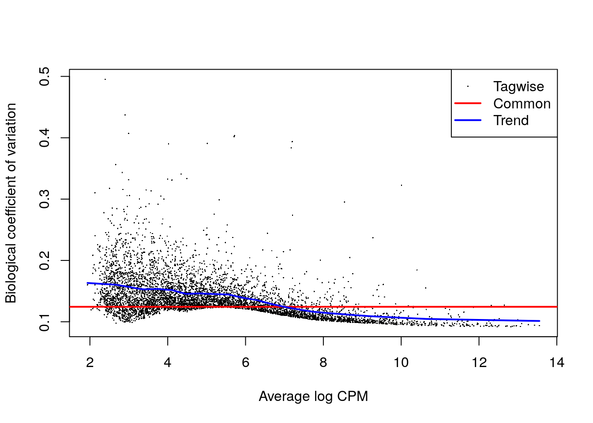
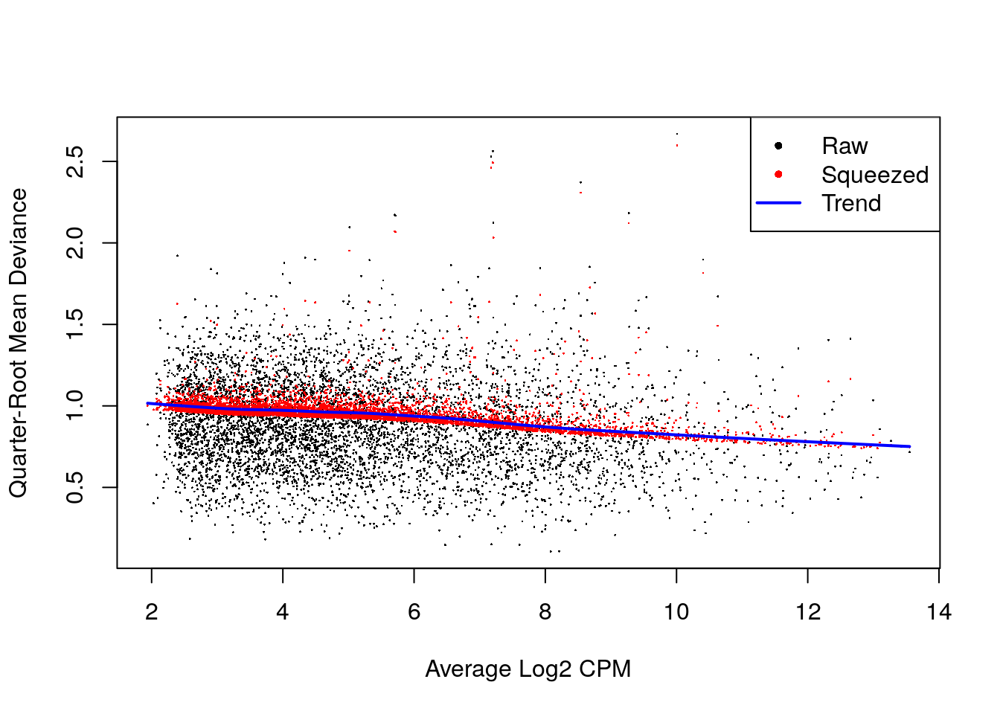
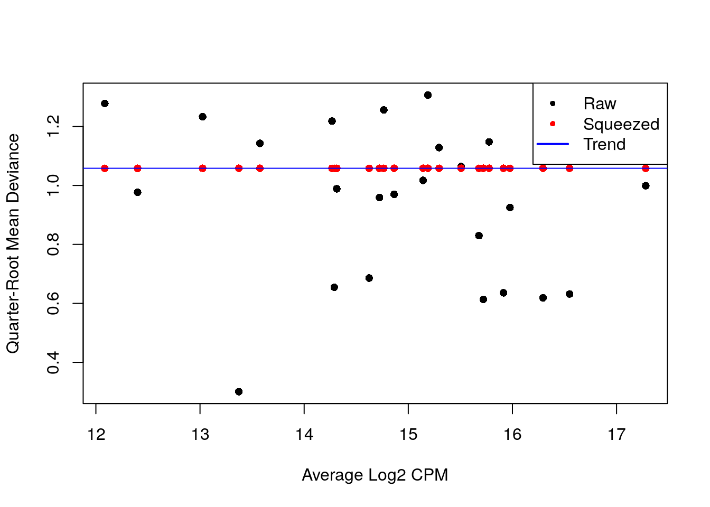

# Análisis de expresión diferencial

Instructor: [Leonardo Collado Torres](https://comunidadbioinfo.github.io/es/authors/lcollado/)


```r
## Paquetes de este capítulo
library("MouseGastrulationData") ## para descargar datos de ejemplo
library("scater") ## para gráficas y control de calidad
library("scran") ## para selección de genes, clustering, etc
library("batchelor") ## para métodos de correción de batch (lote)
library("patchwork") ## para agrupar gráficas
library("Polychrome") ## para muchos colores
library("bluster") ## métodos de clustering
library("edgeR") ## para expresión diferencial
```

## Diapositivas de Peter Hickey

Ve las diapositivas [aquí](https://docs.google.com/presentation/d/1CRTE_1m8YHf8p6GMl-rbBpyOx2KS4UxdTC1dpvVgKEs/edit?usp=sharing)

Esas diapositivas están basadas en este [capítulo de OSCA](https://bioconductor.org/books/release/OSCA/multi-sample-comparisons.html).

## Datos de ejemplo


```r
#--- loading ---#
library("MouseGastrulationData")
sce.chimera <- WTChimeraData(samples=5:10)
```

```
## snapshotDate(): 2021-05-18
```

```
## see ?MouseGastrulationData and browseVignettes('MouseGastrulationData') for documentation
```

```
## downloading 1 resources
```

```
## retrieving 1 resource
```

```
## loading from cache
```

```
## see ?MouseGastrulationData and browseVignettes('MouseGastrulationData') for documentation
```

```
## downloading 1 resources
```

```
## retrieving 1 resource
```

```
## loading from cache
```

```
## see ?MouseGastrulationData and browseVignettes('MouseGastrulationData') for documentation
```

```
## downloading 1 resources
```

```
## retrieving 1 resource
```

```
## loading from cache
```

```
## see ?MouseGastrulationData and browseVignettes('MouseGastrulationData') for documentation
```

```
## downloading 1 resources
```

```
## retrieving 1 resource
```

```
## loading from cache
```

```
## see ?MouseGastrulationData and browseVignettes('MouseGastrulationData') for documentation
```

```
## downloading 1 resources
```

```
## retrieving 1 resource
```

```
## loading from cache
```

```
## see ?MouseGastrulationData and browseVignettes('MouseGastrulationData') for documentation
```

```
## downloading 1 resources
```

```
## retrieving 1 resource
```

```
## loading from cache
```

```
## see ?MouseGastrulationData and browseVignettes('MouseGastrulationData') for documentation
```

```
## downloading 1 resources
```

```
## retrieving 1 resource
```

```
## loading from cache
```

```
## see ?MouseGastrulationData and browseVignettes('MouseGastrulationData') for documentation
```

```
## downloading 1 resources
```

```
## retrieving 1 resource
```

```
## loading from cache
```

```
## see ?MouseGastrulationData and browseVignettes('MouseGastrulationData') for documentation
```

```
## downloading 1 resources
```

```
## retrieving 1 resource
```

```
## loading from cache
```

```
## see ?MouseGastrulationData and browseVignettes('MouseGastrulationData') for documentation
```

```
## downloading 1 resources
```

```
## retrieving 1 resource
```

```
## loading from cache
```

```
## see ?MouseGastrulationData and browseVignettes('MouseGastrulationData') for documentation
```

```
## downloading 1 resources
```

```
## retrieving 1 resource
```

```
## loading from cache
```

```
## see ?MouseGastrulationData and browseVignettes('MouseGastrulationData') for documentation
```

```
## downloading 1 resources
```

```
## retrieving 1 resource
```

```
## loading from cache
```

```
## see ?MouseGastrulationData and browseVignettes('MouseGastrulationData') for documentation
```

```
## downloading 1 resources
```

```
## retrieving 1 resource
```

```
## loading from cache
```

```
## see ?MouseGastrulationData and browseVignettes('MouseGastrulationData') for documentation
```

```
## downloading 1 resources
```

```
## retrieving 1 resource
```

```
## loading from cache
```

```
## see ?MouseGastrulationData and browseVignettes('MouseGastrulationData') for documentation
```

```
## downloading 1 resources
```

```
## retrieving 1 resource
```

```
## loading from cache
```

```
## see ?MouseGastrulationData and browseVignettes('MouseGastrulationData') for documentation
```

```
## downloading 1 resources
```

```
## retrieving 1 resource
```

```
## loading from cache
```

```
## see ?MouseGastrulationData and browseVignettes('MouseGastrulationData') for documentation
```

```
## downloading 1 resources
```

```
## retrieving 1 resource
```

```
## loading from cache
```

```
## see ?MouseGastrulationData and browseVignettes('MouseGastrulationData') for documentation
```

```
## downloading 1 resources
```

```
## retrieving 1 resource
```

```
## loading from cache
```

```
## see ?MouseGastrulationData and browseVignettes('MouseGastrulationData') for documentation
```

```
## downloading 1 resources
```

```
## retrieving 1 resource
```

```
## loading from cache
```

```
## see ?MouseGastrulationData and browseVignettes('MouseGastrulationData') for documentation
```

```
## downloading 1 resources
```

```
## retrieving 1 resource
```

```
## loading from cache
```

```
## see ?MouseGastrulationData and browseVignettes('MouseGastrulationData') for documentation
```

```
## downloading 1 resources
```

```
## retrieving 1 resource
```

```
## loading from cache
```

```
## see ?MouseGastrulationData and browseVignettes('MouseGastrulationData') for documentation
```

```
## downloading 1 resources
```

```
## retrieving 1 resource
```

```
## loading from cache
```

```
## see ?MouseGastrulationData and browseVignettes('MouseGastrulationData') for documentation
```

```
## downloading 1 resources
```

```
## retrieving 1 resource
```

```
## loading from cache
```

```
## see ?MouseGastrulationData and browseVignettes('MouseGastrulationData') for documentation
```

```
## downloading 1 resources
```

```
## retrieving 1 resource
```

```
## loading from cache
```

```
## see ?MouseGastrulationData and browseVignettes('MouseGastrulationData') for documentation
```

```
## downloading 1 resources
```

```
## retrieving 1 resource
```

```
## loading from cache
```

```r
sce.chimera
```

```
## class: SingleCellExperiment 
## dim: 29453 20935 
## metadata(0):
## assays(1): counts
## rownames(29453): ENSMUSG00000051951 ENSMUSG00000089699 ...
##   ENSMUSG00000095742 tomato-td
## rowData names(2): ENSEMBL SYMBOL
## colnames(20935): cell_9769 cell_9770 ... cell_30702 cell_30703
## colData names(11): cell barcode ... doub.density sizeFactor
## reducedDimNames(2): pca.corrected.E7.5 pca.corrected.E8.5
## mainExpName: NULL
## altExpNames(0):
```

```r
#--- feature-annotation ---#
library("scater")
rownames(sce.chimera) <- uniquifyFeatureNames(
    rowData(sce.chimera)$ENSEMBL, rowData(sce.chimera)$SYMBOL)

#--- quality-control ---#
drop <- sce.chimera$celltype.mapped %in% c("stripped", "Doublet")
sce.chimera <- sce.chimera[,!drop]

#--- normalization ---#
sce.chimera <- logNormCounts(sce.chimera)

#--- variance-modelling ---#
library("scran")
dec.chimera <- modelGeneVar(sce.chimera, block=sce.chimera$sample)
chosen.hvgs <- dec.chimera$bio > 0

#--- merging ---#
library("batchelor")
set.seed(01001001)
merged <- correctExperiments(sce.chimera, 
    batch=sce.chimera$sample, 
    subset.row=chosen.hvgs,
    PARAM=FastMnnParam(
        merge.order=list(
            list(1,3,5), # WT (3 replicates)
            list(2,4,6)  # td-Tomato (3 replicates)
        )
    )
)

#--- clustering ---#
g <- buildSNNGraph(merged, use.dimred="corrected")
clusters <- igraph::cluster_louvain(g)
colLabels(merged) <- factor(clusters$membership)

#--- dimensionality-reduction ---#
merged <- runTSNE(merged, dimred="corrected", external_neighbors=TRUE)
merged <- runUMAP(merged, dimred="corrected", external_neighbors=TRUE)
```

### Exploremos los datos de ejemplo


```r
merged
```

```
## class: SingleCellExperiment 
## dim: 14699 19426 
## metadata(2): merge.info pca.info
## assays(3): reconstructed counts logcounts
## rownames(14699): Xkr4 Rp1 ... Vmn2r122 CAAA01147332.1
## rowData names(3): rotation ENSEMBL SYMBOL
## colnames(19426): cell_9769 cell_9770 ... cell_30701 cell_30702
## colData names(13): batch cell ... sizeFactor label
## reducedDimNames(5): corrected pca.corrected.E7.5 pca.corrected.E8.5
##   TSNE UMAP
## mainExpName: NULL
## altExpNames(0):
```

```r
colData(merged)
```

```
## DataFrame with 19426 rows and 13 columns
##                  batch        cell          barcode    sample       stage
##            <character> <character>      <character> <integer> <character>
## cell_9769            5   cell_9769 AAACCTGAGACTGTAA         5        E8.5
## cell_9770            5   cell_9770 AAACCTGAGATGCCTT         5        E8.5
## cell_9771            5   cell_9771 AAACCTGAGCAGCCTC         5        E8.5
## cell_9772            5   cell_9772 AAACCTGCATACTCTT         5        E8.5
## cell_9773            5   cell_9773 AAACGGGTCAACACCA         5        E8.5
## ...                ...         ...              ...       ...         ...
## cell_30698          10  cell_30698 TTTGTCACAGCTCGAC        10        E8.5
## cell_30699          10  cell_30699 TTTGTCACAGCTCGCA        10        E8.5
## cell_30700          10  cell_30700 TTTGTCAGTCTAGTCA        10        E8.5
## cell_30701          10  cell_30701 TTTGTCATCATCGGAT        10        E8.5
## cell_30702          10  cell_30702 TTTGTCATCATTATCC        10        E8.5
##               tomato      pool stage.mapped        celltype.mapped closest.cell
##            <logical> <integer>  <character>            <character>  <character>
## cell_9769       TRUE         3        E8.25             Mesenchyme   cell_24159
## cell_9770       TRUE         3         E8.5            Endothelium   cell_96660
## cell_9771       TRUE         3         E8.5              Allantois  cell_134982
## cell_9772       TRUE         3         E8.5             Erythroid3  cell_133892
## cell_9773       TRUE         3        E8.25             Erythroid1   cell_76296
## ...              ...       ...          ...                    ...          ...
## cell_30698     FALSE         5         E8.5             Erythroid2   cell_75562
## cell_30699     FALSE         5         E8.5             Erythroid3   cell_38810
## cell_30700     FALSE         5         E8.5       Surface ectoderm   cell_38588
## cell_30701     FALSE         5        E8.25 Forebrain/Midbrain/H..   cell_66082
## cell_30702     FALSE         5         E8.5             Erythroid3  cell_138114
##            doub.density sizeFactor    label
##               <numeric>  <numeric> <factor>
## cell_9769    0.02985045    1.63488       19
## cell_9770    0.00172753    1.42090       16
## cell_9771    0.01338013    1.33620       15
## cell_9772    0.00218402    1.48941       7 
## cell_9773    0.00211723    2.06865       5 
## ...                 ...        ...      ...
## cell_30698   0.00332621   0.883343       7 
## cell_30699   0.00146287   0.450624       26
## cell_30700   0.00374155   0.681511       18
## cell_30701   0.05651258   0.722800       1 
## cell_30702   0.00108837   0.637552       26
```

```r
rowData(merged)
```

```
## DataFrame with 14699 rows and 3 columns
##                                                  rotation            ENSEMBL
##                                                  <matrix>        <character>
## Xkr4            2.34962e-05: 2.26353e-05:-3.93419e-05:... ENSMUSG00000051951
## Rp1             2.40285e-05: 2.19175e-05: 2.08760e-04:... ENSMUSG00000025900
## Sox17           3.31560e-03: 9.40744e-03:-8.22634e-03:... ENSMUSG00000025902
## Mrpl15         -1.61444e-02:-1.07756e-02:-1.99889e-02:... ENSMUSG00000033845
## Rgs20           3.39364e-04:-7.14509e-04: 1.02445e-04:... ENSMUSG00000002459
## ...                                                   ...                ...
## CR974586.5      1.29077e-06:-1.48600e-05: 1.08480e-05:... ENSMUSG00000096506
## AC132444.6      8.57755e-07:-1.16664e-06: 2.37066e-07:... ENSMUSG00000096808
## AC149090.1      1.97661e-03:-1.80301e-03:-1.10685e-03:... ENSMUSG00000095041
## Vmn2r122        1.92291e-06:-1.98112e-06: 5.69466e-06:... ENSMUSG00000096730
## CAAA01147332.1  5.55974e-05: 3.40175e-05:-1.00785e-04:... ENSMUSG00000095742
##                        SYMBOL
##                   <character>
## Xkr4                     Xkr4
## Rp1                       Rp1
## Sox17                   Sox17
## Mrpl15                 Mrpl15
## Rgs20                   Rgs20
## ...                       ...
## CR974586.5         CR974586.5
## AC132444.6         AC132444.6
## AC149090.1         AC149090.1
## Vmn2r122             Vmn2r122
## CAAA01147332.1 CAAA01147332.1
```

```r
assayNames(merged)
```

```
## [1] "reconstructed" "counts"        "logcounts"
```


```r
## Clusters vs DE por td-Tomato
table(colLabels(merged), merged$tomato)
```

```
##     
##      FALSE TRUE
##   1    546  401
##   2     60   52
##   3    470  398
##   4    469  211
##   5    335  271
##   6    258  249
##   7   1241  967
##   8    203  221
##   9    630  629
##   10    71  181
##   11   417  310
##   12    47   57
##   13    58    0
##   14   209  214
##   15   414  630
##   16   363  509
##   17   234  198
##   18   657  607
##   19   151  303
##   20   579  443
##   21   137   74
##   22    82   78
##   23   155    1
##   24   762  878
##   25   363  497
##   26  1420  716
```

```r
## Clusters vs lotes de muestras (batch)
table(colLabels(merged), merged$pool)
```

```
##     
##         3    4    5
##   1   224  173  550
##   2    26   30   56
##   3   226  172  470
##   4    78  162  440
##   5    99  227  280
##   6   187  116  204
##   7   300  909  999
##   8    69  134  221
##   9   229  423  607
##   10  114   54   84
##   11  179  169  379
##   12   16   31   57
##   13    2   51    5
##   14   77   97  249
##   15  114  289  641
##   16  183  242  447
##   17  157   81  194
##   18  123  308  833
##   19  106  118  230
##   20  236  238  548
##   21    3   10  198
##   22   27   29  104
##   23    6   84   66
##   24  217  455  968
##   25  132  172  556
##   26  194  870 1072
```


```r
library("patchwork")
plotTSNE(merged, colour_by="tomato", text_by="label") +
plotTSNE(merged, colour_by=data.frame(pool=factor(merged$pool)))
```



## Nuestros clusters vs los originales


```r
## Definir colores, si no scater nos los pone en una escala
## continua
cols_label <- Polychrome::palette36.colors(length(unique(merged$label)))
names(cols_label) <- unique(merged$label)
cols_celltype.mapped <- Polychrome::palette36.colors(length(unique(merged$celltype.mapped)))
names(cols_celltype.mapped) <- unique(merged$celltype.mapped)

## Nuestros clusters vs anotación de células por los
## autores originales
plotTSNE(merged, colour_by="label", text_by="label") +
    theme(legend.position = "none") +
    scale_colour_manual(values = cols_label) +
plotTSNE(merged, colour_by="celltype.mapped") +
    theme(legend.position = "none") +
    scale_colour_manual(values = cols_celltype.mapped)
```

```
## Scale for 'colour' is already present. Adding another scale for 'colour',
## which will replace the existing scale.
## Scale for 'colour' is already present. Adding another scale for 'colour',
## which will replace the existing scale.
```




```r
library("bluster")
pairwiseRand(colLabels(merged), merged$celltype.mapped, "index")
```

```
## [1] 0.5513742
```

```r
by.label <- table(colLabels(merged), merged$celltype.mapped)
pheatmap::pheatmap(log2(by.label+1), color=viridis::viridis(101))
```



## Pseudo-bulking

<script async class="speakerdeck-embed" data-slide="10" data-id="dde92cd6dfc04f9589770e074915658f" data-ratio="1.33333333333333" src="//speakerdeck.com/assets/embed.js"></script>

Estas diapositivas son parte de un webinar que di con Kristen R Maynard el 2021-04-27 para BioTuring que pueden ver [desde su sitio web](https://bioturing.com/sources/webinar/60752954a433e26dd8affcbd) o en YouTube.

<iframe width="560" height="315" src="https://www.youtube.com/embed/S8884Kde-1U" title="YouTube video player" frameborder="0" allow="accelerometer; autoplay; clipboard-write; encrypted-media; gyroscope; picture-in-picture" allowfullscreen></iframe>


```r
# Using 'label' and 'sample' as our two factors; each column of the output
# corresponds to one unique combination of these two factors.
summed <- aggregateAcrossCells(merged, 
    id=colData(merged)[,c("celltype.mapped", "sample")])
summed
```

```
## class: SingleCellExperiment 
## dim: 14699 186 
## metadata(2): merge.info pca.info
## assays(1): counts
## rownames(14699): Xkr4 Rp1 ... Vmn2r122 CAAA01147332.1
## rowData names(3): rotation ENSEMBL SYMBOL
## colnames: NULL
## colData names(16): batch cell ... sample ncells
## reducedDimNames(5): corrected pca.corrected.E7.5 pca.corrected.E8.5
##   TSNE UMAP
## mainExpName: NULL
## altExpNames(0):
```

## Análisis de expresión diferencial

### Convertir a un objeto nuevo


```r
label <- "Mesenchyme"
current <- summed[,label==summed$celltype.mapped]

# Creating up a DGEList object for use in edgeR:
library("edgeR")
y <- DGEList(counts(current), samples=colData(current))
y
```

```
## An object of class "DGEList"
## $counts
##        Sample1 Sample2 Sample3 Sample4 Sample5 Sample6
## Xkr4         2       0       0       0       3       0
## Rp1          0       0       1       0       0       0
## Sox17        7       0       3       0      14       9
## Mrpl15    1420     271    1009     379    1578     749
## Rgs20        3       0       1       1       0       0
## 14694 more rows ...
## 
## $samples
##         group lib.size norm.factors batch cell barcode sample stage tomato pool
## Sample1     1  4607053            1     5 <NA>    <NA>      5  E8.5   TRUE    3
## Sample2     1  1064970            1     6 <NA>    <NA>      6  E8.5  FALSE    3
## Sample3     1  2494010            1     7 <NA>    <NA>      7  E8.5   TRUE    4
## Sample4     1  1028668            1     8 <NA>    <NA>      8  E8.5  FALSE    4
## Sample5     1  4290221            1     9 <NA>    <NA>      9  E8.5   TRUE    5
## Sample6     1  1950840            1    10 <NA>    <NA>     10  E8.5  FALSE    5
##         stage.mapped celltype.mapped closest.cell doub.density sizeFactor label
## Sample1         <NA>      Mesenchyme         <NA>           NA         NA  <NA>
## Sample2         <NA>      Mesenchyme         <NA>           NA         NA  <NA>
## Sample3         <NA>      Mesenchyme         <NA>           NA         NA  <NA>
## Sample4         <NA>      Mesenchyme         <NA>           NA         NA  <NA>
## Sample5         <NA>      Mesenchyme         <NA>           NA         NA  <NA>
## Sample6         <NA>      Mesenchyme         <NA>           NA         NA  <NA>
##         celltype.mapped.1 sample.1 ncells
## Sample1        Mesenchyme        5    286
## Sample2        Mesenchyme        6     55
## Sample3        Mesenchyme        7    243
## Sample4        Mesenchyme        8    134
## Sample5        Mesenchyme        9    478
## Sample6        Mesenchyme       10    299
```

### Pre-procesamiento


```r
discarded <- current$ncells < 10
y <- y[,!discarded]
summary(discarded)
```

```
##    Mode   FALSE 
## logical       6
```

```r
keep <- filterByExpr(y, group=current$tomato)
y <- y[keep,]
summary(keep)
```

```
##    Mode   FALSE    TRUE 
## logical    9011    5688
```

```r
y <- calcNormFactors(y)
y$samples
```

```
##         group lib.size norm.factors batch cell barcode sample stage tomato pool
## Sample1     1  4607053    1.0683392     5 <NA>    <NA>      5  E8.5   TRUE    3
## Sample2     1  1064970    1.0487418     6 <NA>    <NA>      6  E8.5  FALSE    3
## Sample3     1  2494010    0.9582296     7 <NA>    <NA>      7  E8.5   TRUE    4
## Sample4     1  1028668    0.9774156     8 <NA>    <NA>      8  E8.5  FALSE    4
## Sample5     1  4290221    0.9707300     9 <NA>    <NA>      9  E8.5   TRUE    5
## Sample6     1  1950840    0.9816914    10 <NA>    <NA>     10  E8.5  FALSE    5
##         stage.mapped celltype.mapped closest.cell doub.density sizeFactor label
## Sample1         <NA>      Mesenchyme         <NA>           NA         NA  <NA>
## Sample2         <NA>      Mesenchyme         <NA>           NA         NA  <NA>
## Sample3         <NA>      Mesenchyme         <NA>           NA         NA  <NA>
## Sample4         <NA>      Mesenchyme         <NA>           NA         NA  <NA>
## Sample5         <NA>      Mesenchyme         <NA>           NA         NA  <NA>
## Sample6         <NA>      Mesenchyme         <NA>           NA         NA  <NA>
##         celltype.mapped.1 sample.1 ncells
## Sample1        Mesenchyme        5    286
## Sample2        Mesenchyme        6     55
## Sample3        Mesenchyme        7    243
## Sample4        Mesenchyme        8    134
## Sample5        Mesenchyme        9    478
## Sample6        Mesenchyme       10    299
```


```r
par(mfrow=c(2,3))
for (i in seq_len(ncol(y))) {
    plotMD(y, column=i)
}
```


```r
par(mfrow=c(1, 1))
plotMDS(cpm(y, log=TRUE), 
    col=ifelse(y$samples$tomato, "red", "blue"))
```


### Modelo estadístico


```r
design <- model.matrix(~factor(pool) + factor(tomato), y$samples)
design
```

```
##         (Intercept) factor(pool)4 factor(pool)5 factor(tomato)TRUE
## Sample1           1             0             0                  1
## Sample2           1             0             0                  0
## Sample3           1             1             0                  1
## Sample4           1             1             0                  0
## Sample5           1             0             1                  1
## Sample6           1             0             1                  0
## attr(,"assign")
## [1] 0 1 1 2
## attr(,"contrasts")
## attr(,"contrasts")$`factor(pool)`
## [1] "contr.treatment"
## 
## attr(,"contrasts")$`factor(tomato)`
## [1] "contr.treatment"
```


```r
y <- estimateDisp(y, design)
summary(y$trended.dispersion)
```

```
##    Min. 1st Qu.  Median    Mean 3rd Qu.    Max. 
## 0.01026 0.01670 0.02128 0.02020 0.02349 0.02665
```

```r
plotBCV(y)
```




```r
fit <- glmQLFit(y, design, robust=TRUE)
summary(fit$var.prior)
```

```
##    Min. 1st Qu.  Median    Mean 3rd Qu.    Max. 
##  0.3179  0.7143  0.8538  0.8045  0.9128  1.0665
```

```r
summary(fit$df.prior)
```

```
##    Min. 1st Qu.  Median    Mean 3rd Qu.    Max. 
##  0.2267 12.6749 12.6749 12.3390 12.6749 12.6749
```

```r
plotQLDisp(fit)
```




```r
res <- glmQLFTest(fit, coef=ncol(design))
summary(decideTests(res))
```

```
##        factor(tomato)TRUE
## Down                    8
## NotSig               5672
## Up                      8
```

```r
topTags(res)
```

```
## Coefficient:  factor(tomato)TRUE 
##               logFC   logCPM          F       PValue          FDR
## Phlda2   -4.3873546 9.934130 1638.59469 1.812293e-16 1.030832e-12
## Erdr1     2.0690698 8.832662  356.36590 1.060836e-11 3.017019e-08
## Mid1      1.5190728 6.931325  120.14656 1.844351e-08 3.496889e-05
## H13      -1.0596020 7.540121   80.79795 2.373001e-07 2.526790e-04
## Kcnq1ot1  1.3762700 7.241651   83.30701 2.392052e-07 2.526790e-04
## Akr1e1   -1.7205826 5.127802   79.31386 2.665390e-07 2.526790e-04
## Zdbf2     1.8008336 6.797367   83.66324 6.808994e-07 5.532794e-04
## Asb4     -0.9234911 7.340648   53.44578 2.918297e-06 2.074909e-03
## Impact    0.8516300 7.353208   50.31429 4.145416e-06 2.619903e-03
## Lum      -0.6031413 9.274529   41.67104 1.204523e-05 6.851324e-03
```

### De forma sencilla


```r
# Removing all pseudo-bulk samples with 'insufficient' cells.
summed.filt <- summed[,summed$ncells >= 10]

library("scran")
de.results <- pseudoBulkDGE(summed.filt, 
    label=summed.filt$celltype.mapped,
    design=~factor(pool) + tomato,
    coef="tomatoTRUE",
    condition=summed.filt$tomato 
)
```


```r
cur.results <- de.results[["Allantois"]]
cur.results[order(cur.results$PValue),]
```

```
## DataFrame with 14699 rows and 5 columns
##                               logFC    logCPM         F      PValue         FDR
##                           <numeric> <numeric> <numeric>   <numeric>   <numeric>
## Phlda2                    -2.489508  12.58150  1207.016 3.33486e-21 1.60507e-17
## Xist                      -7.978532   8.00166  1092.831 1.27783e-17 3.07510e-14
## Erdr1                      1.947170   9.07321   296.937 1.58009e-14 2.53500e-11
## Slc22a18                  -4.347153   4.04380   117.389 1.92517e-10 2.31647e-07
## Slc38a4                    0.891849  10.24094   113.899 2.52208e-10 2.42776e-07
## ...                             ...       ...       ...         ...         ...
## Ccl27a_ENSMUSG00000095247        NA        NA        NA          NA          NA
## CR974586.5                       NA        NA        NA          NA          NA
## AC132444.6                       NA        NA        NA          NA          NA
## Vmn2r122                         NA        NA        NA          NA          NA
## CAAA01147332.1                   NA        NA        NA          NA          NA
```


```r
y.allantois <- metadata(cur.results)$y
plotBCV(y.allantois)
```


```r
metadata(de.results)$failed
```

```
## [1] "Blood progenitors 1" "Caudal epiblast"     "Caudal neurectoderm"
## [4] "ExE ectoderm"        "Parietal endoderm"   "Stripped"
```


```r
cur.results.Mesenchyme <- de.results[["Mesenchyme"]]
y.Mesenchyme <- metadata(cur.results.Mesenchyme)$y
plotBCV(y.Mesenchyme)
```


## Análisis de abundancia diferencial


```r
table(merged$sample)
```

```
## 
##    5    6    7    8    9   10 
## 2298 1026 2740 2904 4057 6401
```

```r
abundances <- table(merged$celltype.mapped, merged$sample) 
abundances <- unclass(abundances) 
head(abundances)
```

```
##                      
##                        5  6   7   8   9  10
##   Allantois           97 15 139 127 318 259
##   Blood progenitors 1  6  3  16   6   8  17
##   Blood progenitors 2 31  8  28  21  43 114
##   Cardiomyocytes      85 21  79  31 174 211
##   Caudal epiblast      2  2   0   0  22  45
##   Caudal Mesoderm     10 10   9   3  10  29
```


```r
# Attaching some column metadata.
extra.info <- colData(merged)[match(colnames(abundances), merged$sample),]
y.ab <- DGEList(abundances, samples=extra.info)
y.ab
```

```
## An object of class "DGEList"
## $counts
##                      
##                        5  6   7   8   9  10
##   Allantois           97 15 139 127 318 259
##   Blood progenitors 1  6  3  16   6   8  17
##   Blood progenitors 2 31  8  28  21  43 114
##   Cardiomyocytes      85 21  79  31 174 211
##   Caudal epiblast      2  2   0   0  22  45
## 29 more rows ...
## 
## $samples
##    group lib.size norm.factors batch       cell          barcode sample stage
## 5      1     2298            1     5  cell_9769 AAACCTGAGACTGTAA      5  E8.5
## 6      1     1026            1     6 cell_12180 AAACCTGCAGATGGCA      6  E8.5
## 7      1     2740            1     7 cell_13227 AAACCTGAGACAAGCC      7  E8.5
## 8      1     2904            1     8 cell_16234 AAACCTGCAAACCCAT      8  E8.5
## 9      1     4057            1     9 cell_19332 AAACCTGCAACGATCT      9  E8.5
## 10     1     6401            1    10 cell_23875 AAACCTGAGGCATGTG     10  E8.5
##    tomato pool stage.mapped              celltype.mapped closest.cell
## 5    TRUE    3        E8.25                   Mesenchyme   cell_24159
## 6   FALSE    3        E8.25             Somitic mesoderm   cell_63247
## 7    TRUE    4         E8.5             Somitic mesoderm   cell_25454
## 8   FALSE    4        E8.25                 ExE mesoderm  cell_139075
## 9    TRUE    5         E8.0                 ExE mesoderm  cell_116116
## 10  FALSE    5         E8.5 Forebrain/Midbrain/Hindbrain   cell_39343
##    doub.density sizeFactor label
## 5    0.02985045  1.6348759    19
## 6    0.29191572  2.5980769     6
## 7    0.60173979  1.5939009    17
## 8    0.00473259  0.8707367     9
## 9    0.07941464  0.8932525    15
## 10   0.04074704  0.3947355     1
```


```r
keep <- filterByExpr(y.ab, group=y.ab$samples$tomato)
y.ab <- y.ab[keep,]
summary(keep)
```

```
##    Mode   FALSE    TRUE 
## logical      10      24
```


```r
design <- model.matrix(~factor(pool) + factor(tomato), y.ab$samples)

y.ab <- estimateDisp(y.ab, design, trend="none")
summary(y.ab$common.dispersion)
```

```
##    Min. 1st Qu.  Median    Mean 3rd Qu.    Max. 
##  0.0614  0.0614  0.0614  0.0614  0.0614  0.0614
```

```r
plotBCV(y.ab, cex=1)
```


```r
fit.ab <- glmQLFit(y.ab, design, robust=TRUE, abundance.trend=FALSE)
summary(fit.ab$var.prior)
```

```
##    Min. 1st Qu.  Median    Mean 3rd Qu.    Max. 
##   1.254   1.254   1.254   1.254   1.254   1.254
```

```r
plotQLDisp(fit.ab, cex=1)
```




```r
res <- glmQLFTest(fit.ab, coef=ncol(design))
summary(decideTests(res))
```

```
##        factor(tomato)TRUE
## Down                    1
## NotSig                 22
## Up                      1
```

```r
topTags(res)
```

```
## Coefficient:  factor(tomato)TRUE 
##                                     logFC   logCPM         F       PValue
## ExE ectoderm                   -6.5663339 13.02497 66.266874 1.352022e-10
## Mesenchyme                      1.1651500 16.29382 11.290523 1.534506e-03
## Allantois                       0.8345294 15.50702  5.312163 2.554581e-02
## Cardiomyocytes                  0.8484008 14.86430  5.203963 2.701306e-02
## Neural crest                   -0.7706378 14.76462  4.106177 4.830292e-02
## Endothelium                     0.7518608 14.28905  3.911511 5.371320e-02
## Erythroid3                     -0.6430834 17.28041  3.603666 6.367366e-02
## Haematoendothelial progenitors  0.6581135 14.72323  3.123946 8.350641e-02
## ExE mesoderm                    0.3805309 15.67835  1.180627 2.826550e-01
## Pharyngeal mesoderm             0.3793160 15.72073  1.169279 2.849523e-01
##                                         FDR
## ExE ectoderm                   3.244852e-09
## Mesenchyme                     1.841407e-02
## Allantois                      1.620784e-01
## Cardiomyocytes                 1.620784e-01
## Neural crest                   2.148528e-01
## Endothelium                    2.148528e-01
## Erythroid3                     2.183097e-01
## Haematoendothelial progenitors 2.505192e-01
## ExE mesoderm                   6.257608e-01
## Pharyngeal mesoderm            6.257608e-01
```

## Comentarios sobre la interpretación


## Detalles de la sesión de R


```r
## Información de la sesión de R
Sys.time()
```

```
## [1] "2021-08-12 00:16:27 UTC"
```

```r
proc.time()
```

```
##    user  system elapsed 
## 449.027  31.940 464.170
```

```r
options(width = 120)
sessioninfo::session_info()
```

```
## ─ Session info ───────────────────────────────────────────────────────────────────────────────────────────────────────
##  setting  value                       
##  version  R version 4.1.0 (2021-05-18)
##  os       Ubuntu 20.04.2 LTS          
##  system   x86_64, linux-gnu           
##  ui       X11                         
##  language (EN)                        
##  collate  en_US.UTF-8                 
##  ctype    en_US.UTF-8                 
##  tz       UTC                         
##  date     2021-08-12                  
## 
## ─ Packages ───────────────────────────────────────────────────────────────────────────────────────────────────────────
##  package                * version  date       lib source        
##  AnnotationDbi            1.54.1   2021-06-08 [1] Bioconductor  
##  AnnotationHub            3.0.1    2021-06-20 [1] Bioconductor  
##  assertthat               0.2.1    2019-03-21 [1] RSPM (R 4.1.0)
##  batchelor              * 1.8.0    2021-05-19 [1] Bioconductor  
##  beachmat                 2.8.0    2021-05-19 [1] Bioconductor  
##  beeswarm                 0.4.0    2021-06-01 [1] RSPM (R 4.1.0)
##  Biobase                * 2.52.0   2021-05-19 [1] Bioconductor  
##  BiocFileCache            2.0.0    2021-05-19 [1] Bioconductor  
##  BiocGenerics           * 0.38.0   2021-05-19 [1] Bioconductor  
##  BiocManager              1.30.16  2021-06-15 [1] RSPM (R 4.1.0)
##  BiocNeighbors            1.10.0   2021-05-19 [1] Bioconductor  
##  BiocParallel             1.26.1   2021-07-04 [1] Bioconductor  
##  BiocSingular             1.8.1    2021-06-08 [1] Bioconductor  
##  BiocVersion              3.13.1   2021-03-19 [2] Bioconductor  
##  Biostrings               2.60.2   2021-08-05 [1] Bioconductor  
##  bit                      4.0.4    2020-08-04 [1] RSPM (R 4.1.0)
##  bit64                    4.0.5    2020-08-30 [1] RSPM (R 4.1.0)
##  bitops                   1.0-7    2021-04-24 [1] RSPM (R 4.1.0)
##  blob                     1.2.2    2021-07-23 [1] RSPM (R 4.1.0)
##  bluster                * 1.2.1    2021-05-27 [1] Bioconductor  
##  bookdown                 0.22     2021-04-22 [1] RSPM (R 4.1.0)
##  bslib                    0.2.5.1  2021-05-18 [1] RSPM (R 4.1.0)
##  BumpyMatrix              1.0.1    2021-07-04 [1] Bioconductor  
##  cachem                   1.0.5    2021-05-15 [2] RSPM (R 4.1.0)
##  cli                      3.0.1    2021-07-17 [2] RSPM (R 4.1.0)
##  cluster                  2.1.2    2021-04-17 [3] CRAN (R 4.1.0)
##  colorspace               2.0-2    2021-06-24 [1] RSPM (R 4.1.0)
##  cowplot                  1.1.1    2020-12-30 [1] RSPM (R 4.1.0)
##  crayon                   1.4.1    2021-02-08 [2] RSPM (R 4.1.0)
##  curl                     4.3.2    2021-06-23 [2] RSPM (R 4.1.0)
##  DBI                      1.1.1    2021-01-15 [1] RSPM (R 4.1.0)
##  dbplyr                   2.1.1    2021-04-06 [1] RSPM (R 4.1.0)
##  DelayedArray             0.18.0   2021-05-19 [1] Bioconductor  
##  DelayedMatrixStats       1.14.2   2021-08-08 [1] Bioconductor  
##  digest                   0.6.27   2020-10-24 [2] RSPM (R 4.1.0)
##  dplyr                    1.0.7    2021-06-18 [1] RSPM (R 4.1.0)
##  dqrng                    0.3.0    2021-05-01 [1] RSPM (R 4.1.0)
##  DropletUtils             1.12.2   2021-07-22 [1] Bioconductor  
##  edgeR                  * 3.34.0   2021-05-19 [1] Bioconductor  
##  ellipsis                 0.3.2    2021-04-29 [2] RSPM (R 4.1.0)
##  evaluate                 0.14     2019-05-28 [2] RSPM (R 4.1.0)
##  ExperimentHub            2.0.0    2021-05-19 [1] Bioconductor  
##  fansi                    0.5.0    2021-05-25 [2] RSPM (R 4.1.0)
##  farver                   2.1.0    2021-02-28 [1] RSPM (R 4.1.0)
##  fastmap                  1.1.0    2021-01-25 [2] RSPM (R 4.1.0)
##  filelock                 1.0.2    2018-10-05 [1] RSPM (R 4.1.0)
##  generics                 0.1.0    2020-10-31 [1] RSPM (R 4.1.0)
##  GenomeInfoDb           * 1.28.1   2021-07-01 [1] Bioconductor  
##  GenomeInfoDbData         1.2.6    2021-07-29 [1] Bioconductor  
##  GenomicRanges          * 1.44.0   2021-05-19 [1] Bioconductor  
##  ggbeeswarm               0.6.0    2017-08-07 [1] RSPM (R 4.1.0)
##  ggplot2                * 3.3.5    2021-06-25 [1] RSPM (R 4.1.0)
##  glue                     1.4.2    2020-08-27 [2] RSPM (R 4.1.0)
##  gridExtra                2.3      2017-09-09 [1] RSPM (R 4.1.0)
##  gtable                   0.3.0    2019-03-25 [1] RSPM (R 4.1.0)
##  HDF5Array                1.20.0   2021-05-19 [1] Bioconductor  
##  highr                    0.9      2021-04-16 [2] RSPM (R 4.1.0)
##  htmltools                0.5.1.1  2021-01-22 [1] RSPM (R 4.1.0)
##  httpuv                   1.6.1    2021-05-07 [1] RSPM (R 4.1.0)
##  httr                     1.4.2    2020-07-20 [2] RSPM (R 4.1.0)
##  igraph                   1.2.6    2020-10-06 [1] RSPM (R 4.1.0)
##  interactiveDisplayBase   1.30.0   2021-05-19 [1] Bioconductor  
##  IRanges                * 2.26.0   2021-05-19 [1] Bioconductor  
##  irlba                    2.3.3    2019-02-05 [1] RSPM (R 4.1.0)
##  jquerylib                0.1.4    2021-04-26 [1] RSPM (R 4.1.0)
##  jsonlite                 1.7.2    2020-12-09 [2] RSPM (R 4.1.0)
##  KEGGREST                 1.32.0   2021-05-19 [1] Bioconductor  
##  knitr                    1.33     2021-04-24 [2] RSPM (R 4.1.0)
##  labeling                 0.4.2    2020-10-20 [1] RSPM (R 4.1.0)
##  later                    1.2.0    2021-04-23 [1] RSPM (R 4.1.0)
##  lattice                  0.20-44  2021-05-02 [3] CRAN (R 4.1.0)
##  lifecycle                1.0.0    2021-02-15 [2] RSPM (R 4.1.0)
##  limma                  * 3.48.3   2021-08-10 [1] Bioconductor  
##  locfit                   1.5-9.4  2020-03-25 [1] RSPM (R 4.1.0)
##  magick                   2.7.2    2021-05-02 [1] RSPM (R 4.1.0)
##  magrittr                 2.0.1    2020-11-17 [2] RSPM (R 4.1.0)
##  Matrix                   1.3-4    2021-06-01 [3] RSPM (R 4.1.0)
##  MatrixGenerics         * 1.4.2    2021-08-08 [1] Bioconductor  
##  matrixStats            * 0.60.0   2021-07-26 [1] RSPM (R 4.1.0)
##  memoise                  2.0.0    2021-01-26 [2] RSPM (R 4.1.0)
##  metapod                  1.0.0    2021-05-19 [1] Bioconductor  
##  mime                     0.11     2021-06-23 [2] RSPM (R 4.1.0)
##  MouseGastrulationData  * 1.6.0    2021-05-20 [1] Bioconductor  
##  munsell                  0.5.0    2018-06-12 [1] RSPM (R 4.1.0)
##  patchwork              * 1.1.1    2020-12-17 [1] RSPM (R 4.1.0)
##  pheatmap                 1.0.12   2019-01-04 [1] RSPM (R 4.1.0)
##  pillar                   1.6.2    2021-07-29 [2] RSPM (R 4.1.0)
##  pkgconfig                2.0.3    2019-09-22 [2] RSPM (R 4.1.0)
##  png                      0.1-7    2013-12-03 [1] RSPM (R 4.1.0)
##  Polychrome             * 1.3.1    2021-07-16 [1] RSPM (R 4.1.0)
##  promises                 1.2.0.1  2021-02-11 [1] RSPM (R 4.1.0)
##  purrr                    0.3.4    2020-04-17 [2] RSPM (R 4.1.0)
##  R.methodsS3              1.8.1    2020-08-26 [1] RSPM (R 4.1.0)
##  R.oo                     1.24.0   2020-08-26 [1] RSPM (R 4.1.0)
##  R.utils                  2.10.1   2020-08-26 [1] RSPM (R 4.1.0)
##  R6                       2.5.0    2020-10-28 [2] RSPM (R 4.1.0)
##  rappdirs                 0.3.3    2021-01-31 [2] RSPM (R 4.1.0)
##  RColorBrewer             1.1-2    2014-12-07 [1] RSPM (R 4.1.0)
##  Rcpp                     1.0.7    2021-07-07 [2] RSPM (R 4.1.0)
##  RCurl                    1.98-1.3 2021-03-16 [1] RSPM (R 4.1.0)
##  ResidualMatrix           1.2.0    2021-05-19 [1] Bioconductor  
##  rhdf5                    2.36.0   2021-05-19 [1] Bioconductor  
##  rhdf5filters             1.4.0    2021-05-19 [1] Bioconductor  
##  Rhdf5lib                 1.14.2   2021-07-06 [1] Bioconductor  
##  rjson                    0.2.20   2018-06-08 [1] RSPM (R 4.1.0)
##  rlang                    0.4.11   2021-04-30 [2] RSPM (R 4.1.0)
##  rmarkdown                2.10     2021-08-06 [1] RSPM (R 4.1.0)
##  RSQLite                  2.2.7    2021-04-22 [1] RSPM (R 4.1.0)
##  rsvd                     1.0.5    2021-04-16 [1] RSPM (R 4.1.0)
##  Rtsne                    0.15     2018-11-10 [1] RSPM (R 4.1.0)
##  S4Vectors              * 0.30.0   2021-05-19 [1] Bioconductor  
##  sass                     0.4.0    2021-05-12 [1] RSPM (R 4.1.0)
##  ScaledMatrix             1.0.0    2021-05-19 [1] Bioconductor  
##  scales                   1.1.1    2020-05-11 [1] RSPM (R 4.1.0)
##  scater                 * 1.20.1   2021-06-15 [1] Bioconductor  
##  scatterplot3d            0.3-41   2018-03-14 [1] RSPM (R 4.1.0)
##  scran                  * 1.20.1   2021-05-24 [1] Bioconductor  
##  scuttle                * 1.2.1    2021-08-05 [1] Bioconductor  
##  sessioninfo              1.1.1    2018-11-05 [2] RSPM (R 4.1.0)
##  shiny                    1.6.0    2021-01-25 [1] RSPM (R 4.1.0)
##  SingleCellExperiment   * 1.14.1   2021-05-21 [1] Bioconductor  
##  sparseMatrixStats        1.4.2    2021-08-08 [1] Bioconductor  
##  SpatialExperiment      * 1.2.1    2021-06-10 [1] Bioconductor  
##  statmod                  1.4.36   2021-05-10 [1] RSPM (R 4.1.0)
##  stringi                  1.7.3    2021-07-16 [2] RSPM (R 4.1.0)
##  stringr                  1.4.0    2019-02-10 [2] RSPM (R 4.1.0)
##  SummarizedExperiment   * 1.22.0   2021-05-19 [1] Bioconductor  
##  tibble                   3.1.3    2021-07-23 [2] RSPM (R 4.1.0)
##  tidyselect               1.1.1    2021-04-30 [1] RSPM (R 4.1.0)
##  utf8                     1.2.2    2021-07-24 [2] RSPM (R 4.1.0)
##  uwot                     0.1.10   2020-12-15 [1] RSPM (R 4.1.0)
##  vctrs                    0.3.8    2021-04-29 [2] RSPM (R 4.1.0)
##  vipor                    0.4.5    2017-03-22 [1] RSPM (R 4.1.0)
##  viridis                  0.6.1    2021-05-11 [1] RSPM (R 4.1.0)
##  viridisLite              0.4.0    2021-04-13 [1] RSPM (R 4.1.0)
##  withr                    2.4.2    2021-04-18 [2] RSPM (R 4.1.0)
##  xfun                     0.25     2021-08-06 [2] RSPM (R 4.1.0)
##  xtable                   1.8-4    2019-04-21 [1] RSPM (R 4.1.0)
##  XVector                  0.32.0   2021-05-19 [1] Bioconductor  
##  yaml                     2.2.1    2020-02-01 [2] RSPM (R 4.1.0)
##  zlibbioc                 1.38.0   2021-05-19 [1] Bioconductor  
## 
## [1] /__w/_temp/Library
## [2] /usr/local/lib/R/site-library
## [3] /usr/local/lib/R/library
```

## Patrocinadores {-}

Agradecemos a nuestros patrocinadores:

<a href="https://comunidadbioinfo.github.io/es/post/cs_and_s_event_fund_award/#.YJH-wbVKj8A"></a>

<a href="https://www.r-consortium.org/"></a>
