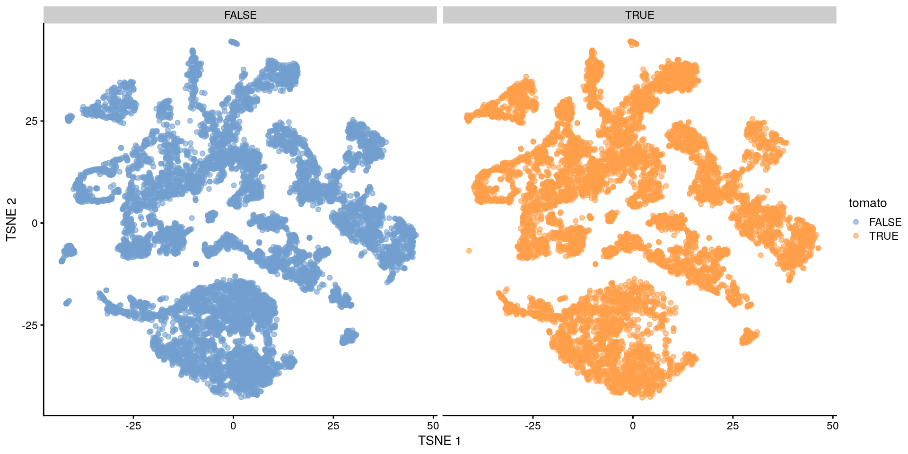
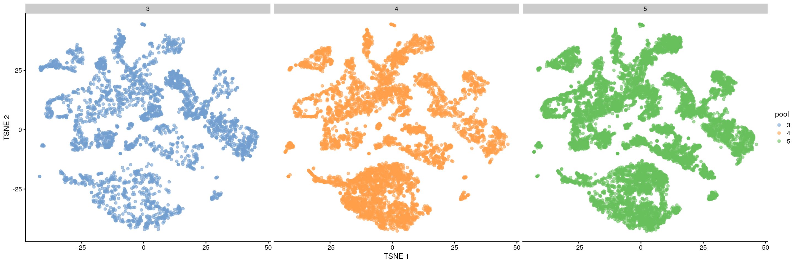
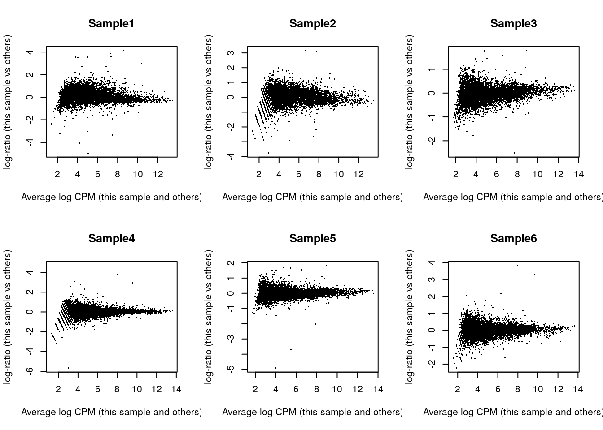

# Análisis de expresión diferencial

Instructor: [Leonardo Collado Torres](https://comunidadbioinfo.github.io/es/authors/lcollado/)


```r
## Paquetes de este capítulo
library("MouseGastrulationData") ## para descargar datos de ejemplo
library("scater") ## para gráficas y control de calidad
library("scran") ## para selección de genes, clustering, etc
library("batchelor") ## para métodos de correción de batch (lote)
library("patchwork") ## para agrupar gráficas
library("Polychrome") ## para muchos colores
library("bluster") ## métodos de clustering
library("edgeR") ## para expresión diferencial
```

## Diapositivas de Peter Hickey

Ve las diapositivas [aquí](https://docs.google.com/presentation/d/1CRTE_1m8YHf8p6GMl-rbBpyOx2KS4UxdTC1dpvVgKEs/edit?usp=sharing)

Esas diapositivas están basadas en este [capítulo de OSCA](https://bioconductor.org/books/release/OSCA/multi-sample-comparisons.html). El libro de OSCA tiene algunas partes más actualizadas de lo que vienen en las diapositivas.

## Motivación

* 👉 scRNA-seq nos puede ayudar a estudiar cambios en composición (cambios en proporciones de células) o cambios en niveles de expresión de genes entre varias condiciones biológicas
  - El primero se llama cambios de abundancia,
  - Ejemplo: [después de un tratamiento con una droga](https://www.ncbi.nlm.nih.gov/pubmed/30013148)
  - Ejemplo: [después de modificaciones genéticas](https://www.ncbi.nlm.nih.gov/pubmed/27383781)
* 👉 Nos permite obtener mayor resolución biológica que experimentos convencionales de RNA-seq, sobre todo si podemos asociar cambios en poblaciones celulares a manipulaciones experimentales

### Dos categorías de análisis

* 👉 Análisis de expresión diferencial
  - Buscamos cambios en niveles de expresión entre condiciones para células del mismo tipo que están presentes en todas las condiciones
* 👉 Análisis de abundancia diferencial
  - Buscamos cambios en la composición de los tipos celulares entre condiciones
  - Podría ser entre estados celulares en vez de tipos celulares
  
**Son dos lados de la misma moneda**


|gene  |condición |celula  | expresión|
|:-----|:---------|:-------|---------:|
|gene1 |grupo1    |celula1 |     13.31|
|gene1 |grupo2    |celula1 |      6.15|
|gene2 |grupo1    |celula1 |      9.67|
|gene2 |grupo2    |celula1 |     11.53|
|gene1 |grupo1    |celula2 |     10.89|
|gene1 |grupo2    |celula2 |      7.65|
|gene2 |grupo1    |celula2 |     10.97|
|gene2 |grupo2    |celula2 |      9.37|


|condición |celula  | frecuencia|
|:---------|:-------|----------:|
|grupo1    |celula1 |         47|
|grupo2    |celula1 |         32|
|grupo1    |celula2 |         39|
|grupo2    |celula2 |         43|

## Datos de ejemplo

Embriones de ratón quiméricos. 

> Chimeric E8.5 mouse embryos
>   - td-Tomato+ ESCs injected into WT blastocyst
>   - No genetic differences between the injected and background cells (except expression of td-Tomato in the former)
> 3 replicate batches
>   - Each batch contains td-Tomato+ and td-Tomato- cells sorted from a single pool of dissociated cells from 6-7 chimeric embryos
>   - 2,000 - 7,000 cells/sample using 10X Genomics
> Aim is to determine whether the injection procedure itself introduces differences in lineage commitment compared to the background cells

https://bioconductor.org/books/release/OSCA/pijuan-sala-chimeric-mouse-embryo-10x-genomics.html

_Pijuan-Sala, B. et al. A single-cell molecular map of mouse gastrulation and early organogenesis. Nature 566, 490–495 (2019)._

### Descarguemos los datos de ejemplo


```r
#--- loading ---#
library("MouseGastrulationData")
sce.chimera <- WTChimeraData(samples = 5:10)
```

```
## snapshotDate(): 2021-05-18
```

```
## see ?MouseGastrulationData and browseVignettes('MouseGastrulationData') for documentation
```

```
## downloading 1 resources
```

```
## retrieving 1 resource
```

```
## loading from cache
```

```
## see ?MouseGastrulationData and browseVignettes('MouseGastrulationData') for documentation
```

```
## downloading 1 resources
```

```
## retrieving 1 resource
```

```
## loading from cache
```

```
## see ?MouseGastrulationData and browseVignettes('MouseGastrulationData') for documentation
```

```
## downloading 1 resources
```

```
## retrieving 1 resource
```

```
## loading from cache
```

```
## see ?MouseGastrulationData and browseVignettes('MouseGastrulationData') for documentation
```

```
## downloading 1 resources
```

```
## retrieving 1 resource
```

```
## loading from cache
```

```
## see ?MouseGastrulationData and browseVignettes('MouseGastrulationData') for documentation
```

```
## downloading 1 resources
```

```
## retrieving 1 resource
```

```
## loading from cache
```

```
## see ?MouseGastrulationData and browseVignettes('MouseGastrulationData') for documentation
```

```
## downloading 1 resources
```

```
## retrieving 1 resource
```

```
## loading from cache
```

```
## see ?MouseGastrulationData and browseVignettes('MouseGastrulationData') for documentation
```

```
## downloading 1 resources
```

```
## retrieving 1 resource
```

```
## loading from cache
```

```
## see ?MouseGastrulationData and browseVignettes('MouseGastrulationData') for documentation
```

```
## downloading 1 resources
```

```
## retrieving 1 resource
```

```
## loading from cache
```

```
## see ?MouseGastrulationData and browseVignettes('MouseGastrulationData') for documentation
```

```
## downloading 1 resources
```

```
## retrieving 1 resource
```

```
## loading from cache
```

```
## see ?MouseGastrulationData and browseVignettes('MouseGastrulationData') for documentation
```

```
## downloading 1 resources
```

```
## retrieving 1 resource
```

```
## loading from cache
```

```
## see ?MouseGastrulationData and browseVignettes('MouseGastrulationData') for documentation
```

```
## downloading 1 resources
```

```
## retrieving 1 resource
```

```
## loading from cache
```

```
## see ?MouseGastrulationData and browseVignettes('MouseGastrulationData') for documentation
```

```
## downloading 1 resources
```

```
## retrieving 1 resource
```

```
## loading from cache
```

```
## see ?MouseGastrulationData and browseVignettes('MouseGastrulationData') for documentation
```

```
## downloading 1 resources
```

```
## retrieving 1 resource
```

```
## loading from cache
```

```
## see ?MouseGastrulationData and browseVignettes('MouseGastrulationData') for documentation
```

```
## downloading 1 resources
```

```
## retrieving 1 resource
```

```
## loading from cache
```

```
## see ?MouseGastrulationData and browseVignettes('MouseGastrulationData') for documentation
```

```
## downloading 1 resources
```

```
## retrieving 1 resource
```

```
## loading from cache
```

```
## see ?MouseGastrulationData and browseVignettes('MouseGastrulationData') for documentation
```

```
## downloading 1 resources
```

```
## retrieving 1 resource
```

```
## loading from cache
```

```
## see ?MouseGastrulationData and browseVignettes('MouseGastrulationData') for documentation
```

```
## downloading 1 resources
```

```
## retrieving 1 resource
```

```
## loading from cache
```

```
## see ?MouseGastrulationData and browseVignettes('MouseGastrulationData') for documentation
```

```
## downloading 1 resources
```

```
## retrieving 1 resource
```

```
## loading from cache
```

```
## see ?MouseGastrulationData and browseVignettes('MouseGastrulationData') for documentation
```

```
## downloading 1 resources
```

```
## retrieving 1 resource
```

```
## loading from cache
```

```
## see ?MouseGastrulationData and browseVignettes('MouseGastrulationData') for documentation
```

```
## downloading 1 resources
```

```
## retrieving 1 resource
```

```
## loading from cache
```

```
## see ?MouseGastrulationData and browseVignettes('MouseGastrulationData') for documentation
```

```
## downloading 1 resources
```

```
## retrieving 1 resource
```

```
## loading from cache
```

```
## see ?MouseGastrulationData and browseVignettes('MouseGastrulationData') for documentation
```

```
## downloading 1 resources
```

```
## retrieving 1 resource
```

```
## loading from cache
```

```
## see ?MouseGastrulationData and browseVignettes('MouseGastrulationData') for documentation
```

```
## downloading 1 resources
```

```
## retrieving 1 resource
```

```
## loading from cache
```

```
## see ?MouseGastrulationData and browseVignettes('MouseGastrulationData') for documentation
```

```
## downloading 1 resources
```

```
## retrieving 1 resource
```

```
## loading from cache
```

```
## see ?MouseGastrulationData and browseVignettes('MouseGastrulationData') for documentation
```

```
## downloading 1 resources
```

```
## retrieving 1 resource
```

```
## loading from cache
```

```r
sce.chimera
```

```
## class: SingleCellExperiment 
## dim: 29453 20935 
## metadata(0):
## assays(1): counts
## rownames(29453): ENSMUSG00000051951 ENSMUSG00000089699 ...
##   ENSMUSG00000095742 tomato-td
## rowData names(2): ENSEMBL SYMBOL
## colnames(20935): cell_9769 cell_9770 ... cell_30702 cell_30703
## colData names(11): cell barcode ... doub.density sizeFactor
## reducedDimNames(2): pca.corrected.E7.5 pca.corrected.E8.5
## mainExpName: NULL
## altExpNames(0):
```


```r
## Exploremos los datos
sapply(colData(sce.chimera)[, -(1:2)], function(x) {
    x <- if (is.character(x) || is.integer(x)) factor(x) else x
    summary(x)
})
```

```
## $sample
##    5    6    7    8    9   10 
## 2411 1047 3007 3097 4544 6829 
## 
## $stage
##  E8.5 
## 20935 
## 
## $tomato
##    Mode   FALSE    TRUE 
## logical   10973    9962 
## 
## $pool
##     3     4     5 
##  3458  6104 11373 
## 
## $stage.mapped
##  E7.0 E7.25  E7.5 E7.75  E8.0 E8.25  E8.5 
##    55    39   255  1224  1641  6998 10723 
## 
## $celltype.mapped
##                      Allantois            Blood progenitors 1 
##                            955                             56 
##            Blood progenitors 2                 Cardiomyocytes 
##                            245                            601 
##                Caudal epiblast                Caudal Mesoderm 
##                             71                             71 
##            Caudal neurectoderm                  Def. endoderm 
##                             19                             91 
##                        Doublet                    Endothelium 
##                           1509                            350 
##                     Erythroid1                     Erythroid2 
##                            448                           1115 
##                     Erythroid3                   ExE ectoderm 
##                           3173                            156 
##                   ExE endoderm                   ExE mesoderm 
##                             14                           1003 
##   Forebrain/Midbrain/Hindbrain                            Gut 
##                           1803                            701 
## Haematoendothelial progenitors          Intermediate mesoderm 
##                            518                            397 
##                     Mesenchyme                 Mixed mesoderm 
##                           1495                              4 
##                   Neural crest                            NMP 
##                            615                            606 
##                      Notochord              Paraxial mesoderm 
##                             11                           1059 
##              Parietal endoderm                            PGC 
##                             61                             25 
##            Pharyngeal mesoderm           Rostral neurectoderm 
##                           1109                            198 
##               Somitic mesoderm                    Spinal cord 
##                            328                            713 
##                       Stripped               Surface ectoderm 
##                             47                           1357 
##              Visceral endoderm 
##                             11 
## 
## $closest.cell
##  cell_71220 cell_132352  cell_37581  cell_38398 cell_133630  cell_75985 
##         180         179         135         123         102          78 
##  cell_74615  cell_96860 cell_134438  cell_38140  cell_36067  cell_98277 
##          76          72          59          59          54          51 
##  cell_40210 cell_133739  cell_69452 cell_137250  cell_40746  cell_74744 
##          46          43          42          41          41          40 
##  cell_37295 cell_139027  cell_76775  cell_98128  cell_97456 cell_132412 
##          39          38          37          37          36          34 
##  cell_69071  cell_70906 cell_133892  cell_40183 cell_132070 cell_133063 
##          34          34          33          32          30          30 
## cell_133712  cell_38655  cell_40388 cell_131552  cell_39059  cell_66392 
##          28          27          27          26          26          25 
##  cell_66974 cell_102032 cell_131092  cell_67212  cell_98050  cell_39343 
##          25          24          24          24          24          23 
##  cell_40527  cell_74684 cell_100899 cell_130659 cell_133721 cell_134638 
##          23          23          22          22          22          22 
##  cell_38244  cell_39903  cell_70218  cell_76927 cell_137879  cell_27132 
##          22          22          22          22          21          21 
##  cell_65563 cell_101969  cell_38451  cell_40571  cell_91221 cell_125957 
##          21          20          20          20          20          19 
##  cell_40143  cell_40412  cell_65386  cell_66720  cell_70671  cell_96014 
##          19          19          19          19          19          19 
##  cell_97435 cell_131123 cell_133876 cell_134544 cell_136737 cell_138771 
##          19          18          18          18          18          18 
##  cell_65700  cell_70110  cell_72521 cell_102689 cell_132918 cell_133005 
##          18          18          18          17          17          17 
## cell_133481  cell_37978  cell_38407  cell_65580 cell_134191 cell_136502 
##          17          17          17          17          16          16 
##  cell_25052  cell_40387  cell_40844  cell_71754  cell_74962  cell_76390 
##          16          16          16          16          16          16 
##  cell_96412  cell_96512  cell_96673  cell_98024  cell_99878 cell_101054 
##          16          16          16          16          16          15 
## cell_102334 cell_102822 cell_103120     (Other) 
##          15          15          15       17749 
## 
## $doub.density
##     Min.  1st Qu.   Median     Mean  3rd Qu.     Max. 
##  0.00000  0.00294  0.02468  0.14791  0.09480 43.64080 
## 
## $sizeFactor
##    Min. 1st Qu.  Median    Mean 3rd Qu.    Max. 
##  0.1199  0.5500  0.7545  0.9091  1.1114  5.4110
```

Básicamente:

* `sample`: 6 ratones diferentes
* `tomato`: inyectados o no con td-Tomato
* `pool`: lote de secuenciación, cada lote con 1 con y otro sin inyección
* `celltype.mappped`: 34 tipos de células anotados


```r
## Número de células en nuestras variables principales
with(colData(sce.chimera), table(sample, pool, tomato))
```

```
## , , tomato = FALSE
## 
##       pool
## sample    3    4    5
##     5     0    0    0
##     6  1047    0    0
##     7     0    0    0
##     8     0 3097    0
##     9     0    0    0
##     10    0    0 6829
## 
## , , tomato = TRUE
## 
##       pool
## sample    3    4    5
##     5  2411    0    0
##     6     0    0    0
##     7     0 3007    0
##     8     0    0    0
##     9     0    0 4544
##     10    0    0    0
```

```r
## Número de tipos celulares
length(unique(sce.chimera$celltype.mapped))
```

```
## [1] 35
```


### Procesamiento

* Usaremos los métodos que ya vimos para procesar datos

* Usaremos `batchelor` porque tenemos muestras de 3 lotes de muestras y queremos eliminar diferencias entre los lotes

* Para más detalles, revisar https://bioconductor.org/books/release/OSCA/integrating-datasets.html


```r
#--- feature-annotation ---#
library("scater")
rownames(sce.chimera) <- uniquifyFeatureNames(
    rowData(sce.chimera)$ENSEMBL, rowData(sce.chimera)$SYMBOL
)

#--- quality-control ---#
drop <- sce.chimera$celltype.mapped %in% c("stripped", "Doublet")
sce.chimera <- sce.chimera[, !drop]

#--- normalization ---#
sce.chimera <- logNormCounts(sce.chimera)

#--- variance-modelling ---#
library("scran")
dec.chimera <- modelGeneVar(sce.chimera, block = sce.chimera$sample)
chosen.hvgs <- dec.chimera$bio > 0

#--- merging ---#
library("batchelor")
set.seed(01001001)
merged <- correctExperiments(sce.chimera,
    batch = sce.chimera$sample,
    subset.row = chosen.hvgs,
    PARAM = FastMnnParam(
        merge.order = list(
            list(1, 3, 5), # WT (3 replicates)
            list(2, 4, 6) # td-Tomato (3 replicates)
        )
    )
)

#--- clustering ---#
g <- buildSNNGraph(merged, use.dimred = "corrected")
clusters <- igraph::cluster_louvain(g)
colLabels(merged) <- factor(clusters$membership)

#--- dimensionality-reduction ---#
merged <- runTSNE(merged, dimred = "corrected", external_neighbors = TRUE)
merged <- runUMAP(merged, dimred = "corrected", external_neighbors = TRUE)
```

### Exploremos los datos de ejemplo

* Exploremos si tenemos clusters con una diferencia grande en el número de celulas entre las muestras sin y con inyecciones de td-Tomato

* Exploremos el número de células en cada cluster a lo largo de los 3 lotes de secuenciación (batch)


```r
## Clusters vs DE por td-Tomato
table(colLabels(merged), merged$tomato)
```

```
##     
##      FALSE TRUE
##   1    546  401
##   2     60   52
##   3    470  398
##   4    469  211
##   5    335  271
##   6    258  249
##   7   1241  967
##   8    203  221
##   9    630  629
##   10    71  181
##   11   417  310
##   12    47   57
##   13    58    0
##   14   209  214
##   15   414  630
##   16   363  509
##   17   234  198
##   18   657  607
##   19   151  303
##   20   579  443
##   21   137   74
##   22    82   78
##   23   155    1
##   24   762  878
##   25   363  497
##   26  1420  716
```

```r
## Clusters vs lotes de muestras (batch)
table(colLabels(merged), merged$pool)
```

```
##     
##         3    4    5
##   1   224  173  550
##   2    26   30   56
##   3   226  172  470
##   4    78  162  440
##   5    99  227  280
##   6   187  116  204
##   7   300  909  999
##   8    69  134  221
##   9   229  423  607
##   10  114   54   84
##   11  179  169  379
##   12   16   31   57
##   13    2   51    5
##   14   77   97  249
##   15  114  289  641
##   16  183  242  447
##   17  157   81  194
##   18  123  308  833
##   19  106  118  230
##   20  236  238  548
##   21    3   10  198
##   22   27   29  104
##   23    6   84   66
##   24  217  455  968
##   25  132  172  556
##   26  194  870 1072
```

* Visualizaremos nuestros clusters que son 26 en dimensiones reducidas de t-SNE
  - Queremos que todos los clusters tengan muestras de cada lote de secuenciación (batch). Detalles en [OSCA](https://bioconductor.org/books/release/OSCA/integrating-datasets.html)
  - Vemos que no parece que haya mucha señal en base a td-Tomato
  

```r
library("patchwork")
plotTSNE(merged, colour_by = "tomato", text_by = "label") +
    plotTSNE(merged, colour_by = data.frame(pool = factor(merged$pool)))
```


### Nuestros clusters vs los originales

* Las siguientes gráficas nos ayudan a comparar nuestros clusters vs los que encontraron en el estudio original

* ¿Les parecen similares?


```r
## Definir colores, si no scater nos los pone en una escala
## continua
cols_label <- Polychrome::palette36.colors(length(unique(merged$label)))
names(cols_label) <- unique(merged$label)
cols_celltype.mapped <- Polychrome::palette36.colors(length(unique(merged$celltype.mapped)))
names(cols_celltype.mapped) <- unique(merged$celltype.mapped)

## Nuestros clusters vs anotación de células por los
## autores originales
plotTSNE(merged, colour_by = "label", text_by = "label") +
    theme(legend.position = "none") +
    scale_colour_manual(values = cols_label) +
    plotTSNE(merged, colour_by = "celltype.mapped") +
    theme(legend.position = "none") +
    scale_colour_manual(values = cols_celltype.mapped)
```

```
## Scale for 'colour' is already present. Adding another scale for 'colour',
## which will replace the existing scale.
## Scale for 'colour' is already present. Adding another scale for 'colour',
## which will replace the existing scale.
```



* Es difícil el proceso de comparar clusters

* Podemos usar `bluster` para evaluar númericamente que tanto se parecen los clusters. Entre más cerca de 1, mejor en `pairwiseRand()`

* También podemos hacer un heatmap


```r
library("bluster")
pairwiseRand(colLabels(merged), merged$celltype.mapped, "index")
```

```
## [1] 0.5513742
```

```r
by.label <- table(colLabels(merged), merged$celltype.mapped)
pheatmap::pheatmap(log2(by.label + 1), color = viridis::viridis(101))
```



* Por eso es más fácil combinar datos de varios lotes de secuenciación y hacer un solo clustering en vez de varios y tener que identificar que clusters de una muestra corresponden a los de otra

* ⚠️ Nos saltaremos el proceso de anotación de células y usaremos los clusters y etiquetas originales

## Análisis de expresión diferencial

* En RNA-seq estamos acostumbrados a evaluar si hay diferencias en los niveles de expresión de genes entre condiciones, así que es natural que lo hagamos con scRNA-seq también

* 🤔 Pero los datos de scRNA-seq tienen muchos ceros 


### Pseudo-bulking

* El proceso de _pseudo-bulking_ es un truco que nos permite usar métodos de bulk RNA-seq para analizar nuestros datos de scRNA-seq

* Cómo tenemos muchas células de cada condición, para cada gene podemos sumar los niveles de expresión entre todas las células de esa condición

<blockquote class="twitter-tweet"><p lang="en" dir="ltr">🔥off the press! 👀 our <a href="https://twitter.com/biorxivpreprint?ref_src=twsrc%5Etfw">@biorxivpreprint</a> on human 🧠brain <a href="https://twitter.com/LieberInstitute?ref_src=twsrc%5Etfw">@LieberInstitute</a> spatial 🌌🔬transcriptomics data 🧬using Visium <a href="https://twitter.com/10xGenomics?ref_src=twsrc%5Etfw">@10xGenomics</a>🎉<a href="https://twitter.com/hashtag/spatialLIBD?src=hash&amp;ref_src=twsrc%5Etfw">#spatialLIBD</a><br><br>🔍<a href="https://t.co/RTW0VscUKR">https://t.co/RTW0VscUKR</a> <br>👩🏾‍💻<a href="https://t.co/bsg04XKONr">https://t.co/bsg04XKONr</a><br>📚<a href="https://t.co/FJDOOzrAJ6">https://t.co/FJDOOzrAJ6</a><br>📦<a href="https://t.co/Au5jwADGhY">https://t.co/Au5jwADGhY</a><a href="https://t.co/PiWEDN9q2N">https://t.co/PiWEDN9q2N</a> <a href="https://t.co/aWy0yLlR50">pic.twitter.com/aWy0yLlR50</a></p>&mdash; 🇲🇽 Leonardo Collado-Torres (@lcolladotor) <a href="https://twitter.com/lcolladotor/status/1233661576433061888?ref_src=twsrc%5Etfw">February 29, 2020</a></blockquote> <script async src="https://platform.twitter.com/widgets.js" charset="utf-8"></script>

* Ejemplo de mi trabajo:
  - 12 muestras
  - 7 regiones
  - 47,681 _spots_ (digamos que células)

<script async class="speakerdeck-embed" data-slide="10" data-id="dde92cd6dfc04f9589770e074915658f" data-ratio="1.33333333333333" src="//speakerdeck.com/assets/embed.js"></script>

* Podemos _comprimir_ la información a una matriz de 12 * 7 = 84 columnas

* Nos quedamos con pocas _réplicas_ para nuestro análisis, pero justamente los métodos de bulk RNA-seq están diseñados para esos escenarios (claro, entre más datos mejor!!!)

* Acá pueden explorar los datos si quieren http://spatial.libd.org/spatialLIBD/

Estas diapositivas son parte de un webinar que di con [Kristen R Maynard](https://twitter.com/kr_maynard) el 2021-04-27 para BioTuring que pueden ver [desde su sitio web](https://bioturing.com/sources/webinar/60752954a433e26dd8affcbd) o en YouTube.

<iframe width="560" height="315" src="https://www.youtube.com/embed/S8884Kde-1U" title="YouTube video player" frameborder="0" allow="accelerometer; autoplay; clipboard-write; encrypted-media; gyroscope; picture-in-picture" allowfullscreen></iframe>


* Podemos hacerlo manualmente o de forma más sencilla con la función `aggregateAcrossCells()`


```r
# Using 'label' and 'sample' as our two factors; each column of the output
# corresponds to one unique combination of these two factors.
summed <- aggregateAcrossCells(merged,
    id = colData(merged)[, c("celltype.mapped", "sample")]
)
summed
```

```
## class: SingleCellExperiment 
## dim: 14699 186 
## metadata(2): merge.info pca.info
## assays(1): counts
## rownames(14699): Xkr4 Rp1 ... Vmn2r122 CAAA01147332.1
## rowData names(3): rotation ENSEMBL SYMBOL
## colnames: NULL
## colData names(16): batch cell ... sample ncells
## reducedDimNames(5): corrected pca.corrected.E7.5 pca.corrected.E8.5
##   TSNE UMAP
## mainExpName: NULL
## altExpNames(0):
```

```r
dim(merged)
```

```
## [1] 14699 19426
```

```r
dim(summed)
```

```
## [1] 14699   186
```

```r
with(colData(merged), length(unique(celltype.mapped)) * length(unique(sample)))
```

```
## [1] 204
```

* En teoría podríamos tener más columnas, pero no las tenemos todas porque no tenemos datos para todas las combinaciones

* Esto puede afectar nuestro análisis, y pues afecta cuantas variables podremos usar para ajustar
  - Por ejemplo, si agregamos sexo con 2 opciones, duplicaríamos el número teórico de columnas pero tal vez no tengamos suficientes datos
  - Si lo llevas al extremo, terminas con los mismos datos que con los que empezamos


### Convertir a un objeto nuevo

* Hagamos nuestro análisis de expresión diferencial

* Empezaremos con solo un tipo celular: `Mesenchyme`


```r
label <- "Mesenchyme"
current <- summed[, label == summed$celltype.mapped]
dim(current)
```

```
## [1] 14699     6
```

* Vemos que nos quedamos con solo 14,699 genes a lo largo de 6 muestras
  - Esto sería un experimento pequeño de bulk RNA-seq

* Usaremos `edgeR` de [Robinson, McCarthy e Smyth, _Bioinformatics_, 2010](https://pubmed.ncbi.nlm.nih.gov/19910308/) que es uno de los paquetes más usados para análisis de expresión diferencial en bulk RNA-seq
  - Aaron Lun, autor de OSCA, fue formado por el mismo grupo en Australia


```r
# Creating up a DGEList object for use in edgeR:
library("edgeR")
y <- DGEList(counts(current), samples = colData(current))
y
```

```
## An object of class "DGEList"
## $counts
##        Sample1 Sample2 Sample3 Sample4 Sample5 Sample6
## Xkr4         2       0       0       0       3       0
## Rp1          0       0       1       0       0       0
## Sox17        7       0       3       0      14       9
## Mrpl15    1420     271    1009     379    1578     749
## Rgs20        3       0       1       1       0       0
## 14694 more rows ...
## 
## $samples
##         group lib.size norm.factors batch cell barcode sample stage tomato pool
## Sample1     1  4607053            1     5 <NA>    <NA>      5  E8.5   TRUE    3
## Sample2     1  1064970            1     6 <NA>    <NA>      6  E8.5  FALSE    3
## Sample3     1  2494010            1     7 <NA>    <NA>      7  E8.5   TRUE    4
## Sample4     1  1028668            1     8 <NA>    <NA>      8  E8.5  FALSE    4
## Sample5     1  4290221            1     9 <NA>    <NA>      9  E8.5   TRUE    5
## Sample6     1  1950840            1    10 <NA>    <NA>     10  E8.5  FALSE    5
##         stage.mapped celltype.mapped closest.cell doub.density sizeFactor label
## Sample1         <NA>      Mesenchyme         <NA>           NA         NA  <NA>
## Sample2         <NA>      Mesenchyme         <NA>           NA         NA  <NA>
## Sample3         <NA>      Mesenchyme         <NA>           NA         NA  <NA>
## Sample4         <NA>      Mesenchyme         <NA>           NA         NA  <NA>
## Sample5         <NA>      Mesenchyme         <NA>           NA         NA  <NA>
## Sample6         <NA>      Mesenchyme         <NA>           NA         NA  <NA>
##         celltype.mapped.1 sample.1 ncells
## Sample1        Mesenchyme        5    286
## Sample2        Mesenchyme        6     55
## Sample3        Mesenchyme        7    243
## Sample4        Mesenchyme        8    134
## Sample5        Mesenchyme        9    478
## Sample6        Mesenchyme       10    299
```

* Listo, ya convertimos nuestros datos al formato que le gusta a `edgeR`


### Pre-procesamiento

* Antes de poder continuar, vamos a eliminar _muestras_ que construimos con el proceso de _pseudo-bulking_ que no tengan al menos 10 células 


```r
discarded <- current$ncells < 10
y <- y[, !discarded]
summary(discarded)
```

```
##    Mode   FALSE 
## logical       6
```

* A continuación eliminaremos genes que tengan bajos nivels de expresión


```r
keep <- filterByExpr(y, group = current$tomato)
y <- y[keep, ]
summary(keep)
```

```
##    Mode   FALSE    TRUE 
## logical    9011    5688
```

* Después normalizaremos los datos
  - Pero si ya habíamos normalizado los datos de scRNA-seq, ¿qué pasó? ^[Empezamos de nuevo con las cuentas originales en `y <- DGEList(counts(current), samples=colData(current))` y no las normalizadas.]


```r
y <- calcNormFactors(y)
y$samples
```

```
##         group lib.size norm.factors batch cell barcode sample stage tomato pool
## Sample1     1  4607053    1.0683392     5 <NA>    <NA>      5  E8.5   TRUE    3
## Sample2     1  1064970    1.0487418     6 <NA>    <NA>      6  E8.5  FALSE    3
## Sample3     1  2494010    0.9582296     7 <NA>    <NA>      7  E8.5   TRUE    4
## Sample4     1  1028668    0.9774156     8 <NA>    <NA>      8  E8.5  FALSE    4
## Sample5     1  4290221    0.9707300     9 <NA>    <NA>      9  E8.5   TRUE    5
## Sample6     1  1950840    0.9816914    10 <NA>    <NA>     10  E8.5  FALSE    5
##         stage.mapped celltype.mapped closest.cell doub.density sizeFactor label
## Sample1         <NA>      Mesenchyme         <NA>           NA         NA  <NA>
## Sample2         <NA>      Mesenchyme         <NA>           NA         NA  <NA>
## Sample3         <NA>      Mesenchyme         <NA>           NA         NA  <NA>
## Sample4         <NA>      Mesenchyme         <NA>           NA         NA  <NA>
## Sample5         <NA>      Mesenchyme         <NA>           NA         NA  <NA>
## Sample6         <NA>      Mesenchyme         <NA>           NA         NA  <NA>
##         celltype.mapped.1 sample.1 ncells
## Sample1        Mesenchyme        5    286
## Sample2        Mesenchyme        6     55
## Sample3        Mesenchyme        7    243
## Sample4        Mesenchyme        8    134
## Sample5        Mesenchyme        9    478
## Sample6        Mesenchyme       10    299
```

* `calcNormFactors()` asume que la mayoría de los genes no están diferencialmente expresados como describen [Robinson y Oshlack, _Genome Biol._, 2010](https://pubmed.ncbi.nlm.nih.gov/20196867/)

* Podemos visualizar los cambios de expresión para todos los genes, una muestra a la vez


```r
par(mfrow = c(2, 3))
for (i in seq_len(ncol(y))) {
    plotMD(y, column = i)
}
```



* Podemos usar técnicas de reducción de dimensiones como `MDS` y `PCA` para explorar la variación entre nuestras muestras (ya no células)


```r
par(mfrow = c(1, 1))
plotMDS(cpm(y, log = TRUE),
    col = ifelse(y$samples$tomato, "red", "blue")
)
```


### Modelo estadístico

* Si todo nos parece bien, podemos seguir con definir nuestro modelo estadístico

* Vamos a ajustar por lote (batch) y encontrar diferencias por la inyección de td-Tomato
  - Como empezamos con las cuentas desde cero, tenemos que tomar en cuenta la variación por lote de secuenciación


```r
design <- model.matrix(~ factor(pool) + factor(tomato), y$samples)
design
```

```
##         (Intercept) factor(pool)4 factor(pool)5 factor(tomato)TRUE
## Sample1           1             0             0                  1
## Sample2           1             0             0                  0
## Sample3           1             1             0                  1
## Sample4           1             1             0                  0
## Sample5           1             0             1                  1
## Sample6           1             0             1                  0
## attr(,"assign")
## [1] 0 1 1 2
## attr(,"contrasts")
## attr(,"contrasts")$`factor(pool)`
## [1] "contr.treatment"
## 
## attr(,"contrasts")$`factor(tomato)`
## [1] "contr.treatment"
```

* Si queremos explorar nuestro modelo estadístico de forma interactiva, podemos usar [`ExploreModelMatrix`](https://bioconductor.org/packages/ExploreModelMatrix) por [Charlotte Soneson](https://twitter.com/CSoneson) y [Michael Love](https://twitter.com/mikelove). Charlotte es de las autoras de `iSEE`.


```r
if (interactive()) {
    ExploreModelMatrix::ExploreModelMatrix(y$samples[, c("pool", "tomato")], ~ factor(pool) + factor(tomato))
}
```

* Tal y como en bulk RNA-seq, podemos usar la información de los genes para mejorar nuestros estimados de la varianza para cada gene, de tal forma que mejoramos los resultados estadísticos aunque tengamos pocas muestras


```r
y <- estimateDisp(y, design)
summary(y$trended.dispersion)
```

```
##    Min. 1st Qu.  Median    Mean 3rd Qu.    Max. 
## 0.01026 0.01670 0.02128 0.02020 0.02349 0.02665
```

```r
plotBCV(y)
```


```r
fit <- glmQLFit(y, design, robust = TRUE)
summary(fit$var.prior)
```

```
##    Min. 1st Qu.  Median    Mean 3rd Qu.    Max. 
##  0.3179  0.7143  0.8538  0.8045  0.9128  1.0665
```

```r
summary(fit$df.prior)
```

```
##    Min. 1st Qu.  Median    Mean 3rd Qu.    Max. 
##  0.2267 12.6749 12.6749 12.3390 12.6749 12.6749
```

```r
plotQLDisp(fit)
```


* Ahora si podemos correr nuestro modelo estádistico


```r
res <- glmQLFTest(fit, coef = ncol(design))
summary(decideTests(res))
```

```
##        factor(tomato)TRUE
## Down                    8
## NotSig               5672
## Up                      8
```

```r
topTags(res)
```

```
## Coefficient:  factor(tomato)TRUE 
##               logFC   logCPM          F       PValue          FDR
## Phlda2   -4.3873546 9.934130 1638.59469 1.812293e-16 1.030832e-12
## Erdr1     2.0690698 8.832662  356.36590 1.060836e-11 3.017019e-08
## Mid1      1.5190728 6.931325  120.14656 1.844351e-08 3.496889e-05
## H13      -1.0596020 7.540121   80.79795 2.373001e-07 2.526790e-04
## Kcnq1ot1  1.3762700 7.241651   83.30701 2.392052e-07 2.526790e-04
## Akr1e1   -1.7205826 5.127802   79.31386 2.665390e-07 2.526790e-04
## Zdbf2     1.8008336 6.797367   83.66324 6.808994e-07 5.532794e-04
## Asb4     -0.9234911 7.340648   53.44578 2.918297e-06 2.074909e-03
## Impact    0.8516300 7.353208   50.31429 4.145416e-06 2.619903e-03
## Lum      -0.6031413 9.274529   41.67104 1.204523e-05 6.851324e-03
```

* Encontramos 32 y 48 genes diferencialmente expresados por la inyección de td-Tomato.


### De forma sencilla

* Eso fue mucho trabajo, ¿no?

* La función `pseudoBulkDGE()` corre todos esos pasos por nosotros


```r
# Removing all pseudo-bulk samples with 'insufficient' cells.
summed.filt <- summed[, summed$ncells >= 10]

library("scran")
de.results <- pseudoBulkDGE(summed.filt,
    label = summed.filt$celltype.mapped,
    design = ~ factor(pool) + tomato,
    coef = "tomatoTRUE",
    condition = summed.filt$tomato
)
class(de.results)
```

```
## [1] "SimpleList"
## attr(,"package")
## [1] "S4Vectors"
```

```r
length(de.results)
```

```
## [1] 23
```

* Nos regresa una lista con los resultados para cada uno de nuestros tipos celulares

* Podemos extraer los resultados para nuestro tipo celular de interés, por ejemplo _Allantois_.


```r
cur.results <- de.results[["Allantois"]]
cur.results[order(cur.results$PValue), ]
```

```
## DataFrame with 14699 rows and 5 columns
##                               logFC    logCPM         F      PValue         FDR
##                           <numeric> <numeric> <numeric>   <numeric>   <numeric>
## Phlda2                    -2.489508  12.58150  1207.016 3.33486e-21 1.60507e-17
## Xist                      -7.978532   8.00166  1092.831 1.27783e-17 3.07510e-14
## Erdr1                      1.947170   9.07321   296.937 1.58009e-14 2.53500e-11
## Slc22a18                  -4.347153   4.04380   117.389 1.92517e-10 2.31647e-07
## Slc38a4                    0.891849  10.24094   113.899 2.52208e-10 2.42776e-07
## ...                             ...       ...       ...         ...         ...
## Ccl27a_ENSMUSG00000095247        NA        NA        NA          NA          NA
## CR974586.5                       NA        NA        NA          NA          NA
## AC132444.6                       NA        NA        NA          NA          NA
## Vmn2r122                         NA        NA        NA          NA          NA
## CAAA01147332.1                   NA        NA        NA          NA          NA
```

```r
y.allantois <- metadata(cur.results)$y
plotBCV(y.allantois)
```


* También nos dice que tipos celulares fallaron porque no teníamos suficiente información para hacer el análisis


```r
metadata(de.results)$failed
```

```
## [1] "Blood progenitors 1" "Caudal epiblast"     "Caudal neurectoderm"
## [4] "ExE ectoderm"        "Parietal endoderm"   "Stripped"
```

* Aquí podemos hacer la misma gráfica que hicimos de forma manual para _Mesenchyme_.


```r
cur.results.Mesenchyme <- de.results[["Mesenchyme"]]
y.Mesenchyme <- metadata(cur.results.Mesenchyme)$y
plotBCV(y.Mesenchyme)
```


## Análisis de abundancia diferencial


```r
table(merged$sample)
```

```
## 
##    5    6    7    8    9   10 
## 2298 1026 2740 2904 4057 6401
```

* Si recuerdan, tenemos 6 muestras en total. 

* 👉 Otro tipo de análisis que podemos hacer es preguntarnos si cambió la composición celular entre nuestras muestras con y sin la inyección de td-Tomato.

* 👉 Este tipo de análisis nos dirá que tipos celulares cambiaron de acuerdo a nuestras condiciones de interés, que puede ser igual de interesante que encontrar genes diferencialmente expresados.

* 👉 Es como si scRNA-seq fuera un _super-FACS_ donde usamos todo el transcriptoma.

* Hagamos una tabla de la frecuencia de cada tipo celular a lo largo de nuestras muestras. Es decir, una tabla de abundancias


```r
abundances <- table(merged$celltype.mapped, merged$sample)
abundances <- unclass(abundances)
head(abundances)
```

```
##                      
##                        5  6   7   8   9  10
##   Allantois           97 15 139 127 318 259
##   Blood progenitors 1  6  3  16   6   8  17
##   Blood progenitors 2 31  8  28  21  43 114
##   Cardiomyocytes      85 21  79  31 174 211
##   Caudal epiblast      2  2   0   0  22  45
##   Caudal Mesoderm     10 10   9   3  10  29
```

* A esta tabla le podemos agregar algo de información de nuestras muestras, y con eso construir un objeto del tipo que le gusta a `edgeR`


```r
# Attaching some column metadata.
extra.info <- colData(merged)[match(colnames(abundances), merged$sample), ]
y.ab <- DGEList(abundances, samples = extra.info)
y.ab
```

```
## An object of class "DGEList"
## $counts
##                      
##                        5  6   7   8   9  10
##   Allantois           97 15 139 127 318 259
##   Blood progenitors 1  6  3  16   6   8  17
##   Blood progenitors 2 31  8  28  21  43 114
##   Cardiomyocytes      85 21  79  31 174 211
##   Caudal epiblast      2  2   0   0  22  45
## 29 more rows ...
## 
## $samples
##    group lib.size norm.factors batch       cell          barcode sample stage
## 5      1     2298            1     5  cell_9769 AAACCTGAGACTGTAA      5  E8.5
## 6      1     1026            1     6 cell_12180 AAACCTGCAGATGGCA      6  E8.5
## 7      1     2740            1     7 cell_13227 AAACCTGAGACAAGCC      7  E8.5
## 8      1     2904            1     8 cell_16234 AAACCTGCAAACCCAT      8  E8.5
## 9      1     4057            1     9 cell_19332 AAACCTGCAACGATCT      9  E8.5
## 10     1     6401            1    10 cell_23875 AAACCTGAGGCATGTG     10  E8.5
##    tomato pool stage.mapped              celltype.mapped closest.cell
## 5    TRUE    3        E8.25                   Mesenchyme   cell_24159
## 6   FALSE    3        E8.25             Somitic mesoderm   cell_63247
## 7    TRUE    4         E8.5             Somitic mesoderm   cell_25454
## 8   FALSE    4        E8.25                 ExE mesoderm  cell_139075
## 9    TRUE    5         E8.0                 ExE mesoderm  cell_116116
## 10  FALSE    5         E8.5 Forebrain/Midbrain/Hindbrain   cell_39343
##    doub.density sizeFactor label
## 5    0.02985045  1.6348759    19
## 6    0.29191572  2.5980769     6
## 7    0.60173979  1.5939009    17
## 8    0.00473259  0.8707367     9
## 9    0.07941464  0.8932525    15
## 10   0.04074704  0.3947355     1
```

* A diferencia de los análisis de expresión diferencial, no usaremos `calcNormFactors()` porque este tipo de análisis no cumple, generalmente, con las condiciones del método estadístico

* A continuación filtramos los tipos celulares para los cuales no tenemos suficiente información, si es el caso


```r
keep <- filterByExpr(y.ab, group = y.ab$samples$tomato)
y.ab <- y.ab[keep, ]
summary(keep)
```

```
##    Mode   FALSE    TRUE 
## logical      10      24
```

* Luego hacemos nuestro análisis de abundancia con `edgeR` el cual nos permite usar el modelo estadístico que está diseñado para valores enteros (cuentas) y pocas réplicas

* Es la misma formúla del modelo estadístico (`design`) que usamos anteriormente, pero para otros números


```r
design <- model.matrix(~ factor(pool) + factor(tomato), y.ab$samples)
design
```

```
##    (Intercept) factor(pool)4 factor(pool)5 factor(tomato)TRUE
## 5            1             0             0                  1
## 6            1             0             0                  0
## 7            1             1             0                  1
## 8            1             1             0                  0
## 9            1             0             1                  1
## 10           1             0             1                  0
## attr(,"assign")
## [1] 0 1 1 2
## attr(,"contrasts")
## attr(,"contrasts")$`factor(pool)`
## [1] "contr.treatment"
## 
## attr(,"contrasts")$`factor(tomato)`
## [1] "contr.treatment"
```

```r
y.ab <- estimateDisp(y.ab, design, trend = "none")
summary(y.ab$common.dispersion)
```

```
##    Min. 1st Qu.  Median    Mean 3rd Qu.    Max. 
##  0.0614  0.0614  0.0614  0.0614  0.0614  0.0614
```

```r
plotBCV(y.ab, cex = 1)
```


* A diferencia de antes, tenemos pocos puntos (antes eran genes, ahora son tipos celulares), así que no estimaremos una curva, por eso usamos `abundance.trend = FALSE`


```r
fit.ab <- glmQLFit(y.ab, design, robust = TRUE, abundance.trend = FALSE)
summary(fit.ab$var.prior)
```

```
##    Min. 1st Qu.  Median    Mean 3rd Qu.    Max. 
##   1.254   1.254   1.254   1.254   1.254   1.254
```

```r
plotQLDisp(fit.ab, cex = 1)
```


* Corremos el análisis


```r
res <- glmQLFTest(fit.ab, coef = ncol(design))
summary(decideTests(res))
```

```
##        factor(tomato)TRUE
## Down                    1
## NotSig                 22
## Up                      1
```

```r
topTags(res)
```

```
## Coefficient:  factor(tomato)TRUE 
##                                     logFC   logCPM         F       PValue
## ExE ectoderm                   -6.5663339 13.02497 66.266874 1.352022e-10
## Mesenchyme                      1.1651500 16.29382 11.290523 1.534506e-03
## Allantois                       0.8345294 15.50702  5.312163 2.554581e-02
## Cardiomyocytes                  0.8484008 14.86430  5.203963 2.701306e-02
## Neural crest                   -0.7706378 14.76462  4.106177 4.830292e-02
## Endothelium                     0.7518608 14.28905  3.911511 5.371320e-02
## Erythroid3                     -0.6430834 17.28041  3.603666 6.367366e-02
## Haematoendothelial progenitors  0.6581135 14.72323  3.123946 8.350641e-02
## ExE mesoderm                    0.3805309 15.67835  1.180627 2.826550e-01
## Pharyngeal mesoderm             0.3793160 15.72073  1.169279 2.849523e-01
##                                         FDR
## ExE ectoderm                   3.244852e-09
## Mesenchyme                     1.841407e-02
## Allantois                      1.620784e-01
## Cardiomyocytes                 1.620784e-01
## Neural crest                   2.148528e-01
## Endothelium                    2.148528e-01
## Erythroid3                     2.183097e-01
## Haematoendothelial progenitors 2.505192e-01
## ExE mesoderm                   6.257608e-01
## Pharyngeal mesoderm            6.257608e-01
```

* Entre los tipos celulares donde teníamos suficiente información, solo 2 muestran diferencias en sus niveles de frecuencia entre las muestras con y sin inyecciones de td-Tomato.

## Comentarios sobre la interpretación


* 👉 La distinción entre ambos tipos de análisis en scRNA-seq es articial
 
* Las etiquetas que usamos para el análisis de abundancia están definidas por los niveles de expresión de los genes

* Este tema de cuantas veces usas los datos y como eso afecta las pruebas estadísticas que usamos es un tema de investigación actual

<blockquote class="twitter-tweet"><p lang="en" dir="ltr">In a talk that was as clear as her book &quot;intro to stat learning&quot;, today&#39;s <a href="https://twitter.com/hashtag/bioc2021?src=hash&amp;ref_src=twsrc%5Etfw">#bioc2021</a> keynote <a href="https://twitter.com/daniela_witten?ref_src=twsrc%5Etfw">@daniela_witten</a> showed how double dipping (e.g. using genes to cluster data and then testing for DE between clusters) leads to + type 1 error and an intuitive method to correct this prob.</p>&mdash; Alejandro Reyes (@areyesq) <a href="https://twitter.com/areyesq/status/1423006233968140292?ref_src=twsrc%5Etfw">August 4, 2021</a></blockquote> <script async src="https://platform.twitter.com/widgets.js" charset="utf-8"></script>

* Les recomiendo que lean detenidamente esa parte en [OSCA](https://bioconductor.org/books/release/OSCA/multi-sample-comparisons.html#comments-on-interpretation)


## Detalles de la sesión de R


```r
## Información de la sesión de R
Sys.time()
```

```
## [1] "2021-08-12 02:07:02 UTC"
```

```r
proc.time()
```

```
##    user  system elapsed 
## 394.708  27.815 401.466
```

```r
options(width = 120)
sessioninfo::session_info()
```

```
## ─ Session info ───────────────────────────────────────────────────────────────────────────────────────────────────────
##  setting  value                       
##  version  R version 4.1.0 (2021-05-18)
##  os       Ubuntu 20.04.2 LTS          
##  system   x86_64, linux-gnu           
##  ui       X11                         
##  language (EN)                        
##  collate  en_US.UTF-8                 
##  ctype    en_US.UTF-8                 
##  tz       UTC                         
##  date     2021-08-12                  
## 
## ─ Packages ───────────────────────────────────────────────────────────────────────────────────────────────────────────
##  package                * version  date       lib source        
##  AnnotationDbi            1.54.1   2021-06-08 [1] Bioconductor  
##  AnnotationHub            3.0.1    2021-06-20 [1] Bioconductor  
##  assertthat               0.2.1    2019-03-21 [1] RSPM (R 4.1.0)
##  batchelor              * 1.8.0    2021-05-19 [1] Bioconductor  
##  beachmat                 2.8.0    2021-05-19 [1] Bioconductor  
##  beeswarm                 0.4.0    2021-06-01 [1] RSPM (R 4.1.0)
##  Biobase                * 2.52.0   2021-05-19 [1] Bioconductor  
##  BiocFileCache            2.0.0    2021-05-19 [1] Bioconductor  
##  BiocGenerics           * 0.38.0   2021-05-19 [1] Bioconductor  
##  BiocManager              1.30.16  2021-06-15 [1] RSPM (R 4.1.0)
##  BiocNeighbors            1.10.0   2021-05-19 [1] Bioconductor  
##  BiocParallel             1.26.1   2021-07-04 [1] Bioconductor  
##  BiocSingular             1.8.1    2021-06-08 [1] Bioconductor  
##  BiocVersion              3.13.1   2021-03-19 [2] Bioconductor  
##  Biostrings               2.60.2   2021-08-05 [1] Bioconductor  
##  bit                      4.0.4    2020-08-04 [1] RSPM (R 4.1.0)
##  bit64                    4.0.5    2020-08-30 [1] RSPM (R 4.1.0)
##  bitops                   1.0-7    2021-04-24 [1] RSPM (R 4.1.0)
##  blob                     1.2.2    2021-07-23 [1] RSPM (R 4.1.0)
##  bluster                * 1.2.1    2021-05-27 [1] Bioconductor  
##  bookdown                 0.22     2021-04-22 [1] RSPM (R 4.1.0)
##  bslib                    0.2.5.1  2021-05-18 [1] RSPM (R 4.1.0)
##  BumpyMatrix              1.0.1    2021-07-04 [1] Bioconductor  
##  cachem                   1.0.5    2021-05-15 [2] RSPM (R 4.1.0)
##  cli                      3.0.1    2021-07-17 [2] RSPM (R 4.1.0)
##  cluster                  2.1.2    2021-04-17 [3] CRAN (R 4.1.0)
##  colorspace               2.0-2    2021-06-24 [1] RSPM (R 4.1.0)
##  cowplot                  1.1.1    2020-12-30 [1] RSPM (R 4.1.0)
##  crayon                   1.4.1    2021-02-08 [2] RSPM (R 4.1.0)
##  curl                     4.3.2    2021-06-23 [2] RSPM (R 4.1.0)
##  DBI                      1.1.1    2021-01-15 [1] RSPM (R 4.1.0)
##  dbplyr                   2.1.1    2021-04-06 [1] RSPM (R 4.1.0)
##  DelayedArray             0.18.0   2021-05-19 [1] Bioconductor  
##  DelayedMatrixStats       1.14.2   2021-08-08 [1] Bioconductor  
##  digest                   0.6.27   2020-10-24 [2] RSPM (R 4.1.0)
##  dplyr                    1.0.7    2021-06-18 [1] RSPM (R 4.1.0)
##  dqrng                    0.3.0    2021-05-01 [1] RSPM (R 4.1.0)
##  DropletUtils             1.12.2   2021-07-22 [1] Bioconductor  
##  edgeR                  * 3.34.0   2021-05-19 [1] Bioconductor  
##  ellipsis                 0.3.2    2021-04-29 [2] RSPM (R 4.1.0)
##  evaluate                 0.14     2019-05-28 [2] RSPM (R 4.1.0)
##  ExperimentHub            2.0.0    2021-05-19 [1] Bioconductor  
##  fansi                    0.5.0    2021-05-25 [2] RSPM (R 4.1.0)
##  farver                   2.1.0    2021-02-28 [1] RSPM (R 4.1.0)
##  fastmap                  1.1.0    2021-01-25 [2] RSPM (R 4.1.0)
##  filelock                 1.0.2    2018-10-05 [1] RSPM (R 4.1.0)
##  generics                 0.1.0    2020-10-31 [1] RSPM (R 4.1.0)
##  GenomeInfoDb           * 1.28.1   2021-07-01 [1] Bioconductor  
##  GenomeInfoDbData         1.2.6    2021-07-29 [1] Bioconductor  
##  GenomicRanges          * 1.44.0   2021-05-19 [1] Bioconductor  
##  ggbeeswarm               0.6.0    2017-08-07 [1] RSPM (R 4.1.0)
##  ggplot2                * 3.3.5    2021-06-25 [1] RSPM (R 4.1.0)
##  glue                     1.4.2    2020-08-27 [2] RSPM (R 4.1.0)
##  gridExtra                2.3      2017-09-09 [1] RSPM (R 4.1.0)
##  gtable                   0.3.0    2019-03-25 [1] RSPM (R 4.1.0)
##  HDF5Array                1.20.0   2021-05-19 [1] Bioconductor  
##  highr                    0.9      2021-04-16 [2] RSPM (R 4.1.0)
##  htmltools                0.5.1.1  2021-01-22 [1] RSPM (R 4.1.0)
##  httpuv                   1.6.1    2021-05-07 [1] RSPM (R 4.1.0)
##  httr                     1.4.2    2020-07-20 [2] RSPM (R 4.1.0)
##  igraph                   1.2.6    2020-10-06 [1] RSPM (R 4.1.0)
##  interactiveDisplayBase   1.30.0   2021-05-19 [1] Bioconductor  
##  IRanges                * 2.26.0   2021-05-19 [1] Bioconductor  
##  irlba                    2.3.3    2019-02-05 [1] RSPM (R 4.1.0)
##  jquerylib                0.1.4    2021-04-26 [1] RSPM (R 4.1.0)
##  jsonlite                 1.7.2    2020-12-09 [2] RSPM (R 4.1.0)
##  KEGGREST                 1.32.0   2021-05-19 [1] Bioconductor  
##  knitr                    1.33     2021-04-24 [2] RSPM (R 4.1.0)
##  labeling                 0.4.2    2020-10-20 [1] RSPM (R 4.1.0)
##  later                    1.2.0    2021-04-23 [1] RSPM (R 4.1.0)
##  lattice                  0.20-44  2021-05-02 [3] CRAN (R 4.1.0)
##  lifecycle                1.0.0    2021-02-15 [2] RSPM (R 4.1.0)
##  limma                  * 3.48.3   2021-08-10 [1] Bioconductor  
##  locfit                   1.5-9.4  2020-03-25 [1] RSPM (R 4.1.0)
##  magick                   2.7.2    2021-05-02 [1] RSPM (R 4.1.0)
##  magrittr                 2.0.1    2020-11-17 [2] RSPM (R 4.1.0)
##  Matrix                   1.3-4    2021-06-01 [3] RSPM (R 4.1.0)
##  MatrixGenerics         * 1.4.2    2021-08-08 [1] Bioconductor  
##  matrixStats            * 0.60.0   2021-07-26 [1] RSPM (R 4.1.0)
##  memoise                  2.0.0    2021-01-26 [2] RSPM (R 4.1.0)
##  metapod                  1.0.0    2021-05-19 [1] Bioconductor  
##  mime                     0.11     2021-06-23 [2] RSPM (R 4.1.0)
##  MouseGastrulationData  * 1.6.0    2021-05-20 [1] Bioconductor  
##  munsell                  0.5.0    2018-06-12 [1] RSPM (R 4.1.0)
##  patchwork              * 1.1.1    2020-12-17 [1] RSPM (R 4.1.0)
##  pheatmap                 1.0.12   2019-01-04 [1] RSPM (R 4.1.0)
##  pillar                   1.6.2    2021-07-29 [2] RSPM (R 4.1.0)
##  pkgconfig                2.0.3    2019-09-22 [2] RSPM (R 4.1.0)
##  png                      0.1-7    2013-12-03 [1] RSPM (R 4.1.0)
##  Polychrome             * 1.3.1    2021-07-16 [1] RSPM (R 4.1.0)
##  promises                 1.2.0.1  2021-02-11 [1] RSPM (R 4.1.0)
##  purrr                    0.3.4    2020-04-17 [2] RSPM (R 4.1.0)
##  R.methodsS3              1.8.1    2020-08-26 [1] RSPM (R 4.1.0)
##  R.oo                     1.24.0   2020-08-26 [1] RSPM (R 4.1.0)
##  R.utils                  2.10.1   2020-08-26 [1] RSPM (R 4.1.0)
##  R6                       2.5.0    2020-10-28 [2] RSPM (R 4.1.0)
##  rappdirs                 0.3.3    2021-01-31 [2] RSPM (R 4.1.0)
##  RColorBrewer             1.1-2    2014-12-07 [1] RSPM (R 4.1.0)
##  Rcpp                     1.0.7    2021-07-07 [2] RSPM (R 4.1.0)
##  RCurl                    1.98-1.3 2021-03-16 [1] RSPM (R 4.1.0)
##  ResidualMatrix           1.2.0    2021-05-19 [1] Bioconductor  
##  rhdf5                    2.36.0   2021-05-19 [1] Bioconductor  
##  rhdf5filters             1.4.0    2021-05-19 [1] Bioconductor  
##  Rhdf5lib                 1.14.2   2021-07-06 [1] Bioconductor  
##  rjson                    0.2.20   2018-06-08 [1] RSPM (R 4.1.0)
##  rlang                    0.4.11   2021-04-30 [2] RSPM (R 4.1.0)
##  rmarkdown                2.10     2021-08-06 [1] RSPM (R 4.1.0)
##  RSQLite                  2.2.7    2021-04-22 [1] RSPM (R 4.1.0)
##  rsvd                     1.0.5    2021-04-16 [1] RSPM (R 4.1.0)
##  Rtsne                    0.15     2018-11-10 [1] RSPM (R 4.1.0)
##  S4Vectors              * 0.30.0   2021-05-19 [1] Bioconductor  
##  sass                     0.4.0    2021-05-12 [1] RSPM (R 4.1.0)
##  ScaledMatrix             1.0.0    2021-05-19 [1] Bioconductor  
##  scales                   1.1.1    2020-05-11 [1] RSPM (R 4.1.0)
##  scater                 * 1.20.1   2021-06-15 [1] Bioconductor  
##  scatterplot3d            0.3-41   2018-03-14 [1] RSPM (R 4.1.0)
##  scran                  * 1.20.1   2021-05-24 [1] Bioconductor  
##  scuttle                * 1.2.1    2021-08-05 [1] Bioconductor  
##  sessioninfo              1.1.1    2018-11-05 [2] RSPM (R 4.1.0)
##  shiny                    1.6.0    2021-01-25 [1] RSPM (R 4.1.0)
##  SingleCellExperiment   * 1.14.1   2021-05-21 [1] Bioconductor  
##  sparseMatrixStats        1.4.2    2021-08-08 [1] Bioconductor  
##  SpatialExperiment      * 1.2.1    2021-06-10 [1] Bioconductor  
##  statmod                  1.4.36   2021-05-10 [1] RSPM (R 4.1.0)
##  stringi                  1.7.3    2021-07-16 [2] RSPM (R 4.1.0)
##  stringr                  1.4.0    2019-02-10 [2] RSPM (R 4.1.0)
##  SummarizedExperiment   * 1.22.0   2021-05-19 [1] Bioconductor  
##  tibble                   3.1.3    2021-07-23 [2] RSPM (R 4.1.0)
##  tidyselect               1.1.1    2021-04-30 [1] RSPM (R 4.1.0)
##  utf8                     1.2.2    2021-07-24 [2] RSPM (R 4.1.0)
##  uwot                     0.1.10   2020-12-15 [1] RSPM (R 4.1.0)
##  vctrs                    0.3.8    2021-04-29 [2] RSPM (R 4.1.0)
##  vipor                    0.4.5    2017-03-22 [1] RSPM (R 4.1.0)
##  viridis                  0.6.1    2021-05-11 [1] RSPM (R 4.1.0)
##  viridisLite              0.4.0    2021-04-13 [1] RSPM (R 4.1.0)
##  withr                    2.4.2    2021-04-18 [2] RSPM (R 4.1.0)
##  xfun                     0.25     2021-08-06 [2] RSPM (R 4.1.0)
##  xtable                   1.8-4    2019-04-21 [1] RSPM (R 4.1.0)
##  XVector                  0.32.0   2021-05-19 [1] Bioconductor  
##  yaml                     2.2.1    2020-02-01 [2] RSPM (R 4.1.0)
##  zlibbioc                 1.38.0   2021-05-19 [1] Bioconductor  
## 
## [1] /__w/_temp/Library
## [2] /usr/local/lib/R/site-library
## [3] /usr/local/lib/R/library
```

## Patrocinadores {-}

Agradecemos a nuestros patrocinadores:

<a href="https://comunidadbioinfo.github.io/es/post/cs_and_s_event_fund_award/#.YJH-wbVKj8A"></a>

<a href="https://www.r-consortium.org/"></a>
