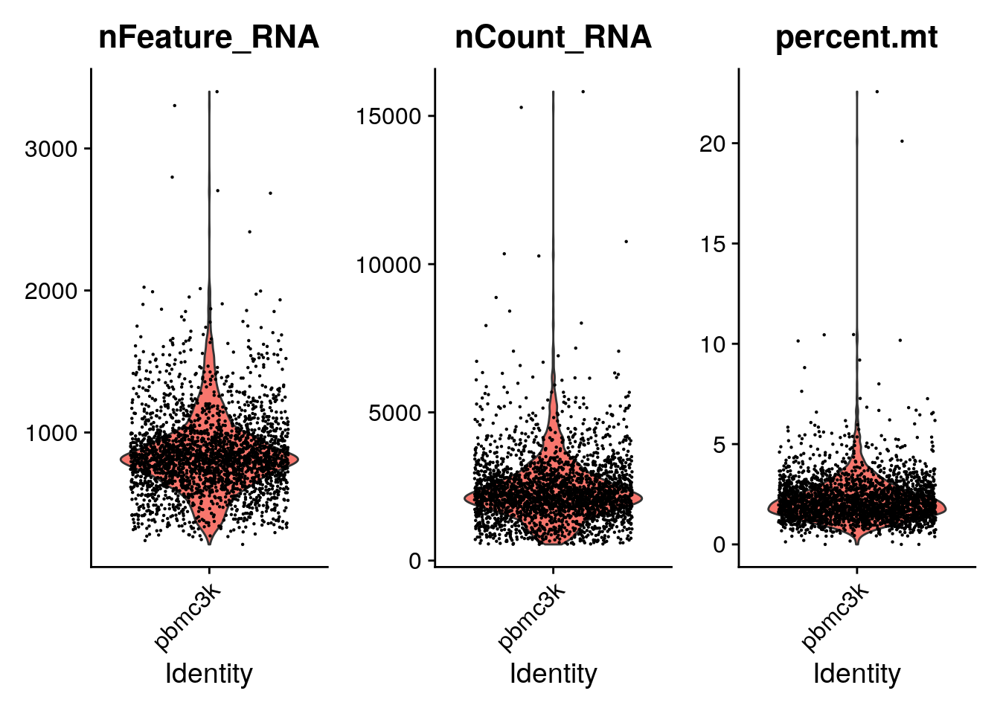
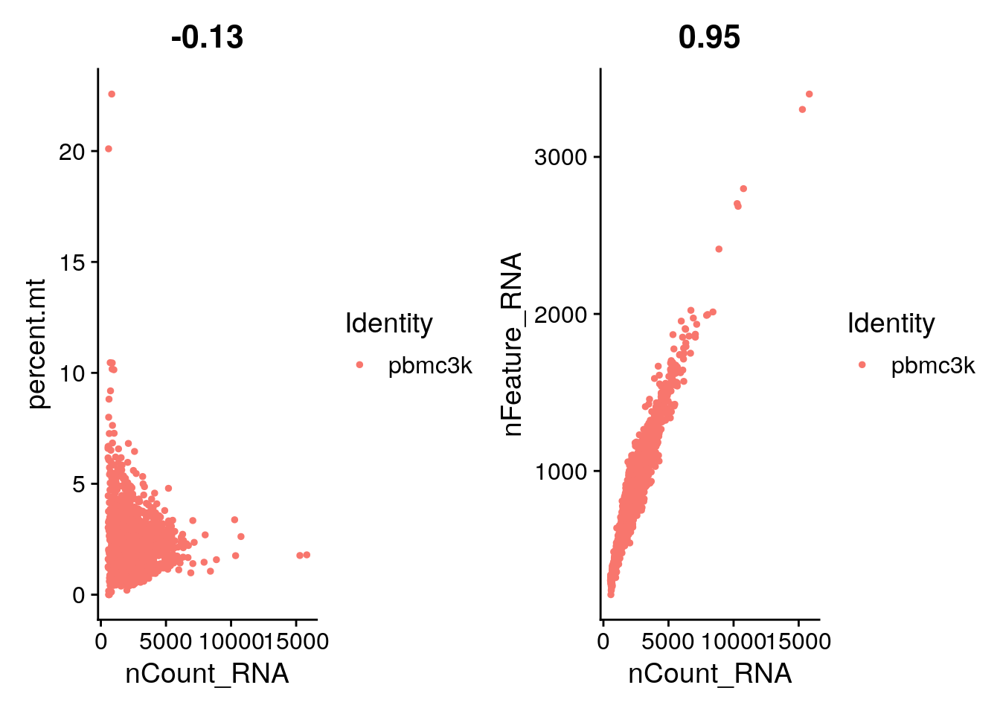
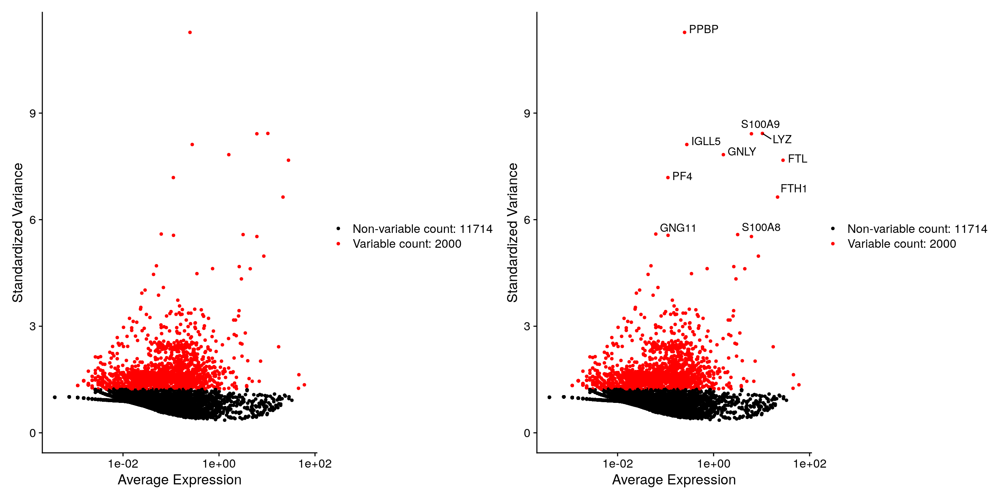
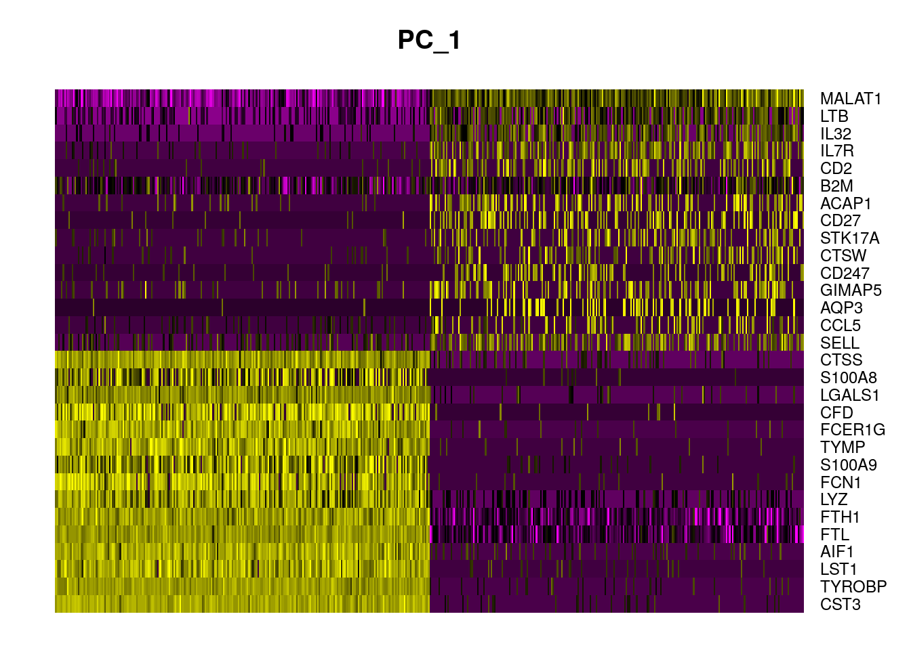
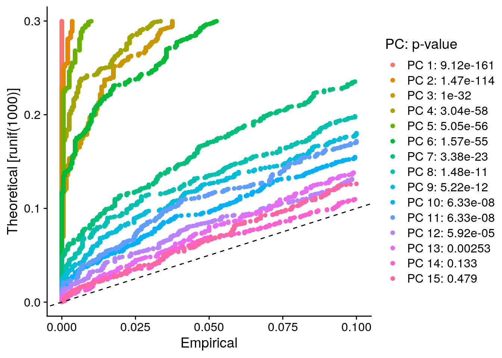
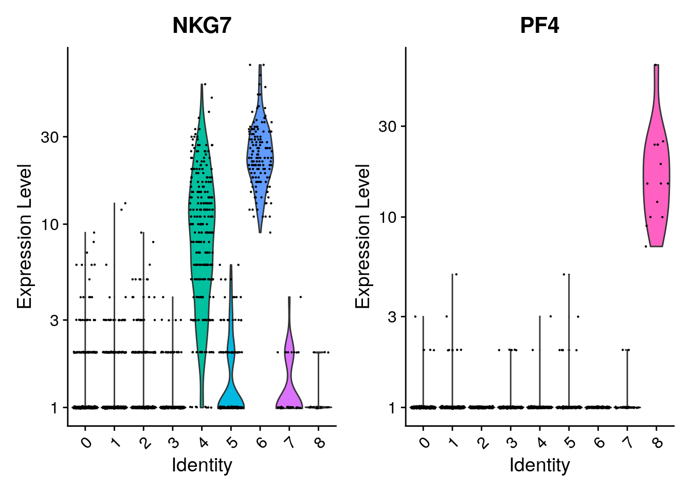
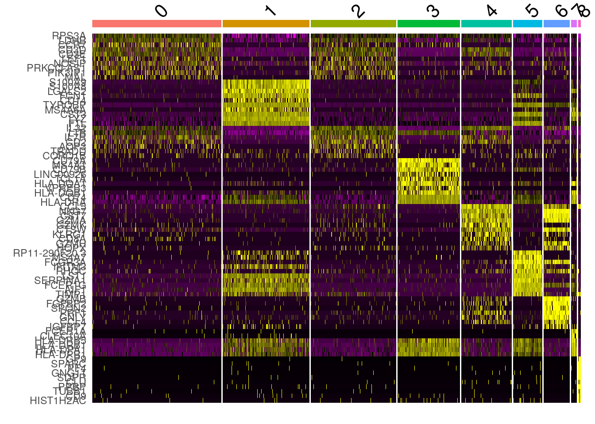
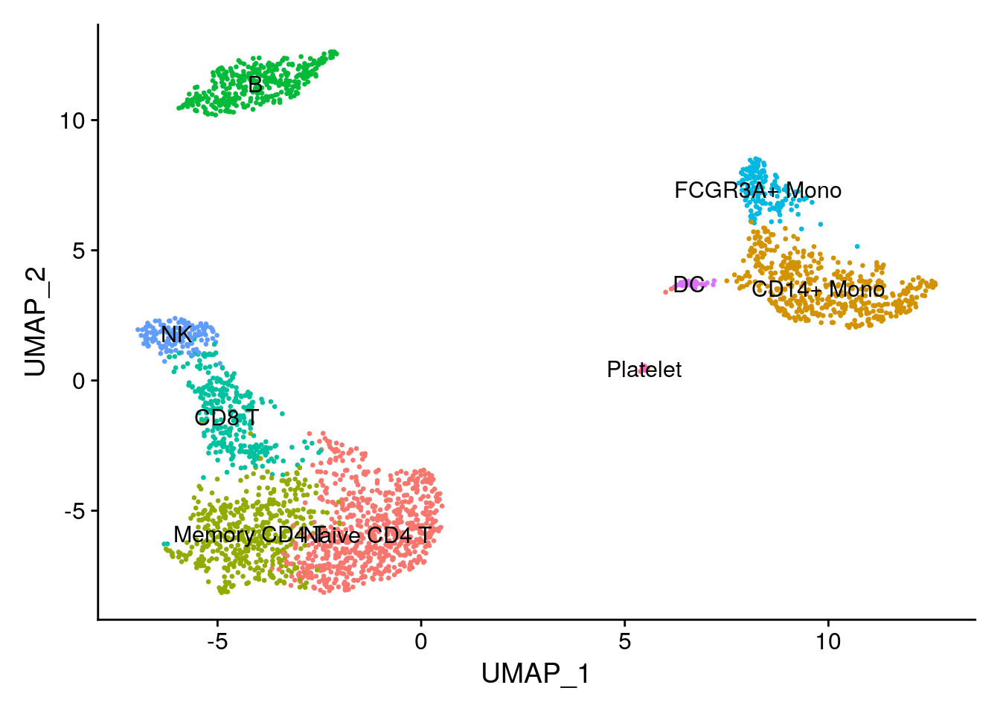

# Introducción a Seurat

Instructor: [Kevin E. Meza-Landeros](https://twitter.com/KevsGenomic)

## Diapositivas

Presentación: [aquí](https://docs.google.com/presentation/d/18ZCddwDD9lY8j4gmt1fO-Xqa8qJwCh_Zu_kXSjluW1Q/edit?usp=sharing) 

## Una perspectiva diferente 

**Seurat** es un paquete R diseñado para control de calidad, análisis y exploración de datos de secuencia de ARN de una sola célula. Seurat tiene como objetivo permitir a los usuarios identificar e interpretar fuentes de heterogeneidad a partir de mediciones transcriptómicas unicelulares e integrar diversos tipos de datos unicelulares. 

Seurat es desarrollado y mantenido por el laboratorio de [Satija](https://satijalab.org/seurat/authors.html) y se publica bajo la Licencia Pública GNU (GPL 3.0).

En este tutorial se ve como procesar los datos de **scRNAseq** con un nuevo paquete. Los pasos a realizar son en esencia los mismos que ya revisamos con el tutorial de la OSCA de RStudio.  
No olvides nunca que el paquete mas adecuado y que deberás utilizar dependerá mayoritariamente de tus datos y el procesamiento que se adecúe a estos.  

**Además... siempre es bueno diversos puntos de vista sobre las cosas, ¿no es así?**

Aprende mas sobre Seurat: [aquí](https://satijalab.org/seurat/)

## Kick-start

En este tutorial partimos a partir de que ya se tienen los archivos FASTQ resultados de secuenciación.  

- ¿Con qué datos estoy trabajando?

Peripheral Blood Mononuclear Cells **(PBMC)** disponibles gratuitamente de **10X Genomics**. Son en total 2,700 céluas únicas secuenciadas con **Illumina NextSeq 500**.

Puedes descargar los datos de [aquí](https://cf.10xgenomics.com/samples/cell/pbmc3k/pbmc3k_filtered_gene_bc_matrices.tar.gz) (7.3MB).  
Descarga el archivo comprimido y procede a descomprimirlo. Se creara el siguiente directorio *filtered_gene_bc_matrices/hg19/*, aquí estarán los archivos que necesitaremos. A continuación lo haremos con código de **R**.

Este tutorial solo es la punta del *iceberg* de lo que se puede hacer con la paquetera de Seurat. Para comenzar a sumergirte en este mundo no dudes en visitar la página oficial mantenida por Satija Lab [Vignettes](https://satijalab.org/seurat/articles/get_started.html)

A continuación estableceremos nuestros directorio de trabajo y leeremos los datos anteriores.  
La función Read10X() lee en la salida de cellranger de 10X (de donde se obtuvieron los FASTQs), devolviendo una matriz de recuento única identificada molecularmente (UMI). Los valores en esta matriz representan el número de moléculas para cada característica (es decir, gen; fila) que se detectan en cada célula (columna).


```r
## Cargar paquetes de R
library("BiocFileCache") ## para descargar datos
library("dplyr") ## para filtar datos
library("Seurat") ## paquete principal de este capítulo
library("patchwork") ## para graficar imágenes juntas
```


```r
# Usemos datos de pbmc3k tal y como lo hacen en
# https://satijalab.org/seurat/articles/pbmc3k_tutorial.html
# pero con nuestro propio código
bfc <- BiocFileCache()
raw.path <- bfcrpath(bfc, file.path(
    "http://cf.10xgenomics.com/samples",
    "cell/pbmc3k/pbmc3k_filtered_gene_bc_matrices.tar.gz"
))
```

```
## adding rname 'http://cf.10xgenomics.com/samples/cell/pbmc3k/pbmc3k_filtered_gene_bc_matrices.tar.gz'
```

```r
untar(raw.path, exdir = file.path(tempdir(), "pbmc3k"))
fname <- file.path(tempdir(), "pbmc3k/filtered_gene_bc_matrices/hg19")

# Load the PBMC dataset
pbmc.data <- Read10X(data.dir = fname)
# Initialize the Seurat object with the raw (non-normalized data).
pbmc <- CreateSeuratObject(counts = pbmc.data, project = "pbmc3k", min.cells = 3, min.features = 200)
```

```
## Warning: Feature names cannot have underscores ('_'), replacing with dashes
## ('-')
```

```r
pbmc
```

```
## An object of class Seurat 
## 13714 features across 2700 samples within 1 assay 
## Active assay: RNA (13714 features, 0 variable features)
```

Veamos la estructura del Objeto de Seurat


```r
str(pbmc)
```

```
## Formal class 'Seurat' [package "SeuratObject"] with 13 slots
##   ..@ assays      :List of 1
##   .. ..$ RNA:Formal class 'Assay' [package "SeuratObject"] with 8 slots
##   .. .. .. ..@ counts       :Formal class 'dgCMatrix' [package "Matrix"] with 6 slots
##   .. .. .. .. .. ..@ i       : int [1:2282976] 29 73 80 148 163 184 186 227 229 230 ...
##   .. .. .. .. .. ..@ p       : int [1:2701] 0 779 2131 3260 4220 4741 5522 6304 7094 7626 ...
##   .. .. .. .. .. ..@ Dim     : int [1:2] 13714 2700
##   .. .. .. .. .. ..@ Dimnames:List of 2
##   .. .. .. .. .. .. ..$ : chr [1:13714] "AL627309.1" "AP006222.2" "RP11-206L10.2" "RP11-206L10.9" ...
##   .. .. .. .. .. .. ..$ : chr [1:2700] "AAACATACAACCAC-1" "AAACATTGAGCTAC-1" "AAACATTGATCAGC-1" "AAACCGTGCTTCCG-1" ...
##   .. .. .. .. .. ..@ x       : num [1:2282976] 1 1 2 1 1 1 1 41 1 1 ...
##   .. .. .. .. .. ..@ factors : list()
##   .. .. .. ..@ data         :Formal class 'dgCMatrix' [package "Matrix"] with 6 slots
##   .. .. .. .. .. ..@ i       : int [1:2282976] 29 73 80 148 163 184 186 227 229 230 ...
##   .. .. .. .. .. ..@ p       : int [1:2701] 0 779 2131 3260 4220 4741 5522 6304 7094 7626 ...
##   .. .. .. .. .. ..@ Dim     : int [1:2] 13714 2700
##   .. .. .. .. .. ..@ Dimnames:List of 2
##   .. .. .. .. .. .. ..$ : chr [1:13714] "AL627309.1" "AP006222.2" "RP11-206L10.2" "RP11-206L10.9" ...
##   .. .. .. .. .. .. ..$ : chr [1:2700] "AAACATACAACCAC-1" "AAACATTGAGCTAC-1" "AAACATTGATCAGC-1" "AAACCGTGCTTCCG-1" ...
##   .. .. .. .. .. ..@ x       : num [1:2282976] 1 1 2 1 1 1 1 41 1 1 ...
##   .. .. .. .. .. ..@ factors : list()
##   .. .. .. ..@ scale.data   : num[0 , 0 ] 
##   .. .. .. ..@ key          : chr "rna_"
##   .. .. .. ..@ assay.orig   : NULL
##   .. .. .. ..@ var.features : logi(0) 
##   .. .. .. ..@ meta.features:'data.frame':	13714 obs. of  0 variables
##   .. .. .. ..@ misc         : list()
##   ..@ meta.data   :'data.frame':	2700 obs. of  3 variables:
##   .. ..$ orig.ident  : Factor w/ 1 level "pbmc3k": 1 1 1 1 1 1 1 1 1 1 ...
##   .. ..$ nCount_RNA  : num [1:2700] 2419 4903 3147 2639 980 ...
##   .. ..$ nFeature_RNA: int [1:2700] 779 1352 1129 960 521 781 782 790 532 550 ...
##   ..@ active.assay: chr "RNA"
##   ..@ active.ident: Factor w/ 1 level "pbmc3k": 1 1 1 1 1 1 1 1 1 1 ...
##   .. ..- attr(*, "names")= chr [1:2700] "AAACATACAACCAC-1" "AAACATTGAGCTAC-1" "AAACATTGATCAGC-1" "AAACCGTGCTTCCG-1" ...
##   ..@ graphs      : list()
##   ..@ neighbors   : list()
##   ..@ reductions  : list()
##   ..@ images      : list()
##   ..@ project.name: chr "pbmc3k"
##   ..@ misc        : list()
##   ..@ version     :Classes 'package_version', 'numeric_version'  hidden list of 1
##   .. ..$ : int [1:3] 4 0 2
##   ..@ commands    : list()
##   ..@ tools       : list()
```

- ¿Cómo accedemos a cada slot?

Clase **Seurat**.  

La **información resumida sobre los objetos de `Seurat`** se puede obtener de forma rápida y sencilla mediante las funciones estándar de R. La forma / dimensiones del objeto se pueden encontrar usando las funciones `dim()`, `ncol()` y `nrow()`; Los nombres de celda y característica se pueden encontrar usando las funciones `colnames()` y `rownames()`, respectivamente, o la función `dimnames()`. Se puede obtener un vector de nombres de objetos `Assay`, `DimReduc` y `Graph` contenidos en un objeto Seurat mediante el uso de nombres. 


```r
dim(pbmc)
```

```
## [1] 13714  2700
```

```r
head(rownames(pbmc))
```

```
## [1] "AL627309.1"    "AP006222.2"    "RP11-206L10.2" "RP11-206L10.9"
## [5] "LINC00115"     "NOC2L"
```

```r
head(colnames(pbmc))
```

```
## [1] "AAACATACAACCAC-1" "AAACATTGAGCTAC-1" "AAACATTGATCAGC-1" "AAACCGTGCTTCCG-1"
## [5] "AAACCGTGTATGCG-1" "AAACGCACTGGTAC-1"
```

Se puede obtener un vector de nombres de objetos `Assay`, `DimReduc` y `Graph` contenidos en un objeto Seurat mediante el uso de nombres. 

La extracción de objetos específicos de `Assay`, `DimReduc` o `Graph` se puede realizar con el operador doble `[[ ]]` extract. La adición de nuevos objetos a un objeto de Seurat también se hace con el operador doble `[[ ]]` extract; Seurat averiguará a qué parte del objeto Seurat pertenece un nuevo objeto asociado. 


```r
names(pbmc)
```

```
## [1] "RNA"
```

```r
pbmc[["RNA"]]
```

```
## Assay data with 13714 features for 2700 cells
## First 10 features:
##  AL627309.1, AP006222.2, RP11-206L10.2, RP11-206L10.9, LINC00115, NOC2L,
## KLHL17, PLEKHN1, RP11-54O7.17, HES4
```

```r
# pbmc[['tsne']]
```

El acceso a los datos de un objeto Seurat se realiza con la función `GetAssayData()`. La adición de datos de expresión a `counts`, `data`, o `scale.data` se puede hacer con `SetAssayData()`. Los datos nuevos deben tener las mismas celdas en el mismo orden que los datos de la expresión actual. Los datos agregados a los recuentos o datos deben tener las mismas características que los datos de la expresión actual. 


```r
GetAssayData(object = pbmc, slot = "data")[1:3, 1:3]
```

```
## 3 x 3 sparse Matrix of class "dgCMatrix"
##               AAACATACAACCAC-1 AAACATTGAGCTAC-1 AAACATTGATCAGC-1
## AL627309.1                   .                .                .
## AP006222.2                   .                .                .
## RP11-206L10.2                .                .                .
```

Metadata de las Células.  

Se puede acceder a los metadatos a nivel de celda con el operador de extracción `[[ ]]` extract o usando `$sigil`. Extraer con `$sigil` significa que solo se puede extraer un bit de metadatos a la vez, aunque se ha habilitado el autocompletado de pestañas, lo que lo hace ideal para uso interactivo. La adición de metadatos a nivel de celda se puede configurar usando el operador de extracción único `[[ ]]` también, o usando `AddMetaData`. 


```r
head(pbmc@meta.data)
```

```
##                  orig.ident nCount_RNA nFeature_RNA
## AAACATACAACCAC-1     pbmc3k       2419          779
## AAACATTGAGCTAC-1     pbmc3k       4903         1352
## AAACATTGATCAGC-1     pbmc3k       3147         1129
## AAACCGTGCTTCCG-1     pbmc3k       2639          960
## AAACCGTGTATGCG-1     pbmc3k        980          521
## AAACGCACTGGTAC-1     pbmc3k       2163          781
```

```r
head(pbmc[[c("nCount_RNA", "nFeature_RNA")]])
```

```
##                  nCount_RNA nFeature_RNA
## AAACATACAACCAC-1       2419          779
## AAACATTGAGCTAC-1       4903         1352
## AAACATTGATCAGC-1       3147         1129
## AAACCGTGCTTCCG-1       2639          960
## AAACCGTGTATGCG-1        980          521
## AAACGCACTGGTAC-1       2163          781
```

```r
# Passing `drop = TRUE` will turn the meta data into a names vector
# with each entry being named for the cell it corresponds to
head(pbmc[["nCount_RNA", drop = TRUE]])
```

```
## AAACATACAACCAC-1 AAACATTGAGCTAC-1 AAACATTGATCAGC-1 AAACCGTGCTTCCG-1 
##             2419             4903             3147             2639 
## AAACCGTGTATGCG-1 AAACGCACTGGTAC-1 
##              980             2163
```

La **clase Assay** almacena datos de una sola celda.

Para los experimentos típicos de scRNA-seq, un objeto Seurat tendrá un único ensayo ("RNA"). Este ensayo también almacenará múltiples 'transformaciones' de los datos, incluidos recuentos sin procesar (ranura `@counts`), datos normalizados (ranura `@data`) y datos escalados para la reducción dimensional (ranura `@scale.data`).

Para experimentos más complejos, un objeto podría contener múltiples ensayos. Estos podrían incluir tipos de datos multimodales (etiquetas derivadas de anticuerpos CITE-seq, ADT) o mediciones imputadas / corregidas por lotes. Cada uno de esos ensayos tiene la opción de almacenar también las mismas transformaciones de datos. 

- ¿Cómo se ven los datos en una matriz de recuento? 

Examinemos algunos genes en las primeras treinta células. Los valores en la matriz representan ceros (no se detectan moléculas). Dado que la mayoría de los valores en una matriz scRNA-seq son 0, Seurat utiliza una representación de **matriz dispersa (*sparse matrix*)** siempre que sea posible. Esto da como resultado un ahorro significativo de memoria y velocidad.  


```r
pbmc.data[c("CD3D", "TCL1A", "MS4A1"), 1:30]
```

```
## 3 x 30 sparse Matrix of class "dgCMatrix"
```

```
##    [[ suppressing 30 column names 'AAACATACAACCAC-1', 'AAACATTGAGCTAC-1', 'AAACATTGATCAGC-1' ... ]]
```

```
##                                                                    
## CD3D  4 . 10 . . 1 2 3 1 . . 2 7 1 . . 1 3 . 2  3 . . . . . 3 4 1 5
## TCL1A . .  . . . . . . 1 . . . . . . . . . . .  . 1 . . . . . . . .
## MS4A1 . 6  . . . . . . 1 1 1 . . . . . . . . . 36 1 2 . . 2 . . . .
```

```r
dense.size <- object.size(as.matrix(pbmc.data))
dense.size
```

```
## 709591472 bytes
```

```r
sparse.size <- object.size(pbmc.data)
sparse.size
```

```
## 29905192 bytes
```

```r
dense.size / sparse.size
```

```
## 23.7 bytes
```

¡EN ESTE CASO UNA MATRIZ NO DISPERSA OCUPA ~ 24 VECES MAS ESPACIO!

## Quality Control

Algunas métricas de control de calidad comúnmente utilizadas por la comunidad incluyen:

- El número de **genes únicos** detectados en cada célula.
    - Las células de baja calidad o las gotitas vacías suelen tener muy pocos genes.
    - Los dobletes o multipletes celulares pueden exhibir un recuento de genes aberrantemente alto
- De manera similar, el **número total de moléculas** detectadas dentro de una célula (se correlaciona fuertemente con genes únicos).
- El porcentaje de **lecturas que se asignan al genoma mitocondrial**.
    - Las células de baja calidad / moribundas a menudo exhiben una extensa contaminación mitocondrial
    - Calculamos métricas de control de calidad mitocondrial con la función `PercentageFeatureSet()`, que calcula el porcentaje de recuentos que se originan a partir de un conjunto de características.

El operador `[[` puede agregar columnas a los metadatos del objeto. Este es un gran lugar para almacenar estadísticas de control de calidad. Entonces calculamos y añadimos la cantidad de lecturas que corresponden al genoma mitocondrial.


```r
pbmc[["percent.mt"]] <- PercentageFeatureSet(pbmc, pattern = "^MT-")
```

Visualizamos las métricas de control de calidad mencionadas anteriormente como un diagrama de violín. Ademas vemos la correlación entre el numero de moléculas de RNA detectadas en cada célula con el número de genes únicos y con el porcentaje de lecturas que corresponden a mtADN.


```r
VlnPlot(pbmc, features = c("nFeature_RNA", "nCount_RNA", "percent.mt"), ncol = 3)
```



```r
plot1 <- FeatureScatter(pbmc, feature1 = "nCount_RNA", feature2 = "percent.mt")
plot2 <- FeatureScatter(pbmc, feature1 = "nCount_RNA", feature2 = "nFeature_RNA")
plot1 + plot2
```



Finalmente filtramos aquellas células que se salen de los estándares de cada uno de los parámetros.


```r
# Filter
pbmc <- subset(pbmc, subset = nFeature_RNA > 200 & nFeature_RNA < 2500 & percent.mt < 5)
```

- ¿Dónde se almacenan la métricas de QC en Seurat?

Están almacenadas en la seccion de `@meta.data` del objeto Seurat.


```r
head(pbmc@meta.data, 5)
```

```
##                  orig.ident nCount_RNA nFeature_RNA percent.mt
## AAACATACAACCAC-1     pbmc3k       2419          779  3.0177759
## AAACATTGAGCTAC-1     pbmc3k       4903         1352  3.7935958
## AAACATTGATCAGC-1     pbmc3k       3147         1129  0.8897363
## AAACCGTGCTTCCG-1     pbmc3k       2639          960  1.7430845
## AAACCGTGTATGCG-1     pbmc3k        980          521  1.2244898
```

## Normalización

De forma predeterminada, se emplea un método de normalización de escala global **"LogNormalize"** que normaliza las medidas de expresión de características para cada célula por la expresión total, multiplica esto por un factor de escala (10.000 por defecto) y transforma el resultado en logaritmos. Los valores normalizados se almacenan en pbmc `[["RNA"]]@data`.


```r
pbmc <- NormalizeData(pbmc, normalization.method = "LogNormalize", scale.factor = 10000)
```

## Detección de genes (caractersticas) altamente variables

A continuación, calculamos un subconjunto de **características que exhiben una alta variación de célula a célula en el conjunto de datos** (es decir, están altamente expresadas en algunas células y poco expresadas en otras). El equipo de Seurat y otros equipos han descubierto que centrarse en estos genes en el análisis posterior ayuda a resaltar la señal biológica en conjuntos de datos unicelulares.

El procedimiento en Seurat mejora a comparación de las versiones anteriores al modelar directamente la relación de varianza media inherente a los datos de una sola célula, y se implementa en la función `FindVariableFeatures()`. De forma predeterminada, **se devuelven 2000 características por conjunto de datos** (aunque se puede modificar). Estos se utilizarán en análisis posteriores, como PCA. 


```r
pbmc <- FindVariableFeatures(pbmc, selection.method = "vst", nfeatures = 2000)

# Identify the 10 most highly variable genes
top10 <- head(VariableFeatures(pbmc), 10)
top10
```

```
##  [1] "PPBP"   "LYZ"    "S100A9" "IGLL5"  "GNLY"   "FTL"    "PF4"    "FTH1"  
##  [9] "GNG11"  "S100A8"
```

```r
# plot variable features with and without labels
plot1 <- VariableFeaturePlot(pbmc)
plot2 <- LabelPoints(plot = plot1, points = top10, repel = TRUE)
```

```
## When using repel, set xnudge and ynudge to 0 for optimal results
```

```r
plot1 + plot2
```

```
## Warning: Transformation introduced infinite values in continuous x-axis
```

```
## Warning: Removed 1 rows containing missing values (geom_point).
```

```
## Warning: Transformation introduced infinite values in continuous x-axis
```

```
## Warning: Removed 1 rows containing missing values (geom_point).
```



## Escalar los datos

A continuación, aplicamos una transformación lineal ("escalado") que es un paso de preprocesamiento estándar antes de las técnicas de reducción dimensional como PCA. La función `ScaleData()`:

- Cambia la expresión de cada gen, de modo que **la expresión media en las células sea 0**
- Escala la expresión de cada gen, de modo que **la varianza entre las células sea 1**
     - Este paso otorga el mismo peso en los análisis posteriores, de modo que los genes altamente expresados no dominen
     
Los resultados de esto se almacenan en pbmc `[["RNA"]]@scale.data`.


```r
all.genes <- rownames(pbmc)
pbmc <- ScaleData(pbmc, features = all.genes)
```

```
## Centering and scaling data matrix
```

## Reducción dimensional lineal

A continuación, realizamos **PCA** sobre los datos escalados. De forma predeterminada, solo las características variables determinadas previamente se utilizan como entrada, pero se pueden definir mediante el argumento de características si desea elegir un subconjunto diferente. 


```r
pbmc <- RunPCA(pbmc, features = VariableFeatures(object = pbmc))
```

```
## PC_ 1 
## Positive:  CST3, TYROBP, LST1, AIF1, FTL, FTH1, LYZ, FCN1, S100A9, TYMP 
## 	   FCER1G, CFD, LGALS1, S100A8, CTSS, LGALS2, SERPINA1, IFITM3, SPI1, CFP 
## 	   PSAP, IFI30, SAT1, COTL1, S100A11, NPC2, GRN, LGALS3, GSTP1, PYCARD 
## Negative:  MALAT1, LTB, IL32, IL7R, CD2, B2M, ACAP1, CD27, STK17A, CTSW 
## 	   CD247, GIMAP5, AQP3, CCL5, SELL, TRAF3IP3, GZMA, MAL, CST7, ITM2A 
## 	   MYC, GIMAP7, HOPX, BEX2, LDLRAP1, GZMK, ETS1, ZAP70, TNFAIP8, RIC3 
## PC_ 2 
## Positive:  CD79A, MS4A1, TCL1A, HLA-DQA1, HLA-DQB1, HLA-DRA, LINC00926, CD79B, HLA-DRB1, CD74 
## 	   HLA-DMA, HLA-DPB1, HLA-DQA2, CD37, HLA-DRB5, HLA-DMB, HLA-DPA1, FCRLA, HVCN1, LTB 
## 	   BLNK, P2RX5, IGLL5, IRF8, SWAP70, ARHGAP24, FCGR2B, SMIM14, PPP1R14A, C16orf74 
## Negative:  NKG7, PRF1, CST7, GZMB, GZMA, FGFBP2, CTSW, GNLY, B2M, SPON2 
## 	   CCL4, GZMH, FCGR3A, CCL5, CD247, XCL2, CLIC3, AKR1C3, SRGN, HOPX 
## 	   TTC38, APMAP, CTSC, S100A4, IGFBP7, ANXA1, ID2, IL32, XCL1, RHOC 
## PC_ 3 
## Positive:  HLA-DQA1, CD79A, CD79B, HLA-DQB1, HLA-DPB1, HLA-DPA1, CD74, MS4A1, HLA-DRB1, HLA-DRA 
## 	   HLA-DRB5, HLA-DQA2, TCL1A, LINC00926, HLA-DMB, HLA-DMA, CD37, HVCN1, FCRLA, IRF8 
## 	   PLAC8, BLNK, MALAT1, SMIM14, PLD4, P2RX5, IGLL5, LAT2, SWAP70, FCGR2B 
## Negative:  PPBP, PF4, SDPR, SPARC, GNG11, NRGN, GP9, RGS18, TUBB1, CLU 
## 	   HIST1H2AC, AP001189.4, ITGA2B, CD9, TMEM40, PTCRA, CA2, ACRBP, MMD, TREML1 
## 	   NGFRAP1, F13A1, SEPT5, RUFY1, TSC22D1, MPP1, CMTM5, RP11-367G6.3, MYL9, GP1BA 
## PC_ 4 
## Positive:  HLA-DQA1, CD79B, CD79A, MS4A1, HLA-DQB1, CD74, HIST1H2AC, HLA-DPB1, PF4, SDPR 
## 	   TCL1A, HLA-DRB1, HLA-DPA1, HLA-DQA2, PPBP, HLA-DRA, LINC00926, GNG11, SPARC, HLA-DRB5 
## 	   GP9, AP001189.4, CA2, PTCRA, CD9, NRGN, RGS18, CLU, TUBB1, GZMB 
## Negative:  VIM, IL7R, S100A6, IL32, S100A8, S100A4, GIMAP7, S100A10, S100A9, MAL 
## 	   AQP3, CD2, CD14, FYB, LGALS2, GIMAP4, ANXA1, CD27, FCN1, RBP7 
## 	   LYZ, S100A11, GIMAP5, MS4A6A, S100A12, FOLR3, TRABD2A, AIF1, IL8, IFI6 
## PC_ 5 
## Positive:  GZMB, NKG7, S100A8, FGFBP2, GNLY, CCL4, CST7, PRF1, GZMA, SPON2 
## 	   GZMH, S100A9, LGALS2, CCL3, CTSW, XCL2, CD14, CLIC3, S100A12, RBP7 
## 	   CCL5, MS4A6A, GSTP1, FOLR3, IGFBP7, TYROBP, TTC38, AKR1C3, XCL1, HOPX 
## Negative:  LTB, IL7R, CKB, VIM, MS4A7, AQP3, CYTIP, RP11-290F20.3, SIGLEC10, HMOX1 
## 	   LILRB2, PTGES3, MAL, CD27, HN1, CD2, GDI2, CORO1B, ANXA5, TUBA1B 
## 	   FAM110A, ATP1A1, TRADD, PPA1, CCDC109B, ABRACL, CTD-2006K23.1, WARS, VMO1, FYB
```

Seurat proporciona varias formas útiles de visualizar tanto las células como las características que definen el PCA, incluidas `VizDimReduction()`, `DimPlot()` y `DimHeatmap()`.

Puedes examinar y visualizar los resultados de PCA de diferentes formas. 


```r
print(pbmc[["pca"]], dims = 1:5, nfeatures = 5)
```

```
## PC_ 1 
## Positive:  CST3, TYROBP, LST1, AIF1, FTL 
## Negative:  MALAT1, LTB, IL32, IL7R, CD2 
## PC_ 2 
## Positive:  CD79A, MS4A1, TCL1A, HLA-DQA1, HLA-DQB1 
## Negative:  NKG7, PRF1, CST7, GZMB, GZMA 
## PC_ 3 
## Positive:  HLA-DQA1, CD79A, CD79B, HLA-DQB1, HLA-DPB1 
## Negative:  PPBP, PF4, SDPR, SPARC, GNG11 
## PC_ 4 
## Positive:  HLA-DQA1, CD79B, CD79A, MS4A1, HLA-DQB1 
## Negative:  VIM, IL7R, S100A6, IL32, S100A8 
## PC_ 5 
## Positive:  GZMB, NKG7, S100A8, FGFBP2, GNLY 
## Negative:  LTB, IL7R, CKB, VIM, MS4A7
```

```r
VizDimLoadings(pbmc, dims = 1:2, reduction = "pca")
```


```r
DimPlot(pbmc, reduction = "pca")
```


En particular, `DimHeatmap()` permite una fácil exploración de las fuentes primarias de heterogeneidad en un conjunto de datos y puede ser útil cuando se intenta decidir qué PC incluir para análisis posteriores posteriores. Tanto las células como las características se ordenan de acuerdo con sus puntajes de PCA. Establecer `cells` en un número traza las células "extremas" en ambos extremos del espectro, lo que acelera drásticamente el trazado de grandes conjuntos de datos. Aunque claramente es un análisis supervisado, consideramos que esta es una herramienta valiosa para explorar conjuntos de características correlacionadas. 


```r
DimHeatmap(pbmc, dims = 1, cells = 500, balanced = TRUE)
```



```r
DimHeatmap(pbmc, dims = 1:15, cells = 500, balanced = TRUE)
```


## Determinar la dimensionalidad del conjunto de datos 

Para superar el extenso ruido técnico en cualquier característica única para los datos de scRNA-seq, Seurat agrupa las células en función de sus puntuaciones de PCA, y cada PC representa esencialmente una "metafunción" que combina información en un conjunto de características correlacionadas. Por lo tanto, los componentes principales principales representan una compresión sólida del conjunto de datos. **Sin embargo, ¿cuántos componentes deberíamos elegir incluir? 10? 20? 100?**

En Macosko et al, implementamos una prueba de remuestreo inspirada en el **procedimiento JackStraw**. Permutamos aleatoriamente un subconjunto de los datos (1% por defecto) y volvemos a ejecutar PCA, construyendo una "distribución nula" de puntuaciones de características, y repetimos este procedimiento. Identificamos PC "importantes" como aquellas que tienen un gran enriquecimiento de características de bajo valor p. 


```r
# NOTE: This process can take a long time for big datasets, comment out for expediency. More
# approximate techniques such as those implemented in ElbowPlot() can be used to reduce
# computation time
pbmc <- JackStraw(pbmc, num.replicate = 100)
pbmc <- ScoreJackStraw(pbmc, dims = 1:20)
```

La función `JackStrawPlot()` proporciona una herramienta de visualización para comparar la distribución de los *p-values* para cada PC con una distribución uniforme (línea discontinua). Las PC "significativas" mostrarán un gran enriquecimiento de funciones con valores p bajos (curva sólida por encima de la línea discontinua). En este caso, parece que hay una fuerte caída en la importancia después de los primeros 10-12 PCs. 


```r
JackStrawPlot(pbmc, dims = 1:15)
```

```
## Warning: Removed 23510 rows containing missing values (geom_point).
```



Un método heurístico alternativo genera un **"diagrama de codo (Elbow Plot)"**: una clasificación de componentes principales basada en el porcentaje de varianza explicada por cada uno (función `ElbowPlot()`). En este ejemplo, podemos observar un "codo" alrededor de PC9-10, lo que sugiere que la mayor parte de la señal verdadera se captura en las primeras 10 PC. 


```r
ElbowPlot(pbmc)
```


## Clustering 


```r
pbmc <- FindNeighbors(pbmc, dims = 1:10)
```

```
## Computing nearest neighbor graph
```

```
## Computing SNN
```

```r
pbmc <- FindClusters(pbmc, resolution = 0.5)
```

```
## Modularity Optimizer version 1.3.0 by Ludo Waltman and Nees Jan van Eck
## 
## Number of nodes: 2638
## Number of edges: 95927
## 
## Running Louvain algorithm...
## Maximum modularity in 10 random starts: 0.8728
## Number of communities: 9
## Elapsed time: 0 seconds
```

## Reducción dimensional no lineal (UMAP/tSNE)

Seurat ofrece varias técnicas de reducción dimensional no lineal, como **tSNE** y **UMAP**, para visualizar y explorar estos conjuntos de datos. El objetivo de estos algoritmos es aprender la variedad subyacente de los datos para colocar células similares juntas en un espacio de baja dimensión. Las células dentro de los grupos basados en gráficos determinados anteriormente deben ubicarse conjuntamente en estos gráficos de reducción de dimensión. Como entrada para UMAP y tSNE, sugerimos usar las mismas PC como entrada para el análisis de agrupamiento. 


```r
# If you haven't installed UMAP, you can do so via reticulate::py_install(packages = 'umap-learn')
pbmc <- RunUMAP(pbmc, dims = 1:10)
```

```
## Warning: The default method for RunUMAP has changed from calling Python UMAP via reticulate to the R-native UWOT using the cosine metric
## To use Python UMAP via reticulate, set umap.method to 'umap-learn' and metric to 'correlation'
## This message will be shown once per session
```

```
## 05:02:26 UMAP embedding parameters a = 0.9922 b = 1.112
```

```
## 05:02:26 Read 2638 rows and found 10 numeric columns
```

```
## 05:02:26 Using Annoy for neighbor search, n_neighbors = 30
```

```
## 05:02:26 Building Annoy index with metric = cosine, n_trees = 50
```

```
## 0%   10   20   30   40   50   60   70   80   90   100%
```

```
## [----|----|----|----|----|----|----|----|----|----|
```

```
## **************************************************|
## 05:02:27 Writing NN index file to temp file /tmp/Rtmpavjzwz/file49e72f0f7c7
## 05:02:27 Searching Annoy index using 1 thread, search_k = 3000
## 05:02:28 Annoy recall = 100%
## 05:02:28 Commencing smooth kNN distance calibration using 1 thread
## 05:02:28 Initializing from normalized Laplacian + noise
## 05:02:29 Commencing optimization for 500 epochs, with 105140 positive edges
## 05:02:33 Optimization finished
```

```r
# Note that you can set `label = TRUE` or use the LabelClusters function to help label
# individual clusters
DimPlot(pbmc, reduction = "umap")
```


Puede guardar el objeto en este punto para que se pueda volver a cargar fácilmente sin tener que volver a ejecutar los pasos computacionalmente intensivos realizados anteriormente o compartir fácilmente con los colaboradores. 


```r
if (interactive()) {
    saveRDS(pbmc, file = "pbmc_tutorial.rds")
}
```

## Caracteristicas diferencialmente expresadas (biomarcadores de los clusters)

Seurat puede ayudarlo a encontrar marcadores que definan clústeres mediante expresión diferencial. De forma predeterminada, identifica **marcadores positivos y negativos de un solo grupo (especificado en ident.1), en comparación con todas las demás células**. `FindAllMarkers()` automatiza este proceso para todos los clústeres, pero **también se pueden comparar grupos de clústeres entre sí o contra todas las células**.

El argumento min.pct requiere que se detecte una característica en un porcentaje mínimo en cualquiera de los dos grupos de células, y el argumento `thresh.test` requiere que una característica se exprese diferencialmente (en promedio) en alguna cantidad entre los dos grupos. Puede establecer ambos en 0, pero con un aumento dramático en el tiempo, ya que esto probará una gran cantidad de características que probablemente no sean altamente discriminatorias.  
- ¿Demasiado lento?  
Como otra opción para acelerar estos cálculos, se puede configurar el número máximo de células por identificador. Esto reducirá la resolución de cada clase de identidad para que no tenga más células que las que se establezcan. Si bien generalmente habrá una pérdida de potencia, los aumentos de velocidad pueden ser significativos y es probable que las características expresadas de manera más diferencial aún se eleven a la cima. 


```r
# find all markers of cluster 2
cluster2.markers <- FindMarkers(pbmc, ident.1 = 2, min.pct = 0.25)
head(cluster2.markers, n = 5)
```

```
##             p_val avg_log2FC pct.1 pct.2    p_val_adj
## IL32 2.892340e-90  1.2013522 0.947 0.465 3.966555e-86
## LTB  1.060121e-86  1.2695776 0.981 0.643 1.453850e-82
## CD3D 8.794641e-71  0.9389621 0.922 0.432 1.206097e-66
## IL7R 3.516098e-68  1.1873213 0.750 0.326 4.821977e-64
## LDHB 1.642480e-67  0.8969774 0.954 0.614 2.252497e-63
```

```r
# find all markers distinguishing cluster 5 from clusters 0 and 3
cluster5.markers <- FindMarkers(pbmc, ident.1 = 5, ident.2 = c(0, 3), min.pct = 0.25)
head(cluster5.markers, n = 5)
```

```
##                       p_val avg_log2FC pct.1 pct.2     p_val_adj
## FCGR3A        8.246578e-205   4.261495 0.975 0.040 1.130936e-200
## IFITM3        1.677613e-195   3.879339 0.975 0.049 2.300678e-191
## CFD           2.401156e-193   3.405492 0.938 0.038 3.292945e-189
## CD68          2.900384e-191   3.020484 0.926 0.035 3.977587e-187
## RP11-290F20.3 2.513244e-186   2.720057 0.840 0.017 3.446663e-182
```

```r
# find markers for every cluster compared to all remaining cells, report only the positive
# ones
pbmc.markers <- FindAllMarkers(pbmc, only.pos = TRUE, min.pct = 0.25, logfc.threshold = 0.25)
```

```
## Calculating cluster 0
```

```
## Calculating cluster 1
```

```
## Calculating cluster 2
```

```
## Calculating cluster 3
```

```
## Calculating cluster 4
```

```
## Calculating cluster 5
```

```
## Calculating cluster 6
```

```
## Calculating cluster 7
```

```
## Calculating cluster 8
```

```r
pbmc.markers %>%
    group_by(cluster) %>%
    top_n(n = 2, wt = avg_log2FC)
```

```
## Registered S3 method overwritten by 'cli':
##   method     from         
##   print.boxx spatstat.geom
```

```
## # A tibble: 18 × 7
## # Groups:   cluster [9]
##        p_val avg_log2FC pct.1 pct.2 p_val_adj cluster gene    
##        <dbl>      <dbl> <dbl> <dbl>     <dbl> <fct>   <chr>   
##  1 3.75e-112       1.09 0.912 0.592 5.14e-108 0       LDHB    
##  2 9.57e- 88       1.36 0.447 0.108 1.31e- 83 0       CCR7    
##  3 0               5.57 0.996 0.215 0         1       S100A9  
##  4 0               5.48 0.975 0.121 0         1       S100A8  
##  5 1.06e- 86       1.27 0.981 0.643 1.45e- 82 2       LTB     
##  6 2.97e- 58       1.23 0.42  0.111 4.07e- 54 2       AQP3    
##  7 0               4.31 0.936 0.041 0         3       CD79A   
##  8 9.48e-271       3.59 0.622 0.022 1.30e-266 3       TCL1A   
##  9 5.61e-202       3.10 0.983 0.234 7.70e-198 4       CCL5    
## 10 7.25e-165       3.00 0.577 0.055 9.95e-161 4       GZMK    
## 11 3.51e-184       3.31 0.975 0.134 4.82e-180 5       FCGR3A  
## 12 2.03e-125       3.09 1     0.315 2.78e-121 5       LST1    
## 13 7.95e-269       4.83 0.961 0.068 1.09e-264 6       GZMB    
## 14 3.13e-191       5.32 0.961 0.131 4.30e-187 6       GNLY    
## 15 1.48e-220       3.87 0.812 0.011 2.03e-216 7       FCER1A  
## 16 1.67e- 21       2.87 1     0.513 2.28e- 17 7       HLA-DPB1
## 17 9.25e-186       7.29 1     0.011 1.27e-181 8       PF4     
## 18 1.92e-102       8.59 1     0.024 2.63e- 98 8       PPBP
```

Seurat tiene **varias pruebas de expresión diferencial** que se pueden configurar con el parámetro test.use (consulte nuestra viñeta DE para obtener más detalles). Por ejemplo, la **prueba ROC** devuelve el "poder de clasificación" para cualquier marcador individual (que varía de 0 - aleatorio a 1 - perfecto) .


```r
cluster0.markers <- FindMarkers(pbmc, ident.1 = 0, logfc.threshold = 0.25, test.use = "roc", only.pos = TRUE)
```

Se incluyen varias herramientas para visualizar la expresión de los marcadores. `VlnPlot()` (muestra distribuciones de probabilidad de expresión entre clústeres) y `FeaturePlot()` (visualiza la expresión de características en un gráfico tSNE o PCA) son nuestras visualizaciones más utilizadas. También sugerimos explorar `RidgePlot()`, `CellScatter()` y `DotPlot()` como métodos adicionales para ver su conjunto de datos. 


```r
VlnPlot(pbmc, features = c("MS4A1", "CD79A"))
```


```r
## you can plot raw counts as well
VlnPlot(pbmc, features = c("NKG7", "PF4"), slot = "counts", log = TRUE)
```



```r
FeaturePlot(pbmc, features = c(
    "MS4A1", "GNLY", "CD3E", "CD14", "FCER1A", "FCGR3A", "LYZ", "PPBP",
    "CD8A"
))
```


```r
# DoHeatmap() generates an expression heatmap for given cells and features. In this case, we are plotting the top 20 markers (or all markers if less than 20) for each cluster.

pbmc.markers %>%
    group_by(cluster) %>%
    top_n(n = 10, wt = avg_log2FC) -> top10
DoHeatmap(pbmc, features = top10$gene) + NoLegend()
```



## Assigning cell type identity to clusters

Podemos usar marcadores canónicos para hacer coincidir fácilmente la agrupación imparcial con los tipos de células conocidos.


```r
new.cluster.ids <- c(
    "Naive CD4 T", "CD14+ Mono", "Memory CD4 T", "B", "CD8 T", "FCGR3A+ Mono",
    "NK", "DC", "Platelet"
)
names(new.cluster.ids) <- levels(pbmc)
pbmc <- RenameIdents(pbmc, new.cluster.ids)

DimPlot(pbmc, reduction = "umap", label = TRUE, pt.size = 0.5) + NoLegend()
```



## Guardar Resultados


```r
if (interactive()) {
    saveRDS(pbmc, file = "pbmc3k_final.rds")
}
```

## Detalles de la sesión de R


```r
## Información de la sesión de R
Sys.time()
```

```
## [1] "2021-08-11 05:03:13 UTC"
```

```r
proc.time()
```

```
##    user  system elapsed 
## 182.384  11.956 131.468
```

```r
options(width = 120)
sessioninfo::session_info()
```

```
## ─ Session info ───────────────────────────────────────────────────────────────────────────────────────────────────────
##  setting  value                       
##  version  R version 4.1.0 (2021-05-18)
##  os       Ubuntu 20.04.2 LTS          
##  system   x86_64, linux-gnu           
##  ui       X11                         
##  language (EN)                        
##  collate  en_US.UTF-8                 
##  ctype    en_US.UTF-8                 
##  tz       UTC                         
##  date     2021-08-11                  
## 
## ─ Packages ───────────────────────────────────────────────────────────────────────────────────────────────────────────
##  package         * version date       lib source        
##  abind             1.4-5   2016-07-21 [1] RSPM (R 4.1.0)
##  assertthat        0.2.1   2019-03-21 [1] RSPM (R 4.1.0)
##  BiocFileCache   * 2.0.0   2021-05-19 [1] Bioconductor  
##  bit               4.0.4   2020-08-04 [1] RSPM (R 4.1.0)
##  bit64             4.0.5   2020-08-30 [1] RSPM (R 4.1.0)
##  blob              1.2.2   2021-07-23 [1] RSPM (R 4.1.0)
##  bookdown          0.22    2021-04-22 [1] RSPM (R 4.1.0)
##  bslib             0.2.5.1 2021-05-18 [1] RSPM (R 4.1.0)
##  cachem            1.0.5   2021-05-15 [2] RSPM (R 4.1.0)
##  cli               3.0.1   2021-07-17 [2] RSPM (R 4.1.0)
##  cluster           2.1.2   2021-04-17 [3] CRAN (R 4.1.0)
##  codetools         0.2-18  2020-11-04 [3] CRAN (R 4.1.0)
##  colorspace        2.0-2   2021-06-24 [1] RSPM (R 4.1.0)
##  cowplot           1.1.1   2020-12-30 [1] RSPM (R 4.1.0)
##  crayon            1.4.1   2021-02-08 [2] RSPM (R 4.1.0)
##  curl              4.3.2   2021-06-23 [2] RSPM (R 4.1.0)
##  data.table        1.14.0  2021-02-21 [1] RSPM (R 4.1.0)
##  DBI               1.1.1   2021-01-15 [1] RSPM (R 4.1.0)
##  dbplyr          * 2.1.1   2021-04-06 [1] RSPM (R 4.1.0)
##  deldir            0.2-10  2021-02-16 [1] RSPM (R 4.1.0)
##  digest            0.6.27  2020-10-24 [2] RSPM (R 4.1.0)
##  dplyr           * 1.0.7   2021-06-18 [1] RSPM (R 4.1.0)
##  ellipsis          0.3.2   2021-04-29 [2] RSPM (R 4.1.0)
##  evaluate          0.14    2019-05-28 [2] RSPM (R 4.1.0)
##  fansi             0.5.0   2021-05-25 [2] RSPM (R 4.1.0)
##  farver            2.1.0   2021-02-28 [1] RSPM (R 4.1.0)
##  fastmap           1.1.0   2021-01-25 [2] RSPM (R 4.1.0)
##  filelock          1.0.2   2018-10-05 [1] RSPM (R 4.1.0)
##  fitdistrplus      1.1-5   2021-05-28 [1] RSPM (R 4.1.0)
##  future            1.21.0  2020-12-10 [1] RSPM (R 4.1.0)
##  future.apply      1.7.0   2021-01-04 [1] RSPM (R 4.1.0)
##  generics          0.1.0   2020-10-31 [1] RSPM (R 4.1.0)
##  ggplot2           3.3.5   2021-06-25 [1] RSPM (R 4.1.0)
##  ggrepel           0.9.1   2021-01-15 [1] RSPM (R 4.1.0)
##  ggridges          0.5.3   2021-01-08 [1] RSPM (R 4.1.0)
##  globals           0.14.0  2020-11-22 [1] RSPM (R 4.1.0)
##  glue              1.4.2   2020-08-27 [2] RSPM (R 4.1.0)
##  goftest           1.2-2   2019-12-02 [1] RSPM (R 4.1.0)
##  gridExtra         2.3     2017-09-09 [1] RSPM (R 4.1.0)
##  gtable            0.3.0   2019-03-25 [1] RSPM (R 4.1.0)
##  highr             0.9     2021-04-16 [2] RSPM (R 4.1.0)
##  htmltools         0.5.1.1 2021-01-22 [1] RSPM (R 4.1.0)
##  htmlwidgets       1.5.3   2020-12-10 [1] RSPM (R 4.1.0)
##  httpuv            1.6.1   2021-05-07 [1] RSPM (R 4.1.0)
##  httr              1.4.2   2020-07-20 [2] RSPM (R 4.1.0)
##  ica               1.0-2   2018-05-24 [1] RSPM (R 4.1.0)
##  igraph            1.2.6   2020-10-06 [1] RSPM (R 4.1.0)
##  irlba             2.3.3   2019-02-05 [1] RSPM (R 4.1.0)
##  jquerylib         0.1.4   2021-04-26 [1] RSPM (R 4.1.0)
##  jsonlite          1.7.2   2020-12-09 [2] RSPM (R 4.1.0)
##  KernSmooth        2.23-20 2021-05-03 [3] CRAN (R 4.1.0)
##  knitr             1.33    2021-04-24 [2] RSPM (R 4.1.0)
##  labeling          0.4.2   2020-10-20 [1] RSPM (R 4.1.0)
##  later             1.2.0   2021-04-23 [1] RSPM (R 4.1.0)
##  lattice           0.20-44 2021-05-02 [3] CRAN (R 4.1.0)
##  lazyeval          0.2.2   2019-03-15 [1] RSPM (R 4.1.0)
##  leiden            0.3.9   2021-07-27 [1] RSPM (R 4.1.0)
##  lifecycle         1.0.0   2021-02-15 [2] RSPM (R 4.1.0)
##  limma             3.48.2  2021-08-08 [1] Bioconductor  
##  listenv           0.8.0   2019-12-05 [1] RSPM (R 4.1.0)
##  lmtest            0.9-38  2020-09-09 [1] RSPM (R 4.1.0)
##  magrittr          2.0.1   2020-11-17 [2] RSPM (R 4.1.0)
##  MASS              7.3-54  2021-05-03 [3] CRAN (R 4.1.0)
##  Matrix            1.3-4   2021-06-01 [3] RSPM (R 4.1.0)
##  matrixStats       0.60.0  2021-07-26 [1] RSPM (R 4.1.0)
##  memoise           2.0.0   2021-01-26 [2] RSPM (R 4.1.0)
##  mgcv              1.8-36  2021-06-01 [3] RSPM (R 4.1.0)
##  mime              0.11    2021-06-23 [2] RSPM (R 4.1.0)
##  miniUI            0.1.1.1 2018-05-18 [1] RSPM (R 4.1.0)
##  munsell           0.5.0   2018-06-12 [1] RSPM (R 4.1.0)
##  nlme              3.1-152 2021-02-04 [3] CRAN (R 4.1.0)
##  parallelly        1.27.0  2021-07-19 [1] RSPM (R 4.1.0)
##  patchwork       * 1.1.1   2020-12-17 [1] RSPM (R 4.1.0)
##  pbapply           1.4-3   2020-08-18 [1] RSPM (R 4.1.0)
##  pillar            1.6.2   2021-07-29 [2] RSPM (R 4.1.0)
##  pkgconfig         2.0.3   2019-09-22 [2] RSPM (R 4.1.0)
##  plotly            4.9.4.1 2021-06-18 [1] RSPM (R 4.1.0)
##  plyr              1.8.6   2020-03-03 [1] RSPM (R 4.1.0)
##  png               0.1-7   2013-12-03 [1] RSPM (R 4.1.0)
##  polyclip          1.10-0  2019-03-14 [1] RSPM (R 4.1.0)
##  promises          1.2.0.1 2021-02-11 [1] RSPM (R 4.1.0)
##  purrr             0.3.4   2020-04-17 [2] RSPM (R 4.1.0)
##  R6                2.5.0   2020-10-28 [2] RSPM (R 4.1.0)
##  RANN              2.6.1   2019-01-08 [1] RSPM (R 4.1.0)
##  rappdirs          0.3.3   2021-01-31 [2] RSPM (R 4.1.0)
##  RColorBrewer      1.1-2   2014-12-07 [1] RSPM (R 4.1.0)
##  Rcpp              1.0.7   2021-07-07 [2] RSPM (R 4.1.0)
##  RcppAnnoy         0.0.19  2021-07-30 [1] RSPM (R 4.1.0)
##  reshape2          1.4.4   2020-04-09 [1] RSPM (R 4.1.0)
##  reticulate        1.20    2021-05-03 [1] RSPM (R 4.1.0)
##  rlang             0.4.11  2021-04-30 [2] RSPM (R 4.1.0)
##  rmarkdown         2.10    2021-08-06 [1] RSPM (R 4.1.0)
##  ROCR              1.0-11  2020-05-02 [1] RSPM (R 4.1.0)
##  rpart             4.1-15  2019-04-12 [3] CRAN (R 4.1.0)
##  RSpectra          0.16-0  2019-12-01 [1] RSPM (R 4.1.0)
##  RSQLite           2.2.7   2021-04-22 [1] RSPM (R 4.1.0)
##  Rtsne             0.15    2018-11-10 [1] RSPM (R 4.1.0)
##  sass              0.4.0   2021-05-12 [1] RSPM (R 4.1.0)
##  scales            1.1.1   2020-05-11 [1] RSPM (R 4.1.0)
##  scattermore       0.7     2020-11-24 [1] RSPM (R 4.1.0)
##  sctransform       0.3.2   2020-12-16 [1] RSPM (R 4.1.0)
##  sessioninfo       1.1.1   2018-11-05 [2] RSPM (R 4.1.0)
##  Seurat          * 4.0.3   2021-06-10 [1] RSPM (R 4.1.0)
##  SeuratObject    * 4.0.2   2021-06-09 [1] RSPM (R 4.1.0)
##  shiny             1.6.0   2021-01-25 [1] RSPM (R 4.1.0)
##  spatstat.core     2.3-0   2021-07-16 [1] RSPM (R 4.1.0)
##  spatstat.data     2.1-0   2021-03-21 [1] RSPM (R 4.1.0)
##  spatstat.geom     2.2-2   2021-07-12 [1] RSPM (R 4.1.0)
##  spatstat.sparse   2.0-0   2021-03-16 [1] RSPM (R 4.1.0)
##  spatstat.utils    2.2-0   2021-06-14 [1] RSPM (R 4.1.0)
##  stringi           1.7.3   2021-07-16 [2] RSPM (R 4.1.0)
##  stringr           1.4.0   2019-02-10 [2] RSPM (R 4.1.0)
##  survival          3.2-11  2021-04-26 [3] CRAN (R 4.1.0)
##  tensor            1.5     2012-05-05 [1] RSPM (R 4.1.0)
##  tibble            3.1.3   2021-07-23 [2] RSPM (R 4.1.0)
##  tidyr             1.1.3   2021-03-03 [1] RSPM (R 4.1.0)
##  tidyselect        1.1.1   2021-04-30 [1] RSPM (R 4.1.0)
##  utf8              1.2.2   2021-07-24 [2] RSPM (R 4.1.0)
##  uwot              0.1.10  2020-12-15 [1] RSPM (R 4.1.0)
##  vctrs             0.3.8   2021-04-29 [2] RSPM (R 4.1.0)
##  viridisLite       0.4.0   2021-04-13 [1] RSPM (R 4.1.0)
##  withr             2.4.2   2021-04-18 [2] RSPM (R 4.1.0)
##  xfun              0.25    2021-08-06 [2] RSPM (R 4.1.0)
##  xtable            1.8-4   2019-04-21 [1] RSPM (R 4.1.0)
##  zoo               1.8-9   2021-03-09 [1] RSPM (R 4.1.0)
## 
## [1] /__w/_temp/Library
## [2] /usr/local/lib/R/site-library
## [3] /usr/local/lib/R/library
```

## Patrocinadores {-}

Agradecemos a nuestros patrocinadores:

<a href="https://comunidadbioinfo.github.io/es/post/cs_and_s_event_fund_award/#.YJH-wbVKj8A"></a>

<a href="https://www.r-consortium.org/"></a>
