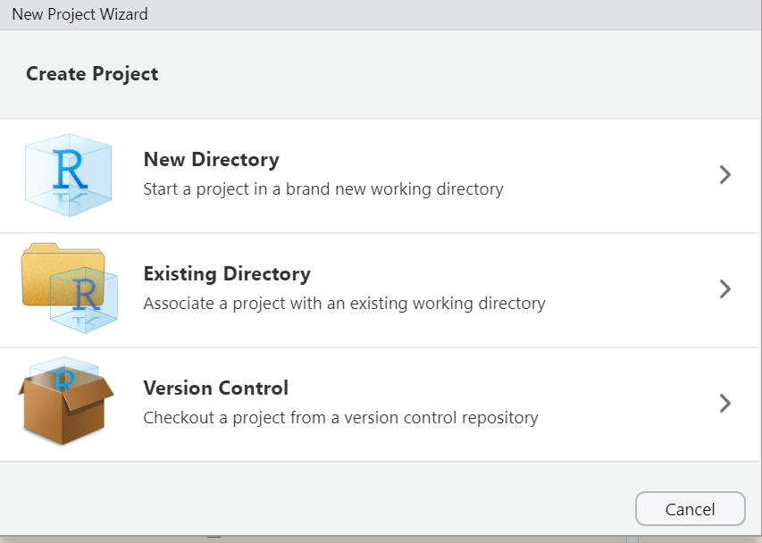

# Información del taller {-}

**9-13 de agosto de 2021**

¡Bienvenidxs al taller _Análisis de datos transcriptómicos de célula única (scRNA-seq) con R y Bioconductor_!

<p align="justify">

En los últimos años, la generación y análisis de transcriptomas de célula única ha cobrado gran importancia para resolver preguntas biológicas. En este taller revisaremos los métodos más recientes para analizar datos de single cell RNA-seq (transcriptómica en células únicas), usando paquetes de R especializados que están disponibles libremente vía Bioconductor. Este taller estará basado en el libro Orchestrating Single Cell Analysis with Bioconductor que fue publicado en Nature Methods y es de los artículos con mayor publicidad en 2020 y 2021.


Durante este taller aprenderás las herramientas estadísticas para analizar datos de transcriptómica en células únicas usando Bioconductor. Revisaremos qué es un análisis de datos de célula única, cuáles son las principales diferencias entre el análisis de transcriptomas de célula única y en bulk, cómo documentar tu análisis y algunas herramientas para interpretar tus resultados. 
</p>


## Formato del curso: en línea {-}

<p align="justify">
Este es un curso digital. Las sesiones y material del curso serán presentados en línea. Esta modalidad incluirá grabaciones de video o audio del material, intercambio de archivos y sesiones de discusión temáticos, ejercicios de auto-evaluación y acceso a los instructores para comentarios durante el curso.
</p>


## ¿Quién es nuestra audiencia? {-}

<p align="justify">
Este curso está dirigido a personas que desean aprender cómo analizar datos transcriptómicos de célula única usando paquetes de R/Bioconductor. Revisa los videos de [CDSB2020 en YouTube](https://www.youtube.com/playlist?list=PLwa0ZAE6DJg5h-7uTFZjgP7VZUEadZZfl) o la página web de [cdsb2020](https://comunidadbioinfo.github.io/cdsb2020/), que es similar al taller de este año.
</p>


## Formulario de registro  {-}

http://congresos.nnb.unam.mx/EBM2021/

<blockquote class="twitter-tweet"><p lang="en" dir="ltr">Do you want to learn how to analyze <a href="https://twitter.com/hashtag/scRNAseq?src=hash&amp;ref_src=twsrc%5Etfw">#scRNAseq</a> with <a href="https://twitter.com/Bioconductor?ref_src=twsrc%5Etfw">@Bioconductor</a>?<br><br>Learn with <a href="https://twitter.com/lcolladotor?ref_src=twsrc%5Etfw">@lcolladotor</a><a href="https://twitter.com/yalbi_ibm?ref_src=twsrc%5Etfw">@yalbi_ibm</a> <a href="https://twitter.com/AnaBetty2304?ref_src=twsrc%5Etfw">@AnaBetty2304</a> <a href="https://twitter.com/argininaa?ref_src=twsrc%5Etfw">@argininaa</a> <a href="https://twitter.com/naielisha?ref_src=twsrc%5Etfw">@naielisha</a> <a href="https://twitter.com/lawrah20?ref_src=twsrc%5Etfw">@lawrah20</a> <a href="https://twitter.com/roramirezf94?ref_src=twsrc%5Etfw">@roramirezf94</a> <a href="https://twitter.com/jvelezmagic?ref_src=twsrc%5Etfw">@jvelezmagic</a> <a href="https://twitter.com/KevsGenomic?ref_src=twsrc%5Etfw">@KevsGenomic</a> <a href="https://twitter.com/mpadilla905?ref_src=twsrc%5Etfw">@mpadilla905</a><br><br>Material adapted from OSCA <a href="https://twitter.com/PeteHaitch?ref_src=twsrc%5Etfw">@PeteHaitch</a> et al<a href="https://twitter.com/hashtag/rstats?src=hash&amp;ref_src=twsrc%5Etfw">#rstats</a><a href="https://t.co/MIfFmKt3Fq">https://t.co/MIfFmKt3Fq</a> <a href="https://t.co/nSPCmVEPAC">pic.twitter.com/nSPCmVEPAC</a></p>&mdash; ComunidadBioInfo (@CDSBMexico) <a href="https://twitter.com/CDSBMexico/status/1411093315186012164?ref_src=twsrc%5Etfw">July 2, 2021</a></blockquote> <script async src="https://platform.twitter.com/widgets.js" charset="utf-8"></script>

## Instructores {-}

* [Leonardo Collado-Torres](https://twitter.com/lcolladotor)
* [Yalbi Balderas](https://twitter.com/yalbi_ibm)

https://comunidadbioinfo.github.io/es/#people

## Ponentes e instructores invitados {-}

* [Ana Beatriz Villaseñor Altamirano](https://twitter.com/AnaBetty2304)
* [Citlali Gil Aguillon](https://twitter.com/argininaa)
* [Elisa Márquez Zavala](https://twitter.com/naielisha)
* [Laura Lucila Gómez Romero](https://twitter.com/lawrah20)
* [Ricardo Ramirez Flores](https://twitter.com/roramirezf94)

## Ayudantes {-}

* [Jesús Vélez Santiago](https://twitter.com/jvelezmagic)
* [Kevin Emmanuel Meza Landeros](https://twitter.com/KevsGenomic)
* [Mónica Padilla Gálvez](https://twitter.com/mpadilla905)


## Temario  {-}


Día 1

* Introducción a R y RStudio
* Ejercicio usando `usethis`, `here` y `postcards`
* Introducción a RNA-seq de célula única (scRNA-seq) con Bioconductor y al libro de OSCA

Día 2

* Estructura e importe de datos
* _Comunidades RLadies_
* Control de calidad

Día 3

* Normalización de datos
* _Foto y actividades de la comunidad_
* Selección de genes

Día 4

* Reducción de dimensiones
* Clustering
* Identificación de genes marcadores

Día 5

* Anotación de clusters de células
* Análisis de expresión diferencial
* Plática científica del ponente invitadx


## Código de Conducta {-}

Seguiremos el código de conducta de la CDSB México [comunidadbioinfo.github.io/es/codigo-de-conducta/](https://comunidadbioinfo.github.io/es/codigo-de-conducta/) además del código de conducta de Bioconductor [bioconductor.org/about/code-of-conduct/](http://bioconductor.org/about/code-of-conduct/). 


## Pre-requisitos {-}

De forma general, 

-	Computadora con al menos 8Gb de memoria y permisos de administrador para instalar paqueterías de R.
-	Tener instalado R y RStudio en su última versión.
-	Conocimientos básicos de secuenciación de transcriptomas.
-	Conocimientos básicos de RStudio (Creación de Rscripts, manejo de la consola de RStudio, manejo del espacio de visualización).
-	Conocimiento intermedio de R (Manejo de variables, lectura de archivos, creación y manejo de data frames y listas, generación de gráficas básicas, conocimiento sobre cómo instalar paqueterías desde CRAN y Bioconductor).


Más específicamente, computadora con al menos 8 GB de memoria RAM, aplicación Zoom https://zoom.us/download, R versión 4.1 instalada de CRAN https://cran.r-project.org/ (ver video de https://youtu.be/6knyHlUe1cM sobre como instalar R en macOS o winOS), RStudio versión 1.4 https://www.rstudio.com/products/rstudio/download/#download, y los siguientes paquetes de R y Bioconductor:


```r
## Para instalar paquetes
if (!requireNamespace("remotes", quietly = TRUE)) {
    install.packages("remotes")
}

## Para instalar paquetes de Bioconductor
remotes::install_cran("BiocManager")
BiocManager::version()
# El anterior comando debe mostrar que estás usando la versión 3.13

## Instala los paquetes de R que necesitamos
```


```
## BiocManager::install(c("batchelor", "BiocFileCache", "BiocSingular", "bluster", "celldex", "cowplot", "dplyr", "DropletUtils", "edgeR", "EnsDb.Hsapiens.v86", "ExperimentHub", "ExploreModelMatrix", "fossil", "gert", "ggrepel", "gh", "here", "iSEE", "kableExtra", "lobstr", "MouseGastrulationData", "org.Mm.eg.db", "patchwork", "PCAtools", "pheatmap", "plotly", "Polychrome", "postcards", "pryr", "RColorBrewer", "Rtsne", "scater", "scPipe", "scran", "scRNAseq", "sessioninfo", "Seurat", "SingleCellExperiment", "SingleR", "suncalc", "TENxPBMCData", "usethis", "uwot"))
```


## Horario {-}

_Consulta el calendario de este curso en: <http://bit.ly/calendarcdsb2021>._

| Horario  | Tema | Instructores |
| ------------------ | ---------------------------------- | ----------------------------- | 
| **Día 1: Agosto 9, 2021**  |     |      |      |
| 08:00-09:00 | (opcional) Ayuda con instalación de paquetes de R | |
| 09:00-09:30 | Inauguración EBM2021  | [Julio Collado Vides](https://www.ccg.unam.mx/pedro-julio-collado-vides/), [Christian Sohlenkamp](https://www.ccg.unam.mx/christian-sohlenkamp/), [Irma Martínez Flores](https://www.ccg.unam.mx/irma-martinez-flores/), [Shirley Alquicira Hernández](https://www.ccg.unam.mx/shirley-alquicira-hernandez/)  |
| 09:30-10:00 | [Bienvenida a la CDSB y revisión del código de conducta](https://speakerdeck.com/lcolladotor/cdsb2021) | [Leonardo Collado-Torres](http://comunidadbioinfo.github.io/authors/lcollado/) |
| 10:00-11:00 | Introducción a R y RStudio | [Leonardo Collado-Torres](http://comunidadbioinfo.github.io/authors/lcollado/) |
| 11:00-11:30 | Descanso | |
| 11:30-14:00 | Ejercicio usando `usethis`, `here` y `postcards` | [Citlali Gil Aguillon](https://twitter.com/argininaa) y [Elisa Márquez Zavala](https://twitter.com/naielisha) |
| 14:00-15:30 | Descanso: comida | |
| 15:30-17:00 | Introducción a RNA-seq de célula única (scRNA-seq) con Bioconductor y al libro de OSCA | [Citlali Gil Aguillon](https://twitter.com/argininaa) y [Elisa Márquez Zavala](https://twitter.com/naielisha) |
| 17:00-18:00 | (Invitada) [Principios FAIR para software de investigación](https://twitter.com/orchid00/status/1424885782272122884?s=20) | [Paula Andrea](https://twitter.com/orchid00) |
| **Día 2: Agosto 10, 2021** |      |      |
| 08:00-09:00 | (opcional) Ayuda con instalación de paquetes de R | |
| 09:00-11:00 | Estructura e importe de datos | [Citlali Gil Aguillon](https://twitter.com/argininaa) y [Elisa Márquez Zavala](https://twitter.com/naielisha) |
| 11:00-11:30 | Descanso | |
| 11:30-12:00 | Keynote: [La comunidad R-Ladies](https://rladiesqro.github.io/additional/2021TIB_Rladies/) | [Ana Beatriz Villaseñor Altamirano](https://twitter.com/AnaBetty2304) |
| 12:00-14:00 | Control de calidad | [Leonardo Collado-Torres](http://comunidadbioinfo.github.io/authors/lcollado/)  |
| 14:00-15:30 | Descanso: comida | |
| 15:30-17:30 | Control de calidad | [Leonardo Collado-Torres](http://comunidadbioinfo.github.io/authors/lcollado/)  |
| 17:30-18:00 | (opcional) Interactúa con lxs instructores y ayudantes | |
| **Día 3: Agosto 11, 2021** |      |      |
| 08:00-09:00 | (opcional) Ayuda con instalación de paquetes de R | |
| 09:00-10:30 | Normalización de datos | [Ana Beatriz Villaseñor Altamirano](https://twitter.com/AnaBetty2304) |
| 10:30-11:00 | Foto | |
| 11:00-11:30 | Descanso | |
| 11:30-12:30 | Selección de genes | [Yalbi Balderas](https://twitter.com/yalbi_ibm) |
| 12:30-14:00 | Actividades para construir la comunidad | [Leonardo Collado-Torres](http://comunidadbioinfo.github.io/authors/lcollado/) |
| 14:00-15:30 | Descanso: comida | |
| 15:30-17:30 | Selección de genes | [Laura Lucila Gómez Romero](https://twitter.com/lawrah20) |
| 17:30-18:00 | (opcional) Interactúa con lxs instructores y ayudantes | |
| **Día 4: Agosto 12, 2021** |      |      |
| 08:00-09:00 | (opcional) Ayuda con instalación de paquetes de R | |
| 09:00-11:00 | Reducción de dimensiones | [Laura Lucila Gómez Romero](https://twitter.com/lawrah20) |
| 11:00-11:30 | Descanso | |
| 11:30-14:00 | Clustering | [Laura Lucila Gómez Romero](https://twitter.com/lawrah20) |
| 14:00-15:30 | Descanso: comida | |
| 15:30-17:30 | Identificación de genes marcadores | [Yalbi Balderas](https://twitter.com/yalbi_ibm) |
| 17:30-18:30 | CDSB 2021: Evento social remoto | |
| **Día 5: Agosto 13, 2021** |      |      |
| 08:00-09:00 | (opcional) Ayuda con instalación de paquetes de R | |
| 09:00-10:30 | Anotación de clusters de células | [Yalbi Balderas](https://twitter.com/yalbi_ibm) |
| 10:30-11:00 | Evaluación del taller | [Irma Martínez Flores](https://www.ccg.unam.mx/irma-martinez-flores/) y [Shirley Alquicira Hernández](https://www.ccg.unam.mx/shirley-alquicira-hernandez/) |
| 11:00-11:30 | Descanso | |
| 11:30-12:30 | Análisis de expresión diferencial | [Leonardo Collado-Torres](http://comunidadbioinfo.github.io/authors/lcollado/) |
| 12:30-14:00 | Introducción a `Seurat` | [Kevin Emmanuel Meza Landeros](https://twitter.com/KevsGenomic) |
| 14:00-15:30 | Descanso: comida | |
| 15:30-17:00 | Plática científica y sesión de preguntas | [Ricardo Ramirez Flores](https://twitter.com/roramirezf94) |
| 17:00-17:30 | Clausura y recordatorio de la CDSB |      |
| 17:30-18:00 | (opcional) Interactúa con lxs instructores y ayudantes | |

## Música para ejercicios {-}

Aquí están las listas de canciones por si desean escuchar algo de música mientras realizan ejercicios

* [iTunes](https://music.apple.com/mx/playlist/cdsb2021/pl.u-d2b05dVTMjkvpg2?l=en)
* [Spotify](https://open.spotify.com/playlist/0OuvqM69DKFK3QPbHIy2kc?si=373e4941aef0457d)

## Materiales {-}

Descarga los materiales con `usethis::use_course('comunidadbioinfo/cdsb2021_scRNAseq')` o revisalos en línea vía [**comunidadbioinfo.github.io/cdsb2021_scRNAseq**](http://comunidadbioinfo.github.io/cdsb2021_scRNAseq).

### Durante el curso {-}

Durante el curso estaremos actualizando el material, así que les recomendamos que usen RStudio para crear un nuevo proyecto que esté configurado con `git`/`GitHub`, para que con un simple `Pull` puedan actualizar los archivos del curso en su computadora. Para que funcione bien esto, les recomendamos que no editen los archivos que descarguen. Eso mejor háganlo en sus notas.

Primero, en RStudio seleccionen `File` y luego `New Project ...`. Les saldrá la siguiente ventana donde tienen que escoger la opción de control de versiones.

<div class="figure">

<p class="caption">(\#fig:unnamed-chunk-1)Al crear un nuevo proyecto, seleccionen la opción de _Version Control_ (la tercera).</p>
</div>

A continuación, seleccionen la opción de `Git`.

<div class="figure">

<p class="caption">(\#fig:unnamed-chunk-2)Selecciona la opción de `Git` (la primera).</p>
</div>

En la venta para especificar los detalles de `git`, 

* Específica el siguiente URL del repositorio `https://github.com/ComunidadBioInfo/cdsb2021_scRNAseq.git`
* El nombre del directorio se llenará de forma automática. No tienes que cambiarlo.
* Especifíca el subdirectorio de donde quieres que guarde este proyecto. Te conviene ponerlo en tu Desktop o algún lugar que no sea adentro de otro proyecto de RStudio.
* Selecciona la opción de _Open in new session_ para que te abra una nueva ventana de RStudio si así lo prefieres.


<div class="figure">

<p class="caption">(\#fig:unnamed-chunk-3)Especifica que el _Repository URL_ es `https://github.com/ComunidadBioInfo/cdsb2021_scRNAseq.git`.</p>
</div>

## Fuentes {-}

El material de este curso está basado en el:

* libro [**Orchestrating Single Cell Analysis with Bioconductor**](https://osca.bioconductor.org/) de [Aaron Lun](https://www.linkedin.com/in/aaron-lun-869b5894/), [Robert Amezquita](https://robertamezquita.github.io/), [Stephanie Hicks](https://www.stephaniehicks.com/) y [Raphael Gottardo](http://rglab.org)
* [**curso de scRNA-seq para WEHI**](https://drive.google.com/drive/folders/1cn5d-Ey7-kkMiex8-74qxvxtCQT6o72h) creado por [Peter Hickey](https://www.peterhickey.org/)
* curso de [Leonardo Collado-Torres](https://twitter.com/lcolladotor) para LCG-UNAM-EJ de marzo 2020 https://github.com/lcolladotor/osca_LIIGH_UNAM_2020
* taller de la CDSB 2020 https://github.com/ComunidadBioInfo/cdsb2020
* curso de [Leonardo Collado-Torres](https://twitter.com/lcolladotor) para la LCG-UNAM de febrero 2021 https://github.com/lcolladotor/rnaseq_LCG-UNAM_2021


## Zoom {-}

Las ligas de Zoom están disponibles exclusivamente para lxs participantes de CDSB2021 vía Slack. Te enviaremos una invitación al correo electrónico que usaste para registrate.

## Organizadores {-}

* Comunidad de Desarrolladores de Software en Bioinformática [CDSB](https://twitter.com/CDSBMexico)
* Red Mexicana de Bioinformática [RMB](https://twitter.com/RBioinformatica)
* Nodo Nacional de Bioinformática en la UNAM [NNB-CCG](https://twitter.com/nnb_unam)

## Patrocinadores {-}

Agradecemos a nuestros patrocinadores:

<a href="https://comunidadbioinfo.github.io/es/post/cs_and_s_event_fund_award/#.YJH-wbVKj8A"></a>

<a href="https://www.r-consortium.org/"></a>


## Información sesión de R{-}

Detalles de la sesión de R usada para crear este libro. El código fuente está disponible vía [`ComunidadBioInfo/cdsb2021_scRNAseq`](https://github.com/ComunidadBioInfo/cdsb2021_scRNAseq).


```r
options(width = 120)
pkgs <- installed.packages()[, "Package"]
sessioninfo::session_info(pkgs, include_base = TRUE)
```

```
## ─ Session info ───────────────────────────────────────────────────────────────────────────────────────────────────────
##  setting  value                       
##  version  R version 4.1.0 (2021-05-18)
##  os       Ubuntu 20.04.2 LTS          
##  system   x86_64, linux-gnu           
##  ui       X11                         
##  language (EN)                        
##  collate  en_US.UTF-8                 
##  ctype    en_US.UTF-8                 
##  tz       UTC                         
##  date     2021-08-13                  
## 
## ─ Packages ───────────────────────────────────────────────────────────────────────────────────────────────────────────
##  package                * version    date       lib source        
##  abind                    1.4-5      2016-07-21 [1] RSPM (R 4.1.0)
##  ade4                     1.7-17     2021-06-17 [1] RSPM (R 4.1.0)
##  annotate                 1.70.0     2021-05-19 [1] Bioconductor  
##  AnnotationDbi            1.54.1     2021-06-08 [1] Bioconductor  
##  AnnotationFilter         1.16.0     2021-05-19 [1] Bioconductor  
##  AnnotationHub            3.0.1      2021-06-20 [1] Bioconductor  
##  AnVIL                    1.4.1      2021-06-22 [2] Bioconductor  
##  ape                      5.5        2021-04-25 [1] RSPM (R 4.1.0)
##  askpass                  1.1        2019-01-13 [2] RSPM (R 4.1.0)
##  assertthat               0.2.1      2019-03-21 [1] RSPM (R 4.1.0)
##  backports                1.2.1      2020-12-09 [1] RSPM (R 4.1.0)
##  base                   * 4.1.0      2021-07-29 [3] local         
##  base64enc                0.1-3      2015-07-28 [1] RSPM (R 4.1.0)
##  batchelor                1.8.0      2021-05-19 [1] Bioconductor  
##  beachmat                 2.8.0      2021-05-19 [1] Bioconductor  
##  beeswarm                 0.4.0      2021-06-01 [1] RSPM (R 4.1.0)
##  benchmarkme              1.0.7      2021-03-21 [1] RSPM (R 4.1.0)
##  benchmarkmeData          1.0.4      2020-04-23 [1] RSPM (R 4.1.0)
##  BH                       1.75.0-0   2021-01-11 [1] RSPM (R 4.1.0)
##  Biobase                  2.52.0     2021-05-19 [1] Bioconductor  
##  BiocFileCache            2.0.0      2021-05-19 [1] Bioconductor  
##  BiocGenerics             0.38.0     2021-05-19 [1] Bioconductor  
##  BiocIO                   1.2.0      2021-05-19 [1] Bioconductor  
##  BiocManager              1.30.16    2021-06-15 [1] RSPM (R 4.1.0)
##  BiocNeighbors            1.10.0     2021-05-19 [1] Bioconductor  
##  BiocParallel             1.26.1     2021-07-04 [1] Bioconductor  
##  BiocSingular             1.8.1      2021-06-08 [1] Bioconductor  
##  BiocStyle                2.20.2     2021-06-17 [1] Bioconductor  
##  biocthis                 1.2.0      2021-05-19 [1] Bioconductor  
##  BiocVersion              3.13.1     2021-03-19 [2] Bioconductor  
##  biomaRt                  2.48.2     2021-07-01 [1] Bioconductor  
##  Biostrings               2.60.2     2021-08-05 [1] Bioconductor  
##  bit                      4.0.4      2020-08-04 [1] RSPM (R 4.1.0)
##  bit64                    4.0.5      2020-08-30 [1] RSPM (R 4.1.0)
##  bitops                   1.0-7      2021-04-24 [1] RSPM (R 4.1.0)
##  blob                     1.2.2      2021-07-23 [1] RSPM (R 4.1.0)
##  bluster                  1.2.1      2021-05-27 [1] Bioconductor  
##  bookdown                 0.22       2021-04-22 [1] RSPM (R 4.1.0)
##  boot                     1.3-28     2021-05-03 [3] CRAN (R 4.1.0)
##  brew                     1.0-6      2011-04-13 [2] RSPM (R 4.1.0)
##  brio                     1.1.2      2021-04-23 [2] RSPM (R 4.1.0)
##  bslib                    0.2.5.1    2021-05-18 [1] RSPM (R 4.1.0)
##  BumpyMatrix              1.0.1      2021-07-04 [1] Bioconductor  
##  cachem                   1.0.5      2021-05-15 [2] RSPM (R 4.1.0)
##  Cairo                    1.5-12.2   2020-07-07 [1] RSPM (R 4.1.0)
##  callr                    3.7.0      2021-04-20 [2] RSPM (R 4.1.0)
##  caTools                  1.18.2     2021-03-28 [1] RSPM (R 4.1.0)
##  cdsb2021scRNAseq         0.99.0     2021-08-13 [1] local         
##  celldex                  1.2.0      2021-05-20 [1] Bioconductor  
##  circlize                 0.4.13     2021-06-09 [1] RSPM (R 4.1.0)
##  class                    7.3-19     2021-05-03 [3] CRAN (R 4.1.0)
##  cli                      3.0.1      2021-07-17 [2] RSPM (R 4.1.0)
##  clipr                    0.7.1      2020-10-08 [2] RSPM (R 4.1.0)
##  clue                     0.3-59     2021-04-16 [1] RSPM (R 4.1.0)
##  cluster                  2.1.2      2021-04-17 [3] CRAN (R 4.1.0)
##  clusterExperiment        2.12.0     2021-05-19 [1] Bioconductor  
##  ClusterR                 1.2.5      2021-05-21 [1] RSPM (R 4.1.0)
##  codetools                0.2-18     2020-11-04 [3] CRAN (R 4.1.0)
##  colorspace               2.0-2      2021-06-24 [1] RSPM (R 4.1.0)
##  colourpicker             1.1.0      2020-09-14 [1] RSPM (R 4.1.0)
##  commonmark               1.7        2018-12-01 [2] RSPM (R 4.1.0)
##  compiler                 4.1.0      2021-07-29 [3] local         
##  ComplexHeatmap           2.8.0      2021-05-19 [1] Bioconductor  
##  cowplot                  1.1.1      2020-12-30 [1] RSPM (R 4.1.0)
##  cpp11                    0.3.1      2021-06-25 [1] RSPM (R 4.1.0)
##  crayon                   1.4.1      2021-02-08 [2] RSPM (R 4.1.0)
##  credentials              1.3.1      2021-07-25 [2] RSPM (R 4.1.0)
##  crosstalk                1.1.1      2021-01-12 [1] RSPM (R 4.1.0)
##  curl                     4.3.2      2021-06-23 [2] RSPM (R 4.1.0)
##  data.table               1.14.0     2021-02-21 [1] RSPM (R 4.1.0)
##  datasets               * 4.1.0      2021-07-29 [3] local         
##  DBI                      1.1.1      2021-01-15 [1] RSPM (R 4.1.0)
##  dbplyr                   2.1.1      2021-04-06 [1] RSPM (R 4.1.0)
##  DelayedArray             0.18.0     2021-05-19 [1] Bioconductor  
##  DelayedMatrixStats       1.14.2     2021-08-08 [1] Bioconductor  
##  deldir                   0.2-10     2021-02-16 [1] RSPM (R 4.1.0)
##  DEoptimR                 1.0-9      2021-05-24 [1] RSPM (R 4.1.0)
##  desc                     1.3.0      2021-03-05 [2] RSPM (R 4.1.0)
##  devtools                 2.4.2      2021-06-07 [2] RSPM (R 4.1.0)
##  diffobj                  0.3.4      2021-03-22 [2] RSPM (R 4.1.0)
##  digest                   0.6.27     2020-10-24 [2] RSPM (R 4.1.0)
##  docopt                   0.7.1      2020-06-24 [2] RSPM (R 4.1.0)
##  doParallel               1.0.16     2020-10-16 [1] RSPM (R 4.1.0)
##  dplyr                    1.0.7      2021-06-18 [1] RSPM (R 4.1.0)
##  dqrng                    0.3.0      2021-05-01 [1] RSPM (R 4.1.0)
##  DropletUtils             1.12.2     2021-07-22 [1] Bioconductor  
##  DT                       0.18       2021-04-14 [1] RSPM (R 4.1.0)
##  edgeR                    3.34.0     2021-05-19 [1] Bioconductor  
##  ellipsis                 0.3.2      2021-04-29 [2] RSPM (R 4.1.0)
##  EnsDb.Hsapiens.v86       2.99.0     2021-07-29 [1] Bioconductor  
##  ensembldb                2.16.4     2021-08-05 [1] Bioconductor  
##  evaluate                 0.14       2019-05-28 [2] RSPM (R 4.1.0)
##  ExperimentHub            2.0.0      2021-05-19 [1] Bioconductor  
##  ExploreModelMatrix       1.4.0      2021-05-19 [1] Bioconductor  
##  fansi                    0.5.0      2021-05-25 [2] RSPM (R 4.1.0)
##  farver                   2.1.0      2021-02-28 [1] RSPM (R 4.1.0)
##  fastmap                  1.1.0      2021-01-25 [2] RSPM (R 4.1.0)
##  filelock                 1.0.2      2018-10-05 [1] RSPM (R 4.1.0)
##  fitdistrplus             1.1-5      2021-05-28 [1] RSPM (R 4.1.0)
##  FNN                      1.1.3      2019-02-15 [1] RSPM (R 4.1.0)
##  forcats                  0.5.1      2021-01-27 [1] RSPM (R 4.1.0)
##  foreach                  1.5.1      2020-10-15 [1] RSPM (R 4.1.0)
##  foreign                  0.8-81     2020-12-22 [3] CRAN (R 4.1.0)
##  formatR                  1.11       2021-06-01 [1] RSPM (R 4.1.0)
##  fossil                   0.4.0      2020-03-23 [1] RSPM (R 4.1.0)
##  fs                       1.5.0      2020-07-31 [2] RSPM (R 4.1.0)
##  futile.logger            1.4.3      2016-07-10 [1] RSPM (R 4.1.0)
##  futile.options           1.0.1      2018-04-20 [1] RSPM (R 4.1.0)
##  future                   1.21.0     2020-12-10 [1] RSPM (R 4.1.0)
##  future.apply             1.7.0      2021-01-04 [1] RSPM (R 4.1.0)
##  genefilter               1.74.0     2021-05-19 [1] Bioconductor  
##  generics                 0.1.0      2020-10-31 [1] RSPM (R 4.1.0)
##  GenomeInfoDb             1.28.1     2021-07-01 [1] Bioconductor  
##  GenomeInfoDbData         1.2.6      2021-07-29 [1] Bioconductor  
##  GenomicAlignments        1.28.0     2021-05-19 [1] Bioconductor  
##  GenomicFeatures          1.44.0     2021-05-19 [1] Bioconductor  
##  GenomicRanges            1.44.0     2021-05-19 [1] Bioconductor  
##  gert                     1.3.1      2021-06-23 [2] RSPM (R 4.1.0)
##  GetoptLong               1.0.5      2020-12-15 [1] RSPM (R 4.1.0)
##  GGally                   2.1.2      2021-06-21 [1] RSPM (R 4.1.0)
##  ggbeeswarm               0.6.0      2017-08-07 [1] RSPM (R 4.1.0)
##  ggplot2                  3.3.5      2021-06-25 [1] RSPM (R 4.1.0)
##  ggrepel                  0.9.1      2021-01-15 [1] RSPM (R 4.1.0)
##  ggridges                 0.5.3      2021-01-08 [1] RSPM (R 4.1.0)
##  gh                       1.3.0      2021-04-30 [2] RSPM (R 4.1.0)
##  gitcreds                 0.1.1      2020-12-04 [2] RSPM (R 4.1.0)
##  GlobalOptions            0.1.2      2020-06-10 [1] RSPM (R 4.1.0)
##  globals                  0.14.0     2020-11-22 [1] RSPM (R 4.1.0)
##  glue                     1.4.2      2020-08-27 [2] RSPM (R 4.1.0)
##  gmp                      0.6-2      2021-01-07 [1] RSPM (R 4.1.0)
##  goftest                  1.2-2      2019-12-02 [1] RSPM (R 4.1.0)
##  gplots                   3.1.1      2020-11-28 [1] RSPM (R 4.1.0)
##  graphics               * 4.1.0      2021-07-29 [3] local         
##  grDevices              * 4.1.0      2021-07-29 [3] local         
##  grid                     4.1.0      2021-07-29 [3] local         
##  gridBase                 0.4-7      2014-02-24 [1] RSPM (R 4.1.0)
##  gridExtra                2.3        2017-09-09 [1] RSPM (R 4.1.0)
##  gtable                   0.3.0      2019-03-25 [1] RSPM (R 4.1.0)
##  gtools                   3.9.2      2021-06-06 [1] RSPM (R 4.1.0)
##  hash                     2.2.6.1    2019-03-04 [1] RSPM (R 4.1.0)
##  HDF5Array                1.20.0     2021-05-19 [1] Bioconductor  
##  here                     1.0.1      2020-12-13 [1] RSPM (R 4.1.0)
##  highr                    0.9        2021-04-16 [2] RSPM (R 4.1.0)
##  hms                      1.1.0      2021-05-17 [1] RSPM (R 4.1.0)
##  howmany                  0.3-1      2012-06-01 [1] RSPM (R 4.1.0)
##  htmltools                0.5.1.1    2021-01-22 [1] RSPM (R 4.1.0)
##  htmlwidgets              1.5.3      2020-12-10 [1] RSPM (R 4.1.0)
##  httpuv                   1.6.1      2021-05-07 [1] RSPM (R 4.1.0)
##  httr                     1.4.2      2020-07-20 [2] RSPM (R 4.1.0)
##  ica                      1.0-2      2018-05-24 [1] RSPM (R 4.1.0)
##  igraph                   1.2.6      2020-10-06 [1] RSPM (R 4.1.0)
##  ini                      0.3.1      2018-05-20 [2] RSPM (R 4.1.0)
##  interactiveDisplayBase   1.30.0     2021-05-19 [1] Bioconductor  
##  IRanges                  2.26.0     2021-05-19 [1] Bioconductor  
##  irlba                    2.3.3      2019-02-05 [1] RSPM (R 4.1.0)
##  iSEE                     2.4.0      2021-05-19 [1] Bioconductor  
##  isoband                  0.2.5      2021-07-13 [1] RSPM (R 4.1.0)
##  iterators                1.0.13     2020-10-15 [1] RSPM (R 4.1.0)
##  jquerylib                0.1.4      2021-04-26 [1] RSPM (R 4.1.0)
##  jsonlite                 1.7.2      2020-12-09 [2] RSPM (R 4.1.0)
##  kableExtra               1.3.4      2021-02-20 [1] RSPM (R 4.1.0)
##  KEGGREST                 1.32.0     2021-05-19 [1] Bioconductor  
##  kernlab                  0.9-29     2019-11-12 [1] RSPM (R 4.1.0)
##  KernSmooth               2.23-20    2021-05-03 [3] CRAN (R 4.1.0)
##  knitr                    1.33       2021-04-24 [2] RSPM (R 4.1.0)
##  labeling                 0.4.2      2020-10-20 [1] RSPM (R 4.1.0)
##  lambda.r                 1.2.4      2019-09-18 [1] RSPM (R 4.1.0)
##  later                    1.2.0      2021-04-23 [1] RSPM (R 4.1.0)
##  lattice                  0.20-44    2021-05-02 [3] CRAN (R 4.1.0)
##  lazyeval                 0.2.2      2019-03-15 [1] RSPM (R 4.1.0)
##  leiden                   0.3.9      2021-07-27 [1] RSPM (R 4.1.0)
##  lifecycle                1.0.0      2021-02-15 [2] RSPM (R 4.1.0)
##  limma                    3.48.3     2021-08-10 [1] Bioconductor  
##  listenv                  0.8.0      2019-12-05 [1] RSPM (R 4.1.0)
##  littler                  0.3.13     2021-07-24 [2] RSPM (R 4.1.0)
##  lmtest                   0.9-38     2020-09-09 [1] RSPM (R 4.1.0)
##  lobstr                   1.1.1      2019-07-02 [1] RSPM (R 4.1.0)
##  locfdr                   1.1-8      2015-07-15 [1] RSPM (R 4.1.0)
##  locfit                   1.5-9.4    2020-03-25 [1] RSPM (R 4.1.0)
##  lubridate                1.7.10     2021-02-26 [1] RSPM (R 4.1.0)
##  magick                   2.7.2      2021-05-02 [1] RSPM (R 4.1.0)
##  magrittr                 2.0.1      2020-11-17 [2] RSPM (R 4.1.0)
##  maps                     3.3.0      2018-04-03 [1] RSPM (R 4.1.0)
##  markdown                 1.1        2019-08-07 [2] RSPM (R 4.1.0)
##  MASS                     7.3-54     2021-05-03 [3] CRAN (R 4.1.0)
##  Matrix                   1.3-4      2021-06-01 [3] RSPM (R 4.1.0)
##  MatrixGenerics           1.4.2      2021-08-08 [1] Bioconductor  
##  matrixStats              0.60.0     2021-07-26 [1] RSPM (R 4.1.0)
##  mbkmeans                 1.8.0      2021-05-19 [1] Bioconductor  
##  mclust                   5.4.7      2020-11-20 [1] RSPM (R 4.1.0)
##  memoise                  2.0.0      2021-01-26 [2] RSPM (R 4.1.0)
##  metapod                  1.0.0      2021-05-19 [1] Bioconductor  
##  methods                * 4.1.0      2021-07-29 [3] local         
##  mgcv                     1.8-36     2021-06-01 [3] RSPM (R 4.1.0)
##  mime                     0.11       2021-06-23 [2] RSPM (R 4.1.0)
##  miniUI                   0.1.1.1    2018-05-18 [1] RSPM (R 4.1.0)
##  MouseGastrulationData    1.6.0      2021-05-20 [1] Bioconductor  
##  munsell                  0.5.0      2018-06-12 [1] RSPM (R 4.1.0)
##  nlme                     3.1-152    2021-02-04 [3] CRAN (R 4.1.0)
##  NMF                      0.23.0     2020-08-01 [1] RSPM (R 4.1.0)
##  nnet                     7.3-16     2021-05-03 [3] CRAN (R 4.1.0)
##  openssl                  1.4.4      2021-04-30 [2] RSPM (R 4.1.0)
##  org.Hs.eg.db             3.13.0     2021-07-29 [1] Bioconductor  
##  org.Mm.eg.db             3.13.0     2021-07-29 [1] Bioconductor  
##  parallel                 4.1.0      2021-07-29 [3] local         
##  parallelly               1.27.0     2021-07-19 [1] RSPM (R 4.1.0)
##  patchwork                1.1.1      2020-12-17 [1] RSPM (R 4.1.0)
##  pbapply                  1.4-3      2020-08-18 [1] RSPM (R 4.1.0)
##  PCAtools                 2.4.0      2021-05-19 [1] Bioconductor  
##  pheatmap                 1.0.12     2019-01-04 [1] RSPM (R 4.1.0)
##  phylobase                0.8.10     2020-03-01 [1] RSPM (R 4.1.0)
##  pillar                   1.6.2      2021-07-29 [2] RSPM (R 4.1.0)
##  pixmap                   0.4-12     2021-01-29 [1] RSPM (R 4.1.0)
##  pkgbuild                 1.2.0      2020-12-15 [2] RSPM (R 4.1.0)
##  pkgconfig                2.0.3      2019-09-22 [2] RSPM (R 4.1.0)
##  pkgload                  1.2.1      2021-04-06 [2] RSPM (R 4.1.0)
##  pkgmaker                 0.32.2     2020-10-20 [1] RSPM (R 4.1.0)
##  plogr                    0.2.0      2018-03-25 [1] RSPM (R 4.1.0)
##  plotly                   4.9.4.1    2021-06-18 [1] RSPM (R 4.1.0)
##  plyr                     1.8.6      2020-03-03 [1] RSPM (R 4.1.0)
##  png                      0.1-7      2013-12-03 [1] RSPM (R 4.1.0)
##  Polychrome               1.3.1      2021-07-16 [1] RSPM (R 4.1.0)
##  polyclip                 1.10-0     2019-03-14 [1] RSPM (R 4.1.0)
##  postcards                0.2.2      2021-07-31 [1] RSPM (R 4.1.0)
##  pracma                   2.3.3      2021-01-23 [1] RSPM (R 4.1.0)
##  praise                   1.0.0      2015-08-11 [2] RSPM (R 4.1.0)
##  prettyunits              1.1.1      2020-01-24 [2] RSPM (R 4.1.0)
##  processx                 3.5.2      2021-04-30 [2] RSPM (R 4.1.0)
##  progress                 1.2.2      2019-05-16 [1] RSPM (R 4.1.0)
##  promises                 1.2.0.1    2021-02-11 [1] RSPM (R 4.1.0)
##  ProtGenerics             1.24.0     2021-05-19 [1] Bioconductor  
##  pryr                     0.1.5      2021-07-26 [1] RSPM (R 4.1.0)
##  ps                       1.6.0      2021-02-28 [2] RSPM (R 4.1.0)
##  purrr                    0.3.4      2020-04-17 [2] RSPM (R 4.1.0)
##  R.cache                  0.15.0     2021-04-30 [1] RSPM (R 4.1.0)
##  R.methodsS3              1.8.1      2020-08-26 [1] RSPM (R 4.1.0)
##  R.oo                     1.24.0     2020-08-26 [1] RSPM (R 4.1.0)
##  R.utils                  2.10.1     2020-08-26 [1] RSPM (R 4.1.0)
##  R6                       2.5.0      2020-10-28 [2] RSPM (R 4.1.0)
##  RANN                     2.6.1      2019-01-08 [1] RSPM (R 4.1.0)
##  rapiclient               0.1.3      2020-01-17 [2] RSPM (R 4.1.0)
##  rappdirs                 0.3.3      2021-01-31 [2] RSPM (R 4.1.0)
##  rcmdcheck                1.3.3      2019-05-07 [2] RSPM (R 4.1.0)
##  RColorBrewer             1.1-2      2014-12-07 [1] RSPM (R 4.1.0)
##  Rcpp                     1.0.7      2021-07-07 [2] RSPM (R 4.1.0)
##  RcppAnnoy                0.0.19     2021-07-30 [1] RSPM (R 4.1.0)
##  RcppArmadillo            0.10.6.0.0 2021-07-16 [1] RSPM (R 4.1.0)
##  RcppEigen                0.3.3.9.1  2020-12-17 [1] RSPM (R 4.1.0)
##  RcppHNSW                 0.3.0      2020-09-06 [1] RSPM (R 4.1.0)
##  RcppProgress             0.4.2      2020-02-06 [1] RSPM (R 4.1.0)
##  RCurl                    1.98-1.3   2021-03-16 [1] RSPM (R 4.1.0)
##  registry                 0.5-1      2019-03-05 [1] RSPM (R 4.1.0)
##  rematch2                 2.1.2      2020-05-01 [2] RSPM (R 4.1.0)
##  remotes                  2.4.0      2021-06-02 [1] RSPM (R 4.1.0)
##  reshape                  0.8.8      2018-10-23 [1] RSPM (R 4.1.0)
##  reshape2                 1.4.4      2020-04-09 [1] RSPM (R 4.1.0)
##  ResidualMatrix           1.2.0      2021-05-19 [1] Bioconductor  
##  restfulr                 0.0.13     2017-08-06 [1] RSPM (R 4.1.0)
##  reticulate               1.20       2021-05-03 [1] RSPM (R 4.1.0)
##  rhdf5                    2.36.0     2021-05-19 [1] Bioconductor  
##  rhdf5filters             1.4.0      2021-05-19 [1] Bioconductor  
##  Rhdf5lib                 1.14.2     2021-07-06 [1] Bioconductor  
##  Rhtslib                  1.24.0     2021-05-19 [1] Bioconductor  
##  rintrojs                 0.3.0      2021-06-06 [1] RSPM (R 4.1.0)
##  rjson                    0.2.20     2018-06-08 [1] RSPM (R 4.1.0)
##  rlang                    0.4.11     2021-04-30 [2] RSPM (R 4.1.0)
##  rmarkdown                2.10       2021-08-06 [1] RSPM (R 4.1.0)
##  rncl                     0.8.4      2020-02-10 [1] RSPM (R 4.1.0)
##  RNeXML                   2.4.5      2020-06-18 [1] RSPM (R 4.1.0)
##  rngtools                 1.5        2020-01-23 [1] RSPM (R 4.1.0)
##  robustbase               0.93-8     2021-06-02 [1] RSPM (R 4.1.0)
##  ROCR                     1.0-11     2020-05-02 [1] RSPM (R 4.1.0)
##  roxygen2                 7.1.1      2020-06-27 [2] RSPM (R 4.1.0)
##  rpart                    4.1-15     2019-04-12 [3] CRAN (R 4.1.0)
##  rprojroot                2.0.2      2020-11-15 [2] RSPM (R 4.1.0)
##  Rsamtools                2.8.0      2021-05-19 [1] Bioconductor  
##  RSpectra                 0.16-0     2019-12-01 [1] RSPM (R 4.1.0)
##  RSQLite                  2.2.7      2021-04-22 [1] RSPM (R 4.1.0)
##  rstudioapi               0.13       2020-11-12 [2] RSPM (R 4.1.0)
##  rsvd                     1.0.5      2021-04-16 [1] RSPM (R 4.1.0)
##  rtracklayer              1.52.0     2021-05-19 [1] Bioconductor  
##  Rtsne                    0.15       2018-11-10 [1] RSPM (R 4.1.0)
##  rversions                2.1.1      2021-05-31 [2] RSPM (R 4.1.0)
##  rvest                    1.0.1      2021-07-26 [1] RSPM (R 4.1.0)
##  S4Vectors                0.30.0     2021-05-19 [1] Bioconductor  
##  sass                     0.4.0      2021-05-12 [1] RSPM (R 4.1.0)
##  ScaledMatrix             1.0.0      2021-05-19 [1] Bioconductor  
##  scales                   1.1.1      2020-05-11 [1] RSPM (R 4.1.0)
##  scater                   1.20.1     2021-06-15 [1] Bioconductor  
##  scattermore              0.7        2020-11-24 [1] RSPM (R 4.1.0)
##  scatterplot3d            0.3-41     2018-03-14 [1] RSPM (R 4.1.0)
##  scPipe                   1.14.0     2021-05-19 [1] Bioconductor  
##  scran                    1.20.1     2021-05-24 [1] Bioconductor  
##  scRNAseq                 2.6.1      2021-05-25 [1] Bioconductor  
##  sctransform              0.3.2      2020-12-16 [1] RSPM (R 4.1.0)
##  scuttle                  1.2.1      2021-08-05 [1] Bioconductor  
##  selectr                  0.4-2      2019-11-20 [1] RSPM (R 4.1.0)
##  sessioninfo              1.1.1      2018-11-05 [2] RSPM (R 4.1.0)
##  Seurat                   4.0.3      2021-06-10 [1] RSPM (R 4.1.0)
##  SeuratObject             4.0.2      2021-06-09 [1] RSPM (R 4.1.0)
##  shape                    1.4.6      2021-05-19 [1] RSPM (R 4.1.0)
##  shapefiles               0.7        2013-01-26 [1] RSPM (R 4.1.0)
##  shiny                    1.6.0      2021-01-25 [1] RSPM (R 4.1.0)
##  shinyAce                 0.4.1      2019-09-24 [1] RSPM (R 4.1.0)
##  shinydashboard           0.7.1      2018-10-17 [1] RSPM (R 4.1.0)
##  shinyjs                  2.0.0      2020-09-09 [1] RSPM (R 4.1.0)
##  shinyWidgets             0.6.0      2021-03-15 [1] RSPM (R 4.1.0)
##  SingleCellExperiment     1.14.1     2021-05-21 [1] Bioconductor  
##  SingleR                  1.6.1      2021-05-20 [1] Bioconductor  
##  sitmo                    2.0.1      2019-01-07 [1] RSPM (R 4.1.0)
##  snow                     0.4-3      2018-09-14 [1] RSPM (R 4.1.0)
##  softImpute               1.4-1      2021-05-09 [1] RSPM (R 4.1.0)
##  sourcetools              0.1.7      2018-04-25 [1] RSPM (R 4.1.0)
##  sp                       1.4-5      2021-01-10 [1] RSPM (R 4.1.0)
##  sparseMatrixStats        1.4.2      2021-08-08 [1] Bioconductor  
##  spatial                  7.3-14     2021-05-03 [3] CRAN (R 4.1.0)
##  SpatialExperiment        1.2.1      2021-06-10 [1] Bioconductor  
##  spatstat.core            2.3-0      2021-07-16 [1] RSPM (R 4.1.0)
##  spatstat.data            2.1-0      2021-03-21 [1] RSPM (R 4.1.0)
##  spatstat.geom            2.2-2      2021-07-12 [1] RSPM (R 4.1.0)
##  spatstat.sparse          2.0-0      2021-03-16 [1] RSPM (R 4.1.0)
##  spatstat.utils           2.2-0      2021-06-14 [1] RSPM (R 4.1.0)
##  splines                  4.1.0      2021-07-29 [3] local         
##  statmod                  1.4.36     2021-05-10 [1] RSPM (R 4.1.0)
##  stats                  * 4.1.0      2021-07-29 [3] local         
##  stats4                   4.1.0      2021-07-29 [3] local         
##  stringi                  1.7.3      2021-07-16 [2] RSPM (R 4.1.0)
##  stringr                  1.4.0      2019-02-10 [2] RSPM (R 4.1.0)
##  styler                   1.5.1      2021-07-13 [1] RSPM (R 4.1.0)
##  SummarizedExperiment     1.22.0     2021-05-19 [1] Bioconductor  
##  suncalc                  0.5.0      2019-04-03 [1] RSPM (R 4.1.0)
##  survival                 3.2-11     2021-04-26 [3] CRAN (R 4.1.0)
##  svglite                  2.0.0      2021-02-20 [1] RSPM (R 4.1.0)
##  sys                      3.4        2020-07-23 [2] RSPM (R 4.1.0)
##  systemfonts              1.0.2      2021-05-11 [1] RSPM (R 4.1.0)
##  tcltk                    4.1.0      2021-07-29 [3] local         
##  tensor                   1.5        2012-05-05 [1] RSPM (R 4.1.0)
##  TENxPBMCData             1.10.0     2021-05-20 [1] Bioconductor  
##  testthat                 3.0.4      2021-07-01 [2] RSPM (R 4.1.0)
##  tibble                   3.1.3      2021-07-23 [2] RSPM (R 4.1.0)
##  tidyr                    1.1.3      2021-03-03 [1] RSPM (R 4.1.0)
##  tidyselect               1.1.1      2021-04-30 [1] RSPM (R 4.1.0)
##  tinytex                  0.33       2021-08-05 [1] RSPM (R 4.1.0)
##  tools                    4.1.0      2021-07-29 [3] local         
##  usethis                  2.0.1      2021-02-10 [2] RSPM (R 4.1.0)
##  utf8                     1.2.2      2021-07-24 [2] RSPM (R 4.1.0)
##  utils                  * 4.1.0      2021-07-29 [3] local         
##  uuid                     0.1-4      2020-02-26 [1] RSPM (R 4.1.0)
##  uwot                     0.1.10     2020-12-15 [1] RSPM (R 4.1.0)
##  vctrs                    0.3.8      2021-04-29 [2] RSPM (R 4.1.0)
##  vipor                    0.4.5      2017-03-22 [1] RSPM (R 4.1.0)
##  viridis                  0.6.1      2021-05-11 [1] RSPM (R 4.1.0)
##  viridisLite              0.4.0      2021-04-13 [1] RSPM (R 4.1.0)
##  waldo                    0.2.5      2021-03-08 [2] RSPM (R 4.1.0)
##  webshot                  0.5.2      2019-11-22 [1] RSPM (R 4.1.0)
##  whisker                  0.4        2019-08-28 [2] RSPM (R 4.1.0)
##  withr                    2.4.2      2021-04-18 [2] RSPM (R 4.1.0)
##  xfun                     0.25       2021-08-06 [2] RSPM (R 4.1.0)
##  XML                      3.99-0.6   2021-03-16 [1] RSPM (R 4.1.0)
##  xml2                     1.3.2      2020-04-23 [2] RSPM (R 4.1.0)
##  xopen                    1.0.0      2018-09-17 [2] RSPM (R 4.1.0)
##  xtable                   1.8-4      2019-04-21 [1] RSPM (R 4.1.0)
##  XVector                  0.32.0     2021-05-19 [1] Bioconductor  
##  yaml                     2.2.1      2020-02-01 [2] RSPM (R 4.1.0)
##  zinbwave                 1.14.1     2021-05-25 [1] Bioconductor  
##  zip                      2.2.0      2021-05-31 [2] RSPM (R 4.1.0)
##  zlibbioc                 1.38.0     2021-05-19 [1] Bioconductor  
##  zoo                      1.8-9      2021-03-09 [1] RSPM (R 4.1.0)
## 
## [1] /__w/_temp/Library
## [2] /usr/local/lib/R/site-library
## [3] /usr/local/lib/R/library
```

Fecha de la última actualización de esta página: 2021-08-13 15:13:31.

## Licencia  {-}

<a rel="license" href="http://creativecommons.org/licenses/by-nc-sa/4.0/"></a><br />This work is licensed under a <a rel="license" href="http://creativecommons.org/licenses/by-nc-sa/4.0/">Creative Commons Attribution-NonCommercial-ShareAlike 4.0 International License</a>.
